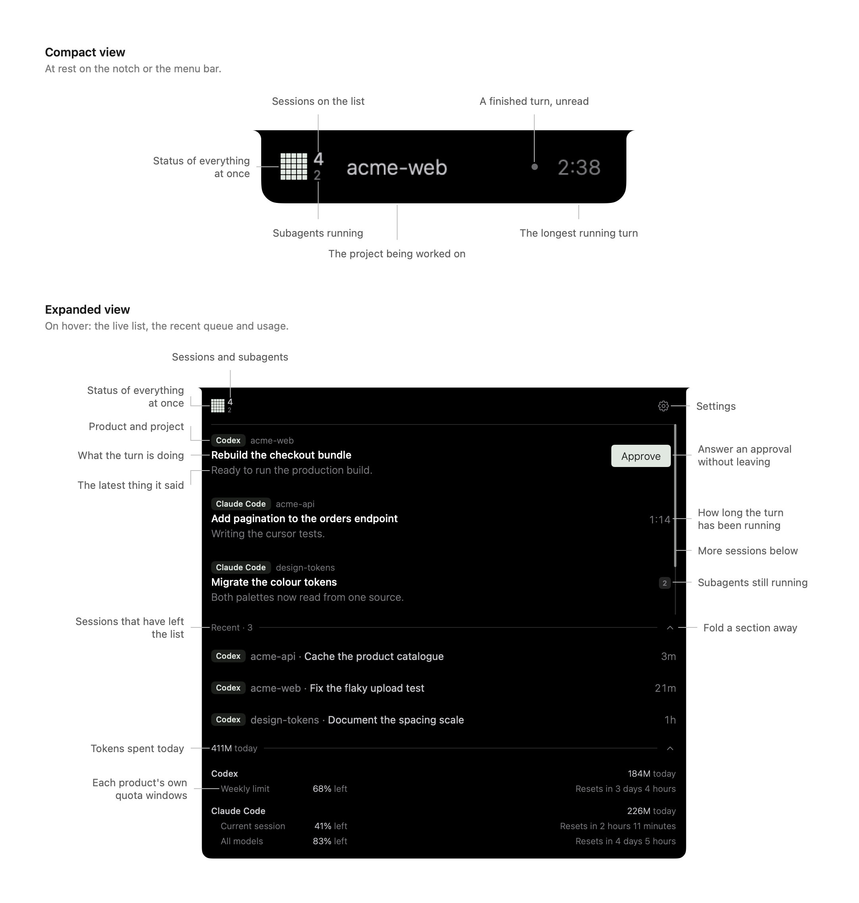
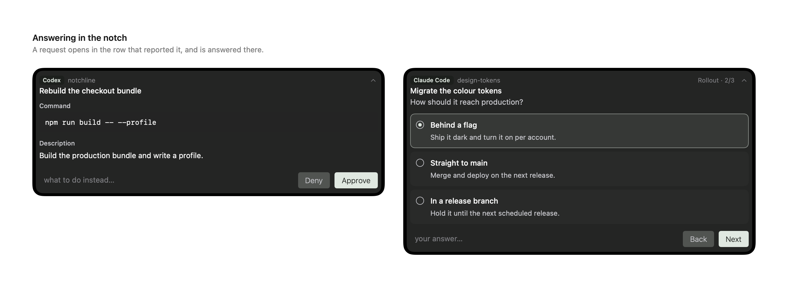

<p align="center">
  <picture>
    <source media="(prefers-color-scheme: dark)" srcset="design/assets/03-stacked/notchline-stacked-black-1024.png">
    
  </picture>
</p>
<p align="center">
  
  
  
  
  
</p>

**Notchline keeps coding agent activity reachable at your Mac’s notch.**

<p align="center">
  
</p>

## Overview

Notchline shows which sessions are working, waiting for you or completed. Hover to see monitored sessions, read previews, answer supported requests or return to the originating conversation. Displays without a notch use a compact pill. Currently supports Codex Desktop, Claude Code (Desktop + CLI), Antigravity (Desktop + CLI) and Trae Desktop (local IDE), with the coverage listed below.

<p align="center">
  
</p>

<p align="center">
  
</p>

## Motivation

My screens are already full of code editors, browser windows, and communication tools. I built Notchline to keep track of the coding agents buried behind them without repeatedly switching windows.

## Features

- **Live overview** — See monitored sessions in one list, ordered by urgency.
- **Content previews** — Read brief progress updates and answers alongside elapsed time and subagent activity.
- **Answers in the notch** — Respond to supported approval requests and questions directly in the panel.
- **Navigation** — Return to the originating conversation or terminal.
- **Recent sessions** — Revisit completed sessions cleared from the live list during the current app run.
- **Usage** — Check quota windows and today’s token usage for supported products.
- **Display settings** — Choose a display and adjust the compact overlay’s appearance.

## Supported products

Support has six cumulative levels. Each level adds the capabilities below; read removal, navigation, quota and usage are declared separately. A level applies only to the product's stated execution modes and request forms.

| Level | Adds |
| --- | --- |
| **L1 — Lifecycle monitoring** | Turn start/end, elapsed time, distinct Thread identities and manual row dismissal |
| **L2 — Context identification** | Project names and Thread titles, with declared sources and missing-data rules |
| **L3 — Progress monitoring** | Current-Turn progress with declared update timing |
| **L4 — Wait detection** | Supported approval/input waits and their resolution or cancellation |
| **L5 — Request reading** | Supported commands, questions, options and documents |
| **L6 — Request answering** | Supported answers through valid request connections, with stale-answer protection |

| Product | Level and request coverage | Independent capabilities and limits |
| --- | --- | --- |
| **Codex Desktop** | **L6** for ordinary approvals; `request_permissions` and synchronous questions are reading-only, asynchronous questions preview-only | Exact Thread navigation, Desktop Project identity, Desktop read removal, final-answer previews, subagents, a quota window and today's tokens |
| **Claude Code (Desktop + CLI)** | **L6** for tool approvals, plan approval and question sets | Working-directory Projects; Desktop/terminal read removal under stated conditions; host navigation with terminal-tab selection where supported; subagents, up to three quota windows and today's tokens. No final-answer preview |
| **Antigravity** (Desktop + CLI) | **L3** for observed Turns on both surfaces: prompt-derived titles and event-updated progress; Desktop rows use Desktop's Projects. No approval/input detection, request reading or answering | Read removal from Desktop's view record or, for the CLI, conditional terminal gestures; Desktop raised or CLI terminal selected; final-answer previews. No quota, today's tokens, subagents or cold-start recovery |
| **Trae Desktop** (local IDE) | **L5**, verified Trae 3.5.91 build: native titles, folder names, displayed progress, ordinary command approvals and structured questions; requests are reading-only | Exact observed Thread navigation. No read removal, answers, quota, tokens, subagents or cold-start recovery |

No product recovers pre-launch Turn state. Read removal only clears a monitoring row; it never archives the Thread. Unsupported features and temporary read failures are different. See the [support contract and full capability matrix](docs/product-support.md) for each level's requirements, exclusions, request forms and host/mode conditions.

## Limitations

- **Existing activity** — Existing sessions appear only after a new lifecycle event establishes their state.
- **Side chats** — Temporary side chats do not appear as rows.
- **Claude Code navigation** — Exact session or terminal-tab selection is not always available, and full-screen hosts cannot be reached.
- **Antigravity** — L3, for Desktop and the CLI through one switch: a row shows `Working...` from a Turn's first model call until its observed end, titled with what you asked, with no approval or question detection or usage quota. The line under the title updates after each model call, so a sentence written before a command appears once that command returns. A finished row clears once you type or paste in the foreground terminal that conversation runs in, when the CLI process exits, or on a right-click; coming back to look without typing does not clear it, because the CLI does not ask its terminal to report focus. A Desktop row is filed under Desktop's Project and clears once Desktop records the conversation as viewed after it finished — when you switch to another conversation or back to Desktop's window on it; clicking it raises Desktop. A Turn stopped with Desktop's **Stop execution** sends no end, so its row keeps `Working...` until the next Turn, Desktop quitting or a right-click.
- **Persistent history** — Recent sessions are temporary; there is no searchable archive or cross-device sync.
- **Compatibility** — Some features depend on undocumented product behaviour and may break after updates.
- **Trae** — Requires the verified 3.5.91 build in `/Applications/Trae.app`. Supports local IDE/V2 root Threads; SOLO, remote workspaces, Plan/Spec and rich permission forms are outside this release. Start a new Turn after the companion connects. Requests are answered in Trae; navigating there does not clear a completed row. See [Trae integration](docs/trae-integration.md).

## Requirements & installation

Requires macOS 26.5 or later.

Place `Notchline.app` in Applications and open it.

> [!NOTE]
> **Notchline is not currently notarised**: if macOS blocks it, go to **System Settings → Privacy & Security → Open Anyway**, then confirm opening it ([Apple’s instructions](https://support.apple.com/en-ie/102445)).

To build from source, open `Notchline/Notchline.xcodeproj` in Xcode 26.6 or later and run the `Notchline` scheme. Optionally enable integrations during onboarding.

> [!NOTE]
> **Codex hooks require manual trust.** After enabling the Codex integration, use `/hooks` in Codex to trust Notchline’s hooks.

Enable **Trae Desktop** in Settings to install Notchline’s companion extension, then reopen Trae’s windows. Turning it off uninstalls that extension. A different Trae build stays disconnected until verified.

## Files and data

- **Product configuration** — Edits `~/.codex/hooks.json`, `~/.claude/settings.json` and `~/.gemini/config/hooks.json` when managing integrations, preserving unrelated settings and saving a `.notchline-backup` beside each existing file before changes.
- **Trae companion** — Installs `notchline.trae-companion` through Trae’s extension CLI. Reads displayed local content through a version-pinned private interface; does not edit Trae’s application bundle or hook configuration.
- **Support files** — Creates hook helpers, local sockets and installation records under `~/Library/Application Support/Notchline/`.
- **Preferences** — Saves settings in `~/Library/Preferences/com.yinfenglu.Notchline.plist`.
- **Quota transcripts** — Claude Code quota checks create transcripts under `~/.claude/projects/`; Notchline shows their size in Settings and does not delete them.

See the [file inventory](docs/artifacts.md) for exact paths.

## How it works

```text
Coding agents → Product adapters → session state → Overlay
      ↑                                              │
      └────────── Navigation and answers ────────────┘
```

Product adapters collect local hook events, companion observations and metadata, reduce them into session state and combine them into one snapshot for the overlay. User actions return to the originating product through navigation or a supported answer connection. Processing stays on your Mac.

## Next steps

The shared monitoring core handles Turn starts and endings, and each product opts into wait detection, previews, navigation, read state, subagents, quota and answers. Next is adding further coding agents at the support level they earn, and raising Antigravity if its hooks ever observe a wait. See the [architecture plan](docs/technical-explorations/multi-product-provider-architecture/README.md).

## Comparison with Open Island

[Open Island](https://github.com/Octane0411/open-vibe-island) is another native macOS notch companion. This summary is based on the [source comparison from 7 September 2026](docs/comparisons/notchline-and-open-island.md), which documents support boundaries and implementation details.

| Capability | Notchline | Open Island |
| --- | --- | --- |
| Shared features | Notch overlay, previews, supported request answers, Codex deep links and Recent | Same core features |
| Supported products | Codex Desktop, Claude Code (Desktop + CLI), Antigravity (Desktop + CLI, L3) and Trae Desktop (local IDE, L5) | Also standalone Codex CLI, Cursor, Gemini CLI, OpenCode and more |
| Completed rows | Cleared using per-Thread read evidence | Visibility follows activity and process state |
| Codex Projects | Actual Desktop Project assignments and Chats | Working-directory names |
| Codex automatic approvals | Distinguishes automatic review from requests needing a person | No equivalent filter found |
| Subagent activity | Both products; tracks work continuing after the parent Turn ends | Claude detail list; cleared on parent completion |
| Usage | Quota windows and today's token totals | Quota windows; Claude readings depend on a terminal status-line cache |
| Turn timing | Elapsed time and finished duration | Activity age and Claude subagent timers |
| Navigation | Exact Codex Thread; Claude host, with Terminal.app/iTerm2 tab targeting | Additional terminal-pane and IDE workspace targets |
| Startup and history | New lifecycle events; Recent covers the current app run | Restores cached records and discovers existing conversations |
| Expanded list | Urgency ordering and brief content previews | Configurable grouping/sorting and more tool and work-item detail |
| Notifications | Compact status and a panel opened on hover | Automatic notification cards, sounds and haptics |
| Remote monitoring | Local observation | SSH setup for remote Claude Code |

## Project status

A solo side project in active development.

## Licence

Copyright © 2026 Yinfeng Lu. Licensed under [GPL-3.0-or-later](LICENSE), without warranty. See [LICENSE](LICENSE) for the full terms.
