<p align="center">
  <picture>
    <source media="(prefers-color-scheme: dark)" srcset="design/assets/07-readme/notchline-readme-header-dark.png">
    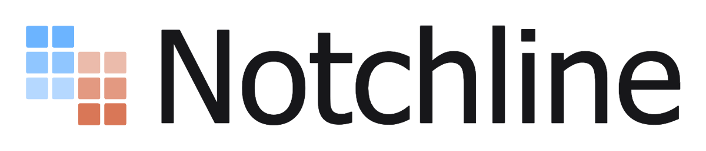
  </picture>
</p>
<p align="center">
  
  
  
</p>

**Notchline is a macOS overlay that keeps the Codex Desktop and Claude Code sessions which still need attention visible without taking up usable desktop space.**


<p align="center">
  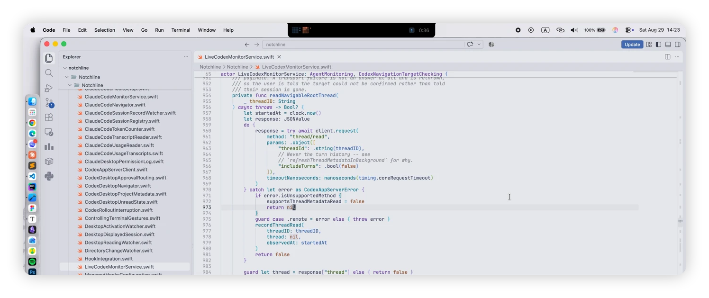
</p>

## Overview

Daily work can already fill the screen with a code editor, a browser, documents, and communication tools. Codex Desktop, Claude Desktop and terminal sessions then end up buried under those windows, even while several sessions continue working in the background.

Once the agent windows are out of sight, it becomes difficult to see which work is still running, which session needs an approval or answer, and which conversation has completed. Repeatedly bringing every window to the front just to check its state interrupts the work that already occupies the desktop.

Notchline moves that overview into the otherwise unused area around the display notch. Its collapsed surface quietly shows the current state of both products without covering any working window; hovering reveals the monitored Threads, and clicking a row returns to the originating conversation. It observes, navigates, and — for the one payload a row is already reporting — lets you answer the request itself without leaving what you are doing: a command granted or refused with a reason, a question answered in its own words. Nothing else moves: it starts no Turn, cancels no work, archives no Thread and marks nothing as read.

## Features

- **Live status without another window**

  The collapsed surface wraps a physical notch, or becomes a compact pill on a display without one. A 5×5 matrix per product separates `Working...`, `Input needed`, `Approval needed` and `Completed`; the trailing wing can add elapsed time and subagent activity.

  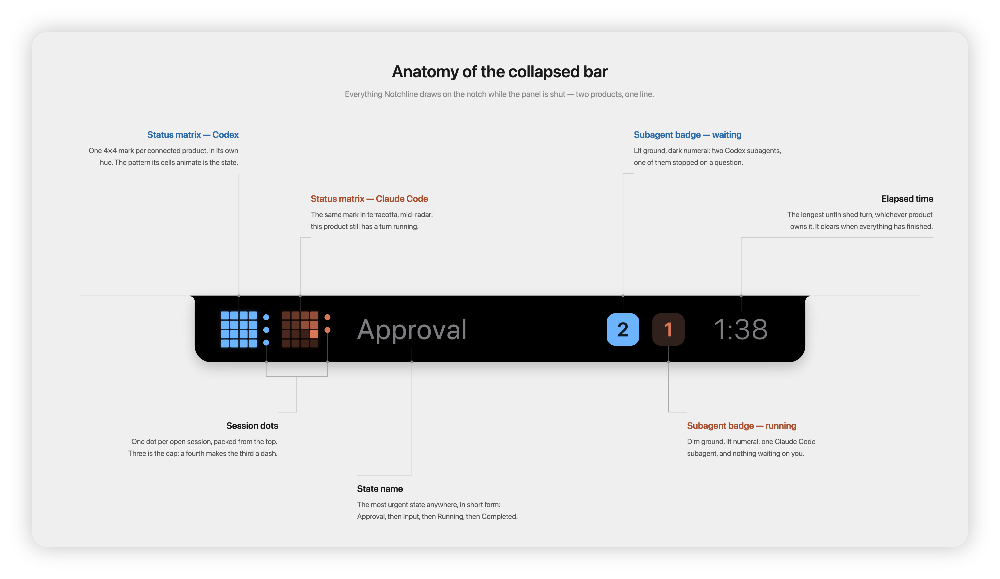

- **One list for both products**

  Codex Desktop and Claude Code Threads share one urgency-sorted list and the same four statuses. A row can show its Project, title, current-content preview, elapsed time and subagent count; completed rows stay until read or navigation evidence clears them, or a secondary click dismisses them.

  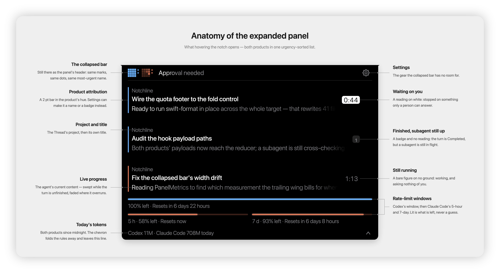

- **Navigation back to the originating work**

  A Codex row is confirmed still navigable before its official deep link is used. Claude Code rows return to Claude Desktop or the originating terminal; Terminal.app and iTerm2 select the exact tab when its tty is available, other terminals only activate the application.

- **Quota and daily usage**

  The expanded footer shows Codex's primary rate-limit window, Claude Code's 5-hour and 7-day windows, and today's token count. Unavailable readings stay unavailable rather than estimated, and the quota rows fold down to the daily summary.

- **Display and product settings**

  Each product has an independent integration switch and health row. Settings also choose the display, optionally hide the collapsed wings, add an outline for dark wallpapers, and present product attribution as a coloured name, plain name, badge or colour bar.

  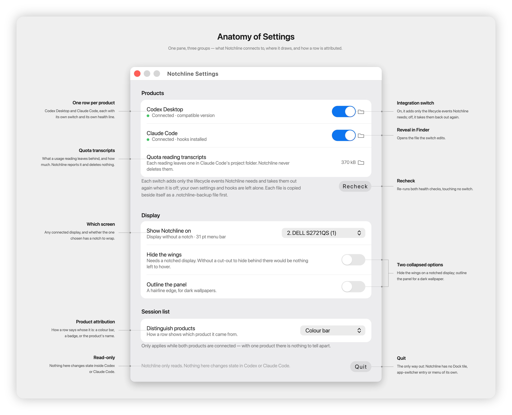

### Status matrix patterns

Each product carries its own 5×5 mark on the collapsed surface — Codex above, Claude Code below — and every state animates differently, so the surface reads at a glance without depending on colour or on the panel being open. The cell curves below are the ones the app ships.

| Working... | Input needed | Approval needed | Completed | Connected |
|:---:|:---:|:---:|:---:|:---:|
| 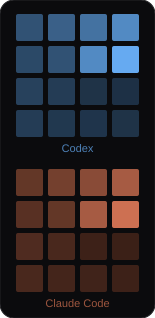 | 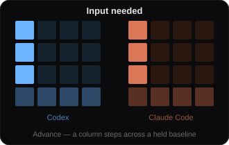 | 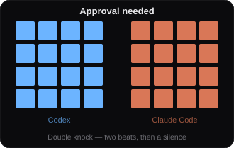 | 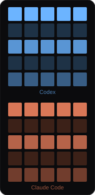 | 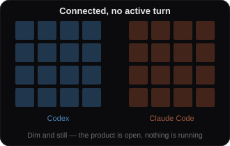 |
| **Rain** — a drop falls down each column, then the column is empty | **Wedge** — a `>`-fronted band crosses, and wraps rather than stopping | **Double knock** — two beats, then a silence | **Bars** — three rules breathing, top to bottom | **Dim and still** — the product is open, nothing is running |

## Motivation

In my daily work, the available screen area is often already occupied by a code editor, internal documentation, product pages, communication software and the other tools needed for the task in front of me. There is rarely space left to keep Codex Desktop, Claude Desktop or every Claude Code terminal visible as well.

The agent windows therefore spend much of their time underneath everything else. That makes it easy to miss a conversation waiting for permission, a question that needs an answer, or a session that has already completed. Bringing those windows to the front, checking them one by one and burying them again is a small but frequent interruption.

I wanted one quiet place that consumed no usable desktop area but still made the live state of every task easy to check at any moment. The strip around the MacBook notch was already present, always visible and otherwise unable to hold a normal window. Notchline grew from using that space as a compact status surface: small enough to stay out of the way, but detailed enough to show when my attention is needed.

## Requirements and installation

| Requirement | Current project setting |
| --- | --- |
| macOS | 26.5 or later |
| Xcode | 26.6 (the project was created and last upgraded with this tool version) |
| Swift | Swift 5 language mode with approachable concurrency and main-actor default isolation |
| Dependencies | Apple platform frameworks and system interfaces only; no Swift Package Manager or CocoaPods packages |
| Codex | Codex Desktop and a `codex` executable Notchline can locate |
| Claude Code | The `claude` CLI; Claude Desktop for sessions hosted in that application |

There is currently no packaged, signed or notarised release. Build the app from source:

```sh
git clone https://github.com/soondubu137/notchline.git
cd notchline
open Notchline/Notchline.xcodeproj
```

Run the `Notchline` scheme from Xcode, or build from the command line after Xcode has generated the local scheme:

```sh
xcodebuild build \
  -project Notchline/Notchline.xcodeproj \
  -scheme Notchline \
  -destination 'platform=macOS'
```

Code signing is configured as automatic for local development. The app target is not sandboxed because it must run local product commands, read product-owned metadata, manage Hook configuration and communicate with terminal applications.

### Permissions

Notchline does not request Accessibility or Screen Recording permission.

It may request Automation permission when opening a Claude Code row hosted in Terminal.app or iTerm2. That permission is used only to identify and select the tab whose tty belongs to the session. If permission is denied, navigation falls back to activating the terminal application.

## First run and usage

The first launch opens one onboarding window, in two pages. The first has the two product connection switches and an explanation of the Hook configuration they manage; the second is a live guide to reading the notch — the collapsed bar and the expanded panel as the app itself draws them, each part numbered and named, with the five state patterns between them. Selecting `Start` completes onboarding; later launches show only the overlay.

Enabling an integration adds Notchline's lifecycle definitions to the product's own configuration:

- Codex: `~/.codex/hooks.json`
- Claude Code: `~/.claude/settings.json`

Before each change, the existing file is copied beside itself as `hooks.json.notchline-backup` or `settings.json.notchline-backup`. The editor changes only Notchline's managed definitions and preserves unrelated settings. Codex also requires the new definitions to be trusted through `/hooks`; Claude Code has no equivalent trust step.

Once running:

- Hover over the collapsed surface to expand it; move the pointer away to collapse it.
- Left-click a row to return to its originating Thread or host.
- Left-click the bright mark on a row that wants you to open the request there, and answer it in the notch.
- Right-click a completed row to dismiss that session's row without deleting or marking anything read.
- Press `⌥Space` to bring the panel down from the keyboard, with the first waiting request already open and the cursor in its field. The arrows move between the answers, `⏎` takes the one the white ground is on, and `⎋` hands the keyboard back. The chord is settable in Settings, which also says whether the app is actually holding it.
- Use the gear in the expanded header to open Settings.
- Use `Quit` in Settings to stop the app.

`⌥Space` is the only keyboard shortcut, and it is the app's own. Because Notchline runs as `LSUIElement`, it has no Dock tile, app-switcher entry or application menu; consequently there is no application-level `⌘,` or `⌘Q` route either.

## How it works

Notchline is one `LSUIElement` process that observes two products it does not control. Each product is understood through its own boundary — hooks, a subprocess, a few read-only file adapters — and everything past that boundary follows a single path: one reducer per product, one merged snapshot, one main-actor store, one overlay.

<picture>
  <source media="(prefers-color-scheme: dark)" srcset="design/assets/07-readme/notchline-architecture-dark.svg">
  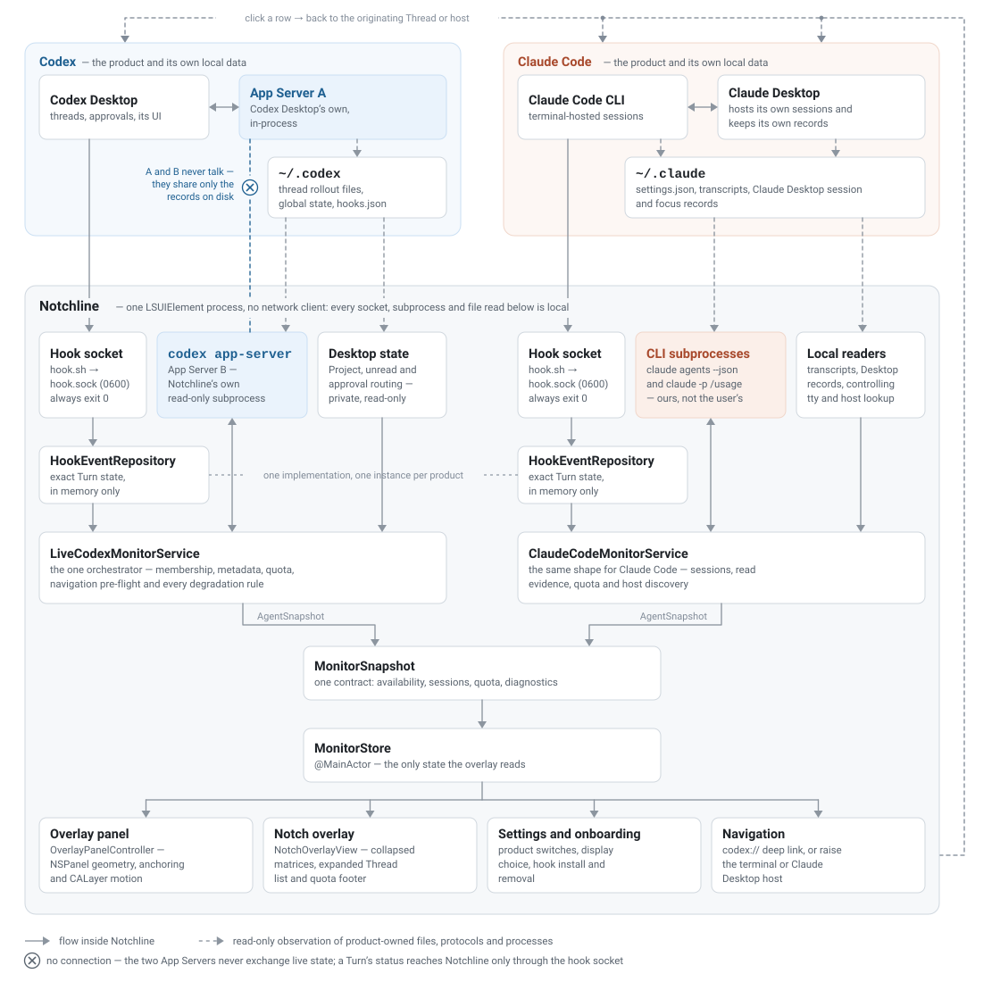
</picture>

**Live state comes only from Hooks.** Both products run a small `sh` helper on lifecycle events that forwards one payload to a per-product, permission-restricted Unix domain socket and always exits successfully, so a closed Notchline never adds errors to the originating session. Payloads feed an in-memory reducer holding each session's exact state — no on-disk event queue, no persisted Thread list, and therefore no cold-start reconstruction.

**Files say what a session is; only a hook says what it is doing.** Notchline runs its own subprocesses — a **separate** `codex app-server` spoken to over JSON-RPC, plus `claude agents --json` and `claude -p "/usage"` — never attaching to the user's own. They supply Thread identity, titles, Projects, quota and the pre-flight that a row is still navigable, alongside narrowly scoped readers for transcripts, Claude Desktop records and each session's controlling tty. The split is a measured boundary, not a preference: on a standalone Codex App Server, `thread/loaded/list` comes back empty and `thread/read` never reports `inProgress`. Features no public interface exposes — Desktop Project identity, unread state, approval routing — come from read-only adapters recorded in the [non-public integration registry](docs/non-public-codex-integration-features.md).

**One contract, one store, one surface.** Each service reduces its own product's evidence into an `AgentSnapshot`; `MonitorStore` merges the two on the main actor into a single `MonitorSnapshot` and publishes that. The views render that store and nothing else — they parse no protocol and read no product file. Clicking a row runs the loop in reverse, back to the originating Thread's official deep link or to the terminal or Claude Desktop host that owns it. There is no network client: every socket, subprocess and file read in the diagram is local.

## Known limitations

- **No cold-start reconstruction**

  Sessions already running, waiting or completed before Notchline launched stay hidden until a later lifecycle event establishes their state.

- **Side chats won't become rows**

  Side chats in both products are not treated as full sessions, so they won't show up in Notchline.

- **Claude Code navigation can degrade**

  Claude Desktop can only be activated, not focused to a specific session. A terminal tab is selected only when the terminal exposes its tty through a scripting dictionary. A host whose window is **full-screen** cannot be reached at all: a full-screen window is a desktop of its own, and no public interface available to Notchline crosses into one. Such a click reports that it failed rather than claiming a raise the user cannot see. Codex rows are unaffected, because their deep link goes through Launch Services.

- **Several integrations rely on undocumented local behaviour**

  Host updates can affect Project names, unread membership, Claude Code titles, quota parsing, approval correction, subagent attribution or navigation. The dependencies and their degradation paths live in the [integration registry](docs/non-public-codex-integration-features.md).

- **Claude Code quota reads leave transcripts**

  `claude -p "/usage"` creates a Claude Code project transcript. Notchline reports the accumulated footprint in Settings but deletes nothing (for safety concerns).

- **The scope is local and current**

  There is no history browser, search, cross-device sync or remote service.

## Project status

Notchline is an actively developed, pre-release solo side project. There are no published tags or GitHub releases; current work is tracked on the [project board](https://github.com/users/soondubu137/projects/2) and in [GitHub Issues](https://github.com/soondubu137/notchline/issues).

## Licence

No open-source licence has been selected for this repository. All rights are reserved, and no permission is granted to use, copy, modify or distribute the source.
