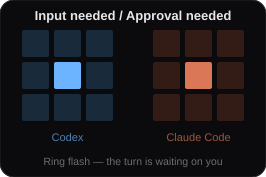

<p align="center">
  
</p>


Notchline is a macOS overlay that monitors Codex Desktop and Claude Code, whether hosted in Claude Desktop or a terminal. It sits in the notch, or in the menu bar on a notch-less display, and shows monitored Threads whose Turn is running, waiting for input or approval, or completed and unread.

Selecting a row returns to its host. Notchline does not send input, grant approval, or modify threads.

## Features

- Live Turn updates from Hooks, with background reconciliation for membership and metadata.
- Four shared states: `Running`, `Input needed`, `Approval needed`, and `Completed`.
- Project, thread title, current-content preview, elapsed time, and subagent activity in each row.
- Completed rows remain until they are read, removed from the host, or manually dismissed.
- Exact thread navigation for Codex; terminal-tab selection for supported Claude Code hosts.
- Codex and Claude Code rate-limit windows, plus today's token use.
- Physical-notch and notch-less layouts, with an option to hide the collapsed wings where the notch can be measured.
- No persisted monitoring history, Accessibility permission, or Screen Recording permission.

<!-- TODO: Add `docs/assets/readme-expanded-panel.png` here. Capture one expanded panel with both products present and three non-sensitive rows spanning an attention state, Running, and Completed. Include a preview, elapsed time, a subagent count, and the usage footer; crop to the overlay. -->

Collapsed, the overlay uses a 3×3 status matrix for each connected product:

<table>
<tr>
<td></td>
<td></td>
</tr>
<tr>
<td></td>
<td></td>
</tr>
</table>

<!-- TODO: Add `docs/assets/readme-collapsed-layouts.png` here. Show the physical-notch and notch-less collapsed layouts side by side at the same scale, with product matrices, elapsed time, subagent count, and the usage ring visible. -->

Integration is enabled separately for each product in Settings. Notchline preserves unrelated Hook configuration.

<!-- TODO: Add `docs/assets/readme-integration-settings.png` here. Capture the Products section with both integrations enabled and healthy; exclude personal paths and account information. -->

## Limitations

- Requires macOS 26.5 or later.
- There is no cold-start sync. Turns already active, waiting, or completed before Notchline starts appear only after a new lifecycle event.
- Codex opens the exact thread. Claude Code selects a terminal tab when its host exposes the controlling terminal; otherwise it activates only the host application.
- Some handling of Projects, read state, usage, presence, approval routing, and subagents depends on undocumented local data or observed host behaviour. Private data is read only, failures are handled conservatively, and host updates may require changes. See [the integration registry](docs/non-public-codex-integration-features.md).
- A Claude Code Turn with neither a Desktop record nor a controlling terminal has no reliable read signal; its completed row remains until the next submission or manual dismissal.
- Scope is one account on one Mac, with no history, search, or sync.

Terminal-tab selection may request Automation permission. Notchline runs as an `LSUIElement`, so it has no Dock icon, app switcher entry, or application menu.

## Build from source

Open [`Notchline/Notchline.xcodeproj`](Notchline/Notchline.xcodeproj) in Xcode, or run:

```sh
xcodebuild build -project Notchline/Notchline.xcodeproj -scheme Notchline -destination 'platform=macOS'
```

## Status

Notchline is under active development and has not reached its first release. This is a solo project and is not currently accepting pull requests.
