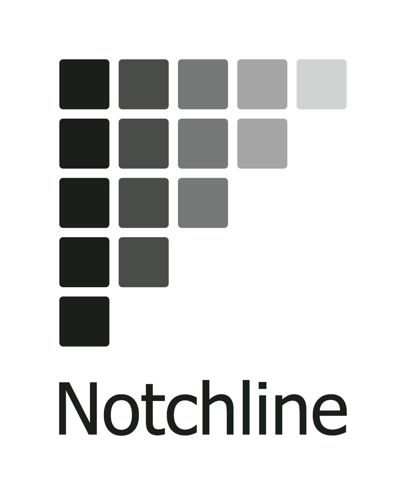
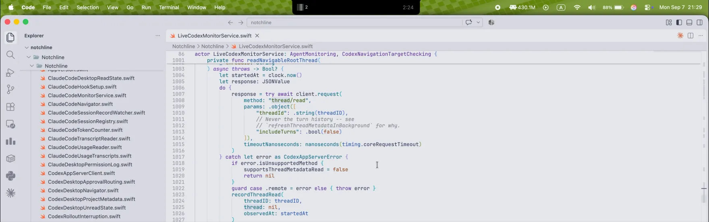

  

  
  
  
  
  

> 本简体中文版由 ChatGPT 翻译。

[English](README.md)

**Notchline 让你在 Mac 刘海处随时查看编程智能体的活动。**

  

## 概览与动机

我的屏幕已经塞满编辑器、浏览器和通讯工具。Notchline 让我无需反复切换窗口，也能掌握编程智能体的活动：悬停即可查看对话、回答支持的请求或跳回原处。没有刘海的显示器使用紧凑的胶囊形面板。

## 主要功能

- **实时概览** — 按紧急程度排序，展示进度预览、耗时和子智能体活动。
- **回答与导航** — 处理支持的请求，或返回对应对话。
- **已读移除与最近记录** — 根据已读证据移除完成的条目，并在本次应用运行期间回看。
- **用量与隐私** — 查看支持产品的配额和每日 token 用量；隐私模式遮盖文字。

## 支持的产品

| [累积分级](docs/product-support-zh.md) | 在声明的模式和请求形式内逐级增加 |
| --- | --- |
| **L1 — 生命周期监控** | Turn 开始与结束、耗时和手动移除 |
| **L2 — 上下文识别** | Project 名称与 Thread 标题 |
| **L3 — 进度监控** | 当前 Turn 的进度 |
| **L4 — 等待检测** | 审批／输入等待及其解除 |
| **L5 — 请求阅读** | 命令、问题、选项和文档 |
| **L6 — 请求回答** | 通过有效连接回答，并防止提交过期答案 |

| 产品 | 等级 | 额外能力（独立于等级） | 边界 |
| --- | --- | --- | --- |
| **Codex Desktop** | **L6**：普通审批 | 精确 Thread 导航、Desktop Project／已读移除、最终答案预览、子智能体、配额和每日 token 用量 | 本地 CLI 的范围在下方单独列出；同步问题与 `request_permissions` 只读；异步问题仅预览 |
| **Codex CLI（本地交互式）** | **L5**：普通审批和同步问题，只读 | 最终答案预览、有条件的终端已读移除、返回宿主、共用账户读数 | 仅默认 home；所有请求都在终端回答；无精确窗口／标签页／Thread 选择，不恢复启动前状态，不支持 remote/daemon/exec（[范围与验证](docs/product-support-zh.md#51-本地-codex-cli)） |
| **Claude Code（Desktop + CLI）** | **L6**：工具／计划审批与问题集 | 以文件夹为 Project、有条件的 Desktop／终端已读移除、宿主／标签页导航、子智能体、配额和每日 token 用量 | 无最终答案预览；精确导航取决于宿主，无法到达全屏宿主 |
| **Antigravity（Desktop + CLI）** | **L3** | Desktop Project、有条件的 Desktop／终端已读移除、宿主导航和最终答案预览 | 无等待检测、请求、配额、token 用量或子智能体；进度可能等待工具返回；Desktop 停止后条目可能仍显示工作中；CLI 已读移除需要输入／粘贴，仅切换标签页无效 |
| **Trae Desktop（本地 IDE/V2）** | **L5**：普通命令与结构化问题 | 精确导航至已观察的 Thread、基于可见完成内容的条件式已读移除、保留主对话文字 | 仅限已验证的 3.5.91 构建；需在 Trae 中回答；无配额、token 用量或子智能体；IDE 内 SOLO 不属于 L5，排除独立 SoloLite、远程、Plan/Spec 和复杂权限形式（[范围](docs/trae-integration.md)） |

| Claude Code／Antigravity CLI 的[终端宿主](docs/tech-design.md#142-raising-the-host-claude-code) | 返回导航 | 完成后的已读移除（宿主在前台、屏幕已解锁） |
| --- | --- | --- |
| **Terminal.app** | 选择匹配的标签页；需授予“自动化”权限 | 取决于终端输入证据；焦点／指针手势取决于产品与终端实际报告的信号 |
| **iTerm2** | 选择匹配的窗口、标签页和窗格；需授予“自动化”权限 | 与 Terminal.app 相同的终端输入条件 |
| **Ghostty 1.3.1** | 唤起应用；不精确选择标签页／窗格 | Claude Code：输入／粘贴、焦点或指针手势；Antigravity：仅输入／粘贴 |
| **kitty、WezTerm、Alacritty、VS Code 终端** | 能识别宿主时唤起应用；不精确选择标签页／窗格 | 共用终端证据路径；各宿主组合未经独立验证 |
| **tmux、screen、SSH、管道** | 无专用返回目标 | 不支持 |

Codex CLI 始终只返回宿主，包括 Terminal.app 和 iTerm2。已完成条目可在输入／粘贴后移除；若终端报告焦点，返回窗口也可以：已验证 Ghostty，Apple Terminal 不提供此报告。移动指针不会移除条目。具体条件和 CLI 0.154.0 验收基线见[支持契约](docs/product-support-zh.md#51-本地-codex-cli)。

## 整体限制

- 不支持监控运行在远程主机上的编程智能体，包括 SSH 场景。
- 不恢复应用启动前的 Turn，也不显示临时侧边对话；连接后请开始新的 Turn。
- 最近记录仅保留至应用退出；无持久化归档或跨设备同步。
- 已读移除依赖可信证据；手动移除只影响条目，不删除对话。
- 未公开的产品行为可能随更新变化；回答请求需要有效连接。

## 要求、安装与开发

需要 **macOS 26.5+**。将 `Notchline.app` 移至“应用程序”并打开。目前未经公证；若被阻止，请使用 **系统设置 → 隐私与安全 → 仍要打开**（[操作说明](https://support.apple.com/en-ie/102445)）。这一步只需一次：Notchline 每天检查更新，也可在 **关于 → Check for Updates** 中手动检查，更新会原地安装，无需再次确认。

在首次引导或设置中启用产品。Codex Desktop 与本地 CLI 共用一个开关和 Hook 配置；在需要信任的各客户端中通过 `/hooks` 审查并信任受管定义。启用 Trae 会安装配套扩展，随后请重新打开 Trae 窗口。

使用 **Xcode 26.6+** 打开 `Notchline/Notchline.xcodeproj`，选择 **Notchline** scheme：

- **Debug：** 在 **Product → Scheme → Edit Scheme → Run** 中选择 **Debug**，然后 **Product → Run**（⌘R）。
- **Release：** 将 **Run → Build Configuration** 设为 **Release**，再执行 **Product → Build**（⌘B）；通过 **Products → Show in Finder** 找到 `Notchline.app`。如需归档，使用 **Product → Archive**，并将其配置设为 **Release**。

## 文件与数据

| 位置 | 用途 |
| --- | --- |
| `~/.codex/hooks.json`、`~/.claude/settings.json`、`~/.gemini/config/hooks.json` | 管理 Hook 条目；保留无关设置，修改已有文件前在旁边保存 `.notchline-backup` 备份 |
| Trae 扩展目录 | 安装／移除 `notchline.trae-companion`；移除时也可能修改 `~/.trae/extensions/extensions.json` 中该扩展的条目 |
| `~/Library/Application Support/Notchline/` | 辅助程序、本地套接字和安装记录 |
| `~/Library/Preferences/com.yinfenglu.Notchline.plist` | 偏好设置，包括更新器的设置 |
| `~/Library/Caches/com.yinfenglu.Notchline/` | 准备更新时下载的文件 |
| `~/.claude/projects/` | 配额查询产生的对话记录；设置中显示大小，Notchline 从不删除它们 |
| 仅内存 | 监控状态、预览和最近记录；[完整文件清单](docs/artifacts.md) |

## 工作原理

每个产品的 Provider 协调本地证据来源，将类型化事件交给共用的 Turn reducer。重构后的运行时组合生命周期、内容、已读证据和用量；Codex 保留独立编排，以同时处理 App Server 和 Hooks。浮层统一渲染 `MonitorSnapshot`，导航与支持的回答则返回原产品（[架构](docs/system-architecture.md)）。

## 项目状态

个人业余项目，正在积极开发中。

## 许可证

Copyright © 2026 Yinfeng Lu. 本项目采用 [GPL-3.0-or-later](LICENSE) 许可证，不提供担保。完整条款见 [LICENSE](LICENSE)。
