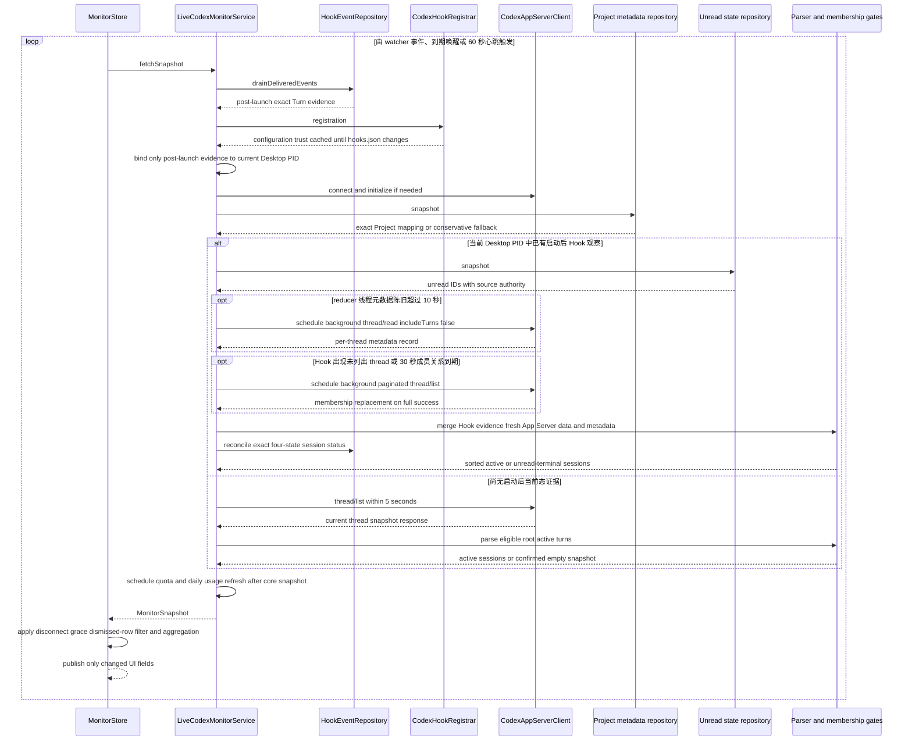
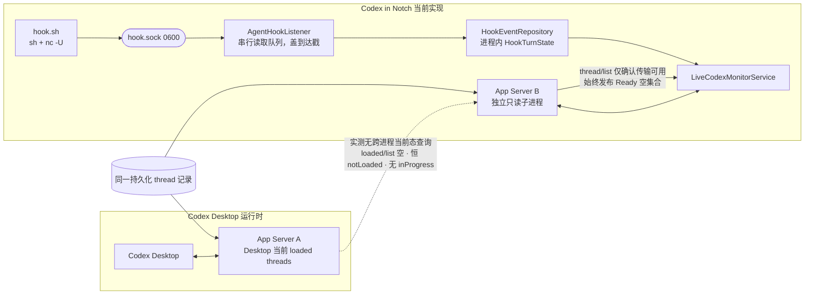
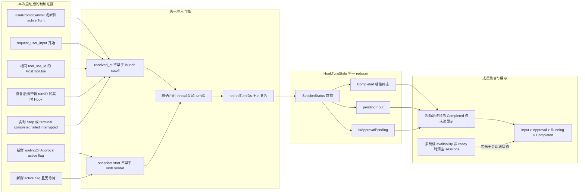
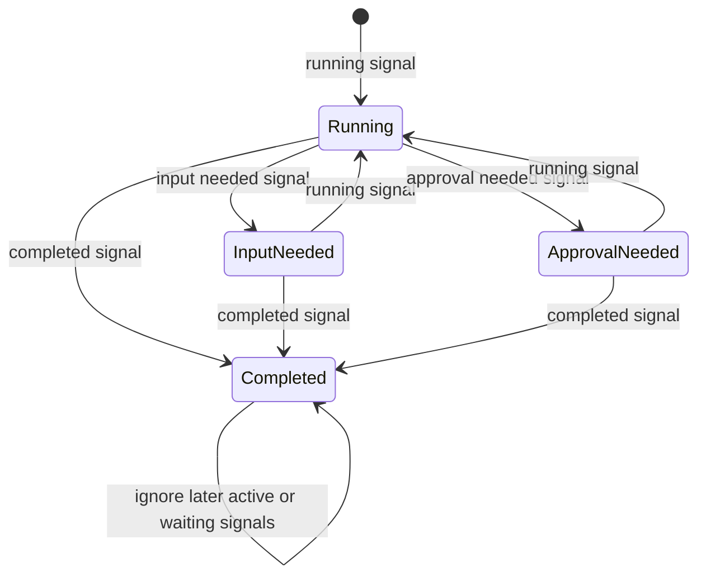
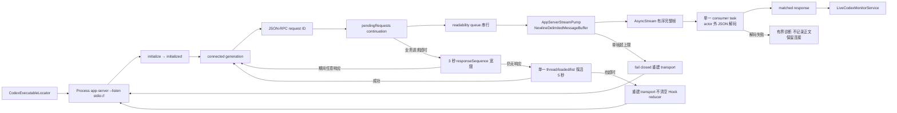

# Codex in Notch — 当前系统设计架构

| 字段 | 内容 |
| --- | --- |
| 文档性质 | 当前实现架构，而非未来方案 |
| 基线日期 | 2026-08-15 |
| 核心目标 | 在一个 macOS 顶部视窗中汇总当前 Codex Desktop 根会话的活动或未读终态 Turn |
| 代码入口 | `MonitorStore.shared` → `LiveCodexMonitorService` |

本文以当前 Swift 实现为准，展示从 Codex Desktop 信号进入应用，到行级状态收敛、集合筛选、顶部汇总和精确导航的完整链路。主链保持为：

```text
边界信号 → 单一 reducer / orchestrator → MonitorSnapshot → MonitorStore → AppKit / SwiftUI
```

图中的“私有只读”只表示依赖未公开的 Desktop schema；它们被限制在边界适配器内，不进入领域模型，也不允许写回 Codex Desktop。详细风险登记见 [`non-public-codex-integration-features.md`](non-public-codex-integration-features.md)。

## 1. 当前实现总图

```mermaid
flowchart LR
    subgraph codexSources ["Codex Desktop 与本地数据源"]
        desktopHooks["Codex Desktop 官方 Hooks 生命周期"]
        desktopState[(".codex-global-state.json 私有只读")]
        codexBinary["codex 可执行文件与私有 Desktop bundle 发现路径"]
        appServerProcess["独立 codex app-server 子进程"]
        desktopProcess["Codex Desktop 私有 bundle ID 与当前 PID"]
        desktopDeepLink["Codex Desktop deep link 目标"]
    end

    subgraph hookBoundary ["Hook 边界"]
        hookRegistrar["CodexHookRegistrar actor 五条冻结定义"]
        hooksConfig[("~/.codex/hooks.json")]
        hookHelper["hook.sh sh 加 nc -U 退出码恒为 0"]
        hookSocket(["hook.sock 0600 一次连接一条 payload"])
        hookListener["AgentHookListener 串行读取队列 盖到达戳"]
        installState[("install.json 仅 installedAt 与 lastEventAt")]
        hookRepository["HookEventRepository actor 精确 Turn reducer 与会话正文"]
    end

    subgraph appServerBoundary ["公开 App Server 只读边界"]
        executableLocator["CodexExecutableLocator"]
        appServerClient["CodexAppServerClient actor"]
        streamPump["AppServerStreamPump 串行队列内 NDJSON 分帧"]
        streamConsumer["单一 consumer task actor 外解码"]
        requestGuard["pendingRequests 超时与单一 liveness probe"]
    end

    subgraph desktopAdapters ["Desktop 私有只读适配器"]
        projectRepository["CodexDesktopProjectMetadataRepository actor"]
        unreadRepository["CodexDesktopUnreadStateRepository actor"]
        directoryWatcher["目录 watcher 与 50 ms debounce 可重新挂载"]
        desktopPidGate["NSRunningApplication PID 观察门槛"]
    end

    subgraph applicationCore ["应用核心"]
        liveService["LiveCodexMonitorService actor 单一编排器"]
        snapshotParser["CodexSnapshotParser 纯解析与排序"]
        unreadGate["TerminalUnreadMembershipGate 终态成员 gate"]
        serviceState[("内存缓存与后台 refresh tasks")]
        monitorSnapshot["MonitorSnapshot availability sessions quota diagnostic"]
    end

    subgraph presentationState ["主线程展示状态"]
        stabilityGate["ConnectionStabilityGate 3 秒断开宽限"]
        aggregation["MonitorAggregation 顶部状态聚合"]
        monitorStore["MonitorStore @MainActor 唯一 UI 状态源"]
    end

    subgraph macUi ["macOS 展示与控制"]
        panelController["OverlayPanelController NSPanel 几何与动画"]
        notchView["NotchOverlayView 收起与展开会话列表"]
        productRoot["ProductRootView 首次引导"]
        settingsView["AppSettingsView 单面板设置窗口"]
        navigator["CodexDesktopNavigator"]
        claudeNavigator["ClaudeCodeNavigator 按进程祖先链唤起宿主"]
    end

    desktopHooks -->|"执行受信 handler"| hookHelper
    hookHelper -->|"整份 payload 不做过滤"| hookSocket
    hookSocket --> hookListener
    hookListener -->|"按到达顺序交出"| hookRepository
    hookRepository -->|"HookStateSnapshot"| liveService
    hookRepository -->|"仅持久化 Hook 配置信任"| installState

    hookRegistrar -->|"尾部追加五条定义 写下之后不再改写"| hooksConfig
    hooksConfig -.->|"官方 Hooks 配置"| desktopHooks
    hooksConfig -.->|"FSEvents 变更 重算注册完整度"| hookRegistrar
    hookRegistrar -->|"字节不同才覆写"| hookHelper

    executableLocator -->|"定位可执行 URL"| codexBinary
    executableLocator -->|"注入 executableURL"| appServerClient
    codexBinary -->|"被 Process 执行"| appServerProcess
    appServerClient -->|"启动和管理子进程"| appServerProcess
    appServerProcess -->|"stdout 字节流"| streamPump
    streamPump -->|"有序完整帧 AsyncStream"| streamConsumer
    streamConsumer -->|"已解码 envelope"| appServerClient
    appServerClient -->|"stdin JSON-RPC request"| appServerProcess
    requestGuard -->|"保护 request 生命周期"| appServerClient
    appServerClient <-->|"六个只读方法与结果"| liveService

    desktopState -.->|"Project assignments"| projectRepository
    desktopState -.->|"local unread thread IDs"| unreadRepository
    desktopState -.->|"目录原子替换事件"| directoryWatcher
    directoryWatcher -->|"debounced change signal"| unreadRepository
    projectRepository -->|"Project 或 Chats 或 unavailable"| liveService
    unreadRepository -->|"权威性标记加未读集合"| liveService
    desktopProcess -->|"当前 PID"| desktopPidGate
    desktopPidGate -->|"绑定 Hook 信任到当前进程"| liveService
    hookRegistrar <-->|"registration install remove"| liveService

    liveService -->|"构造行状态"| snapshotParser
    liveService <-->|"30 秒列表与 60 秒用量刷新"| serviceState
    snapshotParser -->|"MonitoredSession 候选"| unreadGate
    unreadGate -->|"活动或未读终态成员"| monitorSnapshot
    liveService -->|"availability quota diagnostic"| monitorSnapshot

    monitorSnapshot -->|"候选发布"| stabilityGate
    monitorSnapshot -->|"ready 时聚合 sessions"| aggregation
    stabilityGate -->|"允许发布或暂存重试"| monitorStore
    aggregation -->|"顶部 MonitorStatus"| monitorStore
    hookRepository -.->|"changeEvents 仅当渲染投影变化"| monitorStore
    unreadRepository -.->|"changeEvents"| monitorStore

    monitorStore -->|"Published 状态"| panelController
    monitorStore -->|"Published 状态与用户操作"| notchView
    monitorStore -->|"onboarding 状态"| productRoot
    settingsView -->|"安装 移除 预览 显示器"| monitorStore
    monitorStore -->|"点击 Codex 行"| navigator
    monitorStore -->|"点击 Claude Code 行"| claudeNavigator
    navigator -->|"目标预检 thread/list"| liveService
    navigator -->|"codex://threads/{threadId}"| desktopDeepLink
    desktopDeepLink -.->|"Launch Services 定向打开"| desktopProcess
```



边界分类：

| 类型 | 图中能力 | 约束 |
| --- | --- | --- |
| 官方公开 | Hooks lifecycle、App Server 协议与六个只读方法（`thread/read` 恒带 `includeTurns: false`）、`codex://threads/{threadId}` | 作为主集成契约使用 |
| 已登记的非公开依赖 | Desktop Project/unread schema、Desktop bundle 内可执行路径、Desktop bundle identifier | 只读或只用于发现；失败时 fail closed；同步维护非公开 feature 清单 |
| 应用内部 | Hook helper、socket、`install.json`、reducer、缓存、snapshot、UI store | `install.json` 的 `lastEventAt` 只回答“Hook 是否曾成功执行”，不能证明当前运行时；Turn 状态、会话身份、预览和缓存**只**存在于内存中——没有事件队列，因此没有待消费的事件（[ADR 0015](adr/0015-hook-events-go-straight-into-the-reducer.md)） |

## 2. 核心刷新时序

这条时序说明为什么主链不需要为每一种异常添加 UI 补丁：`MonitorStore` 只接受完整 `MonitorSnapshot`，低延迟事件、低频校正、私有元数据和恢复策略都在 `LiveCodexMonitorService` 边界内收敛。



两个目录 watcher 都能重新挂载：目录不存在或被替换不是终局状态，`rename`／`delete` 会触发重开，刷新路径也会顺手重试。它们没有自己的重试定时器，因此「挂不上」的成本是每次刷新一个失败的 `open`，而不是新增一个唤醒源。

刷新不再按固定节拍采样。驱动它的有四个来源，合并成同一条 `changeEvents` 流或睡眠时长：store 在渲染投影变化时发出的信号、`hooks.json` 与 Desktop 状态文件的目录 watcher、**服务自身在后台读取落地后发出的失效信号**、服务通过 `nextRefreshDeadline()` 报出的下一个到期时刻（终态 settling 到期、元数据/成员关系/额度缓存过期），以及一个 60 秒心跳。

第二项是必需的而非优化：额度、成员关系与线程元数据都在后台读取，结果落地时启动它的那次快照早已发布。取消轮询之前，这些结果靠下一个轮询周期（1 秒内）被顺带带出；取消之后，如果它们不自己发出信号，就要一直等到某个不相关的到期唤醒——实测表现为启动后额度环空白约 10 秒。因此**每个后台读取都必须以一次失效信号结束**。`isRefreshInFlight` 把它们合并为一条刷新，不产生第二套状态管线。

**`nextRefreshDeadline()` 只能报出"这次刷新真的能推进的到期时刻"。** 存储侧在该时刻醒来并刷新；如果刷新之后它仍在过去，同一个唤醒会立刻再次触发——失效方向不是"迟到的唤醒"，而是忙等。因此每一项到期都必须镜像其调度器自身的判定条件：元数据到期只按**会被重读的那些线程**（Hook 追踪的）计算，而不是整个 `threadRecords` 缓存——缓存里的其余线程由成员关系读取按 30 秒刷新，用 10 秒的元数据窗口去量它，得到的是一个提前 20 秒到期、没有任何工作会去清除的时刻；退避标记是"下次尝试不得早于"的下限，而不是独立的唤醒理由。两处都曾各自成立过。

终态行是这条规则唯一的例外，而且是刻意的。已读证据不会随时间到来，只会随 watcher 上的一次文件变化到来，而 watcher 按其自身文档只是"低延迟提示，永远不是真相来源"。据此**不报出任何到期**曾看起来是同一条规则的自然结论，实测下来却是把产品的核心交互整个押在一条边沿上：真机 trace 里，一行终态从列出到用户读取之间是**整整八秒零刷新**。因此这类行改为报出一个**从当前时刻向前量**的复查时刻（`terminalUnreadRecheckInterval`，1 秒）。ADR 0012 的第三条判定之后，这个 1 秒**同时**是一次真正的采样：它要前台、显示器与锁屏三个状态同时成立，只能在复查时读一次。终端那一半也落在这一秒上，但理由更硬——控制终端的访问时间由内核推进，不产生任何可监听的事件，所以那里根本没有边沿可等；它现在同样是三个状态一起读（访问时间、宿主应用是否持有前台、屏幕是否可用），也只能在复查时读一次。它没有把复查变成忙等——没有行在等的时候一次也不问，而问出来的答案要么让那一行消失，要么预约下一次。要区分的不是"报不报"，而是"报出的是不是陈旧值"——`terminalObservedAt + settlingInterval` 对未读行永远落在过去，被存储侧钳到 1 秒下限且没有任何刷新能推动它，那才是穿着到期外衣的忙等；从 `now` 向前量的复查按构造可清除：那一刻的刷新要么隐藏该行，要么预约下一次。watcher 正常情况下先一步到达，这个下限根本不会到期。

**「能推进」要连着分支一起读，而不是只看那一行自己。** 上一段论证的是「从 `now` 向前量的复查按构造可清除」——那句话只在**这次刷新真的会去评估这一行**时成立，而三处都曾不成立，症状一致：一个永远落在未来、因而连存储侧的 `stuckDeadlines` 抑制也认不出来的 1 Hz（`stuckDeadlines` 只压制*重复报出的同一个*过期时刻，而这个时刻每次调用都在往前走）。

1. **Gate 只在活 Hook 分支被修剪**（CR-Fable-001）。`shouldDisplay`／`retain` 都住在 `sessions(from:)` 里，只有 Codex 侧的活 Hook 分支会走到；无 Hook、待安装、以及每一条错误分支都直接返回，条目于是原地冻结、永不隐藏，复查一秒一秒地重新报出。用户侧的样子是：一个轮次跑完没读，退出 Codex Desktop——刘海上什么都没有，应用整天每秒醒一次。修法不是在每个 `return` 前补一句 `reset()`，而是一个 `defer` 加一个「这次刷新评估过行没有」的标志：出问题的从来不是当时那几条分支，而是后来加的那一条没人记得去教。
2. **屏幕不可用时的复查采样不到任何东西**（CR-Fable-018）。上一段为 1 秒采样所作的辩护是成立的，但它是对着「有人可能正在看的屏幕」说的。能让这类行退场的每一条路径都要求显示器醒着、会话解锁并在 console 上——Claude Code 的 `isInFrontOfThem` 与终端手势路径都直接压在 `systemScreenIsAvailable()` 上，Codex 侧则要用户在 Desktop 里打开那条 thread。这三个前提同时为假时，答案在任何工作开始之前就已经知道，采样采不到任何东西。所以这个读数从「只在判定内部读」提到**在预约到期之前先读一次**：等的是*用户*的行不再预约，改为挂在 `ScreenAvailabilityWatcher` 的边沿上（显示器唤醒、解锁、屏保结束、会话回到 console、系统唤醒）。锁屏过夜从每秒一次唤醒变成零次，而用户回来时的延迟没有变化——那几条通知都赶在用户能做任何事之前到达。等的是*时间*的行（settling 窗口）与等的是*文件*的行（未读状态读不出来）都不受影响：前者靠刷新自己推进，后者靠另一个应用重写文件，都与有没有人在场无关。
3. **有设备不等于能回答**（CR-Fable-036，见 `tech-design.md` §1.5.1）。`tmux`／`ssh` 会话确实有控制终端，但它的宿主永远不可能持有前台，判定于是永远为假，行进了 gate 并每秒预约一次全量双产品刷新。谓词要问的是它旁边那句注释早就写下的东西：不是「有没有设备」，而是「有没有一个可能说出是的宿主」。

三条合起来是同一条规则的加强版：**到期不仅要是这一行原则上可清除的，还要是当前这条分支、当前这台机器状态下真的会有刷新去清除的。**

**到期唤醒必须在一次刷新运行结束时重新装填，而不是在存储侧自己的循环里。** 到期是刷新*产生*的：一行终态在 Stop hook 驱动的那次刷新里才开始等用户，也才在那一刻预约 1 秒复查。而绝大多数刷新由 watcher 边沿驱动，不是由存储侧发起的。早先的写法是一个 `while` 循环——自己刷新一次、算一次到期、睡到那个时刻——于是边沿驱动的刷新预约出来的到期，落在循环已经睡下之后：那个睡眠是按"还没有终态行"的状态算出来的，通常就是 60 秒心跳。复查被如实报出、被如实忽略，行就在屏幕上多留最多一分钟。同一处漏装填也拖住了断连宽限期的重新判定与额度读取的重试。现在 `scheduleNextWake()` 挂在 `startRefreshRunIfNeeded` 的运行结束处，watcher、Recheck 与心跳三条路径都经过它，因此每一次刷新之后的到期都真的被睡到。

存储侧不校验服务报出的到期时刻，因此另设一条兜底：睡眠时长以 `minimumRefreshInterval`（1 秒）为**下界**，绝不向下取到 0。这把任何漏网的错误到期限制在取消轮询前的 1 Hz，而不是吃满一个核心——上一版缺少这个下界时实测 63% CPU，主线程停在 `NSRunningApplication` 的同步 LaunchServices 往返上。它同样不承担任何延迟指标。

**心跳只是兜底，不承担任何延迟指标。** 它存在的唯一理由是本仓库已知的两类静默失效：`DirectoryChangeWatcher` 在 `open(O_EVTONLY)` 失败或目录被替换后不会重新挂载（CR-018），而到期唤醒同样可能因为任务被取消或 deadline 算错而无声丢失。任何"更新太慢"的问题都不得通过缩短心跳来解决。

**但一次唤醒本身不是重读的理由（CR-Fable-002）。** 上面那条心跳，加上 Codex 侧 30 秒到期一次的账号读数，意味着这个进程无论如何每 30–60 秒会醒一次，并在那一次里向**所有**服务各要一次快照。于是任何「缓存超过 N 秒就重读」的数据源，只要 N 小于这个间隔，实际行为就是按这个间隔无条件采样——`ClaudeCodeSessionRegistry` 的 30 秒新鲜度正是如此，`claude agents --json` 因此在一台空闲机器上（一个 Claude Code 都没开、屏幕锁着）每 30–60 秒被启动一次，永远。新鲜度是「一个答案最陈旧能到什么程度」的上限，不是「没人问也要买一份新的」的理由。规则因此写成：**没有边沿报告过变化、屏幕上也没有任何一行依赖它的时候，缓存里那个答案直接算数**——前提是那个答案真的是答出来的，而不是没人回答时留下的空壳。这与上面终态行那条"没有行在等的时候一次也不问"是同一条规则的两个方向：一个说没人等就不预约到期，一个说醒了也不代表要花钱。成本与实测见 §6，判定见 `tech-design.md` §15.1。

安装健康度同理：注册完整度回答的是一个只在本应用写 `hooks.json`、用户主动 Recheck 或该文件在我们脚下被改动时才变化的问题，因此它同样不按节拍重算。`CodexHookRegistrar.registration()` 缓存上一次读数，前两者直接失效缓存，外部编辑则在读取时比对 watcher 的 `changeCount` 认出来——**没有兜底的上限节拍**（`tech-design.md` §442）。**轮询配置本来就无法回答真正会出问题的那一维**——Codex 按定义内容哈希记录信任，扫描通过并不意味着 hook 会被执行（见第 8 节）。

事件消费**每轮只发生一次**。`drainDeliveredEvents` 把 inbox 整体取走并推进 Turn 状态，取走是原子的，因此第二次读取只会把第一次本该被告知的证据据为己有；它只出现在快照路径上。`hookSetupStatus` 改为只读持久化信任标记，集成健康度随 `MonitorSnapshot.setupStatus` 一并返回，上层不再二次询问。

### 2.1 启动边界：不做现状同步

产品能力被严格限定为“本次启动之后开始同步会话列表”。启动前的一切——正在运行的会话、已完成未读的会话、正在等待审批的会话——统统无视，直到它们产生下一个 lifecycle 事件。

**这条现在是架构性质，不再是一次检查。** Hook 事件不再落盘（[ADR 0015](adr/0015-hook-events-go-straight-into-the-reducer.md)）：一份 payload 顺着 socket 进到这个进程，来自片刻之前跑过的 helper，所以**到达的事件按构造就是当前的**。没有 backlog 可分类，因为什么都没有被写下来——`liveEventCutoff` 与 backlog 分类随事件队列一起删除。启动之后收到的第一个事件是本次运行的第一个事件，仅此而已。

磁盘上留下的只有 `install.json` 里的一行 `lastEventAt`，它只回答「这套定义是否曾经被信任过」，永远不作为当前运行时证据恢复：重启后 `hasObservedEvent` 为真而 `hasObservedLiveEvent` 为假，轮次一个都不恢复。

App Server 一侧同样不产生会话：它只提供成员关系与元数据，为已由实时 Hook 建立身份的会话补充标题与 Project，永远不能独立创建一行。



状态判断分为传输与快照两个阶段：`initialize` 或连接失败、App Server 没有响应时才是 Disconnected；握手已经开始但校验 `thread/list` 尚未完成时保持 Connecting；`thread/list` 成功返回即确认传输可用，并**始终**以 Ready 空集合发布。`thread/loaded/list` 只保留为传输超时后的轻量探活，不决定业务 availability，也不参与任何成员集合。

收起态的绘制随在场走：`MonitorStore.presenceMarks` 为每个已连接产品给出一个标记，UI 一个矩阵画一个，**每个矩阵跑自己产品的曲线**而不是共用汇总状态。没有产品已连接时只有一个不指认任何产品的灰色标记；有刘海形态在这种静息态下连前导翼一起不画（`drawsCompactMarks`），因为缺口本身已经是屏幕上的一个形状，旁边再放一个不带信息的形状没有意义。无刘海形态保留标记以守住它在菜单栏里的位置。此时 hover 只把药丸横向撑开露出齿轮（`expandsToPillOnly`），不落下面板——面板里没有内容可放。

**这里产出的 availability 只是收起态状态的一半。** 另一半是**在场**：该产品此刻是否打开，由同一次刷新里已经在取的 `NSRunningApplication` 查询回答（Claude Code 侧由活跃会话列表回答）。两者都成立才算已连接，收起态才显示 `Connected`；否则显示 `Disconnected`。`Connecting`、`Set up integration`、`Update required`、`Version unsupported` 都不再出现在收起态，只随 availability 进入展开面板与 Settings。归并规则是纯函数，写在 `MonitorAggregation.status`；在场本身是 `AgentSnapshot.presence`，与 availability 并列而不是由它推导。

**启动不做现状同步。** 会话只能由本次启动之后收到的 Hook 创建；启动前正在运行、已完成未读或等待审批的会话一律无视，直到它们产生下一个 lifecycle 事件。这是能力边界而非取舍：实测（CLI `0.148.0-alpha.9`，真实运行中的 Turn）表明独立 App Server 的 `thread/loaded/list` 为空、Thread 恒为 `notLoaded`、`thread/list` 契约上不返回 `turns`、`thread/read` 也从不出现 `inProgress`，因此不存在任何受支持的读取能回答“Desktop 此刻在做什么”。

**Claude Code 侧同一条规则，理由不同。** 那一侧读得出来：`claude agents --json` 给出存在哪些会话，transcript 尾部给出其中哪些仍在轮次中，产品也一度据此重建启动前的行（`ClaudeCodeTranscriptReader.currentTurn`，2026-08-19 移除）。移除的理由不是成本，而是这份答案在最要紧的地方是错的：**等待用户期间 transcript 一个字都不写**，因此重建出的轮次只可能是 *Running*，启动瞬间正停在权限请求上的会话被画成正在干活。文件分不开「在等」与「在做」，猜哪一边都是伪造状态（§7 第 5、6 条），也就不存在一个更窄的版本可留。代价是那些会话要等下一个 lifecycle 事件才出现，与 Codex 侧相同；换回来的是启动边界在两个产品上是同一句话，而不是一侧的例外。

独立 App Server 与 Desktop 不共享进程内事件流，也没有任何受支持的读取能观察 Desktop 当前运行时，因此启动不产生会话；启动后的 Hook 是会话的唯一来源。完整共享运行时仍属于 [`technical-explorations/shared-app-server/README.md`](technical-explorations/shared-app-server/README.md) 中的后续探索——只有在那类拓扑成立后才值得重新讨论启动同步，且不能建立在 `status` 或 `inProgress` 之上。在任何拓扑下都不得用启动 cutoff 之前的事件补齐当前状态。

## 3. 单会话状态收敛





关键规则：

- 启动 cutoff 之前的所有 Hook 类型统一丢弃其业务语义；不存在“历史 Stop 可以恢复终态边界”的例外。
- Desktop 中断后继续执行可能创建新的 Turn 而不再发送 `UserPromptSubmit`。同一 Thread 上更晚到达、携带未退休新 `turn_id` 的实时 Hook 会原子替换当前 Turn，并立即退休旧 ID；恢复后的最终 Stop 因而能命中新的当前 Turn，迟到旧事件仍不能复活。
- `Approval needed` 一律由某个工具调用的开合区间确定，但 Codex 有**两种**审批形态，都以 `tool_use_id` 成对关闭：
  - **专用审批工具**（实测 2026-08-15，网络访问审批）：`PreToolUse(request_permissions)` 打开一个跨越人工等待整段时间的工具调用，同 `tool_use_id` 的 `PostToolUse` 关闭；此形态下 Codex **不发送** `PermissionRequest`，与 `request_user_input` 完全同构。
  - **普通工具审批**（实测 2026-08-15，Bash 命令审批）：Codex 先用 `PreToolUse` announce 该调用（`tool_name: "Bash"`、`tool_use_id: "exec-…"`），约 30ms 后发出 `PermissionRequest`，后者**带 `tool_name` 但 `tool_use_id` 为 null**，随后停在人工等待上；用户批准后同 `tool_use_id` 的 `PostToolUse` 到达。因此 `PermissionRequest` 借用该 tool 当前仍打开的调用 id 作为等待身份，关闭仍走既有配对，不引入任何计时或超时猜测。
- `PermissionRequest` 本身仍不是等待证据：没有仍打开的调用可配对时（或它指名的 tool 与当前打开的调用不一致）保持原状态，不建立无法被关闭的等待。自动放行的请求会立刻收到配对的 `PostToolUse`，同一批事件内开合，因此不会滞留成假的等待态。
- **批准与拒绝的关闭方式不同**（实测 2026-08-15，同一 Bash 审批分别批准与拒绝）：批准后到达配对 `PostToolUse`；**拒绝后该调用再也不会出现任何事件**——67 秒静默后直接是本 Turn 的 `Stop`。因此借用 id 的等待还必须能被"其他调用的活动"关闭：Codex 在真正阻塞于审批弹窗期间不发送任何事件，所以任意**其他** `tool_use_id` 的 `PreToolUse`／`PostToolUse` 就是人工已经回答的证据。只有借用 id 的等待适用该规则；`request_permissions` 自带 id、必然收到关闭事件，不受影响。
- 拒绝后如果 Turn 不再调用任何工具，等待由 `Stop` 关闭并进入 Completed。拒绝瞬间本身没有任何事件可观察，因此从用户点击拒绝到下一个事件之间仍会短暂显示 Approval needed；这是可观察证据的边界，不用计时器弥补。
- 产品只关心 Turn 是否仍在进行：实时 `Stop` 以及 App Server 的 `completed`、`failed`、`interrupted` 都直接成为 Completed，不再发起 `thread/read` 区分结束原因。
- App Server 不参与状态推导。Thread payload 只贡献根线程判定、标题与 preview；实测表明它没有任何字段能表达 Turn 级运行时真值，因此原先的 `activeFlags` 纠偏机制已整体删除而非保留为空转代码。
- 缺失、超时、未知枚举或不满足身份门槛的信号不触发状态变化；当前四态值保持不变。
- 终态是否留在列表由 `TerminalUnreadMembershipGate` 决定。只有当前主文件的权威 unread 快照能新增隐藏决定；backup、last-known-good 或解析失败只能保守保留。

## 4. App Server 传输与恢复边界



分帧是整条链路上唯一依赖字节顺序的环节，因此它同步发生在 `FileHandle` 已经串行化的 readability queue 内，绝不跨越 actor 跳转：相互独立的 task 进入 actor 的顺序没有保证，而一次 chunk 错位会破坏其后每一个帧边界，并让残留片段继续吞掉下一条响应。越过分帧之后，每一帧都是自包含且按 `id` 寻址的，顺序不再有意义，所以代价最高的 JSON 解码放在单一 consumer task 中、在 actor 之外完成，不会阻塞超时处理、连接管理或其他响应。该 consumer 也保证 stream end 一定排在它之前的所有帧之后。

恢复逻辑只处理“连接是否还能工作”，不参与推导会话状态。普通 RPC timeout、远端方法错误或协议错误不会立即把当前会话改成 Disconnected；已有可信快照时，`lastTrustedSnapshot` 和主线程的 3 秒 `ConnectionStabilityGate` 共同避免瞬时闪断。启动仍处于 Connecting 且初始化已确认无响应时没有可信快照可保留，直接发布 Disconnected，不额外等待该门槛。

## 5. 组件职责与代码位置

| 层 | 真实组件 | 单一职责 | 代码 |
| --- | --- | --- | --- |
| UI 状态 | `MonitorStore` | 拉取完整快照、合并刷新触发、发布 UI 状态、计算顶部汇总、按用户意图移除终态行（整张列表或单行，共用 `dismissedSessionIDs`） | [`MonitorStore.swift`](../Notchline/Notchline/MonitorStore.swift) |
| 核心编排 | `LiveCodexMonitorService` | 协调 Hook、App Server、Project、未读、缓存、成员集合与降级 | [`LiveCodexMonitorService.swift`](../Notchline/Notchline/LiveCodexMonitorService.swift) |
| Turn reducer 与正文 | `HookEventRepository` | 两个产品共用的唯一 store：payload 先由 `HookPayloadDistiller` 在解码之前选出字段（大起来的都是本 app 不读的字段，所以工具结果的大小不再决定事件听不听得见，见 [ADR 0015](adr/0015-hook-events-go-straight-into-the-reducer.md)），再用精确身份消费、拒绝回放复活、维护内存 `HookTurnState`，并持有每个会话的流式正文（头部 240 字符）与投递证据；读不懂的 payload、放不下的事件、以及「注册了却不触发」的探测按本次运行累计成一句诊断，经 `AgentSnapshot.diagnostic` 交给 Settings 的产品行（CR-029）。**只在渲染投影变化时**发变更信号——状态、轮次身份、或行上那句正文——而不是每个事件一次；delta 只在**从没有到有**且该会话被上次刷新列出时报一个边沿（见 [ADR 0015](adr/0015-hook-events-go-straight-into-the-reducer.md)） | [`HookIntegration.swift`](../Notchline/Notchline/HookIntegration.swift) |
| Hook transport（两个产品） | `AgentHookListener` | 只做传输：绑定 0600 Unix domain socket、accept、读一份 payload、盖到达戳交给 store。一次连接一条 payload，写方关闭即帧尾；**串行读取队列保序**，交接完成后才关闭连接（唯一的背压）。一条连接最多读到 16 MiB 为止，这个上限只约束读队列每个事件的时间，不约束 reducer 能被告知什么——字段选择在 store 里、在解码之前，所以切断之前完整到达的字段照常生效。不做字段选择、不写任何文件 | [`AgentHookListener.swift`](../Notchline/Notchline/AgentHookListener.swift) |
| 会话身份（Claude Code） | `ClaudeCodeSessionRegistry` | 运行 `claude agents --json` 并对读取单飞；**一份「读出来是空的」列表被扣住，不按时钟重读**，只有边沿、非空列表与失败的尝试才按节拍走（CR-Fable-002）；新鲜度从**上一次尝试**起算，失败保留上一次列表；**会话目录的变更可以把新鲜度窗口截断**（`invalidate()`，不低于 `edgeFloor`，读取途中到达的边沿不被该次读取消费）；在 stdout 里定位数组而不假定它独占该流（逐段配平的 `[ … ]` 按开始先后交给解码器裁决，不认第一个方括号，空数组最后才取，CR-Fable-039）；**排除本应用自己的额度读取会话**（见 `tech-design.md` §15.1） | [`ClaudeCodeSessionRegistry.swift`](../Notchline/Notchline/ClaudeCodeSessionRegistry.swift) |
| Hook 注册（Codex） | `CodexHookRegistrar` | 写 `hook.sh`、在用户的 `hooks.json` 里增删本应用管理的**五**条定义，并回答注册完整度（`absent` / `mismatched` / `complete`）。**定义写下之后不再改写**（[ADR 0014](adr/0014-the-codex-hook-definition-is-never-rewritten.md)）；注册健康度由自己写文件与 FSEvents 边沿触发重算，不按节拍轮询；边沿在读的时候比计数，不订阅（CR-028） | [`HookIntegration.swift`](../Notchline/Notchline/HookIntegration.swift) |
| 用户配置编辑 | `ManagedHooksConfiguration` | 在用户拥有的配置里严格增删本应用的定义；看不懂的结构一律不改，必须改才能继续时整体拒绝 | [`ManagedHooksConfiguration.swift`](../Notchline/Notchline/ManagedHooksConfiguration.swift) |
| 公开协议边界 | `CodexAppServerClient` | 子进程、stdio JSON-RPC、握手、请求关联、超时、探活与传输重建 | [`CodexAppServerClient.swift`](../Notchline/Notchline/CodexAppServerClient.swift) |
| 传输分帧 | `AppServerStreamPump` | 在串行 readability queue 内把 stdout 切成有序完整帧，并对单帧上限 fail closed | [`CodexAppServerClient.swift`](../Notchline/Notchline/CodexAppServerClient.swift) |
| 纯解析 | `CodexSnapshotParser` | 根线程判定、标题、预览、额度解析与排序；不推导状态 | [`LiveCodexMonitorService.swift`](../Notchline/Notchline/LiveCodexMonitorService.swift) |
| 私有 Project 边界 | `CodexDesktopProjectMetadataRepository` | 只读并严格校验 Desktop Project/Chats 映射 | [`CodexDesktopProjectMetadata.swift`](../Notchline/Notchline/CodexDesktopProjectMetadata.swift) |
| 私有未读边界 | `CodexDesktopUnreadStateRepository` | 只读 unread 集合、标记来源权威性、发出目录变化事件 | [`CodexDesktopUnreadState.swift`](../Notchline/Notchline/CodexDesktopUnreadState.swift) |
| 私有已读边界（Claude Code） | `ClaudeCodeDesktopReadStateRepository` | 只读 Claude Desktop 的会话记录，按 `cliSessionId` 连接身份，取 `lastFocusedAt` 与 `isArchived`，另取 `sessionId` 供下一行接回身份；**没有记录就是 unknown 而不是未读**；发出账户目录变化事件（见 [ADR 0012](adr/0012-read-state-is-answered-per-product-or-not-at-all.md)） | [`ClaudeCodeDesktopReadState.swift`](../Notchline/Notchline/ClaudeCodeDesktopReadState.swift) |
| 屏幕上是哪个会话 | `ClaudeDesktopFocusLogReader` | 记录只记会话**被放上屏幕**，从不记它被拿下来，所以用户切到新会话的输入框之后，最后被盖章的会话会继续冒充在屏幕上，其终态行会被没人读过就撤掉。Claude Desktop 自己的日志两个方向都说（`setFocusedSession: sessionId=…|null`），从当前末尾向前读、只认本进程启动之后追加的行，**在编排器里只作否决权**：能拦下记录声称的会话，不能提名记录没声称的；读不到就是 `unknown`，即没有这份日志之前的原样行为（见 [ADR 0012](adr/0012-read-state-is-answered-per-product-or-not-at-all.md) 第五条） | [`DesktopDisplayedSession.swift`](../Notchline/Notchline/DesktopDisplayedSession.swift) |
| 终端已读边界（Claude Code） | `ControllingTerminalGestureReader` | **对每个会话都问，不是上一条答 unknown 时才问**（远程控制会让同一个会话两边都在），一次读出**两个事实**：`sysctl(KERN_PROC_PID)` → 控制终端设备号 → `devname_r` → `stat` 的**访问时间**（手势），加上同一个 `sysctl` 的 `e_ppid` 逐级向上看**前台进程是不是这个会话的祖先**（在不在人眼前，最多 16 级，复用 `DesktopReadingWatcher.systemScreenIsAvailable`）。两者同时成立才算已读——访问时间记的是"会话读了这个设备"而不是"有人做了什么"，而 Claude Code 打开着全动作鼠标上报，指针划过一扇没有焦点的窗就会推动它（ADR 0012 的 2026-08-20 修正）。**不在屏幕上的界面收不到任何东西**，所以它仍按会话而不是按应用成立；没有控制终端答 `nil`，那样的行不进 gate；宿主不在前台答"未读"，那样的行留在 gate 里继续按秒复查 | [`ControllingTerminalGestures.swift`](../Notchline/Notchline/ControllingTerminalGestures.swift) |
| 应用激活边界 | `DesktopActivationWatcher` | 用公开的 `NSWorkspace.didActivateApplicationNotification` 记录某个 bundle id 的应用**回到前台的时刻**（只记跃迁，从不回答「此刻是否在前台」），并把它作为一条边沿发出 | [`DesktopActivationWatcher.swift`](../Notchline/Notchline/DesktopActivationWatcher.swift) |
| 在不在人眼前 | `DesktopReadingWatcher` | 同一个公开激活通知维护「那个应用此刻是否持有前台」，再减去三种持有前台但等于没有的状态：`CGDisplayIsAsleep`、`CGSessionCopyCurrentDictionary` 的锁屏与 console、屏保的公开分布式通知。**全应用唯一一条读状态而不是等跃迁的判定**，因而唯一可能撤掉没人读过的行；最小化、另一块显示器与另一个 Space 分辨不了（见 [ADR 0012](adr/0012-read-state-is-answered-per-product-or-not-at-all.md)） | [`DesktopReadingWatcher.swift`](../Notchline/Notchline/DesktopReadingWatcher.swift) |
| 路径集合监听 | `PathSetChangeWatcher` | 监听一个**运行期间会变化**的路径集合并合成单一事件流；`ClaudeCodeSessionRecordWatcher` 与私有已读边界共用它 | [`PathSetChangeWatcher.swift`](../Notchline/Notchline/PathSetChangeWatcher.swift) |
| 领域模型 | `MonitorSnapshot`、`MonitoredSession`、`MonitorAggregation` | 定义 UI 唯一消费的数据契约与聚合优先级 | [`MonitorDomain.swift`](../Notchline/Notchline/MonitorDomain.swift) |
| 精确导航（Codex） | `CodexDesktopNavigator` | 预检目标并使用官方 deep link 打开同一 Thread | [`CodexDesktopNavigator.swift`](../Notchline/Notchline/CodexDesktopNavigator.swift) |
| 导航分发 | `AgentNavigationRouter` | 按产品把整行交给它自己的导航器；没有注册导航器的产品报自己的名字失败，而不是被交给表里第一个 | [`CodexDesktopNavigator.swift`](../Notchline/Notchline/CodexDesktopNavigator.swift) |
| 宿主唤起（Claude Code） | `ClaudeCodeNavigator`、`ProcessAncestryHostResolver`、`AppleEventsTerminalTabFocuser` | 点击时向 `ClaudeCodeMonitorService` 问该会话此刻的 pid（会话已结束就失败，这就是点击前的重新确认），用 `sysctl(KERN_PROC_PID)` 的 `e_ppid` 与 `proc_pidpath` 向上走进程祖先链判定宿主：祖先里有 Claude Desktop 就激活它，否则最近的那个 `.app` 就是宿主终端。终端能报出 tty 的（Terminal.app、iTerm2）用它自己的公开脚本字典选中该标签页，报不出的只激活应用（见 [ADR 0004](adr/0004-make-exact-desktop-navigation-a-release-gate.md)） | [`ClaudeCodeNavigator.swift`](../Notchline/Notchline/ClaudeCodeNavigator.swift) |
| 窗体 | `OverlayPanelController` | NSPanel 生命周期、目标显示器、顶部吸附、尺寸和动画；并持有「此刻该不该在屏幕上」——遮蔽状态**不进 store**，因为面板两侧画的是同一棵视图树，发布它等于为了什么都不改而重算整个叠层（见第 6 节） | [`OverlayPanelController.swift`](../Notchline/Notchline/OverlayPanelController.swift) |
| 面板该不该在屏幕上 | `OverlayConcealment`、`OverlayConcealmentWatcher` | 回答目标显示器此刻是不是还归用户的桌面，只判一条：**菜单栏没画**（该屏有应用或视频全屏、或菜单栏设成自动隐藏）。Mission Control **不隐藏菜单栏**，因此它自然落在「留在屏幕上」这一侧，这是产品要的（`PRD.md` §9.2.1），窗口列表里那一层 Dock 铺屏窗口存在但不读。判据只读窗口列表里的 owner、layer 与 bounds 三个字段（都不受 Screen Recording 权限遮蔽，`kCGWindowName` 才受），纯函数可断言；watcher 只报边沿，且给每次取样发号，让路上被后取样超过的旧读数作废 | [`OverlayConcealment.swift`](../Notchline/Notchline/OverlayConcealment.swift) |
| 视图 | `NotchOverlayView` | 只渲染 `MonitorStore`，不解析协议、不读文件；终态行上盖一层只认领次要点击的 `SecondaryClickCatcher`，发出的仍然只是意图（`tech-design.md` §17） | [`NotchOverlayView.swift`](../Notchline/Notchline/NotchOverlayView.swift) |
| 设置窗口 | `AppSettingsView`、`ProductSettingsCopy`、`MacOSWindowColor` | macOS 26 单面板设置：分组卡片自绘，控件全用原生；`Color / macOS Window` 两模式 token（见 `figma-design.md` §8）。产品行说的那几句话是一个值（`ProductSettingsCopy`）而不是四个 view 上的计算属性——那一行下方的失败报告是本窗口里唯一为报告失败而存在的东西，值可以被断言，`body` 不能（CR-029）。窗口**怎么出现**归 `SettingsWindowPresenter`：每次打开都把窗口居中放到**组件所在的那块屏**上（`MonitorStore.selectedScreen`，按显示器标识符匹配 `NSScreen`；见 `PRD.md` §11），再激活本应用并把窗口排到最前。取组件那块屏而不是有焦点的那块，一是这扇窗改的东西只在刘海里看得见，二是这个答案在排窗过程中不会变——焦点那块屏晚读一步就变成 Settings 自己那块。落点算法是纯函数 `SettingsWindowPlacement.origin`，可断言。**摆放只在窗口看不见时发生**，这是这条路的形状所在：`SettingsWindowTracker` 用一个 `viewDidMoveToWindow` 的 `NSView` 同步交出窗口——`makeNSView` 时还没有窗口，而晚一跳 SwiftUI 已经把窗口排上屏，那一跳就是用户看见的闪（实测：窗口先在上次关掉的那块屏出现，约 50 ms 后跳过来）；presenter 再观察 `isVisible` 的**两个**方向，隐藏那一次才是主力——它把窗口摆到当前该去的那块屏，于是下一次显示的第一帧就已经对了。`⌘,` 走的是 SwiftUI 自己的菜单项、本应用看不见，这条 `isVisible` 观察同时也是它的入口 | [`SettingsWindow.swift`](../Notchline/Notchline/SettingsWindow.swift) |
| 常驻动效 | `NotchStatusMatrix`、`SearchlightLabel`、`SessionRowText` | 用 CALayer 承载持续动画，使叠层不必逐帧重渲染（见第 6 节） | [`NotchStatusMatrix.swift`](../Notchline/Notchline/NotchStatusMatrix.swift) |

## 6. 常驻动效的渲染边界

**叠层里不允许存在持续运行的 SwiftUI 动画。** 常驻动效一律画在 CALayer 上，交给 render server 求值。

这条约束来自实测，不是偏好。指示器与标签扫光原先都是 `TimelineView(.animation)`；在 Release 下把状态固定为 `.running`、逐项开关测得：

| 配置 | CPU |
| --- | --- |
| 指示器关、扫光关 | 0.0% |
| 指示器关、扫光开 | 7.8% |
| 两者都开（原实现） | 11.8% |
| 展开面板 + 两行会话扫光 | 15.3% |
| 全部迁到 Core Animation | 0.0%–0.4% |

两条结论都与直觉相反，值得单独记住：

1. **代价不与画面内容成正比。** 去掉三层高斯模糊只省下 11.8% 里的 2 个百分点。真正的开销是每帧重新渲染整个叠层——包含 `PanelContour` 这个自定义 `Shape` 和全部文本测量。
2. **压低刷新率没有用。** 把 schedule 限到 30 Hz，与显示器的 120 Hz 实测相同。重绘不由视图自己的 tick 驱动，而由「面板被标记为需要显示」驱动，所以 SwiftUI 侧多久醒一次都一样，整块面板照样重画。

因此判断标准不是「这个动画画得贵不贵」，而是**它是否持续 tick**。

### 低频的内容更新同样适用

上面这句最初写作「一秒一次的计时读数仍然是普通 SwiftUI `Text`，完全没有问题」——**那是错的**，后来实测推翻了它。处理时间读数每秒只变一次，却是通过 `@Published` 从 store 发出的；而 store 上的任何一次发布都会重新求值整个叠层，实测约 20ms。一秒一次就是约 4% 的核心，并且这份成本在 Approval needed 这种可以无限期等待用户的状态下照样持续——那时屏幕上除了四个字符没有任何东西在变。

读数现在订阅一条 SwiftUI 不观察的 tick（`MonitorStore.elapsedTick`）并自绘图层；store 只在读数的**保留宽度**变化时才发布 `elapsedLayoutRevision`，等宽数字下那是位数变化，一轮一次而非一秒一次。同一场景实测 4.7% → 0.0%。

所以这条规则的完整形式是：**叠层重渲染的次数应当由「布局是否改变」决定，而不是由「内容是否改变」决定。** 内容变化交给图层，只有布局变化才值得惊动 SwiftUI。持续动效只是这条规则最极端的一种违反方式。

### 怎么测：`ps %cpu` 会骗人

上面这些数字都是 Release 构建、把状态固定后逐项开关变量测出来的。但**测法本身有一个坑值得单独记住：`ps %cpu` 会把短促的突发摊平掉。**

展开／折叠一次过渡实测约 92 ms CPU（60 秒内 30 次过渡耗 2.97 s，不切换的基线耗 0.21 s），折算动画期间约半个核心。同一件事在 `ps %cpu` 上只显示为 0.1%–0.3%，几乎等于不存在——必须换成累计 CPU 时间（`ps -o time`）做差才看得见。

反过来，**稳态成本用 `ps %cpu` 看是准的**，上面那张表就是这么测的。

所以：稳态用 `ps %cpu`，突发用累计 CPU 时间。选错工具会得出「已经没有成本」的错误结论。

### 迁移后的机制不绑定当前设计

指示器把 SVG 的 `<animate values="…">` 列表直接交给 `CAKeyframeAnimation`——linear 计算模式把 N 个值铺在 N-1 段区间上，正是 SMIL 的规则，所以曲线不变，只是求值搬到了 render server。标签把字形光栅化一次，再让 Core Animation 推动一层渐变遮罩扫过高亮副本；会话行还额外把尾部淡出接管为自己的 layer 遮罩，因为 SwiftUI 的 `.mask` 盖在 AppKit 宿主视图上并不可靠。

轨迹数值、循环周期、颜色、尺寸、格子比例、辉光层数与半径、新增状态、标签文案与字体——改这些都**不需要重做优化**。标签文案尤其是免费的：它用 `PanelMetrics` 预留宽度时的同一套 `NSFont` 度量来测量，面板宽度会自动跟上。

需要重新评估的只有一种情况：动效不再是**固定循环 + 可动画的 layer 属性**，而是每帧依赖实时数据（流式进度、波形）、需要逐帧重绘（粒子、shader），或字形每帧都变。

### 唯一一个允许存在的轮询：面板该不该在屏幕上

叠层跟着菜单栏走（PRD §9.2.1），而**这件事没有任何东西发布**。在 macOS 26.5 上逐个量过，进程问到的都是自己的状态，不是系统的：

| 信号 | 别的应用全屏时 | Mission Control 时 |
| --- | --- | --- |
| `NSApp.currentSystemPresentationOptions` | `0`，不变 | `0`，不变 |
| `NSMenu.menuBarVisible()` | `true`，不变 | `true`，不变 |
| `NSScreen` 的 `visibleFrame` / `safeAreaInsets` / `auxiliaryTopLeftArea` | 不变 | 不变 |
| `NSWorkspace.activeSpaceDidChangeNotification` | 不触发 | 不触发 |
| Window Server 自己的菜单栏窗口 | **离开在屏列表** | 还在 |
| Dock 在 dock 层以下、铺满整屏的窗口 | 没有 | 每屏一个 |

只有后两行会动，所以判据读窗口列表；而**前四行同时也是「试过哪些订阅」的清单**——边沿触发版本根本不会触发，于是这里只能轮询。后两行里也只有菜单栏那一行被读：**Mission Control 并不隐藏菜单栏**，于是「跟着菜单栏」这一条规则把 Mission Control 判成留在屏幕上，而这正是产品要的结果（`PRD.md` §9.2.1）。最后一行留在表里，是因为它是曾经据以隐藏 Mission Control 的那个信号，也是唯一能看见 Mission Control 的信号——将来若要再判它，从这里开始，别再去试上面四行。

它不违反第 7 节，因为**下游不重渲染**：取样在 utility 队列上做，回到主 actor 只做一次比较，相同就丢掉；不同也只是 `orderOut` / `orderFrontRegardless` 一个窗口。store 和任何 SwiftUI 视图都看不见这个节拍。

代价与选择：Release 下一次 `CGWindowListCopyWindowInfo` 屏上 61 个窗口时 723µs，加 `.excludeDesktopElements` 后 583µs（判据要读的菜单栏窗口还在）。间隔 250ms 是**延迟预算而不是采样率**——它是菜单栏开始离开之后面板最多还能留多久。这个数当初是按 Mission Control 的展开取的（缩放约 350ms，是两个场景里更紧的那个；菜单栏自己的淡出比它慢），如今只剩菜单栏这一条，预算比需要的更紧；不放宽是因为一次取样只要 583µs，省下来也换不到什么。合计 0.1%–0.3% `%cpu`，按累计 CPU 时间差算 0.25%，稳态法与累计法在这里一致。

### 有限的过渡不算持续动效

判断标准是「是否持续 tick」，所以一次**有始有终**的过渡不受这条约束限制：它跑完就消失，不会让叠层每帧重画到关机。状态名在展开／收起之间的交接就是这样一次过渡——旧读数留在新读数之上淡出，`CABasicAnimation` 一条，由 render server 求值，`SweepingLabelView` 自己不 tick，SwiftUI 也不重新求值面板。

这次交接连带定死了三件事，都是「布局在动、内容也在换」时才会暴露的：

1. **字形层按自己的光栅尺寸定框，永远不按 `bounds`。** `CALayer` 的 `contentsGravity` 默认是拉伸，而收起时 `bounds` 正在从 `Approval needed` 的宽度收到 `Approval` 的宽度——按 `bounds` 定框，短字形就会被拉到旧宽度、再随动画挤回自己。`ElapsedReadoutView` 与 `SessionRowTextView` 一直是按光栅定框的，只有状态名这一个没有，而它恰好是唯一一个宽度会被动画的标签。
2. **曲线只声明一处。** `PanelMotion`（`NotchStatusMatrix.swift`）给出 `200 ms` / `cubic-bezier(0.22, 1, 0.36, 1)`（Reduce Motion 为 `80 ms` / ease-out）的 SwiftUI 与 Core Animation 两种形式。窗口（`OverlayPanelController`）、顶栏（`NotchOverlayView`）与标签的淡出原先各写各的，三处一致纯属人工维持；淡化必须与它下面正在收的宽度同时结束，所以这里不能有第二种意见。
3. **扫光不再每次布局重装。** 过渡期间这个视图每帧都被 layout，而扫光的几何只跟字形尺寸有关——`SessionRowTextView` 早就按这条写了，状态名现在跟上。（未做新的性能实测，也不宣称一个数字：这里改的是每帧一次 `CATransaction` 提交的结构，不是已量过的稳态成本。）

一个读数是另一个的前缀时（`Approval` / `Approval needed`），新读数**不淡入**：共有的字形是同一批像素、同一个位置，两层叠加只会让一个没动过的词暗下去一趟。只有真正不同的读数才双向交叉淡化。文案规则见 `figma-design.md` §9.1。

### 测试守不住的部分

`NotchStatusMatrix` 与两个 layer-backed 标签有测试断言它们仍由 `CAAnimation` 驱动、遮罩仍然存在，把它们改回 SwiftUI 会编译失败。但**在面板别处新加一个持续动画，测试抓不到**——那一维只能靠本节和视图上的注释守住。

另外 `SearchlightLabel` 的字体与 `PanelMetrics.statusLabelFont` 是两处独立声明的同一个 `NSFont`：只改一处，绘制出的标签就会与预留的面板宽度不一致。

### Hook 事件的到达代价（CC-015 之后）

`MessageDisplay` 把 Claude Code 的事件率从「每次工具调用一次」抬到了**一个正在说话的轮次每秒 3.4 次**，所以这条路径重新量过一遍。Release 构建，实测机器，突发法（差分累计 CPU 时间，见上文「怎么测」）：

| 场景 | 结果 |
| --- | --- |
| 空闲（无事件） | `%cpu` 中位数 0.0–0.1，RSS 约 100 MB |
| 实测节奏（0.29 秒一个 delta，持续 60 秒） | `%cpu` 均值 0.88，较空闲 +0.65；RSS 持平 |
| 5000 个 `MessageDisplay` 突发 ×3 轮 | 中位数 **2.06 ms/事件** |
| 同样 5000 个，但在 cwd 检查处即被丢弃 | 中位数 **2.06 ms/事件** |
| 同样 5000 个，但 payload 不带 cwd | 中位数 **2.07 ms/事件** |
| 64 会话 × 10 条 × 60 KB delta（约 38 MB 正文） | 同样 1.75 ms/事件，RSS 140.5 → 140.8 MB |
| 累计约 36000 个事件之后的事件目录 | **0 个文件**；整个 support 目录 24 KB |

三种负载互相之间落在噪声里，结论因此是明确的：**每个事件的代价全部在 NWConnection 的建立与拆除加 HTTP 解析上，预览这条路径量不出来。** 那笔代价在 CC-015 之前就已经为另外 11 个事件付着了，这次只是把付它的频率提高了。想再降只能改传输（例如复用连接），而连接由 Claude Code 的客户端发起，不由本应用决定。

**CR-030 之后又量了一次选择这一步**（Release，同一台机器，中位数）：1.4 KB 的 `PostToolUse` 整份解码 5.0 µs、选择加解码 8.0–9.7 µs——每个事件多 3 µs，落在上表 2.06 ms 的噪声里；976 KB 时 416 µs → 89 µs，快 4.7 倍；8.8 MB 时 3.6 ms → 5.2 ms，慢 1.4 倍（逐字节扫描出了 L2 之后受内存带宽限制），而那个尺寸此前的结果是整份丢弃。16 MiB 的 payload 从客户端第一次 write 到交接完成是 55–75 ms，仍在 helper 自己的 `nc -w 1` 之内。

倒数第二行是那条内存边界的直接验证：60 KB 的 delta 与 120 字节的 delta 同价，因为折叠函数只扫新 delta 且在头部写满时立刻停下——正文的长度不进入代价。最后一行是「不为 delta 写文件」这条设计的直接验证。

### 事件代价的另一个维度：reducer 里还留着多少个 Turn（CR-Fable-008）

上表量的是**每个事件**的代价，而它只在 reducer 是空的时候成立。真正随时间涨的是另一维：`HookEventRepository` 每消费一批事件就把**当前持有的每个 Turn** 拼成一个字符串并整体排序（`renderedProjection()`，用来判断渲染投影变没变），每次刷新再把所有 Turn 排序拷贝一遍（`snapshot()`）。两者都按持有量算，不按屏幕上的行数算。

Release 实测（`ENABLE_TESTABILITY=YES`，同一台机器，300 次采样取中位数，每个条目带一条 240 字符——即上限——的 prompt 预览）：

| reducer 里的 Turn 数 | 一个事件走完刷新路径的 drain | 其中 `snapshot()` 一次 |
| --- | --- | --- |
| 0 | 13.7 µs | 6.0 µs |
| 100 | 236.8 µs | 152.4 µs |
| 500 | 1.28 ms | 0.87 ms |
| 2000 | 5.26 ms | 3.62 ms |
| 5000 | 11.42 ms | 7.67 ms |

干净的线性：约 **2.2 µs／持有的 Turn／事件**，其中排序快照约 1.5 µs、渲染投影约 0.7 µs。参照上一节，传输那一端是 2.06 ms／事件——**到 2000 个条目时，reducer 自己比传输还贵 2.5 倍**。

问题不在这几个函数，而在于 Claude Code 侧从来没有东西**删除**过条目。预览（`retainPreviews`）和 transcript 缓存（`transcripts.retain`）都在同一次刷新里按活会话列表裁剪，reducer 条目却只是在建行时被 `guard let session = liveByID[turn.threadID]` 挡掉——屏幕始终是对的，涨的是屏幕背后的工作。而且涨得比「一天开几个会话」快：`/clear` 与会话内 `/resume` 会**原地**换掉 session id，所以一个长命的 CLI 进程每清一次上下文就多留一个死条目。内存本身不大（估算每周 100 KB–1 MB），但没有上限，而一个菜单栏应用的正常状态就是连开一个月。

修法是在同一次刷新里、按同一个集合，调两侧共用的 `removeThreads(notIn:snapshotStartedAt:)`，并且带着和 Codex 侧一样的护栏：读数开始得比某个 Turn 的最后一个事件还早，就说明它看不到那个事件报告的东西，不能作为「该会话没了」的证据；再加一个 `newTurnReconciliationGrace` 的宽限，覆盖「prompt hook 比会话记录先到」——桌面端会话正是被它的第一个 prompt 创建的。第三条护栏是 Claude Code 独有的：presence 为 `unknown` 时**不裁剪**。那是 `claude` 连续失败到信任上限之后的状态，此时列表不是「答出来的空」而是「没人回答」，行照样不画，但没人回答不构成删除状态的证据（`AGENTS.md` §6.2）。

**没有被这次修改覆盖的一处**：`HookTurnState.retiredTurnIDs` 仍然按该线程每个轮次涨一个 id。它的上限是那个线程自己的寿命，不是进程的寿命——一个还被列出的会话，它的条目本来就还需要——所以它是另一个问题，不在这次的范围里。

### 启动瞬间的 CPU：今日 token 的第一遍扫描

启动后头几秒 `%cpu` 冲到 100% 上下、随后归零，全部来自 `ClaudeCodeTokenCounter.scan` 的第一遍。进程刚起来时 `progress` 是空的，**当天被写过的每个 transcript 都要从第 0 字节读一遍**（实测机器 42 MB）；此后每 60 秒一次的复扫只读新追加的字节，不在这一档成本里。

采样（`sample` 抓栈）指向的既不是读盘也不是 JSON 解码——解码只占 2821 个热点样本里的 32 个——而是找换行的那个循环。原实现是 `for index in 0 ..< count where bytes[index] == UInt8(ascii: "\n")`：对 `UnsafeRawBufferPointer` 的逐字节迭代只有在优化器把它特化掉之后才是免费的，未特化时每个字节都要走一次 `IndexingIterator.next()`、一个 `formIndex(after:)` 的 protocol witness 和一次泛型 metadata 查找。同一份 42 MB 数据、同一段代码，只换构建配置：

| 构建 | 旧实现 | 换成 `memchr` 之后 |
| --- | --- | --- |
| `-Onone` | 3.08 s CPU | 0.08 s CPU |
| `-O` | 0.12 s CPU | 0.08 s CPU |

整机验证（Debug 构建，集成为 active 的干净启动）：峰值 `%cpu` 68 → 99.8 → 84.8，12 秒累计 3.87 s；改后峰值 21%，累计 0.70 s，与 Release 同价。

**这条记在这里，不是因为「Debug 也要快」**——性能结论一律以 Release 为准（见 `AGENTS.md` §2）——而是因为**一段热点代码的代价不该由构建配置决定**。逐字节的 Swift 循环把 26 倍的差价押在优化器身上，本地开发天天跑的那个构建于是背着一个 3 秒的启动尖峰，盖得住别的东西；`memchr` 两边同价，这一维就不必再靠「记得用 Release 量」来守。测法仍是本节「怎么测」那条：突发看累计 CPU 时间的差分，热点靠 `sample`。

同一条规则的另一半写在代码里：每行的 `"usage"` 判定用一个 `static let` 的 needle，而不是每行重新构造一个 `Data`。

### 这一遍扫描的上限：预算，以及为什么不是「少读一点」（CC-009）

`memchr` 之后这条路径不再是尖峰，但它仍然**没有上限**：mtime 跳过、断点续读、`"usage"` 预判三条省的都是常数，省下来之后的量仍然正比于「Claude Code 今天写了多少」，而那个量不由本应用决定。2026-08-20 重新量了一遍（`-O`，实测机器 516 个 transcript 共 163 MB）：

| 量什么 | 结果 |
| --- | --- |
| 只读盘，`F_NOCACHE` 绕开 page cache，全部 163 MB | **0.16 s，约 1.0 GB/s** |
| 整条流水线（`read(2)` + `memchr` + `"usage"` 预判 + 命中行解码），全部 163 MB | 首遍 0.37 s、热态 0.26 s，约 **440–630 MB/s** |
| 当天（UTC）被写过的文件，00:20 UTC 时 | 72 个共 4.3 MB |
| 一整个 UTC 日写出的量（2026-08-20） | 334 个文件共 33.2 MB |

**冷 cache 不是问题**——这是 issue 里唯一没测过的那一环，测完发现读盘只占整条流水线的六分之一，把有史以来的全部 transcript 冷读一遍也只要 0.16 s。真正的代价在扫描本身，因此上限用字节写、按 600 MB/s 折算成时间：**每遍 128 MiB**，约 0.2 s 的单核，约为实测最重一天（33 MB）的四倍。超出预算的那一遍**停在原地、保留已数的、返回「无数值」**，下一遍从没读完的那个文件继续——已经扫到当前大小的文件只花一次 `stat`，所以积压是在几遍之内排空，而不是每遍从头再来。半个 transcript 目录的和是一个偏小的数字，而偏小的数字看起来像清闲的一天，所以宁可不给。唯一的例外是「一行比整份预算还长」：预算只在块与块之间生效，遇到还没吐出过一整行的文件会继续读到读出一行为止，否则那条记录会被每一遍重读、被每一遍漏数。超读的量因此是一行，不是一个文件。

同一次改动顺手把「今天」这条线对齐了：mtime 的比较**用 UTC 日零点，不用本地日历零点**。归桶按记录 `timestamp` 的前十位（UTC），两条线差一个时区偏移，两个方向各是一种错：UTC 以东（如 `+08`）本地日先开始，UTC 日头八小时里写过的文件会被跳过，而它们正装着当天的记录——一次没有任何症状的少算；UTC 以西则相反，跳过的门槛过松，实测 00:20 UTC 时本地零点放进来 277 个文件共 23.7 MB，UTC 零点只放进来 72 个共 4.3 MB。

两条更省的路子测过之后否决了：

- **从文件尾往回找「今天从哪开始」**，这样续接的老会话就不必重读它的历史。省下的量是可测的，但不多：以 2026-08-20 为例，33.2 MB 里位于当天首条记录之前的只有 3.9 MB（12%）。而它需要「记录按时间递增」这个前提，**实测不成立**：517 个 transcript 里 160 个出现过时间戳倒退，最大一次倒退 4889 秒（81 分钟），2 个文件连日期前缀都倒退过。用 12% 换一个没有症状的少算，方向反了。
- **把 `(size, offset, tokens)` 持久化到磁盘**，这样重启不必重来。重来的代价现在是「今天写了多少」，最重的一天 33 MB 折合约 55 ms，为省这 55 ms 引入一个状态文件、一套失效规则，以及「偏移过期导致数字偏小」的新失败模式，不划算。

### 启动瞬间的 CPU（二）：一个没人要的窗口，和两个自找的子进程

上一条修完之后启动仍然是一个尖峰。2026-08-20 重测（Release，`open -a` 之后按 0.2 s 采样 CPU 累计时间的差分，热点用 `xctrace` 的 Time Profiler 在 `--launch` 下抓）：**本进程 0.62 s，峰值约 55%–86%**；同一秒内它还拉起三个子进程——`codex app-server`（约 0.4 s）、`claude agents --json`（约 0.4 s）、`claude -p /usage`（约 0.9 s），整机峰值因此在 120% 上下。

**本进程那 0.62 s 里没有一行是本应用的代码。** 533 个 1 ms 采样按自耗时归类：`vImage` 84、`libswiftCore` 67、`libobjc` 60、`CoreGraphics` 40……本应用的二进制合计 2。按调用树看，钱花在三处，而三处同源：

| 位置 | 采样 | 是什么 |
| --- | --- | --- |
| `NSPersistentUIRestorer` → `AppWindowsController.makeMainWindow` | 73 | SwiftUI 在启动时**建出并布局那个设置窗口** |
| `_NSTrackingAreaAKManager setCursorForMouseLocation:` → `NSCursor set` → `_AXFMouseCursorGenerator` | 89（主线程）+ 60（worker 上的 `vImage` 卷积） | 新窗口引起的 tracking-area 一遍，落在系统重新生成指针图像上。这一档只在**用户自定义过指针**时这么贵（`com.apple.universalaccess` 的 `cursorIsCustomized = 1`），但触发它的是本应用开了第二个窗口 |
| `AG::Graph::UpdateStack::update` 等 | 31 | 该窗口那棵视图树的第一次求值 |

也就是说：一个 notch 常驻组件，每次启动都把**整个设置窗口**摆上屏幕，并为此付掉一半的启动 CPU。没有任何东西要求它——同一个视图 `⌘,` 就在那里。

改法与两处实测：

- **`WindowGroup` 换成 `Window`，并 `defaultLaunchBehavior(.suppressed)`。** `WindowGroup` 每次启动必开一个窗口，且**首个 group 上的 `defaultLaunchBehavior(.suppressed)` 无效**（macOS 26.5 实测：`.suppressed`／`.presented` 硬编码在 `WindowGroup` 上都照常开窗，换成 `Window` 后两者都生效）。首次引导仍然要不请自来，所以 launch behavior 按 `hasCompletedOnboarding` 取值。结果：**0.62 s → 0.32 s，峰值 `%cpu` 55 → 33**，启动后屏幕上只剩 notch 组件那一个窗口。
- **本应用自己的用量读数不再让会话列表作废。** `claude -p "/usage"` 是一个真会话，进出各写／删一次 `~/.claude/sessions/<pid>.json`；两条边沿都告诉注册表「列表错了」，于是每次读数买回一次 `claude agents --json`——一个 Node 进程、约 0.4 s。实测启动后 3.5 s 那一次就是它。现在目录边沿先比一遍**条目名**：进出的名字如果全部属于本应用自己启动的 `claude`（pid 是自己 `Process` 给的，不读任何文件），就不作废；其余情况——名字没动、名字不认得、目录读不出来——一律照旧作废。实测：启动后那次多余的 `claude` 消失。

一处代价要写下来：主窗口从 `WindowGroup` 换成 `Window(id: "main")` 之后，AppKit 记住窗口位置的 key 跟着变，用户上一次摆的位置会丢一次。

### 稳态的 CPU：一棵每 30–60 秒重跑一次的进程树（CR-Fable-002）

上面那两条都是**启动瞬间**。稳态里最大的一项是另一回事，而且它不在本应用的进程里，所以 `ps %cpu` 看本应用永远看不到：`claude agents --json` 在进程的余生里每 30–60 秒被启动一次——机器空闲、一个 Claude Code 会话都没开、屏幕锁着，照跑。

原因是 §2 那条：注册表的新鲜度（30 秒）比这个进程最慢的唤醒间隔（心跳 60 秒；Codex 集成在跑时是账号读数的 30 秒）还短，于是每一次唤醒落下来的时候窗口都已经过期，「按新鲜度重读」等价于「按唤醒节拍无条件采样」。

它不便宜。本机实测（`/usr/bin/time -p`，user + sys，含被回收的子进程；工作目录取 `/`，与本应用启动子进程时一致）：**单次 0.26–0.33 s CPU**，三次分别 0.33 / 0.27 / 0.26。而且这条命令会**拉起用户的 MCP server**——`ClaudeCodeSessionRegistry.arraySpans` 存在的唯一理由就是扛住那些 server 往它 stdout 上写的东西——所以每一次是一棵进程树，不是一个进程，MCP 配置越重越贵。按 30–60 秒一次折算，**0.4%–1.1% 的一个核，永远**，外加 fork/exec 与 Node 的换页，让整个包一直进不了深度空闲。

它买回来的，绝大多数时候是「空列表仍然是空的」这一句重复。而从空变成非空的每一条路径本来就会自己报告：会话开始时它那份 `~/.claude/sessions/<pid>.json` 是被**新建**出来的，新建触发目录事件（原地重写不会，见 `tech-design.md` §15.1），而一条指名着列表里没有的会话的 hook 事件，本身就是那个会话存在的证据。因此**一份已经答出来是空的列表被扣住**，其余每一种情况仍然按时钟走：非空列表要按新鲜度重读（被 `SIGKILL` 的会话留着自己的记录、不产生任何边沿，只有那条命令自己的 `pid` + `procStart` 校验看得出它是幽灵），失败的尝试要按新鲜度重试（那正是 `trustCeiling` 数它三次失败所用的节拍），边沿则一律不早于 `edgeFloor` 作答。空闲机器上的稳态启动次数因此是**零**。

两处代价写下来。其一，这条路径现在真的压在 `~/.claude/sessions` 的目录边沿上，而不是拿它当延迟优化——watcher 静默失效时，一个开着但一次提示都没提交过的会话不会点亮刘海上的标记，要等它第一次提交（那条 hook 事件会把列表作废）。其二，额度读数不在此列：`claude -p "/usage"` 仍然每 5 分钟跑一次（约 0.9 s），那是另一条命令、另一个理由，与本条无关。

## 7. 保持 clean and neat 的架构约束

1. **只有一个编排中心**：跨数据源的决策集中在 `LiveCodexMonitorService`；UI、文件适配器和 transport 不互相拼状态。
2. **只有一个 Turn reducer**：Hook 事件只进入 `HookEventRepository`；历史回放、乱序、重复和精确身份规则不散落在视图层。第二个来源可以**退休**一个 Turn，但只能在这个 actor 里、带顺序护栏，并且**不得开启、命名或描述**一个 Turn：两侧共用的 `removeThreads(notIn:snapshotStartedAt:)` 与 Claude Code 侧的 `endTurnsForStoppedSessions(_:)`、`endInterruptedTurns(_:)` 是仅有的三处，后两者见 [ADR 0011](adr/0011-a-turn-may-end-on-evidence-that-is-not-a-hook-event.md)。第一处此前只有 Codex 侧在调，Claude Code 侧因此从不删除任何 reducer 条目（CR-Fable-008，代价见 §6）；它现在由两侧在**同一次**裁剪预览与缓存的刷新里各调一次，判据也仍是同一条——列表只有在它真能替一个 Turn 说话时才可以结束它。这一条此前写作「不得携带 Turn 身份」，而那是把当时唯一一份证据的性质写成了规则：会话状态那份读数里确实没有轮次身份。桌面端会话的中断记录里有——它就是 hook 的 `prompt_id`——**证据带着身份反而更严**：它只能结束它指名的那个轮次，指到一个 reducer 没在持有的轮次就什么也不做，而不像不带身份的读数那样只能对「此刻开着的那个」发话。因此规则改成对能力的约束（只能退休），不再是对证据形状的约束。
3. **只有一个 UI 数据契约**：上层只接收 `MonitorSnapshot`；availability、sessions、quota 与 diagnostic 来自同一快照输入。
4. **私有依赖停在边界**：`.codex-global-state.json` 的 schema 只存在于两个只读 repository；领域层只看到 Project resolution 和带权威性标记的 unread 集合。
5. **恢复逻辑不伪造业务状态**：timeout、探活、缓存和断开宽限只决定保留或重建连接，不用计时器猜测 Running、Approval、已读或 Project。（ADR 0012 的第三条判定不是这一条的例外：它读的是三个当下的状态——哪个应用持有前台、显示器醒着没有、屏幕锁着没有——没有一个是计时器，等待本身也不会让任何一行消失。它确实推翻了同一份 ADR 里「只用跃迁」的写法，理由与代价写在那里。同 ADR 的终端判定更不是例外：它读的是内核记下的一次已经发生的动作，等待本身同样不产生它——一台没人的机器上那个时刻永远不动。）
6. **UI 保持被动**：SwiftUI 只展示和发出用户意图；状态解析、导航预检、Hook 安装和文件读取都有独立边界。
7. **历史事件没有业务语义**：历史文件只可证明 Hook 配置曾执行；当前会话列表只能来自当前运行时快照或本次进程启动后的实时事件。
8. **「正在忙」不是丢弃请求的理由**：布尔看起来没问题，但它只在「一定会有别的东西再问一次」时才安全，而这个前提在边沿触发的信号上不成立。

   **但也别反过来给每处都套抽象。** [`SingleFlightGate`](../Notchline/Notchline/SingleFlightGate.swift) 只用在「没有天然载荷可以充当 dirty 位」的地方：store 刷新（Recheck 需要 `hasCovered` 等到自己那次请求）、成员关系与元数据（失败要跨退避保留请求）。集成开关**不用**它——`desiredIntegrationEnabled` 本身就是那条待办记录，再放一个 gate 就是同一个事实的第二份副本，两个真相源比一个差。

   gate 的失败语义是刻意的：**失败的运行绝不自己重试**。让它继续看起来更周到，实际是一个没有退避的无限重试循环——最初就是这么写的，实测 1000 次不停；当时挡住它的判断在调用方，而取消路径正好从旁边绕过去了。失败只保留请求，何时重试由退避和 `nextRefreshDeadline` 决定。
9. **编辑用户的文件时，解析而不是强转**：只改本应用管理的那几个 key，看不懂的结构原样保留；只有当「必须写的 key 已经是看不懂的结构」时才整体拒绝并报错。移除侧再加一次全文深扫，确认本应用的命令没有残留在任何改不动的形状里——残留就拒绝删除 helper，否则留下的是悬空引用。理由见 CR-013：把不认识的东西强转成空字典，等于把用户的文件换成我们自己的。
10. **正文不落盘现在纯粹是一条性能约束**：`MessageDisplay` 一秒到三次，每次落一个文件就是每秒三次磁盘写加三次读删，所以它在写队列之前就转向内存。Codex 侧的 socket 是同一句话的历史版本，那时它兑现的是一条产品承诺——那条承诺已随 PRD 第 7 节删除，socket 留着只因为它在跑。**这条原则以后只回答「值不值得写」，不再回答「准不准写」**：正文放哪儿是工程判断，不是契约。
11. **顺序敏感的状态不进 actor**：字节流分帧这类要求严格顺序的状态机必须留在已经串行化的队列上，只把自包含、顺序无关的单元交给 actor；反过来，CPU 密集的解码不留在 actor 上，避免它阻塞超时与连接管理。
12. **重渲染由布局变化驱动，不由内容变化驱动**：叠层里的持续动效一律画在 CALayer 上，一秒一次的读数同样自绘图层；只有「保留宽度变了」才发布给 SwiftUI（见第 6 节）。理由是一次 SwiftUI 发布的代价是整块面板，而不是变化的那几个字符。

本次没有新增未受官方公开支持的 Codex 集成 feature；现有 Desktop 未读私有适配器的登记已同步收敛为只识别 Completed 终态成员。
