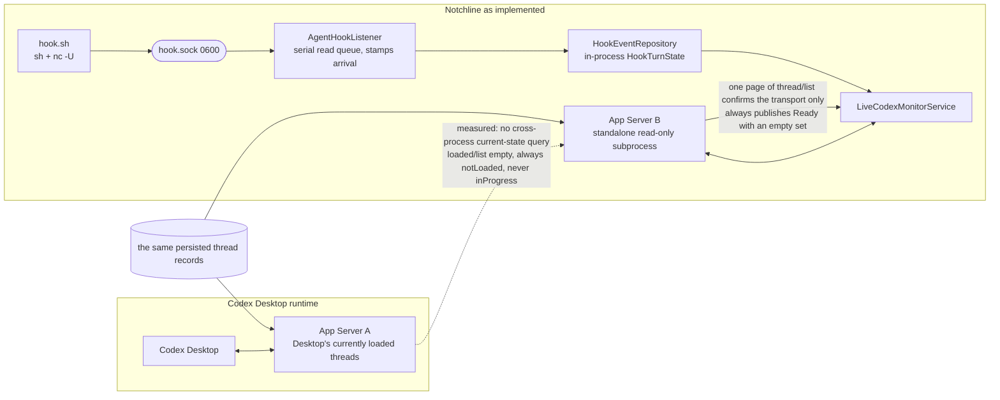
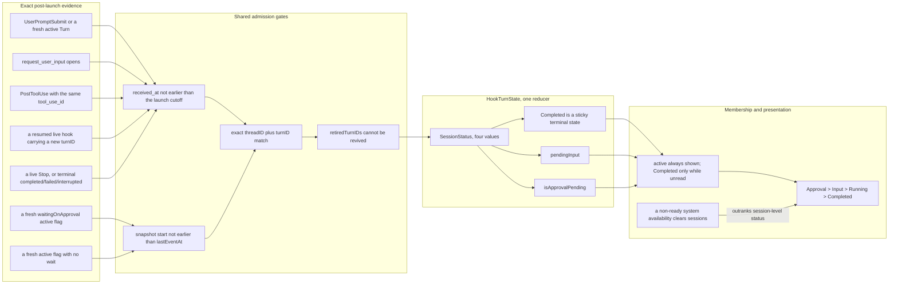
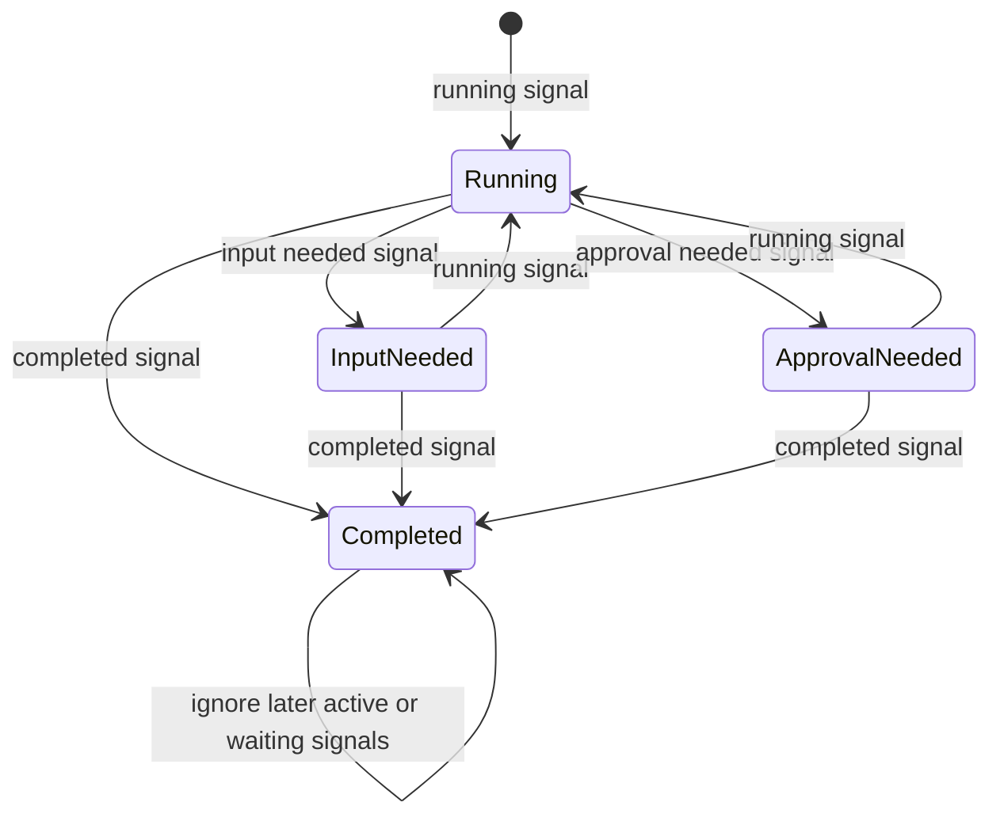

# Notchline — current system architecture

| Field | Value |
| --- | --- |
| Nature | The architecture as implemented, not a future plan |
| Baseline | 2026-08-28 |
| Purpose | Summarise, in one macOS top-of-screen surface, the active or unread-terminal Turns of the monitored products' root threads |
| Entry point | `MonitorStore.shared` → `LiveCodexMonitorService` |

This document follows the current Swift implementation, from a product's boundary signals entering the app through row-level status convergence, set filtering, top-level summary and exact navigation. The main chain stays:

```text
boundary signals → one reducer / orchestrator → MonitorSnapshot → MonitorStore → AppKit / SwiftUI
```

"Private read-only" in the diagrams means only that a dependency is on an undocumented Desktop schema; those are confined to boundary adapters, never enter the domain model, and are never written back. Risks are registered in [`non-public-codex-integration-features.md`](non-public-codex-integration-features.md).

## 1. The implementation at a glance

```mermaid
flowchart LR
    subgraph codexSources ["Codex Desktop and local data sources"]
        desktopHooks["Codex Desktop official Hooks lifecycle"]
        desktopState[(".codex-global-state.json private read-only")]
        codexBinary["codex executable and private Desktop bundle discovery paths"]
        appServerProcess["standalone codex app-server subprocess"]
        desktopProcess["Codex Desktop private bundle ID and current PID"]
        desktopDeepLink["Codex Desktop deep link target"]
    end

    subgraph hookBoundary ["Hook boundary"]
        hookRegistrar["CodexHookRegistrar actor, seven frozen definitions"]
        hooksConfig[("~/.codex/hooks.json")]
        hookHelper["hook.sh: sh plus nc -U, always exit 0"]
        hookSocket(["hook.sock 0600, one payload per connection"])
        hookListener["AgentHookListener serial read queue, stamps arrival"]
        installState[("install.json: only installedAt and lastEventAt")]
        hookRepository["HookEventRepository actor: exact Turn reducer and session text"]
    end

    subgraph appServerBoundary ["Public App Server read-only boundary"]
        executableLocator["CodexExecutableLocator"]
        appServerClient["CodexAppServerClient actor"]
        streamPump["AppServerStreamPump: NDJSON framing on a serial queue"]
        streamConsumer["single consumer task, decoding off the actor"]
        requestGuard["pendingRequests timeout and one liveness probe"]
    end

    subgraph desktopAdapters ["Desktop private read-only adapters"]
        projectRepository["CodexDesktopProjectMetadataRepository actor"]
        unreadRepository["CodexDesktopUnreadStateRepository actor"]
        approvalRoutingRepository["CodexDesktopApprovalRoutingRepository actor"]
        directoryWatcher["directory watcher, 50 ms debounce, re-attachable"]
        desktopPidGate["NSRunningApplication PID observation gate"]
    end

    subgraph applicationCore ["Application core"]
        liveService["LiveCodexMonitorService actor: the one orchestrator"]
        snapshotParser["CodexSnapshotParser: pure parsing and sorting"]
        unreadGate["TerminalUnreadMembershipGate"]
        serviceState[("in-memory caches and background refresh tasks")]
        monitorSnapshot["MonitorSnapshot: availability, sessions, quota, diagnostic"]
    end

    subgraph presentationState ["Main-thread presentation state"]
        stabilityGate["ConnectionStabilityGate, 3 s disconnect grace"]
        aggregation["MonitorAggregation: top-level status"]
        monitorStore["MonitorStore @MainActor, the only UI state source"]
    end

    subgraph macUi ["macOS presentation and control"]
        panelController["OverlayPanelController: NSPanel geometry and animation"]
        notchView["NotchOverlayView: collapsed and expanded session list"]
        productRoot["ProductRootView: first run"]
        settingsView["AppSettingsView: single-panel settings window"]
        navigator["CodexDesktopNavigator"]
        claudeNavigator["ClaudeCodeNavigator: raises the host up the process chain"]
    end

    desktopHooks -->|"runs the trusted handler"| hookHelper
    hookHelper -->|"the whole payload, unfiltered"| hookSocket
    hookSocket --> hookListener
    hookListener -->|"handed over in arrival order"| hookRepository
    hookRepository -->|"HookStateSnapshot"| liveService
    hookRepository -->|"persists hook-configuration trust only"| installState

    hookRegistrar -->|"appends seven definitions at the tail, never rewritten"| hooksConfig
    hooksConfig -.->|"official Hooks configuration"| desktopHooks
    hooksConfig -.->|"FSEvents change, recompute registration completeness"| hookRegistrar
    hookRegistrar -->|"overwrites only when bytes differ"| hookHelper

    executableLocator -->|"locates the executable URL"| codexBinary
    executableLocator -->|"injects executableURL"| appServerClient
    codexBinary -->|"executed by Process"| appServerProcess
    appServerClient -->|"launches and manages the subprocess"| appServerProcess
    appServerProcess -->|"stdout byte stream"| streamPump
    streamPump -->|"ordered complete frames, AsyncStream"| streamConsumer
    streamConsumer -->|"decoded envelope"| appServerClient
    appServerClient -->|"stdin JSON-RPC request"| appServerProcess
    requestGuard -->|"guards the request lifecycle"| appServerClient
    appServerClient <-->|"seven read-only methods and their results"| liveService

    desktopState -.->|"Project assignments"| projectRepository
    desktopState -.->|"local unread thread IDs"| unreadRepository
    desktopState -.->|"per-thread approvalsReviewer"| approvalRoutingRepository
    desktopState -.->|"directory atomic-replace events"| directoryWatcher
    directoryWatcher -->|"debounced change signal"| unreadRepository
    projectRepository -->|"Project, Chats or unavailable"| liveService
    unreadRepository -->|"unread set tagged with its authority"| liveService
    approvalRoutingRepository -->|"threads proven to be auto-reviewed"| liveService
    desktopProcess -->|"current PID"| desktopPidGate
    desktopPidGate -->|"binds hook trust to the current process"| liveService
    hookRegistrar <-->|"registration, install, remove"| liveService

    liveService -->|"constructs row state"| snapshotParser
    liveService <-->|"30 s list and 60 s usage refresh while Turns exist (the Claude Code list and quota carry liveness and screen gates too, §2)"| serviceState
    snapshotParser -->|"MonitoredSession candidates"| unreadGate
    unreadGate -->|"active or unread-terminal members"| monitorSnapshot
    liveService -->|"availability, quota, diagnostic"| monitorSnapshot

    monitorSnapshot -->|"candidate publish"| stabilityGate
    monitorSnapshot -->|"aggregates sessions when ready"| aggregation
    stabilityGate -->|"publish or hold for retry"| monitorStore
    aggregation -->|"top-level MonitorStatus"| monitorStore
    hookRepository -.->|"changeEvents: rendered projection changed, row text changed, Codex PreToolUse"| monitorStore
    unreadRepository -.->|"changeEvents"| monitorStore

    monitorStore -->|"Published state"| panelController
    monitorStore -->|"Published state and user intent"| notchView
    monitorStore -->|"onboarding state"| productRoot
    settingsView -->|"install, remove, display"| monitorStore
    monitorStore -->|"click a Codex row"| navigator
    monitorStore -->|"click a Claude Code row"| claudeNavigator
    navigator -->|"pre-flight thread/read"| liveService
    navigator -->|"codex://threads/{threadId}"| desktopDeepLink
    desktopDeepLink -.->|"Launch Services targeted open"| desktopProcess
```



Boundary classification:

| Kind | Capability | Constraint |
| --- | --- | --- |
| Officially public | Hooks lifecycle; the App Server protocol and its **six** public read-only methods (`account/read`, `account/rateLimits/read`, `account/usage/read`, `thread/list`, `thread/loaded/list`, `thread/read` — the last always with `includeTurns: false`); `codex://threads/{threadId}` | Used as the primary integration contract |
| Registered experimental App Server method | `thread/items/list` (scoped to this Turn, descending, `limit: 6`, taking only the newest `agentMessage.text`) — the seventh method the client speaks | Only for the current progress on a Running row; absent from the schema without `--experimental`, so registered as a non-public dependency. `-32601` (method absent, or that thread's `historyMode` is `legacy`) is **recorded per thread**, that row falls back to the prompt preview, and other rows are unaffected |
| Registered non-public dependencies | Desktop Project/unread schema, the executable path inside the Desktop bundle, the Desktop bundle identifier | Read-only or discovery-only; fail closed on failure; keep the non-public feature registry in sync |
| Internal to the app | The hook helper, socket, `install.json`, reducer, caches, snapshot and UI store | `install.json`'s `lastEventAt` answers only "has a hook ever executed successfully" and never proves anything about the current runtime; Turn state, thread identity, previews and caches exist **only** in memory — there is no event queue, so there are no events awaiting consumption ([ADR 0015](adr/0015-hook-events-go-straight-into-the-reducer.md)) |

## 2. The core refresh sequence

This sequence is why the main chain needs no UI patch per anomaly: `MonitorStore` accepts only a complete `MonitorSnapshot`, and low-latency events, low-frequency correction, private metadata and recovery policy all converge inside `LiveCodexMonitorService`.

```mermaid
sequenceDiagram
    participant store as MonitorStore
    participant service as LiveCodexMonitorService
    participant hooks as HookEventRepository
    participant registrar as CodexHookRegistrar
    participant appServer as CodexAppServerClient
    participant project as Project metadata repository
    participant unread as Unread state repository
    participant reducer as Parser and membership gates

    loop Triggered by a watcher edge, a due deadline or the 60 s heartbeat
        store->>service: fetchSnapshot
        service->>hooks: drainDeliveredEvents
        hooks-->>service: post-launch exact Turn evidence
        service->>registrar: registration
        registrar-->>service: configuration trust cached until hooks.json changes
        service->>service: retire held Turns unless the current Desktop PID produced them
        service->>appServer: connect and initialize if needed
        service->>project: snapshot
        project-->>service: exact Project mapping or conservative fallback

        alt Post-launch hook observation exists under the current Desktop PID
            service->>unread: snapshot
            unread-->>service: unread IDs with source authority
            opt reducer thread metadata stale beyond 10 s
                service->>appServer: schedule background thread/read includeTurns false
                appServer-->>service: per-thread metadata record
            end
            opt a hook names an unlisted, unrefused thread, or 30 s membership is due
                service->>appServer: schedule background paginated thread/list
                appServer-->>service: membership replacement on full success
            end
            note over service: a Turn with no Thread record draws no row; a remote error records "no such thread"
            service->>reducer: merge hook evidence, fresh App Server data and metadata
            service->>hooks: reconcile exact four-state session status
            reducer-->>service: sorted active or unread-terminal sessions
        else no post-launch hook observation
            service->>appServer: thread/list limit 1
            appServer-->>service: one page, discarded unread
            service->>service: Ready with an empty session set
        end

        service->>service: schedule quota and daily usage refresh after the core snapshot
        service-->>store: MonitorSnapshot
        store->>store: apply disconnect grace, the dismissed-row filter and aggregation
        store-->>store: publish only changed UI fields
    end
```

Both directory watchers can re-attach: a missing or replaced directory is not terminal, `rename`/`delete` triggers a reopen, and the refresh path retries in passing. They have no retry timer of their own, so the cost of "cannot attach" is one failed `open` per refresh rather than a new wake-up source.

Refresh no longer samples on a fixed cadence. Four sources drive it, merged into one `changeEvents` stream or a sleep duration: the store's signal when the rendered projection changes; the directory watchers on `hooks.json` and the Desktop state file; **the invalidation signal the service emits when a background read lands**; the next due moment the service reports through `nextRefreshDeadline()` (terminal settling, metadata/membership/quota cache expiry); and a 60-second heartbeat.

The first source has two supplements outside the rendered projection, both existing solely for the row's "current progress" line, whose source is not in the projection:

- **Claude Code**: when a `MessageDisplay` delta folds into the preview store, signal once if the line the row will draw genuinely changed — a Turn change counts, because before this Turn speaks the row draws the prompt. The frequency is capped not by a rule but by the 240-character head: once full, later deltas of the same message return before being stored anywhere. Measured (CLI 2.1.234, 1561 characters / 11 deltas), a long message wakes it twice and a short one once.
- **Codex**: `PreToolUse` signals once (`PostToolUse` does not). It changes no field in the projection, but Codex prints commentary before calling a tool, so this is when that sentence changes and when that `thread/items/list` read should be scheduled.

Neither generalises to "redraw when content changes": `MonitorStore.apply` still publishes only when `sessions` genuinely differ, so a wake-up with no change costs one refresh run rather than the 20 ms whole-surface re-evaluation (`AGENTS.md` §7).

The third source is necessary rather than an optimisation: quota, membership and thread metadata are all read in the background, and by the time a result lands the snapshot that started it has long been published. Before polling was removed these results were carried out by the next poll cycle (within a second); afterwards, if they do not signal for themselves, they wait for some unrelated deadline — measured as a blank quota ring for about 10 seconds after launch. So **every background read must end in an invalidation signal**. `isRefreshInFlight` merges them into one refresh rather than creating a second state pipeline.

**`nextRefreshDeadline()` may report only a deadline this refresh can genuinely clear.** The store wakes at that moment and refreshes; if it is still in the past afterwards, the same wake-up fires again immediately — the failure is not "a late wake-up" but a busy loop. So every deadline must mirror its own scheduler's condition: metadata expiry is computed only over **the threads that will actually be re-read** (those the hooks track) rather than the whole `threadRecords` cache — the rest are refreshed by the membership read on 30 seconds, and measuring them with a 10-second metadata window yields a deadline 20 seconds early that no work will ever clear; and a backoff marker is a floor on "no earlier than the next attempt", not an independent reason to wake. Both were once true here.

Terminal rows are the one deliberate exception. Read evidence does not arrive with time but with a file change on a watcher, and by its own documentation a watcher is "a low-latency hint, never a source of truth". Reporting **no deadline at all** looked like the natural conclusion of the same rule, and measured out as betting the product's core interaction on one edge: in a real trace, a terminal row went **a full eight seconds with zero refreshes** between being listed and being read. So such rows report a re-check **measured forward from now** (`terminalUnreadRecheckInterval`, 1 second). Since ADR 0012's rule 3 that second is **also** a genuine sample: it needs the foreground, the display and the lock state to hold simultaneously, and can only be read at the re-check. The terminal half lands on the same second for a harder reason — a controlling terminal's access time is advanced by the kernel and produces no observable event, so there is no edge to wait for at all; it too reads three states together (access time, whether the host application holds the foreground, whether the screen is available) and can only do so at the re-check. It does not turn the re-check into a busy loop: with no row waiting it is never asked, and an answer either removes that row or books the next one. The distinction is not "report or not" but "is what is reported stale" — `terminalObservedAt + settlingInterval` is permanently in the past for an unread row, clamped by the store to a 1-second floor with no refresh able to move it, and *that* is a busy loop wearing a deadline's clothes; a re-check measured forward from `now` is clearable by construction, because the refresh at that moment either hides the row or books the next. Normally the watcher arrives first and this floor never comes due.

**"Can clear it" has to be read together with the branch, not just the row.** The previous paragraph argues that a re-check measured from `now` is clearable by construction — which holds only while **this refresh will actually evaluate this row**, and that failed in five places with identical symptoms: a 1 Hz that is permanently in the future and therefore invisible even to the store's `stuckDeadlines` suppression (which only suppresses *the same expired moment reported repeatedly*, while this one advances on every call).

1. **The gate is pruned only on the live-hook branch** (CR-Fable-001). `shouldDisplay` and `retain` live inside `sessions(from:)`, reached only by the Codex live-hook branch; the no-hook, awaiting-install and every error branch return before it, so entries froze in place, were never hidden, and the re-check was re-reported second after second. To the user: a Turn finishes unread, Codex Desktop quits — nothing on the notch, and the app wakes once a second all day. The fix is not a `reset()` before each `return` but a `defer` plus a "did this refresh evaluate rows" flag: the problem was never those particular branches but the next one nobody remembers to teach.
2. **A re-check samples nothing while there is no screen** (CR-Fable-018). The defence of 1-second sampling above holds, but it was made about "a screen someone might be looking at". Every path that can retire such a row requires the display awake, the session unlocked and on console — Claude Code's `isInFrontOfThem` and the terminal gesture path both rest directly on `systemScreenIsAvailable()`, and the Codex side needs the user to open that thread in Desktop. With all three false the answer is known before any work starts and the sample gathers nothing. So that reading was promoted from "read inside the test" to **read once before booking the deadline**: rows waiting on a *user* stop booking, and hang on `ScreenAvailabilityWatcher`'s edges instead (display wake, unlock, screen saver end, session returning to console, system wake). A locked night goes from one wake-up per second to none, with no change in latency when the user returns — those notifications all arrive before the user can do anything. Rows waiting on *time* (the settling window) and on a *file* (unread state unreadable) are unaffected: the former is advanced by the refresh itself and the latter by another app rewriting a file, neither of which depends on anyone being present.
3. **Having a device is not being able to answer** (CR-Fable-036, `tech-design.md` §1.5.1). A `tmux`/`ssh` session does have a controlling terminal, but its host can never hold the foreground, so the test is permanently false, the row entered the gate, and it booked a full two-product refresh every second. The predicate has to ask what the comment beside it had long said: not "is there a device" but "is there a host that could ever say yes".
4. **A row the user dismissed stayed in the gate** (CR-Fable-003). `MonitorStore.dismiss(_:)` records the row id in `dismissedSessionIDsByAgent` and re-runs the merge, and stops there — **no signal reaches the provider**. Both products' terminal gates therefore went on treating that row as a listed, unread entry, and `nextRefreshDeadline()` went on booking its 1-second re-check: for Claude Code each re-check is a terminal gesture read (`sysctl` + `devname_r` + `stat`, plus up to 16 levels of ancestry) and a three-state `isInFrontOfThem` sample, and for Codex a full snapshot (including a main-thread `NSRunningApplication` LaunchServices round trip). A user right-clicks one terminal row away and leaves that CLI at a prompt, and with nothing on the notch the app keeps running a two-product refresh every second, indefinitely. The fix sends the dismissal to the service that owns it: the record is still held only by the store — only it can distinguish "the user dismissed it" from "the Turn ended", `tech-design.md` §17 — but each `fetchSnapshot(dismissedRowIDs:)` carries that product's share down, so the service does not evaluate the row or build an entry for it, and `retain` drops any entry it already had. **The row is still reported**: not reporting it would tell the store that Turn had ended, which is what let CR-Fable-004's dismissal be forgotten and the row return to the notch on the next hook event.
5. **The membership deadline has nobody to clear it without hook observation** (CR-Fable-023). Once `threadListReadAt` is set, membership expiry unconditionally refills, while **the schedule that re-reads it is written only on the live-hook branch**. After Desktop quits that deadline is reported every 30 seconds, lands in the past, no refresh can move it, and it bottoms out on the store's 1-second floor — an empty-notch 1 Hz again. The same held for a membership request stopped by backoff: a retry marker is contractually reported as a reason to wake, and the no-hook branch never picks that request back up. The deadline is therefore reported only while the hook reducer still holds a Turn (which is also where `threadRecords`'s and `removeThreads(notIn:)`'s only consumers live), and the no-hook branch drops both reads that only the live-hook branch can consume or clear.

All five are one strengthened rule: **a deadline must be clearable not only in principle for that row, but by a refresh that will genuinely happen on this branch, in this machine state.**

**Deadline wake-ups must be refilled at the end of a refresh run, not inside the store's own loop.** Deadlines are *produced* by refreshes: a terminal row begins waiting on the user during the Stop-hook-driven refresh, and books its 1-second re-check at that moment. Yet the overwhelming majority of refreshes are watcher-driven rather than store-initiated. The earlier form was a `while` loop — refresh, compute a deadline, sleep to it — so a deadline booked by a watcher-driven refresh landed after the loop had already gone to sleep, on a sleep computed from a state with no terminal row in it, usually the 60-second heartbeat. The re-check was faithfully reported and faithfully ignored, and the row stayed on screen for up to a minute. The same missing refill also held up re-evaluating the disconnect grace period and retrying the quota read. `scheduleNextWake()` now hangs off the end of `startRefreshRunIfNeeded`'s run, which the watcher, Recheck and heartbeat paths all pass through, so a deadline produced by any refresh is genuinely slept to.

The store does not validate deadlines the service reports, so there is a second backstop: sleep duration has `minimumRefreshInterval` (1 second) as a **floor** and never rounds to 0. That bounds any escaped bad deadline to the 1 Hz that existed before polling was removed, rather than a whole core — the previous version without this floor measured 63% CPU, with the main thread stuck in `NSRunningApplication`'s synchronous LaunchServices round trip. It likewise carries no latency guarantee.

**The heartbeat is only a backstop and carries no latency guarantee.** Its sole reason to exist is two silent-failure classes known in this repository: `DirectoryChangeWatcher` does not re-attach after `open(O_EVTONLY)` fails or the directory is replaced (CR-018), and a deadline wake-up can be lost soundlessly to a cancelled task or a miscomputed deadline. No "updates are too slow" problem may ever be solved by shortening the heartbeat.

**But a wake-up is not itself a reason to re-read (CR-Fable-002).** That heartbeat, plus the Codex account reading due every 30 seconds, means this process wakes every 30–60 seconds regardless and asks **every** service for a snapshot in that pass. So any data source with "re-read once the cache is older than N" behaves, for any N below that interval, as unconditional sampling at that interval — `ClaudeCodeSessionRegistry`'s 30-second freshness did exactly this, launching `claude agents --json` every 30–60 seconds forever on an idle machine with no Claude Code open and the screen locked. Freshness is a ceiling on how stale an answer may get, not a reason to buy a fresh one nobody asked for. The rule is therefore: **with no edge reporting a change and no row on screen depending on it, the cached answer simply counts** — provided that answer was genuinely answered rather than an empty shell left when nobody replied. This is the same rule as the terminal rows' "never ask when no row is waiting", from the other direction: one says do not book a deadline when nobody is waiting, the other says waking is not spending. Costs and measurements in §6, decision in `tech-design.md` §15.1.

**Listed sessions are the other half of that rule (2026-08-26).** The above covers only an answered empty list; with rows in the list, the 30-second freshness still bought `claude agents --json` every 30 seconds, so a machine with Claude Code open sat on that cadence all day. What it actually buys is one thing: a row **might need to come down**, and of the routes to coming down only one reports no edge — a session `SIGKILL`ed, its record left on disk, with `~/.claude/sessions` firing nothing. That route needs a `pid` plus process start-time comparison, which the kernel answers directly: one `sysctl` per listed session, microseconds, no process. So the cadence still decides **when it may be asked** and the kernel decides **whether the answer is worth paying for** — `ClaudeCodeSessionRegistry.everyListedSessionIsStillAlive()`. Start times are anchored in place on every answered read and afterwards compared only against their own earlier readings, so a reused pid also counts as a ghost; a pid that cannot be anchored or read counts as "not still alive" and falls back to the command, which is the behaviour from before the change. A bonus: a ghost is now found at the next refresh rather than at the next freshness boundary — refreshes are hook-driven, so killing a busy session is seen the same second.

**The clock branch also needs a screen (2026-08-26).** A cadence is a guess about how stale an answer is, and with no display that guess is bought for nobody — the notch it would correct is not being drawn. Edges are exempt: an edge is someone reporting that the list is already wrong, which is evidence and must be answered whether or not anyone is watching. The screen waking is itself an edge already merged into `ClaudeCodeMonitorService.stateChangeEvents`, so the read skipped all night is bought the moment the user returns. The quota read (`claude -p "/usage"`) is the same and harder: both its numbers are drawn only in the expanded panel's footer, which the user must hover the notch to see, so with no screen it is not "probably unwatched" but **unwatchable**.

`claude -p "/usage"`'s cadence also widened from 5 minutes to **30 minutes**. That number is set by cost, not value: measured in Release 2026-08-25, one read is **2.53 s CPU, a 375 MB peak resident, 31.5K page faults and 35.5K context switches**, and it leaves a transcript on disk that nothing cleans. At 5 minutes, twelve hours is 142 launches and about 360 seconds of CPU — more than the app itself spends in the same period. What it buys is a 5-hour and a 7-day window drawn to the percent; the 5-hour one moves about 0.3% a minute at the fastest a person can spend, so half an hour of staleness is a few percentage points on whichever rule is furthest from its reset. The trust ceiling rose from 900 to 3600 seconds with it: the ceiling counts from the **last answer**, and the first failed attempt cannot happen until a whole freshness window after one, so 900 against 1800 would blank the quota on the first miss — exactly what the split exists to prevent.

Installation health is the same: registration completeness answers a question that changes only when this app writes `hooks.json`, when the user asks for a Recheck, or when that file changes under us, so it too is not recomputed on a cadence. `CodexHookRegistrar.registration()` caches the last reading, the first two invalidate it directly, and an external edit is recognised at read time by comparing the watcher's `changeCount` — **with no backstop cadence** (`tech-design.md` §7.2). **Polling the configuration cannot answer the dimension that actually breaks anyway** — Codex records trust by hashing definition content, so a scan passing does not mean a hook will run (§8 of the technical design).

Event consumption happens **once per pass**. `drainDeliveredEvents` takes the inbox wholesale and advances Turn state; the take is atomic, so a second read can only appropriate evidence the first should have been told about. It appears only on the snapshot path. `hookSetupStatus` reads only the persisted trust marker, and integration health returns with `MonitorSnapshot.setupStatus` rather than being asked again upstream.

### 2.1 The launch boundary: no cold-start sync

The product capability is strictly "sync the session list from this launch onwards". Everything before launch — running sessions, finished-unread sessions, sessions awaiting approval — is ignored until it produces its next lifecycle event.

**This is now an architectural property rather than a check.** Hook events no longer touch disk ([ADR 0015](adr/0015-hook-events-go-straight-into-the-reducer.md)): a payload comes down a socket into this process from a helper that ran moments ago, so **an arriving event is current by construction**. There is no backlog to classify because nothing is written down — `liveEventCutoff` and backlog classification were deleted with the event queue. The first event received after launch is this run's first event, and that is all.

The only thing left on disk is one `lastEventAt` line in `install.json`, which answers only "have these definitions ever been trusted" and is never restored as current runtime evidence: after a restart `hasObservedEvent` is true while `hasObservedLiveEvent` is false, and not one Turn is restored.

The App Server likewise produces no sessions: it supplies membership and metadata, adding titles and Projects to sessions whose identity live hooks established, and can never create a row on its own.



State is judged in two stages, transport and snapshot: Disconnected only when `initialize` or the connection fails and the App Server does not answer; Connecting while the handshake has begun and the validating `thread/list` has not completed; and a successful `thread/list` confirms the transport and **always** publishes Ready with an empty set. That validation needs one page (`limit: 1`): it asks whether this transport can answer a real read, not which threads exist, and the paginated membership set has no consumer on this branch (CR-Fable-023, §6). `thread/loaded/list` is kept only as a lightweight liveness probe after a transport timeout, decides no business availability, and takes part in no membership set.

The collapsed drawing follows presence: `MonitorStore.presenceMarks` gives one mark per connected product and the UI draws one matrix each, **each running its own product's curve** rather than a shared summary status. With no product connected there is one grey mark naming no product; in that resting state the notched form drops the leading wing entirely (`drawsCompactMarks`), because the cut-out is already a shape on screen and a second, information-free shape beside it is pointless. The notch-less form keeps the mark to hold its menu-bar position, and hover there only expands the pill sideways to expose the gear (`expandsToPillOnly`) rather than dropping the panel — there is nothing to put in one.

**The availability produced here is only half the collapsed status.** The other half is **presence**: whether that product is open right now, answered by the `NSRunningApplication` query the same refresh already makes (and on the Claude Code side by the active session list). Both must hold to count as connected and show `Connected`; otherwise `Disconnected`. `Connecting`, `Set up integration`, `Update required` and `Version unsupported` no longer appear collapsed and travel with availability into the expanded panel and Settings. The merge is a pure function in `MonitorAggregation.status`, and presence itself is `AgentSnapshot.presence`, a peer of availability rather than derived from it.

**Two counts hang off the mark, computed in the same merge as the status.** Besides fixing a `MonitorStatus` per connected product, `MonitorAggregation.marks` counts that product's own rows (`PresenceMark.sessionCount`, drawn as the dot column right of the matrix) and its unfinished subagents (`PresenceMark.subagents`, drawn as the badge before the timer, its ground saying whether any of them is waiting on a person). Both look only at that product's own rows — the same filter as the status — so Codex's Turns are never counted into Claude Code's mark. The collapsed badge pair reads that result directly (`MonitorStore.compactSubagentBadges`) rather than re-summing, so the two ends of one bar cannot give two answers about one list. The session count dots (`SessionCountDots`) are part of the mark rather than an addition to it: `PanelMetrics.markWidth` counts the matrix and the `5.66` column to its right as one mark, and `marksWidth(_:areProductMarks:)` does so only for product marks, since the resting grey mark has no column. The column is **reserved in width and packed in drawing**: `marksWidth` cannot be told the session count, so the leading wing is one width at every count; `StatusReadout` frames the mark group into that width aligned to the leading edge, a product with no rows draws no column, and the width given up accumulates between the last mark and the cut-out. The notched panel is pinned to the cut-out and the leading wing is fixed, so the leading edge is fixed too — the leading matrix does not move at any session count, and a column opening pushes only the marks after it. The column is exactly as tall as the matrix (`2 × 5.84 + 4.93 = 16.6`), so it is unaffected by menu-bar height and draws identically at every step.

**The merge reads derived status.** `MonitorAggregation.status`, `marks` and `rowOrder` all pass through `effectiveStatus(of:)`, which answers two things: a row whose own Turn is Completed while a subagent it spawned still runs participates in the merge and the sort as Running; and a row one of whose subagents is stopped at an approval dialogue participates as Approval needed, beating the former but not the Turn's own Input needed (`CONTEXT.md`'s "derived status", `PRD.md` §6.2). The second holds whether or not the Turn is terminal. **There is a third thing, and only Claude Code can answer it**: when a row's own Turn is Completed, its subagents have wrapped up, and that Turn's `Stop` said "paused, waiting for background work to wake me" (a non-empty `background_tasks`), that row also participates as Running until the Thread's next terminal state says nothing is in flight — the 50–130 ms in between being exactly how long Claude Code takes to wake the parent Turn (measured 2026-08-23, CLI `2.1.241`), during which a count-only reading would flash `Completed`. **Both products produce such rows**: Codex through `spawn_agent`, and Claude Code's `Agent` call returning the instant the subagent starts. Otherwise it is the identity transform — a row with `runningSubagentCount` of zero is unchanged, whichever product produced it. **This derived answer never enters a row's rendering**: what a row draws still comes only from `MonitoredSession.status`, its own Turn's status. The **ground** of the row-end badge is the one exception, and a ground does not change what the row draws. So the collapsed state can read `Running` with no timer in the trailing wing, and that is correct: `longestRunningSessionStart` filters on `keepsTiming`, no Turn is timing at that moment, and that cell instead writes each product's subagent total.

**Launch does no cold-start sync.** Sessions can be created only by hooks received after this launch; sessions running, finished-unread or awaiting approval before it are ignored until their next lifecycle event. This is a capability boundary rather than a trade-off: measured (CLI `0.148.0-alpha.9`, on a genuinely in-flight Turn), a standalone App Server's `thread/loaded/list` is empty, threads are permanently `notLoaded`, `thread/list` contractually returns no `turns`, and `thread/read` never shows `inProgress` — so no supported read can answer **what state** Desktop is in right now.

**That sentence is about state, not content — a boundary measured 2026-08-25.** On the same standalone App Server, `thread/items/list` **can read items already produced by a Turn another process is running**, including an unfinished one: measured on CLI `0.149.0-alpha.4.3`, polling a Turn driven by a standalone `codex exec` every 1.5 seconds, commentary `agentMessage`s appeared in the first poll after they were printed and kept up thereafter. This does not contradict the paragraph above — it answers what this Turn has said, not whether this Turn is still running; in the same read the Turn's `status` is still `interrupted`, and `thread/turns/list`'s summary holds only a `userMessage` until the Turn ends. So it is used only to fill the row's body line, while membership and status still come only from hooks (`tech-design.md` §11).

**The Claude Code side follows the same rule for a different reason.** There it can be read: `claude agents --json` gives which sessions exist and a transcript's tail gives which are mid-Turn, and the product did rebuild pre-launch rows from that (`ClaudeCodeTranscriptReader.currentTurn`, removed 2026-08-19). It was removed not for cost but because that answer is wrong exactly where it matters: **while waiting on a user a transcript writes nothing**, so a rebuilt Turn can only be *Running*, and a session parked on a permission request at launch is drawn as working. Files cannot separate waiting from working, and guessing either way fabricates state (§7 rules 5 and 6), so there is no narrower version to keep. The cost is that those sessions wait for their next lifecycle event, as on the Codex side; what it buys is one launch-boundary sentence for both products rather than an exception on one side.

**Hooks are the only source of sessions, but not the whole condition for a row.** A hook answers whether there is a Turn and what state it is in; only the product can answer whether the Thread is a navigable root thread, and that test fails closed — no Thread means no row, the same as being handed one and judging it a subagent. The distinction was forced by Codex side chats: an ephemeral thread with its own thread id, firing Turn hooks as usual, yet never persisted, absent from `thread/list`, answered `-32600 "thread not loaded"` by `thread/read`, and openable by no deep link. The test could previously reject only a Thread it had **received**, so a side chat drew a *Project unavailable* row, was retired 10 seconds later by membership reconciliation, returned once at its end, and reported "archived, deleted, or no longer available" on click. Such refusals are now recorded: no row, not re-asked, and no longer paginating an entire history for a thread the product itself says does not exist. The cost is one local `thread/read` per row — measured, the thread is already persisted and readable when the first hook fires (2026-08-25, CLI `0.149.0-alpha.4.3`), so the normal path is one local round trip and does not wait for the full list ([ADR 0017](adr/0017-a-row-requires-a-thread-the-app-server-vouches-for.md)).

**The click asks the same question (2026-08-26).** The re-confirmation before opening a row is also a `thread/read` for **that** Thread rather than a forced full pagination of every unarchived Thread. It was the latter, putting the user's entire Codex history on a click's critical path: the App Server answers `thread/list` by scanning and parsing the rollout files under `~/.codex/sessions` (replace `state_5.sqlite` with an empty database, leave only the sessions directory, and it still lists them all), so the cost grows with history and is paginated — measured on an isolated `CODEX_HOME` with CLI `0.149.0-alpha.4.3`, one full pagination is 51 ms at 50 threads, 335 ms at 199, 754 ms at 400 and **2215 ms at 799**, while one `thread/read` is a median of 1.4 ms. Everything else on the click path is negligible (`NSWorkspace.open`'s callback 94 ms, connecting a no-op). End-to-end A/B on an idle machine, same thread, same fixture (a real row staged over the hook socket, a real `CGEvent` click, timed to `didActivateApplicationNotification`), swapping only the app binary: a median of **220 ms** before (208–317) and **62 ms** after (56–69), the difference of the same order as this machine's full pagination — and this machine has only 47 unarchived threads. **Archiving is not in this gate**: it ends the row's monitoring lifecycle rather than the thread's reachability, and that lifecycle is already owned by the 30-second membership reconciliation, so a row the user can still see is one the last reconciliation still listed ([ADR 0018](adr/0018-the-click-asks-about-one-thread.md)).

A standalone App Server shares no in-process event stream with Desktop, and no supported read observes Desktop's current runtime, so launch produces no sessions and post-launch hooks are their only source. A fully shared runtime remains future exploration in [`technical-explorations/shared-app-server/README.md`](technical-explorations/shared-app-server/README.md) — only once such a topology holds is launch sync worth revisiting, and it must not be built on `status` or `inProgress`. Under no topology may events from before the launch cutoff be used to fill in current state.

## 3. Single-session status convergence





Key rules:

- Every hook type from before the launch cutoff has its business semantics discarded; there is no "a historical `Stop` may restore a terminal boundary" exception.
- Continuing after an interrupt in Desktop may create a new Turn without another `UserPromptSubmit`. A later live hook on the same Thread carrying an unretired new `turn_id` atomically replaces the current Turn and retires the old id immediately, so the resumed final `Stop` hits the new current Turn while late old events still cannot revive it.
- `Approval needed` is always established by a tool call's open/close interval, but Codex has **two** approval shapes, both closed in pairs by `tool_use_id`:
  - **A dedicated approval tool** (measured 2026-08-15, a network access approval): `PreToolUse(request_permissions)` opens a call spanning the entire human wait, closed by `PostToolUse` with the same `tool_use_id`; in this shape Codex sends **no** `PermissionRequest`, making it structurally identical to `request_user_input`.
  - **An ordinary tool approval** (measured 2026-08-15, a Bash command): Codex first announces the call with `PreToolUse` (`tool_name: "Bash"`, `tool_use_id: "exec-…"`), sends `PermissionRequest` about 30 ms later **carrying `tool_name` with a null `tool_use_id`**, and then waits on a person; after approval the `PostToolUse` with that `tool_use_id` arrives. So `PermissionRequest` borrows that tool's still-open call id as the wait's identity, closing still goes through the existing pairing, and no timing or timeout guess is introduced.
- `PermissionRequest` is still not evidence of a wait by itself: with no open call to pair with (or when the tool it names does not match the open call) the status is unchanged, and no wait that cannot be closed is created.
- **This section used to say "an automatically approved request receives its paired `PostToolUse` immediately, opening and closing within one batch, so it cannot linger as a false wait" — that was wrong**, and disproving it is what prompted the change. Measured 2026-08-22 (CLI `0.149.0-alpha.4.1`, `codex exec --approve-for-me`, non-interactive with nobody present to ask): `PreToolUse(Bash, exec-…)`, then `PermissionRequest(Bash, tool_use_id: null)` 10 ms later, and the paired `PostToolUse` **2.5 seconds afterwards** — automatic review is a model round trip plus the command's own execution. The borrowed-id wait spans that whole stretch, so the row reported Approval needed and reverted to Running on every reviewed call. Desktop-side automatic review is longer: `item/autoApprovalReview/started` to `completed` measured 2.1–5.9 s in the same day's Desktop log.
- **So a thread-level gate sits ahead of the approval interval: do this thread's approvals actually reach a person?** Codex Desktop's "Approval for me" (`guardian-approvals` agent mode) hands approvals to an automatic reviewer with only allow and deny and no exit back to a person (measured: its guardian prompt's Outcome Policy defines only those two values). The official `permission-request.command.input` schema has no field separating the two cases — `permission_mode` is `default` in both — so the evidence can only come from the thread: `CodexDesktopApprovalRoutingRepository` reads `.codex-global-state.json`'s `heartbeat-thread-permissions-by-id.<threadId>.approvalsReviewer`, and where the value is `auto_review`, `LiveCodexMonitorService` reduces that row's `approvalNeeded` to `running` when composing it. **Only a thread proven auto-reviewed is reduced**: an absent entry, an unrecognised value or an unreadable file all revert to prior behaviour, because the claim is "nobody will be asked", and absent evidence is not that claim being made. The reducer is untouched — what it proves is still "the permission pipeline opened on a still-open call", true under both settings; reading the setting into the reducer would make it know both events and a Desktop file, violating cross-source decision ownership. `request_user_input` is outside the gate: an automatic reviewer decides approvals only.
- **The gate asks about *this Turn*, not "this thread now".** It previously consulted the map while composing the row, while Desktop rewrites `heartbeat-thread-permissions-by-id` the instant the reviewer changes — yet the running Turn keeps the reviewer it started under and goes on asking a person one call at a time. Measured 2026-08-24: thread `01a03241` opened as `user` (22:32:13), was switched to `auto_review` at 22:37:35, and the five approval dialogues at 22:40:07, 22:40:28, 22:41:10, 22:42:10 and 22:42:28 were all answered by hand (including the `rm -rf` the user reported) while that Turn's rollout `turn_context.approvals_reviewer` — the real authority — stayed `user` throughout; `01a03130` had the same shape five hours earlier. So the answer is taken once and pinned by `TurnApprovalRoutingPin` **the first time that Turn is seen**, until that Turn leaves the reducer, with the next Turn asking again. **It is symmetric in both directions**: a thread switched to `user` mid-Turn also stays auto-reviewed for that Turn. The real authority is now read directly — `CodexRolloutTurnReviewerReader` reads that Turn's own `turn_context.approvals_reviewer`, with the map demoted to the fallback when it cannot answer.
- **The fallback also has to ask when the map was written.** The map and the unread set live in the same `.codex-global-state.json`, a projection of Desktop's in-memory state persisted through a 500 ms trailing debounce shared by every persisted atom with no max-wait, which typing can starve indefinitely (measured 2026-08-26: 165 characters over 45.4 seconds produced one write). So **only a map written inside a short window at that Turn's start may count** (`DesktopApprovalRoutingSnapshot.currentAsOf` against `startedAt`, a 2-second window, `TurnApprovalRoutingPin`): one earlier may still name the reviewer the user just switched away from — in "switch the reviewer to yourself → type → send", the switch reaches memory, typing pins it there, and the map still says `auto_review`, so pinning it silences every dialogue that Turn genuinely raises — while one later describes "this thread now", the very thing the previous rule guards against. Neither end pins anything, so the next credible reading answers as usual; and Desktop writes this file at the start of every Turn (sending clears the composer, and the draft is a persisted atom), so normally that reading arrives about half a second after the Turn opens **and repairs the starved old value in passing**. With none arriving inside the window, the row shows approvals as reaching a person until the rollout authority overrides it — this adapter's consistent failure direction.
- **Approval and refusal close differently** (measured 2026-08-15, the same Bash approval approved and then refused): approval brings the paired `PostToolUse`, whereas **after a refusal that call never produces another event** — 67 seconds of silence and then the Turn's `Stop`. So a borrowed-id wait must also be closable by "activity on another call": Codex sends nothing while genuinely blocked on an approval dialogue, so a `PreToolUse`/`PostToolUse` for any **other** `tool_use_id` is evidence that a person has already answered. Only borrowed-id waits use that rule; `request_permissions` carries its own id and is guaranteed a closing event.
- If a Turn calls no further tool after a refusal, the wait is closed by `Stop` and goes to Completed. The moment of refusal produces no observable event, so Approval needed still shows briefly between the user clicking deny and the next event; that is the boundary of observable evidence and is not papered over with a timer.
- The product cares only whether a Turn is still in progress: a live `Stop` and the App Server's `completed`, `failed` and `interrupted` all become Completed directly, with no `thread/read` to distinguish why it ended.
- The App Server takes no part in deriving status. A Thread payload contributes only the root-thread test, the title and the preview; measurement shows no field of it can express Turn-level runtime truth, so the former `activeFlags` correction mechanism was deleted outright rather than kept as dead code.
- A missing, timed-out or unknown-enum signal, or one failing the identity gates, triggers no state change; the current four-state value stands.
- Whether a terminal Turn stays listed is decided by `TerminalUnreadMembershipGate`. Only an authoritative unread snapshot from the current main file may add a hiding decision; a backup, last-known-good, or a parse failure may only conservatively keep. **And that snapshot must also be written after that Turn's end**: every unread snapshot carries the moment it is complete as of (`DesktopUnreadStateSnapshot.currentAsOf`, the main file's `modificationDate` on the Codex side), and one stopping before that Turn describes a moment when the Turn had not finished, so its silence is no evidence at all (measured 2026-08-26, see [ADR 0002](adr/0002-use-desktop-unread-state-for-monitor-membership.md)'s addendum). Such a row stays and waits for the next write on the 1-second re-check — waiting on a file rather than a user, so it keeps waiting through a locked screen.

## 4. App Server transport and recovery boundary

```mermaid
flowchart LR
    locate["CodexExecutableLocator"] --> launch["Process app-server --listen stdio://"]
    launch --> handshake["initialize → initialized"]
    handshake --> connected["connected generation"]
    connected --> request["JSON-RPC request ID"]
    request --> pending["pendingRequests continuation"]
    pending --> readQueue["serial readability queue"]
    readQueue --> buffer["AppServerStreamPump\nNewlineDelimitedMessageBuffer"]
    buffer --> stream["AsyncStream of ordered complete frames"]
    stream --> consumer["single consumer task\nJSON decoding off the actor"]
    consumer --> response["matched response"]
    response --> caller["LiveCodexMonitorService"]
    buffer -->|"one frame past the ceiling"| overflow["fail closed, rebuild the transport"]
    consumer -->|"decode failure"| diagnose["bounded diagnostic, no body recorded\nconnection kept"]

    pending -->|"business request timeout"| grace["3 s responseSequence grace"]
    grace -->|"any response meanwhile"| connected
    grace -->|"still nothing"| probe["one thread/loaded/list probe, 5 s"]
    probe -->|"succeeds"| connected
    probe -->|"also times out"| reset["rebuild the transport, hook reducer untouched"]
    reset --> launch
    overflow --> launch
```



Framing is the only link in this chain that depends on byte order, so it happens synchronously inside the readability queue `FileHandle` has already serialised, and never crosses an actor hop: independent tasks have no guaranteed order entering an actor, and one misordered chunk breaks every frame boundary after it while the leftover fragment keeps swallowing the next response. Past framing, every frame is self-contained and addressed by `id` so order stops mattering, which is why the most expensive step, JSON decoding, happens in a single consumer task off the actor, where it cannot block timeout handling, connection management or other responses. That consumer also guarantees stream end is ordered after every frame before it.

Recovery logic handles only "can this connection still work" and takes no part in deriving session status. An ordinary RPC timeout, a remote method error or a protocol error does not immediately turn current sessions to Disconnected; with a trustworthy snapshot in hand, `lastTrustedSnapshot` and the main thread's 3-second `ConnectionStabilityGate` together avoid a momentary flicker. While still Connecting at launch with initialisation confirmed unanswered there is no trustworthy snapshot to keep, so Disconnected is published directly without waiting out that gate.

## 5. Component responsibilities and code locations

| Layer | Component | Single responsibility | Code |
| --- | --- | --- | --- |
| UI state | `MonitorStore` | Pull complete snapshots, merge refresh triggers, publish UI state, compute the top-level summary, and remove terminal rows on user intent (right-click on one row, recorded per product in `dismissedSessionIDsByAgent`, forgotten only once that product is visible and no longer lists that Turn, `tech-design.md` §17) | [`MonitorStore.swift`](../Notchline/Notchline/MonitorStore.swift) |
| Core orchestration | `LiveCodexMonitorService` | Coordinate hooks, App Server, Project, unread state, caches, membership and degradation | [`LiveCodexMonitorService.swift`](../Notchline/Notchline/LiveCodexMonitorService.swift) |
| Turn reducer and text | `HookEventRepository` | The one store both products share: a payload is field-selected by `HookPayloadDistiller` before decoding (what grows is what this app does not read, so a tool result's size no longer decides whether an event is heard — [ADR 0015](adr/0015-hook-events-go-straight-into-the-reducer.md)), then consumed by exact identity, refusing replay revival, maintaining in-memory `HookTurnState` and holding each session's streaming text (a 240-character head) and delivery evidence. Unreadable payloads, events that would not fit, and the "registered but not firing" probe accumulate for the run into one diagnostic, reaching Settings' product row through `AgentSnapshot.diagnostic` (CR-029). It signals a change **only when the rendered projection changes** — status, Turn identity, or the row's text line — rather than once per event; beyond the projection there are exactly two supplements, both for the row's "current progress" line: a delta signals an edge when **the line the row will draw has changed** and that session was listed at the last refresh (a frequency capped by the 240-character head rather than by a rule), and Codex's `PreToolUse` signals an edge (its text is not in this process and must be read from the App Server; `PostToolUse` does not) | [`HookIntegration.swift`](../Notchline/Notchline/HookIntegration.swift) |
| Hook transport (both products) | `AgentHookListener` | Transport only: bind a 0600 Unix domain socket, accept, read one payload, stamp arrival and hand it to the store. One payload per connection, with the writer's close as the frame end; **a serial read queue preserves order**, and the connection closes only after handover (the one piece of backpressure). One connection reads at most 16 MiB, a ceiling that bounds read-queue time per event rather than what the reducer can be told — field selection happens in the store before decoding, so fields that arrived whole before a cut still count. It selects no fields and writes no files | [`AgentHookListener.swift`](../Notchline/Notchline/AgentHookListener.swift) |
| Session identity (Claude Code) | `ClaudeCodeSessionRegistry` | Run `claude agents --json` with single-flight reads; **a list that answered empty is held and never re-read on the clock**, with only edges, non-empty lists and failed attempts following the cadence (CR-Fable-002); freshness counts from the **last attempt**, and a failure keeps the previous list; **a session-directory change can truncate the freshness window** (`invalidate()`, never below `edgeFloor`, with an edge arriving mid-read not consumed by that read); it locates the array in stdout without assuming it owns the stream (balanced `[ … ]` spans handed to the decoder in start order, never trusting the first bracket, with an empty array taken last, CR-Fable-039; **a candidate array is accepted only if every entry carries `sessionId`/`pid`/`cwd`/`startedAt`, so a mixed array or one that is not a session list is rejected whole, and an empty array must also be alone on its line**, CR-Codex-001); and it **excludes this app's own quota-reading sessions** (`tech-design.md` §15.1) | [`ClaudeCodeSessionRegistry.swift`](../Notchline/Notchline/ClaudeCodeSessionRegistry.swift) |
| Hook registration (Codex) | `CodexHookRegistrar` | Write `hook.sh`, add and remove this app's managed definitions in the user's `hooks.json`, and answer registration completeness (`absent` / `mismatched` / `complete`). **A definition is never rewritten once written** ([ADR 0014](adr/0014-the-codex-hook-definition-is-never-rewritten.md)); registration health is recomputed on our own writes and FSEvents edges rather than polled, and the edge is compared by count at read time rather than subscribed to (CR-028) | [`HookIntegration.swift`](../Notchline/Notchline/HookIntegration.swift) |
| User configuration editing | `ManagedHooksConfiguration` | Strictly add and remove this app's definitions inside a user-owned configuration; never alter a structure it does not understand, and refuse wholesale when one it must write is such a structure | [`ManagedHooksConfiguration.swift`](../Notchline/Notchline/ManagedHooksConfiguration.swift) |
| Public protocol boundary | `CodexAppServerClient` | Subprocess, stdio JSON-RPC, handshake, request correlation, timeouts, liveness probe and transport rebuild | [`CodexAppServerClient.swift`](../Notchline/Notchline/CodexAppServerClient.swift) |
| Transport framing | `AppServerStreamPump` | Cut stdout into ordered complete frames inside the serial readability queue, failing closed on a single frame past the ceiling | [`CodexAppServerClient.swift`](../Notchline/Notchline/CodexAppServerClient.swift) |
| Pure parsing | `CodexSnapshotParser` | Root-thread test, title, preview, quota parsing and sorting; it derives no status, and its one **subtraction** is reducing `approvalNeeded` to `running` on an auto-reviewed thread (with the routing passed in by the orchestrator) | [`LiveCodexMonitorService.swift`](../Notchline/Notchline/LiveCodexMonitorService.swift) |
| Private Project boundary | `CodexDesktopProjectMetadataRepository` | Read and strictly validate the Desktop Project/Chats mapping | [`CodexDesktopProjectMetadata.swift`](../Notchline/Notchline/CodexDesktopProjectMetadata.swift) |
| Private unread boundary | `CodexDesktopUnreadStateRepository` | Read the unread set, tag its source authority, **report the main file's last write moment** (which the membership gate uses to refuse hiding decisions from a snapshot older than the Turn), and emit directory change events | [`CodexDesktopUnreadState.swift`](../Notchline/Notchline/CodexDesktopUnreadState.swift) |
| Private approval-routing boundary | `CodexDesktopApprovalRoutingRepository` | Read `heartbeat-thread-permissions-by-id.<threadId>.approvalsReviewer` from the same Desktop state, answering whether this thread's approvals reach a person. **It reports only threads proven `auto_review`**, with absence, unrecognised values and read failures all reverting to prior behaviour; it answers about "this thread now", while "this Turn" is pinned by `TurnApprovalRoutingPin` on the `LiveCodexMonitorService` side (the other available source is each rollout's `turn_context.approvals_reviewer` — measured 2026-08-24, the last `turn_context` across 136 rollouts here sits a median 32 KB from EOF, p90 950 KB, max 20 MB, so a bounded tail scan covers only about nine in ten and it is not adopted). It has no watcher of its own — it shares a file with the unread set, whose directory watcher already wakes a refresh on each of its writes | [`CodexDesktopApprovalRouting.swift`](../Notchline/Notchline/CodexDesktopApprovalRouting.swift) |
| Private read-state boundary (Claude Code) | `ClaudeCodeDesktopReadStateRepository` | Read Claude Desktop's session records, join identity by `cliSessionId`, take `lastFocusedAt` and `isArchived`, and take `sessionId` for the next row to join back; **no record means unknown, never unread**; emits account-directory change events ([ADR 0012](adr/0012-read-state-is-answered-per-product-or-not-at-all.md)) | [`ClaudeCodeDesktopReadState.swift`](../Notchline/Notchline/ClaudeCodeDesktopReadState.swift) |
| Which session is on screen | `ClaudeDesktopFocusLogReader` | The records log a session being **put** on screen and never being taken off, so after the user switches to a new session's composer the last-stamped session goes on impersonating the one on screen and its terminal row is retired unread. Claude Desktop's own log states both directions (`setFocusedSession: sessionId=…|null`), read backwards from the current tail and honouring only lines appended after this process started, and **in the orchestrator it is a veto only**: it can block a session the records claim but cannot nominate one they do not; unreadable means `unknown`, the behaviour from before this log ([ADR 0012](adr/0012-read-state-is-answered-per-product-or-not-at-all.md) rule 5) | [`DesktopDisplayedSession.swift`](../Notchline/Notchline/DesktopDisplayedSession.swift) |
| Terminal read boundary (Claude Code) | `ControllingTerminalGestureReader` | **Asked for every session, not only when the previous answer is unknown** (remote control puts one session in front of both), reading **two facts** at once: `sysctl(KERN_PROC_PID)` → controlling terminal device → `devname_r` → `stat`'s **access time** (the gesture), plus the same `sysctl`'s `e_ppid` walked upwards to see whether **the foreground process is an ancestor of this session** (whether it is in front of a person, at most 16 levels, reusing `DesktopReadingWatcher.systemScreenIsAvailable`). Both must hold to count as read — access time records that "the session read this device" rather than "a person did something", and Claude Code enables all-motion mouse reporting, so the pointer crossing an unfocused window advances it (ADR 0012's 2026-08-20 correction). **A surface not on screen receives nothing**, so it still holds per session rather than per application; no controlling terminal answers `nil` and such a row never enters the gate, while a host not in the foreground answers "unread" and such a row stays in the gate for the per-second re-check | [`ControllingTerminalGestures.swift`](../Notchline/Notchline/ControllingTerminalGestures.swift) |
| Application activation boundary | `DesktopActivationWatcher` | Use the public `NSWorkspace.didActivateApplicationNotification` to record **the moment** an application with a given bundle id returns to the foreground (transitions only, never "is it in front right now"), and emit it as an edge | [`DesktopActivationWatcher.swift`](../Notchline/Notchline/DesktopActivationWatcher.swift) |
| Is it in front of a person | `DesktopReadingWatcher` | The same public activation notification maintains "does that application hold the foreground now", minus three states that hold the foreground and mean nothing: `CGDisplayIsAsleep`, `CGSessionCopyCurrentDictionary`'s lock and console checks, and the screen saver's public distributed notifications. **The only test in the whole app that reads a state rather than awaiting a transition**, and therefore the only one that can retire an unread row; minimised, another display and another Space cannot be told apart ([ADR 0012](adr/0012-read-state-is-answered-per-product-or-not-at-all.md)) | [`DesktopReadingWatcher.swift`](../Notchline/Notchline/DesktopReadingWatcher.swift) |
| Path-set watching | `PathSetChangeWatcher` | Watch a path set that **changes at run time** and synthesise one event stream; shared by `ClaudeCodeSessionRecordWatcher` and the private read-state boundary | [`PathSetChangeWatcher.swift`](../Notchline/Notchline/PathSetChangeWatcher.swift) |
| Domain model | `MonitorSnapshot`, `MonitoredSession`, `MonitorAggregation` | Define the one data contract the UI consumes, and the aggregation priority | [`MonitorDomain.swift`](../Notchline/Notchline/MonitorDomain.swift) |
| Exact navigation (Codex) | `CodexDesktopNavigator` | Pre-flight the target and open the same Thread through the official deep link | [`CodexDesktopNavigator.swift`](../Notchline/Notchline/CodexDesktopNavigator.swift) |
| Navigation dispatch | `AgentNavigationRouter` | Hand a whole row to its own product's navigator; a product with no registered navigator fails under its own name rather than being handed to the first in the table | [`CodexDesktopNavigator.swift`](../Notchline/Notchline/CodexDesktopNavigator.swift) |
| Raising the host (Claude Code) | `ClaudeCodeNavigator`, `ProcessAncestryHostResolver`, `AppleEventsTerminalTabFocuser` | On click, ask `ClaudeCodeMonitorService` for that session's current pid (a finished session fails, which is the pre-click re-confirmation), then walk the process ancestor chain with `sysctl(KERN_PROC_PID)`'s `e_ppid` and `proc_pidpath` to decide the host: Claude Desktop among the ancestors means activate it, otherwise the nearest `.app` is the host terminal. A terminal that can report a tty (Terminal.app, iTerm2) has that tab selected through its own public scripting dictionary, and one that cannot has only its application activated ([ADR 0004](adr/0004-make-exact-desktop-navigation-a-release-gate.md)). Activation **follows the window to its desktop**: `WindowServerOccupancyReporter` first asks the window server whether that pid has a visible window in the current Space, and if not, `hide()` then `activate()` — only the app ordering its own window front takes the user along (`tech-design.md` §14.2) | [`ClaudeCodeNavigator.swift`](../Notchline/Notchline/ClaudeCodeNavigator.swift) |
| Process shape | `AppDelegate`, `NotchlineApp` | Runs as `LSUIElement` (`INFOPLIST_KEY_LSUIElement`, written in both Debug and Release configurations): no Dock icon, no ⌘-Tab, and no menu bar even when frontmost, so `⌘,` / `⌘W` / `⌘Q` do not exist (the product cost is in `PRD.md` §1 and §11). **The overlay is unaffected by this anyway**: it is a `.nonactivatingPanel` with `canBecomeKey` false and never relies on this app holding the foreground. What has to be made up for is the one launch that shows onboarding — an accessory app does not get the foreground at launch, so that window would open beneath someone else's, with a grey title bar and the Return promised on `Start` not working. Measured, cooperative `NSApp.activate()` is **refused** at that moment, both called directly and a hop later once SwiftUI has put the window up (in both, the foreground stayed with the previous app, read via `lsappinfo front`, with Chrome frontmost and this app launched by `open`); `activate(ignoringOtherApps:)` does work, so it is used, and only while `hasCompletedOnboarding` is false — every other launch opens no window and leaves the foreground where it is (measured the same way). The gear path is unaffected: that is a user click, where cooperative `NSApp.activate()` works as usual (`SettingsWindowPresenter.reveal`, measured: pressing the gear brings this app forward with the window on the component's screen) | [`NotchlineApp.swift`](../Notchline/Notchline/NotchlineApp.swift) |
| Window | `OverlayPanelController` | NSPanel lifetime, target display, top anchoring, size and animation; it also owns "should this be on screen right now" — concealment **does not enter the store**, because both sides of the panel draw the same view tree, so publishing it would re-evaluate the whole overlay to change nothing (§6). **After every frame change it also re-asks whether the pointer is on the panel** (`MonitorStore.panelResized`): hover arrives through `NSTrackingArea`, and a tracking area speaks only while the pointer **moves**, so a window shrinking out from under a stationary pointer produces no exit — and none afterwards either, since the pointer is then outside the window and its movement is no longer that window's business. Folding the quota block hits this every time: it is a click (so the pointer is by definition still) and the amount withdrawn is far greater than the distance from the chevron to the panel's bottom edge (`56` against `14` with both products connected). Only the "left" direction is repaired: a panel **growing** over a stationary pointer is not an invitation, or the pointer still resting on the notch after Escape would immediately reopen it | [`OverlayPanelController.swift`](../Notchline/Notchline/OverlayPanelController.swift) |
| Should the panel be on screen | `OverlayConcealment`, `OverlayConcealmentWatcher` | Answer whether the target display still belongs to the user's desktop, testing exactly one thing: **the menu bar is not drawn** (an app or video is full-screen there, or the menu bar is set to auto-hide). It tests **where** the menu-bar window is rather than whether it exists: at this screen's origin is `drawn`, slid sideways during a Space switch is `sliding` (not reported, so the previous answer stands), and none at all is `away` (§7's "the one permitted poll"). Mission Control **does not hide the menu bar**, so it naturally falls on the "stays on screen" side, which is what the product wants (`PRD.md` §9.2.1), and the Dock's screen-filling window in the list exists but is not read. The test reads only owner, layer and bounds from the window list (none of which Screen Recording permission gates, unlike `kCGWindowName`), so it is a pure assertable function; the watcher reports edges only, numbering each sample so a stale reading overtaken en route is discarded, with the test and numbering done on the sampling queue and only a flipped answer returning to the main actor, the number carried through to the point of going on screen; with no screen the timer drops to a 60-second heartbeat and the overlay is put back on screen (§7) | [`OverlayConcealment.swift`](../Notchline/Notchline/OverlayConcealment.swift) |
| Views | `NotchOverlayView` | Render `MonitorStore` only, parsing no protocol and reading no file; terminal rows carry a `SecondaryClickCatcher` that claims only secondary clicks and still emits nothing but intent (`tech-design.md` §17) | [`NotchOverlayView.swift`](../Notchline/Notchline/NotchOverlayView.swift) |
| Settings window | `AppSettingsView`, `ProductSettingsCopy`, `FinderRevealTarget`, `MacOSWindowColor` | The macOS 26 single-panel settings: group cards drawn by hand, every control native, and the two-mode `Color / macOS Window` tokens (`figma-design.md` §8). The sentences a product row says are a value (`ProductSettingsCopy`) rather than computed properties on four views — the failure report beneath that row is the only thing in this window that exists to report failure, and a value can be asserted while a `body` cannot (CR-029). **How the window appears** belongs to `SettingsWindowPresenter`: every open centres it on **the component's screen** (`MonitorStore.selectedScreen`, matched to an `NSScreen` by display identifier, `PRD.md` §11), then activates the app and orders the window to the front. The component's screen rather than the focused one, first because everything this window changes is visible only in the notch, and second because that answer cannot change during window ordering — the focused screen read a step late becomes Settings' own. The placement algorithm is the pure, assertable `SettingsWindowPlacement.origin`. **Placement happens only while the window is invisible**, which is the shape of this path: `SettingsWindowTracker` hands the window over synchronously through an `NSView`'s `viewDidMoveToWindow` — there is no window at `makeNSView` time, and a hop later SwiftUI has already put it up, and that hop is the flash the user sees (measured: the window appears on the screen it was last closed on and jumps about 50 ms later); the presenter then observes **both** directions of `isVisible`, with the hide being the workhorse — it moves the window to the screen it should currently be on, so the next show is correct on its first frame. The `⌘,` and app-menu route no longer exists — this app runs as `LSUIElement` with no menu bar to hold that item (see the "Process shape" row) and the gear is the only entry — so observing `isVisible` is no longer a safety net for another entry point but simply where placement lives. The `Show in Finder` at the end of all three `Products` rows follows the same "a value, not a `body`" path: `FinderRevealTarget.revealing(_:)` gives three cases — select this file, open this folder, nowhere to go (disabled) — and both product rows take their paths from `HookIntegrationPaths.live(for:)`, so the button and whoever writes that file cannot point at two different places | [`SettingsWindow.swift`](../Notchline/Notchline/SettingsWindow.swift) |
| Persistent motion | `NotchStatusMatrix`, `SearchlightLabel`, `SessionRowText` | Carry continuous animation on CALayer so the overlay need not re-render per frame (§6) | [`NotchStatusMatrix.swift`](../Notchline/Notchline/NotchStatusMatrix.swift) |

## 6. The rendering boundary for persistent motion

**No continuously running SwiftUI animation is allowed in the overlay.** Persistent motion is drawn on `CALayer` and evaluated by the render server.

This constraint comes from measurement rather than preference. The indicator and the label searchlight were both `TimelineView(.animation)`; measured in Release with the status pinned to `.running`, toggling one at a time:

| Configuration | CPU |
| --- | --- |
| Indicator off, searchlight off | 0.0% |
| Indicator off, searchlight on | 7.8% |
| Both on (the original) | 11.8% |
| Expanded panel plus two rows sweeping | 15.3% |
| Everything moved to Core Animation | 0.0%–0.4% |

Two conclusions are counter-intuitive enough to remember separately:

1. **Cost is not proportional to what is drawn.** Removing three layers of Gaussian blur saved 2 points of the 11.8%. The real expense is re-rendering the entire overlay every frame, including the custom `PanelContour` shape and all text measurement.
2. **Lowering the refresh rate does not help.** Capping the schedule at 30 Hz measured the same as the display's 120 Hz. Redraws are driven by the panel being marked as needing display rather than by the view's own tick, so however often the SwiftUI side wakes, the whole panel is repainted.

So the test is not "is this animation expensive to draw?" but **"does it tick continuously?"**

### Low-frequency content updates count too

This section originally read "the once-a-second timer is still an ordinary SwiftUI `Text` and is completely fine" — **that was wrong**, and measurement later overturned it. The processing-time readout changes once a second but was published from the store through `@Published`, and any publish on the store re-evaluates the whole overlay, measured at about 20 ms. Once a second is about 4% of a core, and that cost continues in a state like Approval needed which can wait on a user indefinitely — while nothing on screen changes but four characters.

The readout now subscribes to a tick SwiftUI does not observe (`MonitorStore.elapsedTick`) and draws itself into a layer; the store publishes `elapsedLayoutRevision` only when the readout's **reserved width** changes, which under monospaced digits is a digit count change, once a Turn rather than once a second. The same scenario measured 4.7% → 0.0%.

The full form of the rule is therefore: **overlay re-render count should be driven by whether the layout changed, not by whether the content changed.** Content changes go to a layer, and only layout changes are worth disturbing SwiftUI. Continuous motion is merely the most extreme violation of it.

### How to measure: `ps %cpu` will lie to you

All the numbers above were measured on a Release build with the status pinned, toggling one variable at a time. But **the method itself has a trap worth remembering separately: `ps %cpu` flattens brief bursts away.**

One expand/collapse transition measures about 92 ms of CPU (30 transitions in 60 seconds cost 2.97 s against a 0.21 s baseline with no toggling), roughly half a core during the animation. The same thing shows as 0.1%–0.3% on `ps %cpu`, effectively nothing — it is visible only by differencing cumulative CPU time (`ps -o time`).

Conversely, **steady-state cost reads accurately on `ps %cpu`**, which is how the table above was measured.

So: `ps %cpu` for steady state, cumulative CPU time for bursts. Choosing the wrong tool produces the false conclusion that there is no cost left.

### The migrated mechanism is not bound to the current design

The indicator hands the SVG's `<animate values="…">` list straight to a `CAKeyframeAnimation` — linear calculation mode spreads N values across N−1 intervals, which is SMIL's own rule, so the curve is unchanged and only the evaluation moved to the render server. The label rasterises its glyphs once and lets Core Animation push a gradient mask across a highlighted copy; session rows additionally take over the trailing fade as their own layer mask, because SwiftUI's `.mask` over an AppKit host view is not reliable.

Track values, loop period, colour, size, cell ratios, glow layer count and radius, new states, label copy and font — changing any of those needs **no re-optimisation**. Label copy is free in particular: it is measured with the same `NSFont` metrics `PanelMetrics` uses to reserve width, so panel width follows automatically.

Only one case needs re-evaluating: motion that is no longer a **fixed loop plus animatable layer properties** but depends on live data per frame (streaming progress, a waveform), needs per-frame redrawing (particles, shaders), or changes its glyphs every frame.

### The one permitted poll: should the panel be on screen

The overlay follows the menu bar (`PRD.md` §9.2.1), and **nothing publishes that fact**. Measured one by one on macOS 26.5, what a process can ask about is its own state rather than the system's:

| Signal | Another app full-screen | Mission Control | Switching Spaces |
| --- | --- | --- | --- |
| `NSApp.currentSystemPresentationOptions` | `0`, unchanged | `0`, unchanged | not measured |
| `NSMenu.menuBarVisible()` | `true`, unchanged | `true`, unchanged | not measured |
| `NSScreen`'s `visibleFrame` / `safeAreaInsets` / `auxiliaryTopLeftArea` | unchanged | unchanged | unchanged |
| `NSApplication.didChangeScreenParametersNotification` | not measured | not measured | does not fire |
| `NSWorkspace.activeSpaceDidChangeNotification` | does not fire | does not fire | fires, but only **after** the switch has finished |
| The window server's own menu-bar window | **leaves the on-screen list** | still there | still there, **slid sideways** |
| The Dock's screen-filling window below the dock layer | absent | one per screen | absent |

Only the last three move, so the test reads the window list; and **the first five are simultaneously the list of subscriptions already tried** — the edge-triggered version simply never fires, so this can only be polled. Of the last three, only the menu-bar row is read: **Mission Control does not hide the menu bar**, so "follow the menu bar" judges Mission Control as staying on screen, which is the product's intended result (`PRD.md` §9.2.1). The last row stays in the table because it is the signal that Mission Control was once hidden on, and the only one that can see Mission Control at all — if it is ever to be judged again, start there rather than retrying the five above.

**Switching Spaces does not hide the menu bar; it slides it away.** Measured 2026-08-24: throughout the switch that screen's menu-bar window keeps its top edge and width and moves along x (from `x: 0` to `-1864` on an 1800 pt screen) until the next Space's own menu bar lands at the origin; the window server carries the overlay along by **the same displacement**. So the test reads not "is it in the list" but "where is it", in three states: at this screen's origin is `drawn`, elsewhere is `sliding` (a Space is moving and nothing is settled), and no candidate at all is `away`. `sliding` is not an answer, is not reported, and leaves the previous answer standing.

The earlier test required the menu bar to be at this screen's origin, so a full ~850 ms switch read as "the menu bar is gone" and the overlay was `orderOut` and `orderFrontRegardless`ed on every Space switch — the user saw it vanish during the switch and flash back on the new desktop; a slow trackpad swipe can keep the menu bar off the origin for 3.5 s (measured), and the overlay disappeared for that long. The `activeSpaceDidChange` row is exactly why a subscription cannot solve this: it arrives with the new menu bar, whereas this has to hold from the switch's first frame.

Candidates are matched to a screen by "top edge plus width", so one configuration needs guarding against: with two equally wide displays whose top edges align side by side, the neighbouring screen's stationary menu bar is geometrically indistinguishable from this screen's sliding one, and misreading it as `sliding` would leave the answer permanently unsettled with the overlay pinned over a full-screen video. The test therefore also takes the bounds of every display in use and **assigns a candidate sitting at another screen's origin to that screen**. That list is fetched only once `sliding` has already been read — `activeDisplayBounds()` costs 214 µs (Release, 3 displays), and `sliding` appears in only a few samples per switch, never in steady state.

It does not violate §7, because **nothing downstream re-renders**: sampling and the test both happen on a utility queue, and only **a changed answer** returns to the main actor, where it does nothing but `orderOut` / `orderFrontRegardless` one window. Neither the store nor any SwiftUI view sees this cadence.

**Moving the test off the main actor was because "does not re-render" is not "does not wake".** Each sample previously did an unconditional `DispatchQueue.main.async` with the comparison on the main actor — nothing downstream drew anything, but the main run loop could never sleep past 250 ms: 48,000 wake-ups a day, 345,000 over twelve hours, almost all concluding "unchanged". The state the test needs (the ticket number, the previous answer, which screen is being watched) now lives behind one lock in `OverlayConcealmentWatcher`, read and written by the sampling queue itself, and the main actor is woken only when the answer genuinely flips — a few times an hour on a normal day. The numbering rule is unchanged: a reading overtaken by a later sample is still discarded, and `sliding` still claims no number.

**Numbering queues the test, not the going on screen (2026-08-26).** A user ran Release for a day on another machine: the screen went dark, came back, they logged in again, and the overlay was gone — with no gesture able to recover it, since there is no Dock icon, no menu bar item and no window to summon, leaving only killing the process in Activity Monitor. The cause is the seam the previous paragraph left: one main-queue hop between the test and going on screen. The timer finished its test on its own queue and scheduled a `DispatchQueue.main.async` to go on screen; `sampleNow()` — called by both display-change and wake edges — tests and goes on screen **immediately** on the main actor, cutting ahead of that already-queued hop. The stale answer lands last, onto a state where `lastReported` has already been written to the new answer: the panel is `orderOut`ed while the watcher believes it is on screen, and every sample afterwards agrees with its own state and reports nothing. The number is therefore carried all the way to going on screen, and `apply(_:ticket:)` accepts only a number higher than the one already on screen. Waking is the one moment those two paths collide.

**With no screen the timer drops to a heartbeat.** A menu bar nobody can see occludes nothing, and this is the largest single item in the whole process's steady-state cost: a 45-second `sample` of a Release build on a real machine 2026-08-25 put **41%** of all on-CPU samples in this one call, and it had been running from `start(onChange:)` onwards, including through a locked night. Each tick now first reads `ScreenAvailabilityReporting.isAvailable()`: if false it `schedule`s the timer to a **60-second heartbeat** until an edge from `changeEvents()` (display wake, unlock, screen saver end, session returning to console, system wake) brings it back — sampling once immediately on return, because a display can sleep under one window arrangement and wake under another, and waiting out a whole interval would leave the overlay over a menu bar that is not there. `schedule` rather than `suspend()`: both have the same effect on wake-ups, and only the latter requires balancing, with an unbalanced `DispatchSourceTimer` crashing on deallocation.

**A heartbeat rather than `.distantFuture`, because two of those five edges are not guaranteed (2026-08-26).** `com.apple.screenIsUnlocked` and the screen saver ending are distributed notifications, another process's best effort; and `screensDidWake` often arrives while the session is still locked. Parking on a distant future bets the whole overlay on another edge arriving, and if none does, it never samples again. The heartbeat reads only the screen, never the window list: 107 µs a minute, with a 15-second leeway so the system may coalesce it into any other wake-up, buying "a missed notification costs at most a minute" rather than "a missed notification costs everything". This is also the backstop this section previously claimed and that parking on a distant future had quietly cancelled.

**The stopping side fails open: the overlay goes back on screen and the previous answer is forgotten.** A menu bar nobody can see occludes nothing, so a `concealed` carried into a dark or locked screen is not a fact about anything — but it would be **held**, keeping the panel off screen with every route back requiring first a notification and then a sample agreeing. The state this product must never reach is "it is gone and the user has no way to bring it back", the same reason `menuBarPresence` never hides when it cannot determine the display (`PRD.md` §9.2.1). The recorded cost is that waking to a full-screen window may leave the overlay over it until the wake edge's sample takes it away. Forgetting the old answer matters as much as going back on screen — keeping a `concealed` `lastReported` would make the first sample after waking agree with it and report nothing, leaving the overlay sitting on the full-screen window.

**Wake edges arm unconditionally, without consulting the reading (2026-08-26).** These edges are emitted by other processes around a transition this process observes from outside: `screensDidWake` arrives with the display while the session is still locked, and the unlock is announced by `loginwindow` rather than by the session dictionary `isAvailable()` reads. An edge that stops the timer on reading "no screen yet" bets the overlay on the **next** edge. The cost of arming unconditionally is one tick — the first tick always reads the screen, and an early edge simply stops it again — and it owes nothing to which of two processes goes first.

That reading has its own price, and it is dearer than the ratio suggests: `isAvailable()` costs 107 µs against the window list's 530 µs, only a 20% surcharge, but like the window list it is a **round trip to the window server**, and sampling it at 4 Hz measurably raised this process's Mach traffic by half (71/s → 107/s) in exchange for a state that changes a few times a day. So it is sampled at about **1 Hz** rather than every tick: the surcharge falls to 0.011% of a core, stopping is at most a second late, and that second cannot cost anything — nothing on screen could be drawn wrongly. The first tick after arming always reads, so a freshly zeroed counter cannot delay a stop that is due.

The zero-surcharge form would be making `changeEvents()` fire in **both** directions and reading only on its edges. That is deliberately not done: that stream is shared by two monitor services, and loosening its contract changes their refresh behaviour rather than this file's; and this poll is also the backstop for a lost notification.

What it buys is **zero** when there is no screen. At eight screenless hours in twelve, 0.21% of a core around the clock becomes 0.22% for four hours and 0.00% for eight — 91.6 seconds of CPU becoming 31.7. It reads the one `ScreenAvailabilityReporting` value rather than a subset of it (only `CGDisplayIsAsleep`, say), for the reason documented on that protocol itself: restating "awake, unlocked, on console" a second time is exactly how two halves start to drift.

Costs and choices: in Release, one `CGWindowListCopyWindowInfo` with 61 windows on screen is 723 µs, and 583 µs with `.excludeDesktopElements` (the menu-bar window the test needs is still there). The 250 ms interval is a **latency budget rather than a sampling rate** — it is how long the panel may remain after the menu bar starts leaving. That number was originally taken from Mission Control's expansion (about 350 ms of scaling, the tighter of the two scenarios; the menu bar's own fade is slower), and with only the menu bar left the budget is tighter than needed; it is not widened because one sample costs 583 µs and the saving would buy nothing. Together that is 0.1%–0.3% `%cpu`, or 0.25% by cumulative CPU difference — steady-state and cumulative methods agree here.

**583 µs is a floor, not a typical value.** Re-measured 2026-08-26 on a machine running Chrome, Xcode and Figma: 530 µs with 39 windows on an idle machine, and 2.0 ms with 49 windows under load — 0.21% to 0.80% of a core. The cost tracks on-screen window count and contention, so "the saving would buy nothing" holds only on a quiet machine; what actually holds it down is the two rules above (return to the main actor only on a change, stop when there is no screen) rather than this interval.

### A finite transition is not persistent motion

The test is "does it tick continuously", so a transition with **a beginning and an end** is not bound by this constraint: it finishes and disappears rather than repainting the overlay every frame until shutdown. Handing the status name between expanded and collapsed is such a transition — the old reading fades out above the new one, one `CABasicAnimation`, evaluated by the render server, with `SweepingLabelView` not ticking itself and SwiftUI not re-evaluating the panel.

That handover incidentally settled three things, all of which surface only when layout moves while content changes:

1. **A glyph layer is framed at its own raster size, never at `bounds`.** `CALayer`'s `contentsGravity` stretches by default, and while collapsing, `bounds` is shrinking from `Approval needed`'s width to `Approval`'s — framed by `bounds`, the shorter glyphs are stretched to the old width and squeezed back by the animation. `ElapsedReadoutView` and `SessionRowTextView` were always framed by raster; only the status name was not, and it is the one label whose width is animated.
2. **The curve is declared in one place.** `PanelMotion` (`NotchStatusMatrix.swift`) gives `200 ms` / `cubic-bezier(0.22, 1, 0.36, 1)` (`80 ms` / ease-out under Reduce Motion) in both SwiftUI and Core Animation form. The window (`OverlayPanelController`), the top bar (`NotchOverlayView`) and the label's fade each declared their own, kept in agreement purely by hand; the fade must end at the same moment as the width closing beneath it, so there cannot be a second opinion. **Reduce Motion likewise has one source**: `MonitorStore.reduceMotion` reads `NSWorkspace.shared.accessibilityDisplayShouldReduceMotion` at construction and then follows `accessibilityDisplayOptionsDidChangeNotification`, and the matrix keyframes, the sweep and the panel spring all read only it. It was once declared as a `false` constant with no writer, making this entire set of reductions dead code in production while tests passing the flag straight to a view still passed — a completely silent failure (CR-Fable-015).
3. **The sweep is no longer reinstalled on every layout.** During the transition this view is laid out every frame, while the sweep's geometry depends only on glyph size — `SessionRowTextView` had long been written that way and the status name now follows. (No new performance measurement was taken and no number is claimed: what changed is the structure of one `CATransaction` commit per frame, not a measured steady-state cost.)

When one reading is a prefix of the other (`Approval` / `Approval needed`), the new reading **does not fade in**: the shared glyphs are the same pixels in the same place, and two layers only dim a word that never moved. Only genuinely different readings cross-fade both ways. The copy rules are in `figma-design.md` §9.1.

### What the tests cannot protect

`NotchStatusMatrix` and the two layer-backed labels have tests asserting they are still driven by `CAAnimation` and still have their masks, so reverting them to SwiftUI fails to compile. But **adding a new continuous animation elsewhere in the panel is caught by nothing** — that dimension is held only by this section and by the comments on the views.

Separately, `SearchlightLabel`'s font and `PanelMetrics.statusLabelFont` are two independent declarations of the same `NSFont`: change one and the drawn label no longer matches the panel width reserved for it.

### The arrival cost of hook events (after CC-015)

`MessageDisplay` raised Claude Code's event rate from once per tool call to **3.4 times a second while a Turn is speaking**, so this path was re-measured. Release build, real machine, burst method (differencing cumulative CPU time, "how to measure" above):

| Scenario | Result |
| --- | --- |
| Idle (no events) | `%cpu` median 0.0–0.1, RSS about 100 MB |
| The measured cadence (a delta every 0.29 s for 60 s) | `%cpu` mean 0.88, +0.65 over idle; RSS flat |
| 5000 `MessageDisplay` bursts × 3 rounds | median **2.06 ms/event** |
| The same 5000, discarded at the cwd check | median **2.06 ms/event** |
| The same 5000, with no cwd in the payload | median **2.07 ms/event** |
| 64 sessions × 10 × 60 KB deltas (about 38 MB of text) | the same 1.75 ms/event, RSS 140.5 → 140.8 MB |
| The event directory after about 36,000 events | **0 files**; the whole support directory 24 KB |

The three loads fall inside each other's noise, so the conclusion is unambiguous: **the per-event cost is entirely NWConnection setup and teardown plus HTTP parsing, and the preview path is not measurable.** That cost was already being paid for 11 other events before CC-015; this only raised how often it is paid. Reducing it further means changing the transport (reusing connections, say), and the connection is initiated by Claude Code's client rather than decided by this app.

**The selection step was measured again after CR-030** (Release, same machine, medians): a 1.4 KB `PostToolUse` decodes whole in 5.0 µs and select-then-decode in 8.0–9.7 µs — 3 µs more per event, inside the 2.06 ms noise above; at 976 KB it is 416 µs → 89 µs, 4.7× faster; at 8.8 MB it is 3.6 ms → 5.2 ms, 1.4× slower (a byte scan past L2 becoming memory-bandwidth bound), and that size previously produced a whole dropped payload. A 16 MiB payload takes 55–75 ms from the client's first write to handover, still inside the helper's own `nc -w 1`.

The second-to-last row directly verifies that memory boundary: a 60 KB delta costs the same as a 120-byte one, because the folding function scans only the new delta and stops the moment the head is full — text length does not enter the cost. The last row directly verifies the "never write a file for a delta" design.

### The other dimension of event cost: how many Turns the reducer still holds (CR-Fable-008)

The table above measures cost **per event**, and that holds only while the reducer is empty. What genuinely grows over time is the other dimension: on every batch consumed, `HookEventRepository` composes **every Turn it currently holds** into one string and sorts the lot (`renderedProjection()`, used to decide whether the rendered projection changed), and every refresh copies and sorts all Turns again (`snapshot()`). Both scale with what is held, not with rows on screen.

Measured in Release (`ENABLE_TESTABILITY=YES`, same machine, median of 300 samples, each entry carrying a 240-character — the maximum — prompt preview):

| Turns in the reducer | One event's drain through the refresh path | of which `snapshot()` |
| --- | --- | --- |
| 0 | 13.7 µs | 6.0 µs |
| 100 | 236.8 µs | 152.4 µs |
| 500 | 1.28 ms | 0.87 ms |
| 2000 | 5.26 ms | 3.62 ms |
| 5000 | 11.42 ms | 7.67 ms |

Cleanly linear: about **2.2 µs per held Turn per event**, of which the sorted snapshot is about 1.5 µs and the rendered projection about 0.7 µs. Against the previous section, the transport end is 2.06 ms/event — **so by 2000 entries the reducer alone is 2.5× more expensive than the transport**.

The problem is not those functions but that nothing on the Claude Code side ever **removed** an entry. Previews (`retainPreviews`) and the transcript cache (`transcripts.retain`) are both pruned by the live session list in the same refresh, while reducer entries were merely filtered out at row-building time by `guard let session = liveByID[turn.threadID]` — the screen was always right, and what grew was the work behind it. And it grows faster than "how many sessions a day": `/clear` and an in-session `/resume` swap the session id **in place**, so a long-lived CLI process leaves one dead entry per context clear. The memory itself is small (an estimated 100 KB–1 MB a week) but unbounded, and a menu-bar app's normal state is a month of uptime.

The fix calls the shared `removeThreads(notIn:snapshotStartedAt:)` in the same refresh against the same set, with the same guards as the Codex side: a reading that started earlier than some Turn's last event cannot see what that event reported and is not evidence the session is gone; plus a `newTurnReconciliationGrace` covering "the prompt hook arrived before the session record" — a desktop session is created by its first prompt. A third guard is unique to Claude Code: with presence `unknown`, **do not prune**. That is the state after `claude` fails consecutively to the trust ceiling, where the list is not an answered empty but nobody answering; rows are still not drawn, but nobody answering is not evidence for deleting state (`AGENTS.md` §6.2).

**One thing this change did not cover**: `HookTurnState.retiredTurnIDs` still grows by one id per Turn on that thread. Its bound is that thread's own lifetime rather than the process's — a session still listed needs its entry anyway — so it is a separate problem and out of scope here.

### Launch CPU: today's tokens, first pass

For the first few seconds after launch `%cpu` spikes to around 100% and then falls to zero, all of it `ClaudeCodeTokenCounter.scan`'s first pass. `progress` is empty when the process starts, so **every transcript written today is read from byte 0** (42 MB on the measured machine); the 60-second re-scans afterwards read only newly appended bytes and are not in this cost bracket.

Sampling (`sample` stack capture) pointed at neither disk reading nor JSON decoding — decoding was 32 of 2821 hot samples — but at the newline-finding loop. The original was `for index in 0 ..< count where bytes[index] == UInt8(ascii: "\n")`: byte-by-byte iteration over an `UnsafeRawBufferPointer` is free only once the optimiser specialises it away, and unspecialised, every byte pays an `IndexingIterator.next()`, a `formIndex(after:)` protocol witness and a generic metadata lookup. Same 42 MB, same code, changing only the build configuration:

| Build | Original | With `memchr` |
| --- | --- | --- |
| `-Onone` | 3.08 s CPU | 0.08 s CPU |
| `-O` | 0.12 s CPU | 0.08 s CPU |

Whole-machine verification (Debug build, clean launch with the integration active): peak `%cpu` 68 → 99.8 → 84.8 with 3.87 s cumulative over 12 seconds; afterwards, a 21% peak and 0.70 s cumulative, the same as Release.

**This is recorded here not because "Debug should be fast"** — performance conclusions are always taken in Release (`AGENTS.md` §2) — but because **the cost of a hot path should not be decided by the build configuration**. A byte-by-byte Swift loop bets a factor of 26 on the optimiser, so the build local development runs all day carried a 3-second launch spike large enough to hide other things; `memchr` costs the same in both, and that dimension no longer relies on remembering to measure in Release. The method is still this section's: cumulative CPU differences for bursts, `sample` for hot spots.

The other half of the same rule is in the code: the per-line `"usage"` test uses a `static let` needle rather than constructing a `Data` per line.

### The ceiling on that pass: a budget, and why not "read less" (CC-009)

After `memchr` this path is no longer a spike, but it still has **no ceiling**: skipping by mtime, resuming from an offset and the `"usage"` pre-check all save constants, and what remains is proportional to how much Claude Code wrote today, which this app does not control. Re-measured 2026-08-20 (`-O`, 516 transcripts totalling 163 MB on the measured machine):

| Measured | Result |
| --- | --- |
| Disk read only, `F_NOCACHE` bypassing the page cache, all 163 MB | **0.16 s, about 1.0 GB/s** |
| The whole pipeline (`read(2)` + `memchr` + `"usage"` pre-check + decoding matched lines), all 163 MB | 0.37 s first pass, 0.26 s warm, about **440–630 MB/s** |
| Files written today (UTC), at 00:20 UTC | 72 totalling 4.3 MB |
| A whole UTC day's output (2026-08-20) | 334 files totalling 33.2 MB |

**A cold cache is not the problem** — the one link never measured in the issue, and measurement put disk reading at a sixth of the pipeline, with a cold read of every transcript ever taking 0.16 s. The real cost is the scan itself, so the ceiling is written in bytes and converted to time at 600 MB/s: **128 MiB per pass**, about 0.2 s of one core, roughly four times the heaviest measured day (33 MB). A pass exhausting the budget **stops where it is, keeps what it counted and returns "no figure"**, and the next pass resumes from the unfinished file — a file already scanned to its current size costs one `stat`, so a backlog drains within a few passes rather than restarting each time. The sum of half a transcript directory is a low number, and a low number looks like a quiet day, so none is given instead. The one exception is "a line longer than the whole budget": the budget applies between chunks, so a file that has not yet yielded a complete line keeps reading until it does, or that record would be re-read and missed on every pass. The overshoot is therefore one line, not one file.

The same change aligned the "today" line: the mtime comparison **uses UTC midnight rather than local calendar midnight**. Bucketing uses the record `timestamp`'s first ten characters (UTC), and the two lines differ by the zone offset, wrong in a different way in each direction: east of UTC (`+08`, say) the local day starts first, so files written in the UTC day's first eight hours are skipped while holding that day's records — a silent undercount; west of UTC the threshold is too loose, and measured at 00:20 UTC, local midnight admitted 277 files totalling 23.7 MB where UTC midnight admitted 72 totalling 4.3 MB.

Two cheaper routes were measured and rejected:

- **Searching backwards from the end for "where today starts"**, so a resumed old session need not re-read its history. The saving is measurable but small: on 2026-08-20, only 3.9 MB of the 33.2 MB (12%) sat before that day's first record. And it needs records to be time-ordered, which is **measurably false**: 160 of 517 transcripts have a timestamp going backwards, the largest by 4889 seconds (81 minutes), and 2 files go backwards even in their date prefix. Trading 12% for a silent undercount is the wrong direction.
- **Persisting `(size, offset, tokens)` to disk**, so a restart need not redo it. Redoing costs "how much was written today", about 55 ms on the heaviest day's 33 MB, and spending a state file, a set of invalidation rules and a new failure mode ("a stale offset undercounts") to save 55 ms does not pay.

### Launch CPU (2): a window nobody asked for, and two self-inflicted subprocesses

After that fix, launch was still a spike. Re-measured 2026-08-20 (Release, sampling cumulative CPU differences every 0.2 s after `open -a`, hot spots via `xctrace`'s Time Profiler under `--launch`): **0.62 s for this process, peaking at about 55%–86%**, and in that same second it started three subprocesses — `codex app-server` (about 0.4 s), `claude agents --json` (about 0.4 s) and `claude -p /usage` (about 0.9 s) — putting the machine's peak around 120%.

**Not one line of that 0.62 s is this app's code.** Classifying 533 one-millisecond samples by self time: `vImage` 84, `libswiftCore` 67, `libobjc` 60, `CoreGraphics` 40, and this app's binary 2 in total. By call tree the money goes to three places, all with one origin:

| Location | Samples | What it is |
| --- | --- | --- |
| `NSPersistentUIRestorer` → `AppWindowsController.makeMainWindow` | 73 | SwiftUI **building and laying out the settings window** at launch |
| `_NSTrackingAreaAKManager setCursorForMouseLocation:` → `NSCursor set` → `_AXFMouseCursorGenerator` | 89 (main thread) + 60 (`vImage` convolution on a worker) | The tracking-area pass the new window causes, landing in the system regenerating the pointer image. This bracket is only this expensive when **the user has customised their pointer** (`com.apple.universalaccess`'s `cursorIsCustomized = 1`), but what triggers it is this app opening a second window |
| `AG::Graph::UpdateStack::update` and friends | 31 | That window's view tree evaluating for the first time |

That is: a permanent notch component putting **the entire settings window** on screen at every launch, and paying half of launch CPU for it. Nothing required it — the same view is one `⌘,` away.

The changes and two measurements:

- **`WindowGroup` became `Window` with `defaultLaunchBehavior(.suppressed)`.** A `WindowGroup` opens a window at every launch, and **`defaultLaunchBehavior(.suppressed)` has no effect on the first group** (measured on macOS 26.5: both `.suppressed` and `.presented` hard-coded on a `WindowGroup` still open a window, and both take effect once it is a `Window`). Onboarding still has to appear uninvited, so launch behaviour is chosen by `hasCompletedOnboarding`. Result: **0.62 s → 0.32 s, peak `%cpu` 55 → 33**, with only the notch component's window on screen after launch.
- **This app's own usage read no longer invalidates the session list.** `claude -p "/usage"` is a real session that writes and deletes a `~/.claude/sessions/<pid>.json` on the way in and out; both edges told the registry the list was wrong, so every reading bought another `claude agents --json` — a Node process, about 0.4 s. Measured, the one 3.5 s after launch was exactly this. The directory edge now compares **entry names** first: if every name appearing or disappearing belongs to the `claude` this app started (the pid coming from its own `Process`, read from no file), it does not invalidate. Everything else — names unchanged, names unrecognised, directory unreadable — invalidates as before. Measured: that surplus `claude` after launch is gone.

One cost to record: moving the main window from `WindowGroup` to `Window(id: "main")` changes the key AppKit remembers the window position under, so the user's last placement is lost once.

### Steady-state CPU: a process tree re-run every 30–60 seconds (CR-Fable-002)

The two above are **launch spikes**. The largest steady-state item is something else, and it is not in this app's process, so `ps %cpu` on this app can never see it: `claude agents --json` was started every 30–60 seconds for the life of the process — on an idle machine, with no Claude Code session open and the screen locked.

The cause is §2's: the registry's freshness (30 seconds) is shorter than this process's slowest wake-up interval (the 60-second heartbeat; 30 seconds from the account read while the Codex integration runs), so the window has always expired by the time a wake-up lands, and "re-read on freshness" is equivalent to "sample unconditionally at the wake-up cadence".

It is not cheap. Measured here (`/usr/bin/time -p`, user + sys, including the reaped child; working directory `/`, as when this app starts subprocesses): **0.26–0.33 s CPU per run**, three runs at 0.33 / 0.27 / 0.26. And that command **starts the user's MCP servers** — the only reason `ClaudeCodeSessionRegistry.arraySpans` exists is to withstand what those servers write to its stdout — so each run is a process tree rather than a process, growing with the MCP configuration. At one run per 30–60 seconds that is **0.4%–1.1% of a core, forever**, plus fork/exec and Node's paging keeping the whole coalition out of deep idle.

What it buys, almost every time, is a repetition of "the empty list is still empty". And every route from empty to non-empty reports itself anyway: a session starting has its `~/.claude/sessions/<pid>.json` **created**, and creation fires a directory event (an in-place rewrite does not, `tech-design.md` §15.1), while a hook event naming a session absent from the list is itself evidence that session exists. So **a list that answered empty is held**, and every other case still follows the clock: a non-empty list is re-read on freshness (a `SIGKILL`ed session leaves its record and produces no edge, and only that command's own `pid` + `procStart` validation sees the ghost), a failed attempt is retried on freshness (which is the cadence `trustCeiling` counts three failures on), and edges never answer sooner than `edgeFloor`. The steady-state launch count on an idle machine is therefore **zero**.

Two costs to record. First, this path now genuinely rests on `~/.claude/sessions`'s directory edges rather than treating them as a latency optimisation — if the watcher fails silently, a session that is open but has never submitted a prompt will not light its mark on the notch until its first submission (whose hook event invalidates the list). Second, the quota read was not in scope then: `claude -p "/usage"` ran every 5 minutes and this section recorded it as "about 0.9 s" — **that number was wrong**, and re-measured in Release 2026-08-25 it is 2.53 s of CPU, next section.

### The real steady-state bill: the half outside the process (2026-08-26)

The previous section already wrote "it is not in this app's process, so `ps %cpu` on this app can never see it". This one finishes measuring that sentence, prompted by a twelve-hour Release run on a real machine: the process's own numbers were all normal — `%CPU` habitually under 1%, CPU time 4 minutes 45 seconds, 7 threads, 280 ports, 58.4 MB resident — while Activity Monitor's "average energy impact over the last 12 hours" read **214.42**. The two do not reconcile: as a rate, 214 is two cores saturated for twelve hours, while 4 minutes 45 seconds is 0.66%.

They do not reconcile because those two columns ask different questions. **The energy column aggregates by *application* and folds subprocesses under the application's row** — measured, expanding this app's row shows `codex` beneath it. More precisely it aggregates by resource coalition: this app and every subprocess it starts share one (measured `res=77602` for `codex app-server`, `claude agents --json` and `claude -p "/usage"` alike). Thread, port, CPU-time and context-switch figures count **this one process** only. So well over half of this app's real cost never appears in its own process row.

The twelve-hour bill once measured (Release, 2026-08-25, this machine; per-run subprocess costs from `/usr/bin/time -l`, counts derived from observed intervals):

| Work | Measured interval | Cost per run | 12-hour CPU |
| --- | --- | --- | --- |
| This app's own process | — | — | **285 s** |
| ↳ of which the menu-bar poll | 4 Hz | 0.53–2.0 ms | ~115–345 s (`sample` measured it at 41% of the process) |
| ↳ of which the transcript stat walk | 60 s | 27.3 ms | ~24 s |
| `claude agents --json` | 33–55 s | 0.29 s CPU / 187 MB peak | **~260–420 s** |
| `claude -p "/usage"` | 5 min 4 s | 2.53 s CPU / 375 MB peak | **~360 s** |
| `codex app-server` (resident) | — | 0.24% of a core | **~103 s** |

The `/usage` interval is not extrapolated: every read leaves a transcript in `~/.claude/projects/…-Notchline-agents-claudeCode-usage/` (`ClaudeCodeUsageTranscripts` explains why they are not deleted), and this machine's 418 of them are timestamped exactly 5 minutes 4 seconds apart.

The conclusion is that **about seven-tenths of the cost is in subprocesses**, in the worst possible shape: over a thousand Node launches in twelve hours, each allocating and releasing 190–375 MB. Process launch is the most expensive action per unit of work on macOS (dyld, JIT warm-up, page faults), and it keeps the whole coalition out of deep idle — which is how an app with a negligible-looking CPU percentage ends up beside a browser in the energy column.

Four changes, by benefit (each one's reasoning is in its own documentation comment):

1. **`claude -p "/usage"` widened from 5 minutes to 30 minutes**, with the trust ceiling moving 900 → 3600 seconds. 142 launches become 24.
2. **Listed sessions use a kernel liveness test** (`everyListedSessionIsStillAlive()`): while sessions are alive `claude agents --json` does not run at all, and the cost goes from a process tree every 30 seconds to a few `sysctl`s per refresh.
3. **Those two and the menu-bar poll all gain a screen gate**: with no display the first two do not run and the third parks its timer. A locked night goes from "runs anyway" to zero.
4. **The transcript walk uses `URL.resourceValues` with a batch prefetch during directory enumeration**: measured on this machine's 691 files, 27.3 ms → 3.2 ms per pass (8.5×), of which 3.2 ms is the directory enumeration itself and the stats are nearly free. Almost all of `attributesOfItem(atPath:)`'s time went to `_FileManagerImpl._extendedAttributes` — extended attributes and ACLs, not one byte of which is read here.

Re-measured on the real machine after the changes (Release, same machine, screen **awake** — the side where these gates benefit least; `top`, four 60-second windows):

| | Before | After |
| --- | --- | --- |
| `%CPU` | 0.5%–0.8% | **0.3%** |
| Idle wake-ups | about 0.37/s | **0** |
| Context switches | about 30/s | about 32/s |
| Mach syscalls | about 71/s | about 77/s |
| `claude` subprocesses | about 10 in 7 minutes | **0 in 7 minutes** |

Idle wake-ups reaching zero is the direct result of moving the test off the main actor — the main run loop is no longer woken every 250 ms to answer "unchanged". `claude` reaching zero is the liveness gate: this machine has live Claude Code sessions, and while they are alive that command need not run at all. The CPU move from 0.5%–0.8% to 0.3% includes the transcript walk's 24 ms, the parent-side cost of the processes no longer forked (`NSTask`, pipes, reaping), and those main-actor wake-ups. Mach traffic rising slightly is the screen gate's own round trip, sampled at 1 Hz; at 4 Hz it was 107/s, and that version was not kept.

The table **does not** measure the screen gate's real half — through a locked night every one of those items is zero, and this machine was in use while being measured.

Change 4 also holds down something that grows by itself: change 1's transcripts add a couple of hundred files a day, and they land in exactly the set that was being stat-ed every 60 seconds.

What remains: `codex app-server` is a resident subprocess untouched by this work, and the menu-bar poll still pays a little for its own gate reading **while there is a screen** (107 µs at about 1 Hz, 0.011% of a core) in exchange for zero when there is not — the arithmetic is in §7.

### Another pointless steady-state read: a read-state nobody will use (CR-Fable-041)

Claude Desktop's read-state reading (`ClaudeCodeDesktopReadStateRepository.snapshot()`) **can only change whether a terminal row stays** — `TerminalUnreadMembershipGate` passes any non-terminal row straight through and drops its entry. Yet `rowsStillWorthShowing` fetched it before looking at `rows`, so a list entirely of Running rows still walked the whole account tree, Desktop's focus log, the activation record and a terminal `stat` per row on every refresh, only to conclude "show them all". With a terminal row present, refresh is at 1 Hz (that is the re-check cadence), and under CR-Fable-036's `tmux`-pinned case it stayed there. **Rows the user dismissed do not count towards this test** (CR-Fable-003): they have left the list at the user's request and no reading will change that, so a list whose only terminal row is the one just dismissed skips the whole read, exactly like a list of Running rows.

Measured in Release (`ENABLE_TESTABILITY=YES`, same machine, a synthetic account tree, steady-state method):

| Records | One fully cached pass | One cold pass (every file opened) |
| --- | --- | --- |
| 41 (this machine's scale) | 0.28 ms | 3.2–4.1 ms |
| 512 (the cap) | 2.40 ms | 39–41 ms |

The pass is now wrapped in `autoreleasepool` as a whole, like `ClaudeCodeTokenCounter.todayTokens()`. **In steady state the difference is unmeasurable** — since directory names and three numbers come back in one `getattrlistbulk` (`tech-design.md` §1.5 rule 3), a cached pass no longer calls `attributesOfItem` per file and produces almost no bridged objects; the difference is entirely in **the pass that opened records**:

| Scenario | Resident growth without a pool | With a pool |
| --- | --- | --- |
| 512 records, one cold pass | +176–192 KB | 0 KB |
| A 41-record tree, 8 rewritten per pass, 200 passes | +288 KB | +16 KB |

They cost the same in time (0.278 against 0.278 ms; 2.40 against 2.40 ms), so the pool is free. **What actually saves the cost is the other half**: with no terminal row that whole pass does not run, and that is the list's most common shape.

One piece of bookkeeping that would go wrong if written elsewhere: the skipped pass must still clear screen membership and gate entries, because the original pass cleared them row by row for exactly such a list; and the test comes from `TerminalUnreadMembershipGate.isTerminal` rather than a second in-place `== .completed`, so that a future widening of the gate's definition cannot silently miss a case here.

### The third pointless steady-state read: a membership set nobody will read (CR-Fable-023)

The Codex version of the same rule, and the most expensive per run. With no post-launch hook observation yet established, the service still paginated every unarchived thread every 30 seconds and rebuilt the whole of `threadRecords` — while by product rule (`PRD.md` §3) that branch never produces a row, so that membership set has no consumer. To the user: with the Codex integration installed, working in Claude Code all day and never opening Codex Desktop, the `codex app-server` subprocess is resident anyway and is asked every 30 seconds to paginate this person's entire history, to answer whether the transport can perform one read.

Measured here (2026-08-25, a real `~/.codex`, Codex Desktop's built-in `codex` binary, 47 unarchived threads; burst method: `ps -o time` differences across calls, with the decoding side differenced by `getrusage` after compiling with `-O`):

| Shape | Response bytes | Subprocess CPU/run | This app's decoding CPU/run |
| --- | --- | --- | --- |
| Full pagination (`limit: 100`, one page here) | 61 KB | 0.14–0.16 s | 2.30 ms |
| One-page confirmation (`limit: 1`) | 1.1 KB | 0.01–0.02 s | 0.05 ms |

At one run per 30 seconds the subprocess side is **0.5% of a core, forever**, growing linearly with history (47 threads need one page here; the pagination threshold is 100); with the one-page confirmation it is 0.05%. This app's own half falls from 2.30 ms to 0.05 ms, unmeasurable in steady state, but it also stops rebuilding 47 `ThreadRecord`s every 30 seconds.

**The read that stays has a consumer, which is exactly the dividing line.** Whether the transport can answer a real read decides half of the collapsed `Connected` versus `Disconnected`, drawn on screen like the quota ring (and quota polling holds in this state for the same reason), while the membership set's consumers are all on the live-hook branch. So the confirming read stays but is capped at one page, and its freshness (30 seconds) is a **ceiling rather than a cadence** — `nextRefreshDeadline()` reports nothing for it, and it rides the wake-up the quota read would cause anyway (as in CR-Fable-002). It also **does not write the membership cache**: one page is not a membership set, and pairing a truncated `listedThreadIDs` with that moment's timestamp would make the next live-hook refresh retire every Turn outside that page as "not in the list".

## 7. Architectural constraints that keep this clean and neat

1. **One orchestration centre**: decisions spanning data sources are concentrated in `LiveCodexMonitorService`; the UI, the file adapters and the transport do not assemble state from each other.
2. **One Turn reducer**: hook events enter only `HookEventRepository`; replay, reordering, duplication and exact-identity rules are not scattered into the view layer. A second source may **retire** a Turn, but only inside this actor, behind an ordering guard, and it may **never open, name or describe** one: the four places are the shared `removeThreads(notIn:snapshotStartedAt:)`, the Codex side's `discardTurns()`, and the Claude Code side's `endTurnsForStoppedSessions(_:)` and `endInterruptedTurns(_:)`, the two `end…` being [ADR 0011](adr/0011-a-turn-may-end-on-evidence-that-is-not-a-hook-event.md). `discardTurns()` reads neither an event nor a list but **the producer itself**: a Turn is an assertion about what a process is doing right now, so a caller who knows that process is gone knows the assertion cannot still be true and can never be disproven — the event that would end it was the dead process's to send. It does not pick a Turn to end but retires every Turn the reducer then holds, so its ordering guard is not a comparison of event moments but a **position relative to the drain**: a changed PID retires before the drain, so the new process's events land in an emptied reducer; and when no process can be found it retires again after the drain, because a dying process's helper may still be in flight and that payload is no better vouched for than the Turn it belongs to (CR-Fable-007). The first of the four was once called only by the Codex side, so the Claude Code side never deleted a reducer entry (CR-Fable-008, cost in §6); both sides now call it once each in the **same** refresh that prunes previews and caches, on the same test — a list may end a Turn only when it can genuinely speak for it. This rule used to read "must not carry Turn identity", which wrote the character of the only evidence then available into the rule: the session-status reading genuinely holds no Turn identity. A desktop session's interrupt record does — it is the hook's `prompt_id` — and **evidence carrying identity is pinned tighter, not looser**: it can end only the Turn it names and does nothing when it names one the reducer does not hold, whereas an identity-free reading can only speak about "whichever is open now". So the rule became a constraint on capability (retire only) rather than on the shape of the evidence.
3. **One UI data contract**: layers above receive only `MonitorSnapshot`; availability, sessions, quota and diagnostic come from the same snapshot input.
4. **Private dependencies stop at the boundary**: `.codex-global-state.json`'s schema exists only inside the two read-only repositories, and the domain layer sees Project resolution and an unread set tagged with its authority.
5. **Recovery logic does not fabricate business state**: timeouts, liveness probes, caching and disconnect grace decide only whether to keep or rebuild a connection, and never guess Running, Approval, read or Project from a timer. (ADR 0012's rule 3 is not an exception: it reads three present states — which app holds the foreground, whether the display is awake, whether the screen is locked — none of which is a timer, and waiting itself removes no row. It genuinely overturns the same ADR's "transitions only" wording, with the reasoning and cost recorded there. The same ADR's terminal test is even less an exception: it reads a kernel record of an action that already happened, which waiting likewise does not produce — on a machine with nobody at it, that moment never moves.)
6. **The UI stays passive**: SwiftUI only displays and emits user intent; status parsing, navigation pre-flight, hook installation and file reading all have their own boundaries.
7. **Historical events carry no business semantics**: a history file proves only that a hook configuration once executed; the current session list comes only from a current runtime snapshot or from live events observed since this process started.
8. **"Busy" is not a reason to drop a request**: a boolean looks fine, but it is safe only when something is guaranteed to ask again, and that premise fails for edge-triggered signals.

   **But do not wrap every case in the abstraction either.** [`SingleFlightGate`](../Notchline/Notchline/SingleFlightGate.swift) is used only where there is no natural payload to serve as a dirty bit: store refresh (Recheck needs `hasCovered` to await its own request), and membership and metadata (a failure must keep the request across a backoff). The integration switch does **not** use it — `desiredIntegrationEnabled` is itself that pending record, and adding a gate would be a second copy of one fact, and two sources of truth are worse than one.

   The gate's failure semantics are deliberate: **a failed run never retries itself**. Letting it continue looks more thorough and is in fact an infinite retry loop with no backoff — that is how it was first written, measured at 1000 iterations without stopping; what stopped it then was a test in the caller, and the cancellation path went round the side of it. A failure only keeps the request, and when to retry is decided by the backoff and `nextRefreshDeadline`.
9. **When editing a user's file, parse rather than coerce**: change only the keys this app manages and preserve structures it cannot read; refuse wholesale, with an error, only when a key that must be written is already such a structure. Removal additionally does a full-document deep scan to confirm none of this app's commands survive in a shape it cannot change — if any does, deleting the helper is refused, or what is left is a dangling reference. The reasoning is CR-013: coercing something unrecognised into an empty dictionary replaces the user's file with our own.
10. **Text not touching disk is now purely a performance constraint**: `MessageDisplay` arrives up to three times a second, and a file per arrival is three disk writes plus three read-deletes a second, so it turns to memory before the write queue. The Codex-side socket is the historical version of the same sentence, when it honoured a product promise — that promise was deleted with PRD §7, and the socket remains only because it works. **This principle now answers only "is it worth writing", never "is it allowed"**: where text lives is an engineering judgement rather than a contract.
11. **Order-sensitive state does not enter an actor**: state machines requiring strict order, such as byte-stream framing, stay on the queue that already serialises them, and only self-contained, order-independent units are handed to an actor; conversely, CPU-heavy decoding does not stay on an actor, where it would block timeouts and connection management.
12. **Re-rendering is driven by layout change, not content change**: persistent motion in the overlay is drawn on CALayer, and so is the once-a-second readout; only "the reserved width changed" is published to SwiftUI (§6). The reasoning is that one SwiftUI publish costs the whole panel rather than the few characters that changed.
