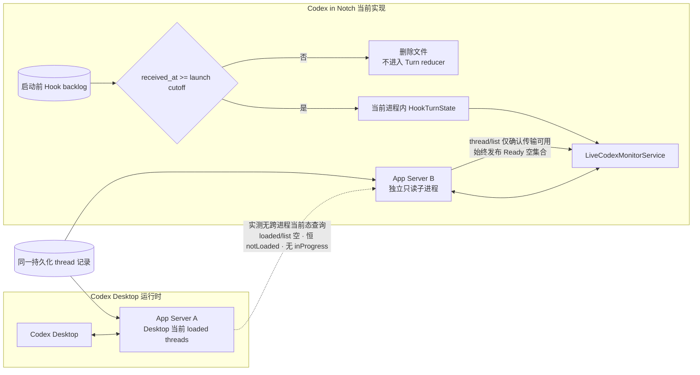
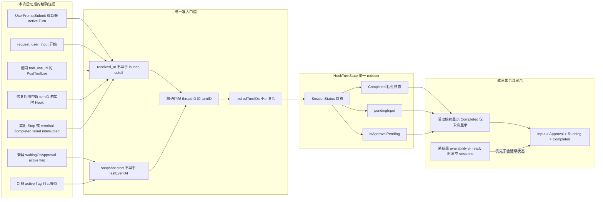
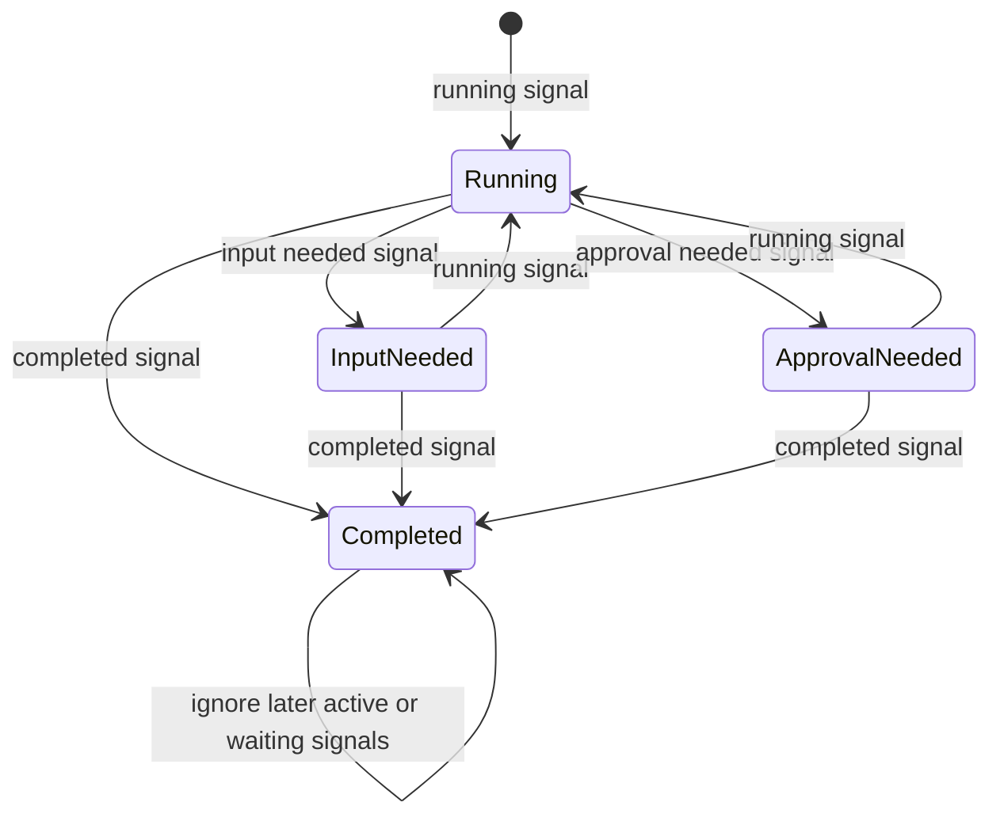
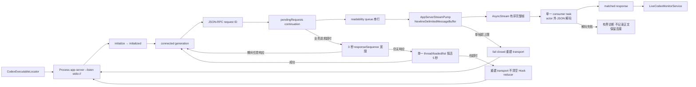

# Codex in Notch — 当前系统设计架构

| 字段 | 内容 |
| --- | --- |
| 文档性质 | 当前实现架构，而非未来方案 |
| 基线日期 | 2026-08-15 |
| 核心目标 | 在一个 macOS 顶部视窗中汇总当前 Codex Desktop 根会话的活动或未读终态 Turn |
| 代码入口 | `MonitorStore.shared` → `LiveCodexMonitorService` |

本文以当前 Swift 实现为准，展示从 Codex Desktop 信号进入应用，到行级状态收敛、集合筛选、顶部汇总和精确导航的完整链路。主链保持为：

```text
边界信号 → 单一 reducer / orchestrator → MonitorSnapshot → MonitorStore → AppKit / SwiftUI
```

图中的“私有只读”只表示依赖未公开的 Desktop schema；它们被限制在边界适配器内，不进入领域模型，也不允许写回 Codex Desktop。详细风险登记见 [`non-public-codex-integration-features.md`](non-public-codex-integration-features.md)。

## 1. 当前实现总图

```mermaid
flowchart LR
    subgraph codexSources ["Codex Desktop 与本地数据源"]
        desktopHooks["Codex Desktop 官方 Hooks 生命周期"]
        desktopState[(".codex-global-state.json 私有只读")]
        codexBinary["codex 可执行文件与私有 Desktop bundle 发现路径"]
        appServerProcess["独立 codex app-server 子进程"]
        desktopProcess["Codex Desktop 私有 bundle ID 与当前 PID"]
        desktopDeepLink["Codex Desktop deep link 目标"]
    end

    subgraph hookBoundary ["Hook 边界"]
        hookInstaller["CodexHookInstaller actor"]
        hooksConfig[("~/.codex/hooks.json")]
        hookHelper["codex_in_notch_hook.py"]
        hookEvents[("events/*.json 0600 仅身份与生命周期")]
        previewChannel["HookPreviewChannel preview.sock 0600 正文只入内存"]
        observationMarker[("monitor-state.json 仅信任标记")]
        hookRepository["HookEventRepository actor 精确 Turn reducer"]
    end

    subgraph appServerBoundary ["公开 App Server 只读边界"]
        executableLocator["CodexExecutableLocator"]
        appServerClient["CodexAppServerClient actor"]
        streamPump["AppServerStreamPump 串行队列内 NDJSON 分帧"]
        streamConsumer["单一 consumer task actor 外解码"]
        requestGuard["pendingRequests 超时与单一 liveness probe"]
    end

    subgraph desktopAdapters ["Desktop 私有只读适配器"]
        projectRepository["CodexDesktopProjectMetadataRepository actor"]
        unreadRepository["CodexDesktopUnreadStateRepository actor"]
        directoryWatcher["目录 watcher 与 50 ms debounce 可重新挂载"]
        desktopPidGate["NSRunningApplication PID 观察门槛"]
    end

    subgraph applicationCore ["应用核心"]
        liveService["LiveCodexMonitorService actor 单一编排器"]
        snapshotParser["CodexSnapshotParser 纯解析与排序"]
        unreadGate["TerminalUnreadMembershipGate 终态成员 gate"]
        serviceState[("内存缓存与后台 refresh tasks")]
        monitorSnapshot["MonitorSnapshot availability sessions quota diagnostic"]
    end

    subgraph presentationState ["主线程展示状态"]
        stabilityGate["ConnectionStabilityGate 3 秒断开宽限"]
        aggregation["MonitorAggregation 顶部状态聚合"]
        monitorStore["MonitorStore @MainActor 唯一 UI 状态源"]
    end

    subgraph macUi ["macOS 展示与控制"]
        panelController["OverlayPanelController NSPanel 几何与动画"]
        notchView["NotchOverlayView 收起与展开会话列表"]
        productRoot["ProductRootView 首次引导"]
        settingsView["AppSettingsView 单面板设置窗口"]
        navigator["CodexDesktopNavigator"]
    end

    desktopHooks -->|"执行受信 handler"| hookHelper
    hookHelper -->|"原子写入脱敏事件"| hookEvents
    hookEvents -->|"按启动 cutoff 分类后删除或隔离"| hookRepository
    hookEvents -.->|"目录 watcher 100ms debounce"| hookRepository
    hookRepository -->|"HookStateSnapshot"| liveService
    hookRepository -->|"仅持久化 Hook 配置信任"| observationMarker

    hookInstaller -->|"增量安装六类定义"| hooksConfig
    hooksConfig -.->|"官方 Hooks 配置"| desktopHooks
    hookInstaller -->|"安装或升级"| hookHelper

    executableLocator -->|"定位可执行 URL"| codexBinary
    executableLocator -->|"注入 executableURL"| appServerClient
    codexBinary -->|"被 Process 执行"| appServerProcess
    appServerClient -->|"启动和管理子进程"| appServerProcess
    appServerProcess -->|"stdout 字节流"| streamPump
    streamPump -->|"有序完整帧 AsyncStream"| streamConsumer
    streamConsumer -->|"已解码 envelope"| appServerClient
    appServerClient -->|"stdin JSON-RPC request"| appServerProcess
    requestGuard -->|"保护 request 生命周期"| appServerClient
    appServerClient <-->|"六个只读方法与结果"| liveService

    desktopState -.->|"Project assignments"| projectRepository
    desktopState -.->|"local unread thread IDs"| unreadRepository
    desktopState -.->|"目录原子替换事件"| directoryWatcher
    directoryWatcher -->|"debounced change signal"| unreadRepository
    projectRepository -->|"Project 或 Chats 或 unavailable"| liveService
    unreadRepository -->|"权威性标记加未读集合"| liveService
    desktopProcess -->|"当前 PID"| desktopPidGate
    desktopPidGate -->|"绑定 Hook 信任到当前进程"| liveService
    hookInstaller <-->|"status install remove settings"| liveService

    liveService -->|"构造行状态"| snapshotParser
    liveService <-->|"30 秒列表与 60 秒用量刷新"| serviceState
    snapshotParser -->|"MonitoredSession 候选"| unreadGate
    unreadGate -->|"活动或未读终态成员"| monitorSnapshot
    liveService -->|"availability quota diagnostic"| monitorSnapshot

    monitorSnapshot -->|"候选发布"| stabilityGate
    monitorSnapshot -->|"ready 时聚合 sessions"| aggregation
    stabilityGate -->|"允许发布或暂存重试"| monitorStore
    aggregation -->|"顶部 MonitorStatus"| monitorStore
    hookRepository -.->|"changeEvents"| monitorStore
    unreadRepository -.->|"changeEvents"| monitorStore

    monitorStore -->|"Published 状态"| panelController
    monitorStore -->|"Published 状态与用户操作"| notchView
    monitorStore -->|"onboarding 状态"| productRoot
    settingsView -->|"安装 移除 预览 显示器"| monitorStore
    monitorStore -->|"点击会话"| navigator
    navigator -->|"目标预检 thread/list"| liveService
    navigator -->|"codex://threads/{threadId}"| desktopDeepLink
    desktopDeepLink -.->|"Launch Services 定向打开"| desktopProcess
```



边界分类：

| 类型 | 图中能力 | 约束 |
| --- | --- | --- |
| 官方公开 | Hooks lifecycle、App Server 协议与六个只读方法（`thread/read` 恒带 `includeTurns: false`）、`codex://threads/{threadId}` | 作为主集成契约使用 |
| 已登记的非公开依赖 | Desktop Project/unread schema、Desktop bundle 内可执行路径、Desktop bundle identifier | 只读或只用于发现；失败时 fail closed；同步维护非公开 feature 清单 |
| 应用内部 | Hook helper、事件目录、信任标记、reducer、缓存、snapshot、UI store | 信任标记只回答“Hook 是否曾成功执行”，不能证明当前运行时；Turn 状态、会话身份、预览和缓存仅存在于内存或待消费事件中 |

## 2. 核心刷新时序

这条时序说明为什么主链不需要为每一种异常添加 UI 补丁：`MonitorStore` 只接受完整 `MonitorSnapshot`，低延迟事件、低频校正、私有元数据和恢复策略都在 `LiveCodexMonitorService` 边界内收敛。


两个目录 watcher 都能重新挂载：目录不存在或被替换不是终局状态，`rename`／`delete` 会触发重开，刷新路径也会顺手重试。它们没有自己的重试定时器，因此「挂不上」的成本是每次刷新一个失败的 `open`，而不是新增一个唤醒源。

刷新不再按固定节拍采样。驱动它的有四个来源，合并成同一条 `changeEvents` 流或睡眠时长：两个目录 watcher（Hook 事件队列与 Desktop 状态文件）、**服务自身在后台读取落地后发出的失效信号**、服务通过 `nextRefreshDeadline()` 报出的下一个到期时刻（终态 settling 到期、元数据/成员关系/额度缓存过期），以及一个 60 秒心跳。

第二项是必需的而非优化：额度、成员关系与线程元数据都在后台读取，结果落地时启动它的那次快照早已发布。取消轮询之前，这些结果靠下一个轮询周期（1 秒内）被顺带带出；取消之后，如果它们不自己发出信号，就要一直等到某个不相关的到期唤醒——实测表现为启动后额度环空白约 10 秒。因此**每个后台读取都必须以一次失效信号结束**。`isRefreshInFlight` 把它们合并为一条刷新，不产生第二套状态管线。

**`nextRefreshDeadline()` 只能报出"这次刷新真的能推进的到期时刻"。** 存储侧在该时刻醒来并刷新；如果刷新之后它仍在过去，同一个唤醒会立刻再次触发——失效方向不是"迟到的唤醒"，而是忙等。因此每一项到期都必须镜像其调度器自身的判定条件：元数据到期只按**会被重读的那些线程**（Hook 追踪的）计算，而不是整个 `threadRecords` 缓存——缓存里的其余线程由成员关系读取按 30 秒刷新，用 10 秒的元数据窗口去量它，得到的是一个提前 20 秒到期、没有任何工作会去清除的时刻；退避标记是"下次尝试不得早于"的下限，而不是独立的唤醒理由。两处都曾各自成立过。

终态行是这条规则唯一的例外，而且是刻意的。已读证据不会随时间到来，只会随 watcher 上的一次文件变化到来，而 watcher 按其自身文档只是"低延迟提示，永远不是真相来源"。据此**不报出任何到期**曾看起来是同一条规则的自然结论，实测下来却是把产品的核心交互整个押在一条边沿上：真机 trace 里，一行终态从列出到用户读取之间是**整整八秒零刷新**。因此这类行改为报出一个**从当前时刻向前量**的复查时刻（`terminalUnreadRecheckInterval`，1 秒）。要区分的不是"报不报"，而是"报出的是不是陈旧值"——`terminalObservedAt + settlingInterval` 对未读行永远落在过去，被存储侧钳到 1 秒下限且没有任何刷新能推动它，那才是穿着到期外衣的忙等；从 `now` 向前量的复查按构造可清除：那一刻的刷新要么隐藏该行，要么预约下一次。watcher 正常情况下先一步到达，这个下限根本不会到期。

存储侧不校验服务报出的到期时刻，因此另设一条兜底：睡眠时长以 `minimumRefreshInterval`（1 秒）为**下界**，绝不向下取到 0。这把任何漏网的错误到期限制在取消轮询前的 1 Hz，而不是吃满一个核心——上一版缺少这个下界时实测 63% CPU，主线程停在 `NSRunningApplication` 的同步 LaunchServices 往返上。它同样不承担任何延迟指标。

**心跳只是兜底，不承担任何延迟指标。** 它存在的唯一理由是本仓库已知的两类静默失效：`DirectoryChangeWatcher` 在 `open(O_EVTONLY)` 失败或目录被替换后不会重新挂载（CR-018），而到期唤醒同样可能因为任务被取消或 deadline 算错而无声丢失。任何"更新太慢"的问题都不得通过缩短心跳来解决。

安装健康度同理：`installationState` 是三次文件读取，回答的却是一个只在本应用写配置、用户修复或外部编辑时才变化的问题。它改为缓存，由本应用自身的 install/uninstall/upgrade 与用户 Recheck 直接失效，另有 60 秒上限兜住外部编辑。**轮询配置本来就无法回答真正会出问题的那一维**——Codex 按定义内容哈希记录信任，扫描通过并不意味着 hook 会被执行（见第 8 节）。

事件消费**每轮只发生一次**。`consumeEvents` 会删除文件并推进 Turn 状态，因此它只出现在快照路径上；`hookSetupStatus` 改为只读持久化信任标记，集成健康度随 `MonitorSnapshot.setupStatus` 一并返回，上层不再二次询问。

### 2.1 启动边界：不做现状同步

产品能力被严格限定为“本次启动之后开始同步会话列表”。启动前的一切——正在运行的会话、已完成未读的会话、正在等待审批的会话——统统无视，直到它们产生下一个 lifecycle 事件。

启动前的 Hook 文件是事件日志，不是当前状态快照。无论类型是 `UserPromptSubmit`、`PermissionRequest`、`PreToolUse`、`PostToolUse`、`Stop` 还是 `SessionEnd`，只要早于本次 repository 的 cutoff，就只能更新“Hook 曾工作过”的配置健康标记，不能创建、终止或修改任何当前 Turn。

App Server 一侧同样不产生会话：它只提供成员关系与元数据，为已由实时 Hook 建立身份的会话补充标题与 Project，永远不能独立创建一行。



状态判断分为传输与快照两个阶段：`initialize` 或连接失败、App Server 没有响应时才是 Disconnected；握手已经开始但校验 `thread/list` 尚未完成时保持 Connecting；`thread/list` 成功返回即确认传输可用，并**始终**以 Ready 空集合发布。`thread/loaded/list` 只保留为传输超时后的轻量探活，不决定业务 availability，也不参与任何成员集合。

收起态的绘制随在场走：`MonitorStore.presenceMarks` 为每个已连接产品给出一个标记，UI 一个矩阵画一个，**每个矩阵跑自己产品的曲线**而不是共用汇总状态。没有产品已连接时只有一个不指认任何产品的灰色标记；有刘海形态在这种静息态下连前导翼一起不画（`drawsCompactMarks`），因为缺口本身已经是屏幕上的一个形状，旁边再放一个不带信息的形状没有意义。无刘海形态保留标记以守住它在菜单栏里的位置。此时 hover 只把药丸横向撑开露出齿轮（`expandsToPillOnly`），不落下面板——面板里没有内容可放。

**这里产出的 availability 只是收起态状态的一半。** 另一半是**在场**：该产品此刻是否打开，由同一次刷新里已经在取的 `NSRunningApplication` 查询回答（Claude Code 侧由活跃会话列表回答）。两者都成立才算已连接，收起态才显示 `Connected`；否则显示 `Disconnected`。`Connecting`、`Set up integration`、`Update Codex`、`Unsupported Version` 都不再出现在收起态，只随 availability 进入展开面板与 Settings。归并规则是纯函数，写在 `MonitorAggregation.status`；在场本身是 `AgentSnapshot.presence`，与 availability 并列而不是由它推导。

**启动不做现状同步。** 会话只能由本次启动之后收到的 Hook 创建；启动前正在运行、已完成未读或等待审批的会话一律无视，直到它们产生下一个 lifecycle 事件。这是能力边界而非取舍：实测（CLI `0.148.0-alpha.9`，真实运行中的 Turn）表明独立 App Server 的 `thread/loaded/list` 为空、Thread 恒为 `notLoaded`、`thread/list` 契约上不返回 `turns`、`thread/read` 也从不出现 `inProgress`，因此不存在任何受支持的读取能回答“Desktop 此刻在做什么”。

独立 App Server 与 Desktop 不共享进程内事件流，也没有任何受支持的读取能观察 Desktop 当前运行时，因此启动不产生会话；启动后的 Hook 是会话的唯一来源。完整共享运行时仍属于 [`technical-explorations/shared-app-server/README.md`](technical-explorations/shared-app-server/README.md) 中的后续探索——只有在那类拓扑成立后才值得重新讨论启动同步，且不能建立在 `status` 或 `inProgress` 之上。在任何拓扑下都不得用启动 cutoff 之前的事件补齐当前状态。

## 3. 单会话状态收敛





关键规则：

- 启动 cutoff 之前的所有 Hook 类型统一丢弃其业务语义；不存在“历史 Stop 可以恢复终态边界”的例外。
- Desktop 中断后继续执行可能创建新的 Turn 而不再发送 `UserPromptSubmit`。同一 Thread 上更晚到达、携带未退休新 `turn_id` 的实时 Hook 会原子替换当前 Turn，并立即退休旧 ID；恢复后的最终 Stop 因而能命中新的当前 Turn，迟到旧事件仍不能复活。
- `Approval needed` 一律由某个工具调用的开合区间确定，但 Codex 有**两种**审批形态，都以 `tool_use_id` 成对关闭：
  - **专用审批工具**（实测 2026-08-15，网络访问审批）：`PreToolUse(request_permissions)` 打开一个跨越人工等待整段时间的工具调用，同 `tool_use_id` 的 `PostToolUse` 关闭；此形态下 Codex **不发送** `PermissionRequest`，与 `request_user_input` 完全同构。
  - **普通工具审批**（实测 2026-08-15，Bash 命令审批）：Codex 先用 `PreToolUse` announce 该调用（`tool_name: "Bash"`、`tool_use_id: "exec-…"`），约 30ms 后发出 `PermissionRequest`，后者**带 `tool_name` 但 `tool_use_id` 为 null**，随后停在人工等待上；用户批准后同 `tool_use_id` 的 `PostToolUse` 到达。因此 `PermissionRequest` 借用该 tool 当前仍打开的调用 id 作为等待身份，关闭仍走既有配对，不引入任何计时或超时猜测。
- `PermissionRequest` 本身仍不是等待证据：没有仍打开的调用可配对时（或它指名的 tool 与当前打开的调用不一致）保持原状态，不建立无法被关闭的等待。自动放行的请求会立刻收到配对的 `PostToolUse`，同一批事件内开合，因此不会滞留成假的等待态。
- **批准与拒绝的关闭方式不同**（实测 2026-08-15，同一 Bash 审批分别批准与拒绝）：批准后到达配对 `PostToolUse`；**拒绝后该调用再也不会出现任何事件**——67 秒静默后直接是本 Turn 的 `Stop`。因此借用 id 的等待还必须能被"其他调用的活动"关闭：Codex 在真正阻塞于审批弹窗期间不发送任何事件，所以任意**其他** `tool_use_id` 的 `PreToolUse`／`PostToolUse` 就是人工已经回答的证据。只有借用 id 的等待适用该规则；`request_permissions` 自带 id、必然收到关闭事件，不受影响。
- 拒绝后如果 Turn 不再调用任何工具，等待由 `Stop` 关闭并进入 Completed。拒绝瞬间本身没有任何事件可观察，因此从用户点击拒绝到下一个事件之间仍会短暂显示 Approval needed；这是可观察证据的边界，不用计时器弥补。
- 产品只关心 Turn 是否仍在进行：实时 `Stop` 以及 App Server 的 `completed`、`failed`、`interrupted` 都直接成为 Completed，不再发起 `thread/read` 区分结束原因。
- App Server 不参与状态推导。Thread payload 只贡献根线程判定、标题与 preview；实测表明它没有任何字段能表达 Turn 级运行时真值，因此原先的 `activeFlags` 纠偏机制已整体删除而非保留为空转代码。
- 缺失、超时、未知枚举或不满足身份门槛的信号不触发状态变化；当前四态值保持不变。
- 终态是否留在列表由 `TerminalUnreadMembershipGate` 决定。只有当前主文件的权威 unread 快照能新增隐藏决定；backup、last-known-good 或解析失败只能保守保留。

## 4. App Server 传输与恢复边界



分帧是整条链路上唯一依赖字节顺序的环节，因此它同步发生在 `FileHandle` 已经串行化的 readability queue 内，绝不跨越 actor 跳转：相互独立的 task 进入 actor 的顺序没有保证，而一次 chunk 错位会破坏其后每一个帧边界，并让残留片段继续吞掉下一条响应。越过分帧之后，每一帧都是自包含且按 `id` 寻址的，顺序不再有意义，所以代价最高的 JSON 解码放在单一 consumer task 中、在 actor 之外完成，不会阻塞超时处理、连接管理或其他响应。该 consumer 也保证 stream end 一定排在它之前的所有帧之后。

恢复逻辑只处理“连接是否还能工作”，不参与推导会话状态。普通 RPC timeout、远端方法错误或协议错误不会立即把当前会话改成 Disconnected；已有可信快照时，`lastTrustedSnapshot` 和主线程的 3 秒 `ConnectionStabilityGate` 共同避免瞬时闪断。启动仍处于 Connecting 且初始化已确认无响应时没有可信快照可保留，直接发布 Disconnected，不额外等待该门槛。

## 5. 组件职责与代码位置

| 层 | 真实组件 | 单一职责 | 代码 |
| --- | --- | --- | --- |
| UI 状态 | `MonitorStore` | 拉取完整快照、合并刷新触发、发布 UI 状态、计算顶部汇总 | [`MonitorStore.swift`](../CodexInNotch/CodexInNotch/MonitorStore.swift) |
| 核心编排 | `LiveCodexMonitorService` | 协调 Hook、App Server、Project、未读、缓存、成员集合与降级 | [`LiveCodexMonitorService.swift`](../CodexInNotch/CodexInNotch/LiveCodexMonitorService.swift) |
| Turn reducer | `HookEventRepository` | 用精确身份消费事件、拒绝回放复活、维护内存 `HookTurnState` | [`HookIntegration.swift`](../CodexInNotch/CodexInNotch/HookIntegration.swift) |
| 正文边界（Codex） | `HookPreviewChannel` | 经 Unix socket 收取 prompt/回答并只留在内存；持有预览开关这一进程内标志 | [`HookPreviewChannel.swift`](../CodexInNotch/CodexInNotch/HookPreviewChannel.swift) |
| 正文边界（Claude Code） | `AgentHookListener` | loopback 收取生命周期事件并落成 0600 事件文件；**先应答再处理**，**`MessageDisplay` 在写队列之前转向内存**，只留每条消息头部 240 字符，另持有本侧预览开关这一进程内标志 | [`AgentHookListener.swift`](../CodexInNotch/CodexInNotch/AgentHookListener.swift) |
| 会话身份（Claude Code） | `ClaudeCodeSessionRegistry` | 按节拍运行 `claude agents --json` 并对读取单飞；新鲜度从**上一次尝试**起算，失败保留上一次列表；**会话目录的变更可以把新鲜度窗口截断**（`invalidate()`，不低于 `edgeFloor`，读取途中到达的边沿不被该次读取消费）；在 stdout 里定位数组而不假定它独占该流；**排除本应用自己的额度读取会话**（见 `tech-design.md` §15.1） | [`ClaudeCodeSessionRegistry.swift`](../CodexInNotch/CodexInNotch/ClaudeCodeSessionRegistry.swift) |
| Hook 管理 | `CodexHookInstaller` | 安装、升级、校验和移除本应用管理的六类 Hook 定义 | [`HookIntegration.swift`](../CodexInNotch/CodexInNotch/HookIntegration.swift) |
| 用户配置编辑 | `ManagedHooksConfiguration` | 在用户拥有的配置里严格增删本应用的定义；看不懂的结构一律不改，必须改才能继续时整体拒绝 | [`ManagedHooksConfiguration.swift`](../CodexInNotch/CodexInNotch/ManagedHooksConfiguration.swift) |
| 公开协议边界 | `CodexAppServerClient` | 子进程、stdio JSON-RPC、握手、请求关联、超时、探活与传输重建 | [`CodexAppServerClient.swift`](../CodexInNotch/CodexInNotch/CodexAppServerClient.swift) |
| 传输分帧 | `AppServerStreamPump` | 在串行 readability queue 内把 stdout 切成有序完整帧，并对单帧上限 fail closed | [`CodexAppServerClient.swift`](../CodexInNotch/CodexInNotch/CodexAppServerClient.swift) |
| 纯解析 | `CodexSnapshotParser` | 根线程判定、标题、预览、额度解析与排序；不推导状态 | [`LiveCodexMonitorService.swift`](../CodexInNotch/CodexInNotch/LiveCodexMonitorService.swift) |
| 私有 Project 边界 | `CodexDesktopProjectMetadataRepository` | 只读并严格校验 Desktop Project/Chats 映射 | [`CodexDesktopProjectMetadata.swift`](../CodexInNotch/CodexInNotch/CodexDesktopProjectMetadata.swift) |
| 私有未读边界 | `CodexDesktopUnreadStateRepository` | 只读 unread 集合、标记来源权威性、发出目录变化事件 | [`CodexDesktopUnreadState.swift`](../CodexInNotch/CodexInNotch/CodexDesktopUnreadState.swift) |
| 领域模型 | `MonitorSnapshot`、`MonitoredSession`、`MonitorAggregation` | 定义 UI 唯一消费的数据契约与聚合优先级 | [`MonitorDomain.swift`](../CodexInNotch/CodexInNotch/MonitorDomain.swift) |
| 精确导航 | `CodexDesktopNavigator` | 预检目标并使用官方 deep link 打开同一 Thread | [`CodexDesktopNavigator.swift`](../CodexInNotch/CodexInNotch/CodexDesktopNavigator.swift) |
| 窗体 | `OverlayPanelController` | NSPanel 生命周期、目标显示器、顶部吸附、尺寸和动画 | [`OverlayPanelController.swift`](../CodexInNotch/CodexInNotch/OverlayPanelController.swift) |
| 视图 | `NotchOverlayView` | 只渲染 `MonitorStore`，不解析协议、不读文件 | [`NotchOverlayView.swift`](../CodexInNotch/CodexInNotch/NotchOverlayView.swift) |
| 设置窗口 | `AppSettingsView`、`MacOSWindowColor` | macOS 26 单面板设置：分组卡片自绘，控件全用原生；`Color / macOS Window` 两模式 token（见 `figma-design.md` §8） | [`SettingsWindow.swift`](../CodexInNotch/CodexInNotch/SettingsWindow.swift) |
| 常驻动效 | `NotchStatusMatrix`、`SearchlightLabel`、`SessionRowText` | 用 CALayer 承载持续动画，使叠层不必逐帧重渲染（见第 6 节） | [`NotchStatusMatrix.swift`](../CodexInNotch/CodexInNotch/NotchStatusMatrix.swift) |

## 6. 常驻动效的渲染边界

**叠层里不允许存在持续运行的 SwiftUI 动画。** 常驻动效一律画在 CALayer 上，交给 render server 求值。

这条约束来自实测，不是偏好。指示器与标签扫光原先都是 `TimelineView(.animation)`；在 Release 下把状态固定为 `.running`、逐项开关测得：

| 配置 | CPU |
| --- | --- |
| 指示器关、扫光关 | 0.0% |
| 指示器关、扫光开 | 7.8% |
| 两者都开（原实现） | 11.8% |
| 展开面板 + 两行会话扫光 | 15.3% |
| 全部迁到 Core Animation | 0.0%–0.4% |

两条结论都与直觉相反，值得单独记住：

1. **代价不与画面内容成正比。** 去掉三层高斯模糊只省下 11.8% 里的 2 个百分点。真正的开销是每帧重新渲染整个叠层——包含 `PanelContour` 这个自定义 `Shape` 和全部文本测量。
2. **压低刷新率没有用。** 把 schedule 限到 30 Hz，与显示器的 120 Hz 实测相同。重绘不由视图自己的 tick 驱动，而由「面板被标记为需要显示」驱动，所以 SwiftUI 侧多久醒一次都一样，整块面板照样重画。

因此判断标准不是「这个动画画得贵不贵」，而是**它是否持续 tick**。

### 低频的内容更新同样适用

上面这句最初写作「一秒一次的计时读数仍然是普通 SwiftUI `Text`，完全没有问题」——**那是错的**，后来实测推翻了它。处理时间读数每秒只变一次，却是通过 `@Published` 从 store 发出的；而 store 上的任何一次发布都会重新求值整个叠层，实测约 20ms。一秒一次就是约 4% 的核心，并且这份成本在 Approval needed 这种可以无限期等待用户的状态下照样持续——那时屏幕上除了四个字符没有任何东西在变。

读数现在订阅一条 SwiftUI 不观察的 tick（`MonitorStore.elapsedTick`）并自绘图层；store 只在读数的**保留宽度**变化时才发布 `elapsedLayoutRevision`，等宽数字下那是位数变化，一轮一次而非一秒一次。同一场景实测 4.7% → 0.0%。

所以这条规则的完整形式是：**叠层重渲染的次数应当由「布局是否改变」决定，而不是由「内容是否改变」决定。** 内容变化交给图层，只有布局变化才值得惊动 SwiftUI。持续动效只是这条规则最极端的一种违反方式。

### 怎么测：`ps %cpu` 会骗人

上面这些数字都是 Release 构建、把状态固定后逐项开关变量测出来的。但**测法本身有一个坑值得单独记住：`ps %cpu` 会把短促的突发摊平掉。**

展开／折叠一次过渡实测约 92 ms CPU（60 秒内 30 次过渡耗 2.97 s，不切换的基线耗 0.21 s），折算动画期间约半个核心。同一件事在 `ps %cpu` 上只显示为 0.1%–0.3%，几乎等于不存在——必须换成累计 CPU 时间（`ps -o time`）做差才看得见。

反过来，**稳态成本用 `ps %cpu` 看是准的**，上面那张表就是这么测的。

所以：稳态用 `ps %cpu`，突发用累计 CPU 时间。选错工具会得出「已经没有成本」的错误结论。

### 迁移后的机制不绑定当前设计

指示器把 SVG 的 `<animate values="…">` 列表直接交给 `CAKeyframeAnimation`——linear 计算模式把 N 个值铺在 N-1 段区间上，正是 SMIL 的规则，所以曲线不变，只是求值搬到了 render server。标签把字形光栅化一次，再让 Core Animation 推动一层渐变遮罩扫过高亮副本；会话行还额外把尾部淡出接管为自己的 layer 遮罩，因为 SwiftUI 的 `.mask` 盖在 AppKit 宿主视图上并不可靠。

轨迹数值、循环周期、颜色、尺寸、格子比例、辉光层数与半径、新增状态、标签文案与字体——改这些都**不需要重做优化**。标签文案尤其是免费的：它用 `PanelMetrics` 预留宽度时的同一套 `NSFont` 度量来测量，面板宽度会自动跟上。

需要重新评估的只有一种情况：动效不再是**固定循环 + 可动画的 layer 属性**，而是每帧依赖实时数据（流式进度、波形）、需要逐帧重绘（粒子、shader），或字形每帧都变。

### 测试守不住的部分

`NotchStatusMatrix` 与两个 layer-backed 标签有测试断言它们仍由 `CAAnimation` 驱动、遮罩仍然存在，把它们改回 SwiftUI 会编译失败。但**在面板别处新加一个持续动画，测试抓不到**——那一维只能靠本节和视图上的注释守住。

另外 `SearchlightLabel` 的字体与 `PanelMetrics.statusLabelFont` 是两处独立声明的同一个 `NSFont`：只改一处，绘制出的标签就会与预留的面板宽度不一致。

### Hook 事件的到达代价（CC-015 之后）

`MessageDisplay` 把 Claude Code 的事件率从「每次工具调用一次」抬到了**一个正在说话的轮次每秒 3.4 次**，所以这条路径重新量过一遍。Release 构建，实测机器，突发法（差分累计 CPU 时间，见上文「怎么测」）：

| 场景 | 结果 |
| --- | --- |
| 空闲（无事件） | `%cpu` 中位数 0.0–0.1，RSS 约 100 MB |
| 实测节奏（0.29 秒一个 delta，持续 60 秒） | `%cpu` 均值 0.88，较空闲 +0.65；RSS 持平 |
| 5000 个 `MessageDisplay` 突发 ×3 轮 | 中位数 **2.06 ms/事件** |
| 同样 5000 个，但在 cwd 检查处即被丢弃 | 中位数 **2.06 ms/事件** |
| 同样 5000 个，但 payload 不带 cwd | 中位数 **2.07 ms/事件** |
| 64 会话 × 10 条 × 60 KB delta（约 38 MB 正文） | 同样 1.75 ms/事件，RSS 140.5 → 140.8 MB |
| 累计约 36000 个事件之后的事件目录 | **0 个文件**；整个 support 目录 24 KB |

三种负载互相之间落在噪声里，结论因此是明确的：**每个事件的代价全部在 NWConnection 的建立与拆除加 HTTP 解析上，预览这条路径量不出来。** 那笔代价在 CC-015 之前就已经为另外 11 个事件付着了，这次只是把付它的频率提高了。想再降只能改传输（例如复用连接），而连接由 Claude Code 的客户端发起，不由本应用决定。

倒数第二行是那条内存边界的直接验证：60 KB 的 delta 与 120 字节的 delta 同价，因为折叠函数只扫新 delta 且在头部写满时立刻停下——正文的长度不进入代价。最后一行是「不为 delta 写文件」这条设计的直接验证。

## 7. 保持 clean and neat 的架构约束

1. **只有一个编排中心**：跨数据源的决策集中在 `LiveCodexMonitorService`；UI、文件适配器和 transport 不互相拼状态。
2. **只有一个 Turn reducer**：Hook 事件只进入 `HookEventRepository`；历史回放、乱序、重复和精确身份规则不散落在视图层。第二个来源可以**退休**一个 Turn，但只能在这个 actor 里、带顺序护栏，并且不得携带 Turn 身份：Codex 侧的 `removeThreads(notIn:snapshotStartedAt:)` 与 Claude Code 侧的 `endTurnsForStoppedSessions(_:)` 是仅有的两处，后者见 [ADR 0011](adr/0011-a-turn-may-end-on-evidence-that-is-not-a-hook-event.md)。
3. **只有一个 UI 数据契约**：上层只接收 `MonitorSnapshot`；availability、sessions、quota 与 diagnostic 来自同一快照输入。
4. **私有依赖停在边界**：`.codex-global-state.json` 的 schema 只存在于两个只读 repository；领域层只看到 Project resolution 和带权威性标记的 unread 集合。
5. **恢复逻辑不伪造业务状态**：timeout、探活、缓存和断开宽限只决定保留或重建连接，不用计时器猜测 Running、Approval、已读或 Project。
6. **UI 保持被动**：SwiftUI 只展示和发出用户意图；状态解析、导航预检、Hook 安装和文件读取都有独立边界。
7. **历史事件没有业务语义**：历史文件只可证明 Hook 配置曾执行；当前会话列表只能来自当前运行时快照或本次进程启动后的实时事件。
8. **「正在忙」不是丢弃请求的理由**：布尔看起来没问题，但它只在「一定会有别的东西再问一次」时才安全，而这个前提在边沿触发的信号上不成立。

   **但也别反过来给每处都套抽象。** [`SingleFlightGate`](../CodexInNotch/CodexInNotch/SingleFlightGate.swift) 只用在「没有天然载荷可以充当 dirty 位」的地方：store 刷新（Recheck 需要 `hasCovered` 等到自己那次请求）、成员关系与元数据（失败要跨退避保留请求）。集成开关**不用**它——`desiredIntegrationEnabled` 本身就是那条待办记录，再放一个 gate 就是同一个事实的第二份副本，两个真相源比一个差。

   gate 的失败语义是刻意的：**失败的运行绝不自己重试**。让它继续看起来更周到，实际是一个没有退避的无限重试循环——最初就是这么写的，实测 1000 次不停；当时挡住它的判断在调用方，而取消路径正好从旁边绕过去了。失败只保留请求，何时重试由退避和 `nextRefreshDeadline` 决定。
9. **编辑用户的文件时，解析而不是强转**：只改本应用管理的那几个 key，看不懂的结构原样保留；只有当「必须写的 key 已经是看不懂的结构」时才整体拒绝并报错。移除侧再加一次全文深扫，确认本应用的命令没有残留在任何改不动的形状里——残留就拒绝删除 helper，否则留下的是悬空引用。理由见 CR-013：把不认识的东西强转成空字典，等于把用户的文件换成我们自己的。
10. **承诺不落盘的东西就不要落盘**：Codex 侧的 prompt 与回答正文只经 socket 进入内存，Claude Code 侧的 `MessageDisplay` 在写队列之前就转向内存，事件文件两侧都只携带身份与生命周期。这条现在**首先是性能约束**：正文一秒到三次，每次落一个文件就是每秒三次磁盘写加三次读删（正文不落盘这件事本身已按 PRD 第 7 节降级为不重要）。推论是隐私开关也不落盘——写盘的开关会失败、会乱序，那正是 CR-012 的 fail-open。凡是「用户以为已经关掉」的东西，都必须在调用返回前就已生效。
11. **顺序敏感的状态不进 actor**：字节流分帧这类要求严格顺序的状态机必须留在已经串行化的队列上，只把自包含、顺序无关的单元交给 actor；反过来，CPU 密集的解码不留在 actor 上，避免它阻塞超时与连接管理。
12. **重渲染由布局变化驱动，不由内容变化驱动**：叠层里的持续动效一律画在 CALayer 上，一秒一次的读数同样自绘图层；只有「保留宽度变了」才发布给 SwiftUI（见第 6 节）。理由是一次 SwiftUI 发布的代价是整块面板，而不是变化的那几个字符。

本次没有新增未受官方公开支持的 Codex 集成 feature；现有 Desktop 未读私有适配器的登记已同步收敛为只识别 Completed 终态成员。
