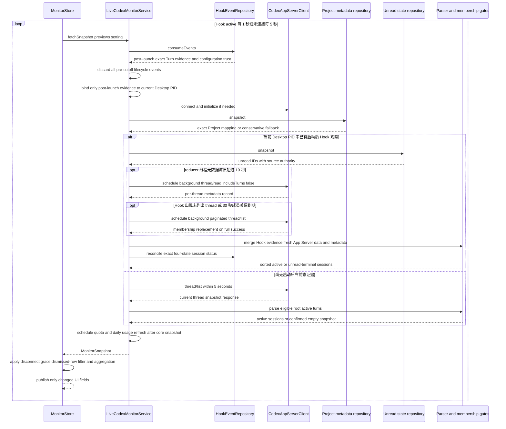
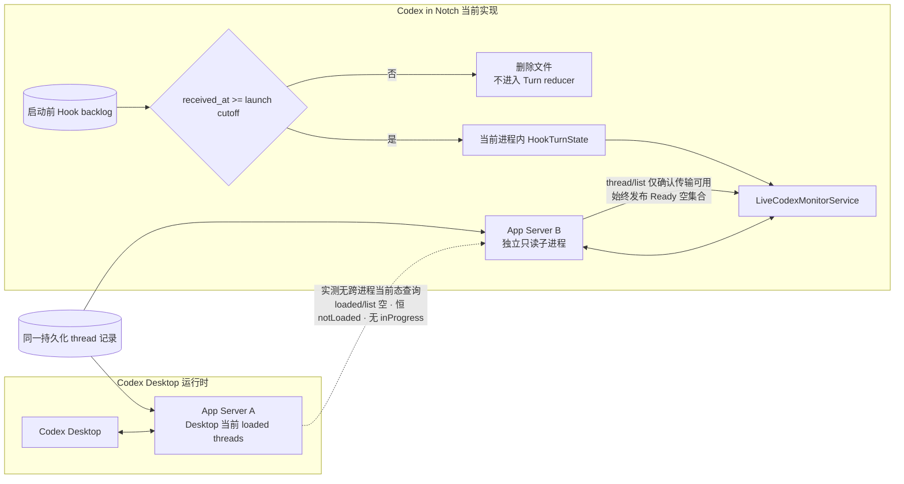
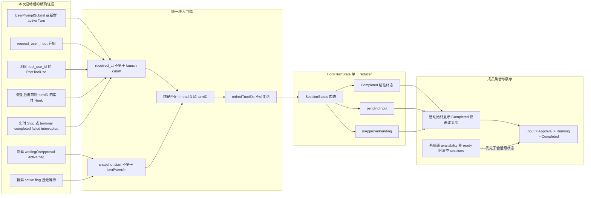
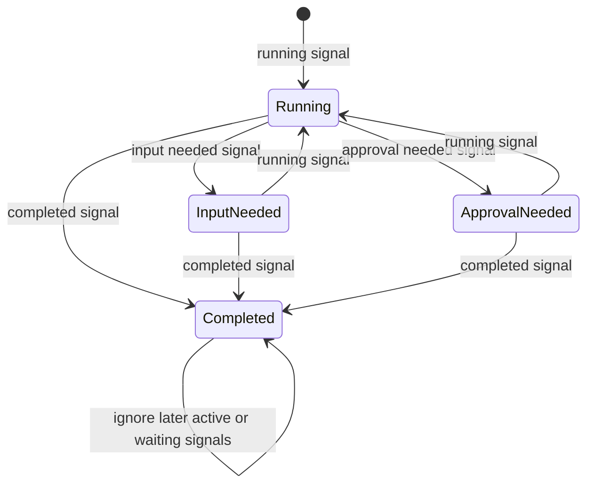
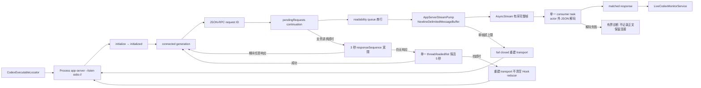

# Codex in Notch — 当前系统设计架构

| 字段 | 内容 |
| --- | --- |
| 文档性质 | 当前实现架构，而非未来方案 |
| 基线日期 | 2026-08-15 |
| 核心目标 | 在一个 macOS 顶部视窗中汇总当前 Codex Desktop 根会话的活动或未读终态 Turn |
| 代码入口 | `MonitorStore.shared` → `LiveCodexMonitorService` |

本文以当前 Swift 实现为准，展示从 Codex Desktop 信号进入应用，到行级状态收敛、集合筛选、顶部汇总和精确导航的完整链路。主链保持为：

```text
边界信号 → 单一 reducer / orchestrator → MonitorSnapshot → MonitorStore → AppKit / SwiftUI
```

图中的“私有只读”只表示依赖未公开的 Desktop schema；它们被限制在边界适配器内，不进入领域模型，也不允许写回 Codex Desktop。详细风险登记见 [`non-public-codex-integration-features.md`](non-public-codex-integration-features.md)。

## 1. 当前实现总图

```mermaid
flowchart LR
    subgraph codexSources ["Codex Desktop 与本地数据源"]
        desktopHooks["Codex Desktop 官方 Hooks 生命周期"]
        desktopState[(".codex-global-state.json 私有只读")]
        codexBinary["codex 可执行文件与私有 Desktop bundle 发现路径"]
        appServerProcess["独立 codex app-server 子进程"]
        desktopProcess["Codex Desktop 私有 bundle ID 与当前 PID"]
        desktopDeepLink["Codex Desktop deep link 目标"]
    end

    subgraph hookBoundary ["Hook 边界"]
        hookInstaller["CodexHookInstaller actor"]
        hooksConfig[("~/.codex/hooks.json")]
        hookHelper["codex_in_notch_hook.py"]
        hookEvents[("events/*.json 0600")]
        observationMarker[("monitor-state.json 仅信任标记")]
        hookRepository["HookEventRepository actor 精确 Turn reducer"]
    end

    subgraph appServerBoundary ["公开 App Server 只读边界"]
        executableLocator["CodexExecutableLocator"]
        appServerClient["CodexAppServerClient actor"]
        streamPump["AppServerStreamPump 串行队列内 NDJSON 分帧"]
        streamConsumer["单一 consumer task actor 外解码"]
        requestGuard["pendingRequests 超时与单一 liveness probe"]
    end

    subgraph desktopAdapters ["Desktop 私有只读适配器"]
        projectRepository["CodexDesktopProjectMetadataRepository actor"]
        unreadRepository["CodexDesktopUnreadStateRepository actor"]
        directoryWatcher["目录 watcher 与 250 ms debounce"]
        desktopPidGate["NSRunningApplication PID 观察门槛"]
    end

    subgraph applicationCore ["应用核心"]
        liveService["LiveCodexMonitorService actor 单一编排器"]
        snapshotParser["CodexSnapshotParser 纯解析与排序"]
        unreadGate["TerminalUnreadMembershipGate 终态成员 gate"]
        serviceState[("内存缓存与后台 refresh tasks")]
        monitorSnapshot["MonitorSnapshot availability sessions quota diagnostic"]
    end

    subgraph presentationState ["主线程展示状态"]
        stabilityGate["ConnectionStabilityGate 3 秒断开宽限"]
        aggregation["MonitorAggregation 顶部状态聚合"]
        monitorStore["MonitorStore @MainActor 唯一 UI 状态源"]
    end

    subgraph macUi ["macOS 展示与控制"]
        panelController["OverlayPanelController NSPanel 几何与动画"]
        notchView["NotchOverlayView 收起与展开会话列表"]
        productRoot["ProductRootView 首次引导"]
        settingsView["AppSettingsView 集成与隐私设置"]
        navigator["CodexDesktopNavigator"]
    end

    desktopHooks -->|"执行受信 handler"| hookHelper
    hookHelper -->|"原子写入脱敏事件"| hookEvents
    hookEvents -->|"按启动 cutoff 分类后删除或隔离"| hookRepository
    hookRepository -->|"HookStateSnapshot"| liveService
    hookRepository -->|"仅持久化 Hook 配置信任"| observationMarker

    hookInstaller -->|"增量安装六类定义"| hooksConfig
    hooksConfig -.->|"官方 Hooks 配置"| desktopHooks
    hookInstaller -->|"安装或升级"| hookHelper

    executableLocator -->|"定位可执行 URL"| codexBinary
    executableLocator -->|"注入 executableURL"| appServerClient
    codexBinary -->|"被 Process 执行"| appServerProcess
    appServerClient -->|"启动和管理子进程"| appServerProcess
    appServerProcess -->|"stdout 字节流"| streamPump
    streamPump -->|"有序完整帧 AsyncStream"| streamConsumer
    streamConsumer -->|"已解码 envelope"| appServerClient
    appServerClient -->|"stdin JSON-RPC request"| appServerProcess
    requestGuard -->|"保护 request 生命周期"| appServerClient
    appServerClient <-->|"六个只读方法与结果"| liveService

    desktopState -.->|"Project assignments"| projectRepository
    desktopState -.->|"local unread thread IDs"| unreadRepository
    desktopState -.->|"目录原子替换事件"| directoryWatcher
    directoryWatcher -->|"debounced change signal"| unreadRepository
    projectRepository -->|"Project 或 Chats 或 unavailable"| liveService
    unreadRepository -->|"权威性标记加未读集合"| liveService
    desktopProcess -->|"当前 PID"| desktopPidGate
    desktopPidGate -->|"绑定 Hook 信任到当前进程"| liveService
    hookInstaller <-->|"status install remove settings"| liveService

    liveService -->|"构造行状态"| snapshotParser
    liveService <-->|"30 秒列表与 60 秒用量刷新"| serviceState
    snapshotParser -->|"MonitoredSession 候选"| unreadGate
    unreadGate -->|"活动或未读终态成员"| monitorSnapshot
    liveService -->|"availability quota diagnostic"| monitorSnapshot

    monitorSnapshot -->|"候选发布"| stabilityGate
    monitorSnapshot -->|"ready 时聚合 sessions"| aggregation
    stabilityGate -->|"允许发布或暂存重试"| monitorStore
    aggregation -->|"顶部 MonitorStatus"| monitorStore
    unreadRepository -.->|"changeEvents 触发即时 refresh"| monitorStore

    monitorStore -->|"Published 状态"| panelController
    monitorStore -->|"Published 状态与用户操作"| notchView
    monitorStore -->|"onboarding 状态"| productRoot
    settingsView -->|"安装 移除 预览 显示器"| monitorStore
    monitorStore -->|"点击会话"| navigator
    navigator -->|"目标预检 thread/list"| liveService
    navigator -->|"codex://threads/{threadId}"| desktopDeepLink
    desktopDeepLink -.->|"Launch Services 定向打开"| desktopProcess
```



边界分类：

| 类型 | 图中能力 | 约束 |
| --- | --- | --- |
| 官方公开 | Hooks lifecycle、App Server 协议与六个只读方法（`thread/read` 恒带 `includeTurns: false`）、`codex://threads/{threadId}` | 作为主集成契约使用 |
| 已登记的非公开依赖 | Desktop Project/unread schema、Desktop bundle 内可执行路径、Desktop bundle identifier | 只读或只用于发现；失败时 fail closed；同步维护非公开 feature 清单 |
| 应用内部 | Hook helper、事件目录、信任标记、reducer、缓存、snapshot、UI store | 信任标记只回答“Hook 是否曾成功执行”，不能证明当前运行时；Turn 状态、会话身份、预览和缓存仅存在于内存或待消费事件中 |

## 2. 核心刷新时序

这条时序说明为什么主链不需要为每一种异常添加 UI 补丁：`MonitorStore` 只接受完整 `MonitorSnapshot`，低延迟事件、低频校正、私有元数据和恢复策略都在 `LiveCodexMonitorService` 边界内收敛。



目录 watcher 的 `changeEvents` 也会触发同一个 `performRefresh`；`isRefreshInFlight` 将轮询与文件事件合并为一条刷新，不产生第二套状态管线。

### 2.1 启动边界：不做现状同步

产品能力被严格限定为“本次启动之后开始同步会话列表”。启动前的一切——正在运行的会话、已完成未读的会话、正在等待审批的会话——统统无视，直到它们产生下一个 lifecycle 事件。

启动前的 Hook 文件是事件日志，不是当前状态快照。无论类型是 `UserPromptSubmit`、`PermissionRequest`、`PreToolUse`、`PostToolUse`、`Stop` 还是 `SessionEnd`，只要早于本次 repository 的 cutoff，就只能更新“Hook 曾工作过”的配置健康标记，不能创建、终止或修改任何当前 Turn。

App Server 一侧同样不产生会话：它只提供成员关系与元数据，为已由实时 Hook 建立身份的会话补充标题与 Project，永远不能独立创建一行。



状态判断分为传输与快照两个阶段：`initialize` 或连接失败、App Server 没有响应时才是 Disconnected；握手已经开始但校验 `thread/list` 尚未完成时保持 Connecting；`thread/list` 成功返回即确认传输可用，并**始终**以 Ready 空集合发布、聚合为 Idle。`thread/loaded/list` 只保留为传输超时后的轻量探活，不决定业务 availability，也不参与任何成员集合。

**启动不做现状同步。** 会话只能由本次启动之后收到的 Hook 创建；启动前正在运行、已完成未读或等待审批的会话一律无视，直到它们产生下一个 lifecycle 事件。这是能力边界而非取舍：实测（CLI `0.148.0-alpha.9`，真实运行中的 Turn）表明独立 App Server 的 `thread/loaded/list` 为空、Thread 恒为 `notLoaded`、`thread/list` 契约上不返回 `turns`、`thread/read` 也从不出现 `inProgress`，因此不存在任何受支持的读取能回答“Desktop 此刻在做什么”。

独立 App Server 与 Desktop 不共享进程内事件流，也没有任何受支持的读取能观察 Desktop 当前运行时，因此启动不产生会话；启动后的 Hook 是会话的唯一来源。完整共享运行时仍属于 [`technical-explorations/shared-app-server/README.md`](technical-explorations/shared-app-server/README.md) 中的后续探索——只有在那类拓扑成立后才值得重新讨论启动同步，且不能建立在 `status` 或 `inProgress` 之上。在任何拓扑下都不得用启动 cutoff 之前的事件补齐当前状态。

## 3. 单会话状态收敛





关键规则：

- 启动 cutoff 之前的所有 Hook 类型统一丢弃其业务语义；不存在“历史 Stop 可以恢复终态边界”的例外。
- Desktop 中断后继续执行可能创建新的 Turn 而不再发送 `UserPromptSubmit`。同一 Thread 上更晚到达、携带未退休新 `turn_id` 的实时 Hook 会原子替换当前 Turn，并立即退休旧 ID；恢复后的最终 Stop 因而能命中新的当前 Turn，迟到旧事件仍不能复活。
- `PermissionRequest` 只证明审批管线运行过，不直接制造 `Approval needed`；当前没有任何可用信号能确认「仍在等待人工批准」，因此该状态只能由 `request_user_input` 之外的显式 Hook 证据产生。
- 产品只关心 Turn 是否仍在进行：实时 `Stop` 以及 App Server 的 `completed`、`failed`、`interrupted` 都直接成为 Completed，不再发起 `thread/read` 区分结束原因。
- App Server 不参与状态推导。Thread payload 只贡献根线程判定、标题与 preview；实测表明它没有任何字段能表达 Turn 级运行时真值，因此原先的 `activeFlags` 纠偏机制已整体删除而非保留为空转代码。
- 缺失、超时、未知枚举或不满足身份门槛的信号不触发状态变化；当前四态值保持不变。
- 终态是否留在列表由 `TerminalUnreadMembershipGate` 决定。只有当前主文件的权威 unread 快照能新增隐藏决定；backup、last-known-good 或解析失败只能保守保留。

## 4. App Server 传输与恢复边界



分帧是整条链路上唯一依赖字节顺序的环节，因此它同步发生在 `FileHandle` 已经串行化的 readability queue 内，绝不跨越 actor 跳转：相互独立的 task 进入 actor 的顺序没有保证，而一次 chunk 错位会破坏其后每一个帧边界，并让残留片段继续吞掉下一条响应。越过分帧之后，每一帧都是自包含且按 `id` 寻址的，顺序不再有意义，所以代价最高的 JSON 解码放在单一 consumer task 中、在 actor 之外完成，不会阻塞超时处理、连接管理或其他响应。该 consumer 也保证 stream end 一定排在它之前的所有帧之后。

恢复逻辑只处理“连接是否还能工作”，不参与推导会话状态。普通 RPC timeout、远端方法错误或协议错误不会立即把当前会话改成 Disconnected；已有可信快照时，`lastTrustedSnapshot` 和主线程的 3 秒 `ConnectionStabilityGate` 共同避免瞬时闪断。启动仍处于 Connecting 且初始化已确认无响应时没有可信快照可保留，直接发布 Disconnected，不额外等待该门槛。

## 5. 组件职责与代码位置

| 层 | 真实组件 | 单一职责 | 代码 |
| --- | --- | --- | --- |
| UI 状态 | `MonitorStore` | 拉取完整快照、合并刷新触发、发布 UI 状态、计算顶部汇总 | [`MonitorStore.swift`](../CodexInNotch/CodexInNotch/MonitorStore.swift) |
| 核心编排 | `LiveCodexMonitorService` | 协调 Hook、App Server、Project、未读、缓存、成员集合与降级 | [`LiveCodexMonitorService.swift`](../CodexInNotch/CodexInNotch/LiveCodexMonitorService.swift) |
| Turn reducer | `HookEventRepository` | 用精确身份消费事件、拒绝回放复活、维护内存 `HookTurnState` | [`HookIntegration.swift`](../CodexInNotch/CodexInNotch/HookIntegration.swift) |
| Hook 管理 | `CodexHookInstaller` | 安装、升级、校验和移除本应用管理的六类 Hook 定义 | [`HookIntegration.swift`](../CodexInNotch/CodexInNotch/HookIntegration.swift) |
| 公开协议边界 | `CodexAppServerClient` | 子进程、stdio JSON-RPC、握手、请求关联、超时、探活与传输重建 | [`CodexAppServerClient.swift`](../CodexInNotch/CodexInNotch/CodexAppServerClient.swift) |
| 传输分帧 | `AppServerStreamPump` | 在串行 readability queue 内把 stdout 切成有序完整帧，并对单帧上限 fail closed | [`CodexAppServerClient.swift`](../CodexInNotch/CodexInNotch/CodexAppServerClient.swift) |
| 纯解析 | `CodexSnapshotParser` | 根线程判定、标题、预览、额度解析与排序；不推导状态 | [`LiveCodexMonitorService.swift`](../CodexInNotch/CodexInNotch/LiveCodexMonitorService.swift) |
| 私有 Project 边界 | `CodexDesktopProjectMetadataRepository` | 只读并严格校验 Desktop Project/Chats 映射 | [`CodexDesktopProjectMetadata.swift`](../CodexInNotch/CodexInNotch/CodexDesktopProjectMetadata.swift) |
| 私有未读边界 | `CodexDesktopUnreadStateRepository` | 只读 unread 集合、标记来源权威性、发出目录变化事件 | [`CodexDesktopUnreadState.swift`](../CodexInNotch/CodexInNotch/CodexDesktopUnreadState.swift) |
| 领域模型 | `MonitorSnapshot`、`MonitoredSession`、`MonitorAggregation` | 定义 UI 唯一消费的数据契约与聚合优先级 | [`MonitorDomain.swift`](../CodexInNotch/CodexInNotch/MonitorDomain.swift) |
| 精确导航 | `CodexDesktopNavigator` | 预检目标并使用官方 deep link 打开同一 Thread | [`CodexDesktopNavigator.swift`](../CodexInNotch/CodexInNotch/CodexDesktopNavigator.swift) |
| 窗体 | `OverlayPanelController` | NSPanel 生命周期、目标显示器、顶部吸附、尺寸和动画 | [`OverlayPanelController.swift`](../CodexInNotch/CodexInNotch/OverlayPanelController.swift) |
| 视图 | `NotchOverlayView` | 只渲染 `MonitorStore`，不解析协议、不读文件 | [`NotchOverlayView.swift`](../CodexInNotch/CodexInNotch/NotchOverlayView.swift) |

## 6. 保持 clean and neat 的架构约束

1. **只有一个编排中心**：跨数据源的决策集中在 `LiveCodexMonitorService`；UI、文件适配器和 transport 不互相拼状态。
2. **只有一个 Turn reducer**：Hook 事件只进入 `HookEventRepository`；历史回放、乱序、重复和精确身份规则不散落在视图层。
3. **只有一个 UI 数据契约**：上层只接收 `MonitorSnapshot`；availability、sessions、quota 与 diagnostic 来自同一快照输入。
4. **私有依赖停在边界**：`.codex-global-state.json` 的 schema 只存在于两个只读 repository；领域层只看到 Project resolution 和带权威性标记的 unread 集合。
5. **恢复逻辑不伪造业务状态**：timeout、探活、缓存和断开宽限只决定保留或重建连接，不用计时器猜测 Running、Approval、已读或 Project。
6. **UI 保持被动**：SwiftUI 只展示和发出用户意图；状态解析、导航预检、Hook 安装和文件读取都有独立边界。
7. **历史事件没有业务语义**：历史文件只可证明 Hook 配置曾执行；当前会话列表只能来自当前运行时快照或本次进程启动后的实时事件。
8. **顺序敏感的状态不进 actor**：字节流分帧这类要求严格顺序的状态机必须留在已经串行化的队列上，只把自包含、顺序无关的单元交给 actor；反过来，CPU 密集的解码不留在 actor 上，避免它阻塞超时与连接管理。

本次没有新增未受官方公开支持的 Codex 集成 feature；现有 Desktop 未读私有适配器的登记已同步收敛为只识别 Completed 终态成员。
