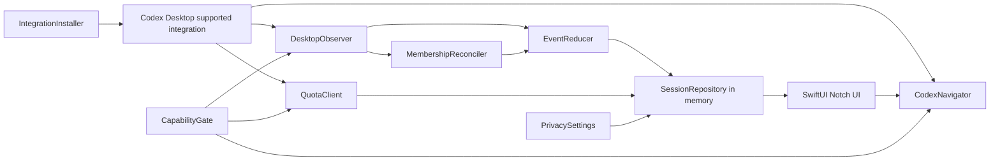

# Codex in Notch — Codex 集成技术设计

| 字段 | 内容 |
| --- | --- |
| 文档状态 | 设计完成，等待 Phase 0 能力验证 |
| 版本 | 0.8 |
| 日期 | 2026-08-11 |
| 范围 | 把 SwiftUI Demo 的 Mock 状态、额度、处理时间、会话列表与点击导航替换为真实 Codex Desktop 数据 |

## 1. 结论

V1 把展开列表实现为 Codex Desktop 当前处理轮次的实时监视器，不实现历史列表。权威成员集合是：当前 Desktop 账户下所有 Project 与 `Chats` 中，存在活动 Turn 或未读终态 Turn，并且仍可通过同一 `threadId` 在 Desktop 精确导航的根会话。

集成采用“受支持的 Desktop 观察通道 + 事件 reducer + 集合校正”架构。Project、未读状态和精确导航都是发布门槛；不能从 cwd、时间、窗口焦点或私有接口推断。Phase 0 如果无法证明这些契约，停止在能力验证阶段，不以近似实现发布。

本文只定义实现方案，不实现代码。

## 2. 设计约束

### 2.1 产品约束

- 一行是一个根 Thread；一轮处理是 Thread 中一个 Turn。
- 监视当前 Desktop 账户的全部 Project 与 `Chats`，不跟随侧边栏选择。
- 活动 Turn 始终显示；终态 Turn 只在 Desktop 未读时显示。
- 已读、归档、删除或失去可导航性立即退出列表。
- 子智能体、exec、独立 CLI/IDE 会话不显示为顶级行。
- 点击必须进入完全相同的 Desktop Thread；只打开首页不算成功。
- 启动时不展示缓存行；连接后从 Desktop 真值重建。
- 当前内容预览可全局关闭，默认开启且不持久化。

### 2.2 安全约束

- 只使用公开、受支持、可做版本能力判断的接口。
- 不连接未经支持的 Desktop 私有 socket，不写私有数据库，不使用辅助功能或 GUI 自动化。
- 不读取认证文件或复制 Desktop 凭据。
- 不发起 Turn、resume Turn、批准、输入、取消、归档或删除。
- 集成配置只在用户确认后修改，并能从设置中移除。

### 2.3 UI 约束

- 共享展开基准宽度 `520`，参考总高度 `302`。
- 顶部汇总区参考高 `46`，始终等于目标菜单栏高度；展开只横向扩张。
- 下方内容区固定 `256`，列表视口 `472 × 240`，三行可见并垂直滚动。
- 健康空列表与全局可用性状态使用 `520 × 94` 薄层。
- Figma 与产品 UI 字体统一使用 SF Pro。

## 3. 关键发布门槛

Phase 0 必须分别证明以下能力，而不是从现有字段猜测：

| 能力 | 必须取得的真实值 | 缺失时行为 |
| --- | --- | --- |
| Thread 身份 | 稳定 root `threadId` 与可导航性 | 阻止 V1 发布 |
| Turn 实时状态 | 开始、Input、Approval、Running、Completed、Error、Cancelled | 阻止实时监视器发布 |
| Desktop 未读 | 与蓝色未读点一致的成员变化 | 阻止终态生命周期发布 |
| Desktop Project | Project id/name 与 `Chats` | 阻止 Project 展示发布，不得用 cwd 替代 |
| 精确导航 | `threadId →` 同一 Desktop 页面 | 阻止 V1 发布 |
| 时间 | 与 Desktop 同源的 `startedAt` / `completedAt` | Running 时长不可发布 |
| 额度 | 当前账户 primary rate-limit window | 只降级为灰色不可用圆环 |
| 当前内容 | 用户可见 prompt/progress/error/final | 只隐藏预览 |

官方 App Server 的 Thread/Turn/状态/额度协议可以作为候选基础，但当前公开字段不能假定已经包含 Desktop Project 与未读成员关系。独立启动的 App Server 也不能假定与 Desktop 共享运行时。Phase 0 必须验证实际支持路径；内部 Desktop 资源只能用于理解问题，不能成为生产依赖。

## 4. 领域数据模型

```swift
struct MonitoredThreadSnapshot: Identifiable, Equatable {
    let id: String                 // Desktop threadId
    let turnId: String
    let title: String
    let project: ProjectIdentity   // Desktop Project or Chats
    let status: TurnStatus
    let startedAtMs: Int64?
    let completedAtMs: Int64?
    let isUnread: Bool
    let isArchived: Bool
    let isDeleted: Bool
    let isNavigable: Bool
    let preview: String?           // memory only
    let observedAtMs: Int64
    let revision: UInt64
}

enum TurnStatus {
    case inputNeeded
    case approvalNeeded
    case running
    case unknown
    case error
    case cancelled
    case completed
}

enum IntegrationAvailability {
    case setupRequired
    case connecting(deadlineMs: Int64)
    case ready
    case updateCodex
    case unsupportedVersion
    case disconnected
}

enum QuotaState {
    case available(primary: RateLimitWindow)
    case unavailable
}

struct PrivacySettings {
    var showCurrentContentPreviews: Bool // default true
}
```

`TurnStatus` 不包含 Idle 或 Disconnected。Idle 从“集成 ready 且成员集合为空”推导；Disconnected 属于 `IntegrationAvailability`。

## 5. 数据真值与禁止回退

| UI 字段 | 权威来源 | 允许回退 | 禁止回退 |
| --- | --- | --- | --- |
| Thread id | Desktop 支持接口 | 无 | 标题、session id、路径、时间接近度 |
| Turn id | 当前活动或未读终态 Turn | 无 | Thread updatedAt |
| 标题 | Desktop 当前显示标题 | 预览开启时使用本轮 prompt 安全截断；否则 `Untitled` | cwd、仓库名、Mock 标题 |
| Project | Desktop Project id/name | 无 Project 时 `Chats` | cwd basename、Git root |
| 未读 | Desktop 未读真值 | 无 | 窗口焦点、Notch 点击、固定保留时间 |
| 状态 | 受支持的 Turn/请求事件与校正快照 | 单会话 Unknown | 计时器或 UI 猜测 |
| 处理时间 | 同 Turn 的 startedAt/completedAt | 无 | Thread 时间、文件修改时间 |
| 预览 | Codex 已向用户公开的内容 | 隐藏 | raw reasoning、工具参数、输出、diff |
| 额度 | 当前账户 primary rate-limit window | 灰色 unavailable | stale 值、daily/lifetime usage 推算 |

## 6. 系统架构



### 6.1 组件职责

| 组件 | 职责 |
| --- | --- |
| `CodexInstallationDetector` | 定位 Desktop、读取版本、判断未运行/过旧/未知新版本 |
| `CapabilityGate` | 根据已验证兼容矩阵启用能力；新版本默认 fail closed |
| `IntegrationInstaller` | 在用户确认后安装/注册本地集成；检测变更、支持移除 |
| `DesktopObserver` | 被动接收 Thread、Turn、请求、未读、Project、归档和删除事件 |
| `MembershipReconciler` | 获取当前活动 + 未读终态集合，与 repository 做集合差分 |
| `EventReducer` | 去重、处理乱序、验证状态转移，生成确定性快照 |
| `PreviewExtractor` | 选择允许的公开内容，单行规范化，只保存在内存 |
| `QuotaClient` | 读取/订阅当前账户 primary window，处理账户切换与 unavailable |
| `SessionRepository` | `@MainActor` 可观察快照、排序、滚动稳定性与派生汇总 |
| `RuntimeClock` | 共享 1 Hz UI 时钟，不为每行创建独立 Timer |
| `CodexNavigator` | 点击前校正目标并执行受支持的精确 Desktop 导航 |

## 7. 集成生命周期

### 7.1 首次安装

1. 检测 Codex Desktop 是否存在并读取版本。
2. 展示 Welcome，不改变系统状态。
3. 展示将读取的本地元数据、不会持久化的内容与可逆性。
4. 用户点击 `Set Up Integration` 后才执行安装/注册。
5. 尊重 Codex 对本地 Hook/集成的信任与审核机制，不绕过。
6. 完成能力探测；只有必需能力全部通过才显示 Ready。
7. `Start Monitoring` 后进入 connecting，并从空集合重建。

安装器必须记录自己管理的最小配置片段与定义 hash，不能覆盖用户其他配置。移除时只移除本应用管理的片段。

### 7.2 启动与重连

```text
launch
→ clear repository
→ detect installation/version
→ Connecting to Codex (≤ 5s)
→ capability handshake
→ reconcile active + unread terminal membership
→ subscribe events
→ ready
```

五秒内连接成功则不显示中间错误；超时后根据原因进入 Update Codex、unsupported 或 disconnected。Codex 未运行时不自动启动。

### 7.3 集合校正时机

- 首次连接成功。
- observer 重连。
- Mac 睡眠唤醒。
- 账户切换。
- 收到可能影响成员集合的未读、归档、删除或 Project 事件。
- 低频安全校正，用于覆盖漏失事件；不得秒级扫描完整历史。
- 点击导航前进行目标级轻量校正。

## 8. 成员集合算法

对每个 root Thread，选择当前活动 Turn；不存在活动 Turn 时选择 Desktop 标记未读的最近终态 Turn。只有满足以下全部条件才进入集合：

```text
isRoot
AND isNavigableInDesktop
AND !isArchived
AND !isDeleted
AND (turn.isActive OR (turn.isTerminal AND thread.isUnread))
```

集合差分规则：

- `added`：读取最小 Thread/Turn/Project 快照并生成行。
- `updated`：按 `revision` 或稳定事件序号合并；旧事件不能覆盖新 Turn。
- `removed`：立即从 repository 删除。
- `thread/closed`：只表示运行时关闭，不直接映射 removed。

重启时不读取本应用旧列表；从空集合执行同一校正。

## 9. 状态 reducer

### 9.1 映射

| 信号 | 产品状态 |
| --- | --- |
| 等待用户输入 active flag / request | Input needed |
| 等待批准 active flag / request | Approval needed |
| Turn active 且无等待请求 | Running |
| 当前 schema/事件无法安全识别 | Unknown |
| terminal failed / system error | Error |
| terminal interrupted/cancelled | Cancelled |
| terminal completed | Completed |

同一 Turn 同时出现多个信号时使用 `Input needed > Approval needed > Running`。终态到达后清空该 Turn 的 pending request。旧 Turn 的晚到事件不能改变新 Turn。

### 9.2 事件去重

优先使用服务端 event/revision 标识；否则构造稳定去重键：

```text
source + method + threadId + turnId + requestOrItemId + revision
```

所有未知字段与枚举写入脱敏诊断，不让应用崩溃。诊断只保留方法名、版本、枚举和哈希标识，不包含正文、路径或凭据。

## 10. 汇总与排序

汇总优先级：

```text
Input needed
> Approval needed
> Running
> Unknown
> Error
> Cancelled
> Completed
```

Unknown 只有在所有成员都 Unknown 时成为汇总；否则忽略 Unknown 并从已知成员计算。ready 且集合为空时为 Idle。availability 非 ready 时，汇总改由全局可用性状态驱动并清空列表。

列表按同一优先级排序，同级按 `observedAtMs` 降序。repository 立即提交顺序，但 UI 在用户滚动或悬停时保留当前可见锚点；变化发生在视口外时显示轻量更新指示。

## 11. 当前内容预览

`PreviewExtractor` 只接收已经面向用户公开的 item：

1. Input needed：当前问题文本。
2. Approval needed：固定 `Approval requested`，不读取命令、路径或理由。
3. Running：最新公开 commentary/progress；否则本轮 prompt。
4. Error：用户可见错误摘要。
5. Cancelled：最后公开进度；否则本轮 prompt。
6. Completed：final answer 开头。
7. Unknown：最后允许显示的公开片段，不能据此推导状态。

处理步骤：去控制字符 → 合并空白 → 取第一可见行 → 内存限制 → 交给 UI Alpha mask。禁止写日志、数据库、UserDefaults 或诊断包。

`showCurrentContentPreviews == false` 时，extractor 不产生正文，并禁止标题生成器访问 prompt fallback。

## 12. 处理时间

计算必须与 Desktop 同一 Turn 字段一致：

```swift
let end = completedAtMs ?? nowMs
let elapsedMs = max(end - startedAtMs, 0)
```

- 等待 Input/Approval 和睡眠时间包含在墙钟经过时间内。
- reducer 持续保留 startedAt；等待期间 UI 不显示时长。
- 只有 Running 行显示秒级时长；顶部存在 Running 时显示其中最大值。
- 使用一个共享 1 Hz clock，仅更新可见的派生字符串。
- 缺失或倒序时间不得用 Thread 时间补齐；对应时长不可用并记录脱敏诊断。

## 13. 额度

连接成功后读取当前账户 primary rate-limit window，并订阅稀疏更新。无法安全合并稀疏更新时重新读取完整 snapshot。

失败策略：

1. 第一次读取失败后静默重试，最长 5 秒。
2. 仍失败则 `QuotaState.unavailable`，立即显示灰色圆环。
3. 不保留旧值，不用 usage lifetime/daily 字段估算。
4. 账户标识变化时先清空额度，再读取新账户。
5. 额度失败不改变 availability、会话状态或导航。

## 14. 精确导航

`CodexNavigator.open(threadId:)`：

1. 通过 repository 和目标级校正确认 Thread 仍存在、未归档、未删除、可导航。
2. 根据版本化能力表选择公开 deep link 或受支持 Desktop action。
3. 使用 `NSWorkspace` 激活 Codex Desktop 并传入结构化 Thread 标识。
4. 验证 Desktop 当前页面的 Thread 标识与目标一致，且没有创建或 resume Turn。
5. 成功后收起面板；不主动标记已读。
6. 失败时保持面板和行，显示非破坏性反馈并触发集合校正。

禁止：首页 fallback 作为成功、猜测 URL、私有 IPC、Accessibility 点击、标题匹配。

## 15. 可用性与局部降级

| 故障 | UI |
| --- | --- |
| 无活动或未读终态 | 薄层 `No active turns` |
| 连接进行中 | 薄层 `Connecting to Codex`，≤ 5s |
| 版本过旧 | 清空列表，薄层 `Update Codex` |
| 版本未知/未经验证 | 清空列表，薄层 `Codex version unsupported` |
| Desktop 未运行或 observer 断开 | 清空列表，薄层 `Codex disconnected` |
| 只有某会话状态未知 | 该行 Unknown；其他行继续真实显示 |
| 额度失败 | 灰色圆环；列表不变 |
| 某行预览失败 | 隐藏该预览；其他字段不变 |

上述 Notch 薄层不提供按钮。修复/移除集成只在首次引导或 Settings 中执行。

## 16. 设置与持久化

### 16.1 持久化内容

允许持久化：

- `showCurrentContentPreviews`。
- 集成安装版本、定义 hash 和兼容性结果。
- 非敏感应用版本/迁移标记。

禁止持久化：

- 会话列表快照、thread 标题缓存、Project 缓存、未读状态。
- prompt、progress、error、final answer、raw reasoning。
- 完整路径、命令、diff、工具参数、凭据、额度旧值。

### 16.2 Settings 行为

- `Recheck`：重新运行只读能力检查，不静默改配置。
- `Remove Integration`：只移除本应用管理的配置片段，然后清空 repository。
- `Show current content previews`：立即影响所有行；关闭时清空内存预览并重新生成安全标题。

## 17. SwiftUI 接入边界

现有 Demo 的 UI 层只依赖稳定 view model：

```swift
@MainActor
protocol MonitorViewModelProtocol: ObservableObject {
    var availability: IntegrationAvailability { get }
    var aggregate: AggregateState { get }
    var quota: QuotaState { get }
    var sessions: [MonitoredThreadSnapshot] { get }
    var privacy: PrivacySettings { get }
    func open(threadId: String) async
}
```

Mock 与真实实现共享协议，Preview/测试继续使用 Mock；生产入口注入真实 repository。SwiftUI 不直接解析协议事件、不读取本地文件、不构造导航 URL。

几何继续由现有 AppKit overlay 负责：使用完整 `NSScreen.frame`，所有中间帧保持相同 `midX` 与 `maxY`；顶部高度来自目标菜单栏，展开总高为 `menuBarHeight + 256`。

## 18. Phase 0 验证计划

1. **版本与 schema**：记录 Desktop/内嵌 CLI 版本，生成/读取官方 schema，构建未知字段兼容 fixture。
2. **同 runtime 可见性**：证明观察器能被动看到 Desktop 当前活动 Turn，不需要 resume 或接管请求。
3. **请求状态**：分别验证 Input、Approval 出现/解决及 Running 恢复。
4. **终态与未读**：验证完成/失败/取消后未读保留，Desktop 阅读后即时移除。
5. **Project/Chats**：覆盖单仓库、多仓库 Project 与无 Project Chat。
6. **删除/归档**：验证事件与集合校正都能自动移除；确认 closed 不等于 deleted。
7. **时间**：对照 Desktop 当前 Turn 上方计时，包含等待和睡眠。
8. **额度**：验证 primary、多窗口字段、账户切换、五秒失败与 unavailable。
9. **导航**：验证受支持 `threadId →` 相同 Desktop 页面，不创建/恢复 Turn。
10. **多客户端安全**：证明 observer 不响应 Desktop 的 server request、不改变运行状态。

产物为能力矩阵、脱敏事件时序、版本兼容表和 go/no-go 结论。

## 19. 实施阶段

### Phase 1：集成骨架

- 安装检测、版本 gate、首次引导与 Settings 存储。
- observer/reconciler/reducer 协议与 fixture。
- 生产 ViewModel 注入，但 UI 仍可切换 Mock。

### Phase 2：真实监视器

- 活动 + 未读终态集合。
- Project/Chats、真实标题、状态与预览。
- Desktop 同源时长、主额度窗口、局部降级。
- 三行滚动、排序锚点与空/断开薄层。

### Phase 3：导航与发布

- 精确导航 adapter 与兼容表。
- 安装修复/移除、账户切换、睡眠/重连校正。
- 签名、公证、性能、无障碍和隐私审计。

## 20. 测试策略

### 20.1 单元测试

- reducer 合法/非法转移、乱序与重复事件。
- 监视成员集合的 active/unread/archive/delete 规则。
- 汇总优先级与 Unknown 特例。
- Project 无近似回退、标题隐私回退。
- Desktop 同源时间公式与时钟边界。
- 额度账户切换、五秒失败和 unavailable。
- Settings 关闭预览后内存清空。

### 20.2 集成测试

- 三个并发 Thread：Input、Running、未读 Completed。
- 同名 Thread、同名 Project 不合并。
- 多仓库 Project 与 `Chats` 显示一致。
- Desktop 阅读、归档、删除自动移除。
- Codex in Notch 重启无缓存闪现并正确重建。
- Desktop 未运行、低版本、未知新版本与重连。
- 点击每一行进入相同 Thread；不存在目标保持面板。

### 20.3 隐私与安全测试

- 扫描数据库、UserDefaults、日志、诊断包，确认无正文、路径、命令、diff、凭据和旧额度。
- 确认不申请 Accessibility/Screen Recording。
- 确认 observer 不发送会改变 Thread/Turn 的方法。
- 确认移除集成不会删除用户其他配置。

## 21. Figma 对应

| 页面/节点 | 技术契约 |
| --- | --- |
| `Notch Core` / `118:120` | `520 × 302` 共享展开、顶部 `46` |
| `06 — Integration States` / `227:3` | 隐私关闭、Unknown、额度局部降级、成员生命周期和薄层状态 |
| `07 — Onboarding` / `232:95` | 显式授权的三步首次安装 |
| `08 — Settings` / `233:3` | 集成管理与预览开关的 On/Off 状态 |

## 22. 参考

- [Codex App Server](https://developers.openai.com/codex/app-server)
- [Codex Hooks](https://developers.openai.com/codex/hooks)
- [`CONTEXT.md`](../CONTEXT.md)
- [`docs/adr`](adr/)
