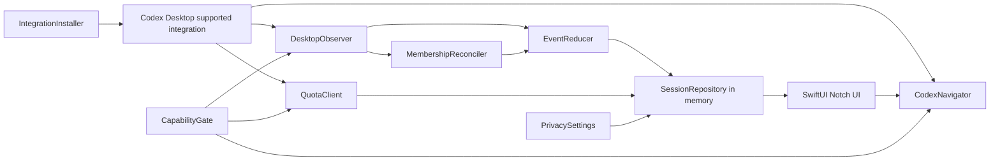

# Codex in Notch — Codex 集成技术设计

| 字段 | 内容 |
| --- | --- |
| 文档状态 | 第一实现切片与精确导航完成；Desktop 未读能力仍阻塞 V1 发布 |
| 版本 | 0.13 |
| 日期 | 2026-08-12 |
| 范围 | 将 SwiftUI 原型中的 Mock 状态、额度、会话列表与点击导航替换为真实 Codex Desktop 数据；Running 计时延后评估 |

## 1. 结论

V1 把展开列表实现为 Codex Desktop 当前处理轮次的实时监视器，不实现历史列表。权威成员集合是：当前 Desktop 账户下所有 Project 与 `Chats` 中，存在活动 Turn 或未读终态 Turn，并且仍可通过同一 `threadId` 在 Desktop 精确导航的根会话。

集成采用“受支持的 Desktop 观察通道 + 事件 reducer + 集合校正”架构。Project、未读状态和精确导航都是发布门槛；不能从 cwd、时间、窗口焦点或私有接口推断。Phase 0 如果无法证明这些契约，停止在能力验证阶段，不以近似实现发布。

本文同时记录实现方案、已验证的协议能力和当前测试版边界。

### 1.1 第一实现切片（2026-08-12）

已经实现：

- 通过 Codex Desktop 随附的 `codex app-server --listen stdio://` 建立 JSON-RPC 连接，严格按 `initialize → initialized` 握手。
- 只调用 `thread/list`、`thread/loaded/list`、`thread/read`、`account/read`、`account/rateLimits/read` 五个只读方法；启动与常规列表刷新不逐 Thread 调用 `thread/read`，且不响应或代替用户处理审批/输入请求。
- 从当前账户 primary rate-limit window 读取真实 `usedPercent`，转换为剩余百分比；不可用时显示灰色圆环。
- 提供用户显式触发的 Hooks 安装器，增量合并 `~/.codex/hooks.json`，保留其他定义，并要求用户在 Codex `/hooks` 中审核信任。
- 使用 `UserPromptSubmit`、`PermissionRequest`、`PreToolUse(request_user_input)`、`PostToolUse` 和 `Stop` 建立 Turn 生命周期事件桥；所有状态事件必须携带精确 `session_id + turn_id`，输入请求还必须用相同 `tool_use_id` 成对关闭。事件文件采用用户私有权限、消费后删除。
- 标题与 Project/`Chats` 优先使用 `thread/list`；只有 Hook 已把某 Turn 标记为 Unknown 终态时，才在后台用 App Server `thread/read` 做状态补全。补全失败时保留 Unknown，不阻塞列表快照。
- Preview 设置默认开启；关闭后 hook 不再写入内容片段，列表完全移除预览行，缺少 Desktop 标题时只显示 `Untitled`。即使开启，prompt/回答片段也不写入持久状态。
- `MonitorStore` 替换生产 Mock，事件活跃时 1 秒校正、断开时 5 秒静默重试；首次收到合法 Hook 后只持久化不含会话身份与内容的布尔信任标记。应用重启时 reducer 从空集合开始，启动前积压事件不得恢复 Running/Input/Approval；App Server 当前 `status/activeFlags` 可在已有精确 Turn 身份上校正瞬时状态。Running 直接显示状态名称，额度区域始终显示真实剩余比例；空列表与全局状态采用薄层展开 UI。
- 会话行通过官方 `codex://threads/<thread-id>` deep link 打开同一 Codex Desktop 会话；打开前强制刷新全部未归档根 Thread，目标不存在时拒绝导航。URL 只定向交给 bundle id `com.openai.codex`，Launch Services 接受后才收起面板。

已经通过本机当前 Codex 版本验证：App Server 握手、真实额度响应、Thread/Turn/Project schema 解析、Hooks 配置合并、事件 reducer 与精确导航 adapter。应用构建与单元测试已通过。

尚未满足、因此仍阻塞 V1 发布：

- 独立 App Server 不共享 Codex Desktop 当前运行时；从未收到过受信 Hook 事件时只能诚实显示 `Codex disconnected`，即使额度读取成功。曾验证过的 Hook 信任可跨 Codex in Notch 自身重启恢复，但仍必须同时检测到当前 Codex Desktop 进程。
- 当前公开协议没有 Desktop 蓝点对应的已读字段。测试版会在 `Stop` 后保留 Completed，直到 Thread 归档/删除；用户仅在 Desktop 查看后暂时无法自动移除。
- Hooks 可以可靠覆盖开始、普通审批、`request_user_input` 和终态边界；App Server 的 `completed`、`failed`、`interrupted` 已分别映射为 Completed、Error、Cancelled，仍需真实 Desktop 样本矩阵验证端到端覆盖。
- `threadSource/sourceKinds` 仍不足以单独证明 Desktop 与独立 IDE 来源边界，必须继续以真实样本验证。

### 1.2 已读移除与精确导航能力探索

- 官方 [Codex Desktop deep links](https://learn.chatgpt.com/docs/reference/commands#deep-links) 已定义 `codex://threads/<thread-id>`。导航 adapter 已按本节约束实现；Codex 当前仍不提供页面完成渲染的公开回执。
- 官方 [Codex App Server](https://learn.chatgpt.com/docs/app-server) 当前没有 unread/read/open/current-view 字段或通知。`thread/read` 是读取 Thread 记录，不是标记已读；`thread/loaded/list` 与 `thread/closed` 也不表达蓝点语义。
- 当前 Desktop 安装包内部把蓝点集合持久化在 `$CODEX_HOME/.codex-global-state.json` 的 `electron-persisted-atom-state.unread-thread-ids-by-host-v1.local`，并通过 Electron 进程内 IPC 更新。它可以支撑受版本和 schema gate 保护的只读实验，但属于私有实现细节，违反本设计“只依赖公开接口”的发布约束，因此不得进入 V1 生产实现。
- 若只做隔离 spike，监听上述文件必须处理原子替换、100–250 ms debounce、解析失败保留 last-known 并 5 秒重试；活动 Turn 无论蓝点如何都继续显示，只有终态 Turn 从 unread 集合消失后才移除。不得注入 IPC、修改 `app.asar`、使用 Accessibility/AppleScript，或把 Stop/SessionEnd 当作已读。
- Developer ID 直接分发在关闭 App Sandbox 时技术上可读取该路径；Mac App Store sandbox 需要用户选择目录与 security-scoped bookmark。无论分发方式如何，文件可读都不等于接口受支持。
- 生产方向仍是向 Codex 请求公开 `hasUnreadTurn` 快照与变化通知；在此之前，完成后“Desktop 阅读即自动移除”仍是唯一未解决的核心能力缺口。

### 1.3 私有未读状态的只读可行性研究（未实现）

对当前 Desktop `26.803.61601` build `6396` 的只读核验表明：

- 状态根目录是 `process.env.CODEX_HOME ?? ~/.codex`；默认文件为 `.codex-global-state.json`。
- 未读集合位于 `electron-persisted-atom-state.unread-thread-ids-by-host-v1.<hostID>`；本地 V1 只能消费 `local`，不能合并其他 host。
- Desktop 自身在状态变化后等待约 `500 ms` 再持久化；写入通过同目录临时文件 `rename` 原子替换主文件，随后独立替换 `.bak`。因此目标 inode 会变化，主文件与 backup 也可能短暂属于不同 generation。
- 这是真实的 Thread 级蓝点集合，没有 Turn id。它只能与“每个 Thread 展示最新活动或未读终态 Turn”的领域模型组合。

若产品负责人未来批准隔离实验，建议使用以下架构：

1. 目录级 `DispatchSourceFileSystemObject` + `O_EVTONLY` 监听 Codex Home，而不是长期监听目标文件 inode；目录事件后每次重新按路径打开文件。
2. 使用 `150–250 ms` trailing debounce；读取前后 `fstat`，generation 改变则重读。拒绝 symlink、非当前用户文件、异常 schema 与超大文件。
3. 只解析目标 host 的字符串集合；不得记录原始 JSON 或明文 Thread id。解析、权限、文件缺失或 watcher 故障时保留 last-known-good，5 秒静默重试，绝不能把错误解释为空集合。
4. 活动、Input、Approval 始终显示。终态只在 post-terminal 的有效 generation 中连续确认“不在未读集合”并经过 settling window 后移除；归档/删除的完整公开分页校正优先级更高。
5. Desktop 重启、Mac 唤醒、账户变化或 watcher 重建时先暂停移除并建立完整 baseline；每 30 秒可做低频校正。

当前只允许这一方案进入独立 spike，而不是正式列表逻辑。建议门槛是：锁定上述 Desktop build；50 次真实 read/unread 循环零错误；至少 100 组完成/阅读竞态零次提前移除；1,000 次 atomic-replace fixture 零丢失；p95 同步不超过 1.5 秒、p99 不超过 2 秒；任意错误都不清空终态行。Developer ID 非沙箱、用户明确开启的实验版可有条件 GO；Mac App Store、未知 build 或跨版本默认开启均 NO-GO。

其他路径的独立研究没有找到公开且准确的替代方案：

- App Server、Hooks、通知、JSONL、SQLite、窗口焦点与 deep-link 回调都不表达“用户已阅读”。
- 当前 Desktop 私有 Unix socket `~/.codex/ipc/ipc.sock` 会广播 `thread-read-state-changed` delta，但没有初始完整快照；连接者必须注册为内部 IPC client、参与 discovery，可能影响路由与超时。它的风险和版本耦合均高于纯只读文件，因此不采用。
- Accessibility、AppleScript、标题匹配、定时移除或“Desktop 获得焦点即已读”均不准确并违反安全约束。
- 唯一公开且诚实的产品折中是把 Notch 点击定义为本应用自己的“已确认”，但它无法覆盖用户直接在 Desktop 阅读，不得称为 Desktop 已读同步；当前产品语义不采用。

生产所需的最小公开能力仍是启动/重连可获取的 `hasUnreadTurn` 快照，以及携带 `threadId`、`hostId` 和新布尔值的 `thread/readState/changed` 通知，并具备 capability/version negotiation。

## 2. 设计约束

### 2.1 产品约束

- 一行是一个根 Thread；一轮处理是 Thread 中一个 Turn。
- 监视当前 Desktop 账户的全部 Project 与 `Chats`，不跟随侧边栏选择。
- 活动 Turn 始终显示；终态 Turn 只在 Desktop 未读时显示。
- 已读、归档、删除或失去可导航性立即退出列表。
- 子智能体、exec、独立 CLI/IDE 会话不显示为顶级行。
- 点击必须进入完全相同的 Desktop Thread；只打开首页不算成功。
- 启动时不展示缓存行；连接后从 Desktop 真值重建。
- 当前内容预览可全局关闭，默认开启且不持久化。

### 2.2 安全约束

- 只使用公开、受支持、可做版本能力判断的接口。
- 不连接未经支持的 Desktop 私有 socket，不写私有数据库，不使用辅助功能或 GUI 自动化。
- 不读取认证文件或复制 Desktop 凭据。
- 不发起 Turn、resume Turn、批准、输入、取消、归档或删除。
- 集成配置只在用户确认后修改，并能从设置中移除。

### 2.3 UI 约束

- 共享展开基准宽度 `520`，参考总高度 `302`。
- 顶部汇总区参考高 `46`，始终等于目标菜单栏高度；展开只横向扩张。
- 下方内容区固定 `256`，列表视口 `472 × 240`，三行可见并垂直滚动。
- 健康空列表与全局可用性状态使用 `520 × 94` 薄层。
- Figma 与产品 UI 字体统一使用 SF Pro。

## 3. 关键发布门槛

Phase 0 必须分别证明以下能力，而不是从现有字段猜测：

| 能力 | 必须取得的真实值 | 缺失时行为 |
| --- | --- | --- |
| Thread 身份 | 稳定 root `threadId` 与可导航性 | 阻止 V1 发布 |
| Turn 实时状态 | 开始、Input、Approval、Running、Completed、Error、Cancelled | 阻止实时监视器发布 |
| Desktop 未读 | 与蓝色未读点一致的成员变化 | 阻止终态生命周期发布 |
| Desktop Project | Project id/name 与 `Chats` | 阻止 Project 展示发布，不得用 cwd 替代 |
| 精确导航 | 官方 `codex://threads/<thread-id>` → 同一 Desktop 页面 | adapter 与单元测试已完成；保留版本化端到端兼容测试 |
| 额度 | 当前账户 primary rate-limit window | 只降级为灰色不可用圆环 |
| 当前内容 | 用户可见 prompt/progress/error/final | 只隐藏预览 |

官方 App Server 的 Thread/Turn/状态/额度协议可以作为候选基础，但当前公开字段不能假定已经包含 Desktop Project 与未读成员关系。独立启动的 App Server 也不能假定与 Desktop 共享运行时。Phase 0 必须验证实际支持路径；内部 Desktop 资源只能用于理解问题，不能成为生产依赖。

处理时长不是 V1 发布门槛。V1 不发布时长字段，也不根据开始/结束时间在 UI 中推算 Running 计时；该能力保留为未来评估项。

## 4. 领域数据模型

```swift
struct MonitoredThreadSnapshot: Identifiable, Equatable {
    let id: String                 // Desktop threadId
    let turnId: String
    let title: String
    let project: ProjectIdentity   // Desktop Project or Chats
    let status: TurnStatus
    let isUnread: Bool
    let isArchived: Bool
    let isDeleted: Bool
    let isNavigable: Bool
    let preview: String?           // memory only
    let observedAtMs: Int64
    let revision: UInt64
}

enum TurnStatus {
    case inputNeeded
    case approvalNeeded
    case running
    case unknown
    case error
    case cancelled
    case completed
}

enum IntegrationAvailability {
    case setupRequired
    case connecting(deadlineMs: Int64)
    case ready
    case updateCodex
    case unsupportedVersion
    case disconnected
}

enum QuotaState {
    case available(primary: RateLimitWindow)
    case unavailable
}

struct PrivacySettings {
    var showCurrentContentPreviews: Bool // default true
}

struct TurnKey: Hashable {
    let threadId: String
    let turnId: String
}

enum PendingInputEvidence: Equatable {
    case hook(toolUseId: String)
    case appServerSnapshot
}

struct TurnEvidence: Equatable {
    let key: TurnKey
    var lifecycle: TurnStatus       // running / unknown / terminal
    var pendingInput: PendingInputEvidence?
    var isApprovalPending: Bool
    var hasLiveBoundary: Bool       // observed after this repository launch
    var retiredTurnIds: Set<String> // memory-only generation guard
}
```

`TurnStatus` 不包含 Idle 或 Disconnected。Idle 从“集成 ready 且成员集合为空”推导；Disconnected 属于 `IntegrationAvailability`。

`TurnEvidence` 是内存中的 reducer 真值，不直接持久化。展示状态按“terminal/unknown 边界优先，否则 Input > Approval > Running”从 evidence 推导，避免一个无关事件直接覆盖整个状态枚举。

## 5. 数据真值与禁止回退

| UI 字段 | 权威来源 | 允许回退 | 禁止回退 |
| --- | --- | --- | --- |
| Thread id | Desktop 支持接口 | 无 | 标题、session id、路径、时间接近度 |
| Turn id | 当前活动或未读终态 Turn | 无 | Thread updatedAt |
| 标题 | Desktop 当前显示标题 | 预览开启时使用本轮 prompt 安全截断；否则 `Untitled` | cwd、仓库名、Mock 标题 |
| Project | Desktop Project id/name | 无 Project 时 `Chats` | cwd basename、Git root |
| 未读 | Desktop 未读真值 | 无 | 窗口焦点、Notch 点击、固定保留时间 |
| 状态 | 受支持的 Turn/请求事件与校正快照 | 单会话 Unknown | 计时器或 UI 猜测 |
| 处理时长（未来） | V1 不发布该 UI 字段 | 无 | `startedAt` 推算、Thread 时间、文件修改时间 |
| 预览 | Codex 已向用户公开的内容 | 隐藏 | raw reasoning、工具参数、输出、diff |
| 额度 | 当前账户 primary rate-limit window | 灰色 unavailable | stale 值、daily/lifetime usage 推算 |

## 6. 系统架构



### 6.1 组件职责

| 组件 | 职责 |
| --- | --- |
| `CodexInstallationDetector` | 定位 Desktop、读取版本、判断未运行/过旧/未知新版本 |
| `CapabilityGate` | 根据已验证兼容矩阵启用能力；新版本默认 fail closed |
| `IntegrationInstaller` | 在用户确认后安装/注册本地集成；检测变更、支持移除 |
| `DesktopObserver` | 被动接收 Thread、Turn、请求、未读、Project、归档和删除事件 |
| `MembershipReconciler` | 获取当前活动 + 未读终态集合，与 repository 做集合差分 |
| `EventReducer` | 去重、处理乱序、验证状态转移，生成确定性快照 |
| `PreviewExtractor` | 选择允许的公开内容，单行规范化，只保存在内存 |
| `QuotaClient` | 读取/订阅当前账户 primary window，处理账户切换与 unavailable |
| `SessionRepository` | `@MainActor` 可观察快照、排序、滚动稳定性与派生汇总 |
| `CodexNavigator` | 点击前校正目标并执行受支持的精确 Desktop 导航 |

## 7. 集成生命周期

### 7.1 首次安装

1. 检测 Codex Desktop 是否存在并读取版本。
2. 展示 Welcome，不改变系统状态。
3. 展示将读取的本地元数据、不会持久化的内容与可逆性。
4. 用户点击 `Set Up Integration` 后才执行安装/注册。
5. 尊重 Codex 对本地 Hook/集成的信任与审核机制，不绕过。
6. 完成能力探测；只有必需能力全部通过才显示 Ready。
7. `Start Monitoring` 后进入 connecting，并从空集合重建。

安装器必须记录自己管理的最小配置片段与定义 hash，不能覆盖用户其他配置。移除时只移除本应用管理的片段。

### 7.2 启动与重连

```text
launch
→ load Hook trust marker only; initialize an empty in-memory reducer
→ detect installation/version
→ Connecting to Codex (≤ 5s)
→ capability handshake
→ reconcile active + unread terminal membership
→ subscribe events
→ ready
```

五秒内连接成功则不显示中间错误；超时后根据原因进入 Update Codex、unsupported 或 disconnected。Codex 未运行时不自动启动。

### 7.3 集合校正时机

- 首次连接成功。
- observer 重连。
- Mac 睡眠唤醒。
- 账户切换。
- 收到可能影响成员集合的未读、归档、删除或 Project 事件。
- 每 30 秒进行一次低频安全校正，用于覆盖漏失事件；Hook 发现尚未列出的新 Thread 时可立即校正，不得秒级扫描完整历史。
- 点击导航前进行目标级轻量校正。

## 8. 成员集合算法

对每个 root Thread，选择当前活动 Turn；不存在活动 Turn 时选择 Desktop 标记未读的最近终态 Turn。只有满足以下全部条件才进入集合：

```text
isRoot
AND isNavigableInDesktop
AND !isArchived
AND !isDeleted
AND (turn.isActive OR (turn.isTerminal AND thread.isUnread))
```

集合差分规则：

- `added`：读取最小 Thread/Turn/Project 快照并生成行。
- `updated`：先按精确 `threadId + turnId` 定位，再按 `revision` 或稳定事件序号合并；旧 Turn 事件和无法关联的结果都不能覆盖当前 Turn。
- `removed`：立即从 repository 删除。
- `thread/closed`：只表示运行时关闭，不直接映射 removed。

重启时不读取本应用旧列表或旧 reducer Turn；从空集合执行同一校正。启动前已写入事件目录的历史事件只用于建立 Hook 信任和恢复终态边界，不能单独证明 Turn 此刻仍处于 Running、Input needed 或 Approval needed。

## 9. 状态 reducer

### 9.1 映射

| 信号 | 产品状态 |
| --- | --- |
| 等待用户输入 active flag / request | Input needed |
| 等待批准 active flag / request | Approval needed |
| Turn active 且无等待请求 | Running |
| 当前 schema/事件无法安全识别 | Unknown |
| terminal failed / system error | Error |
| terminal interrupted/cancelled | Cancelled |
| terminal completed | Completed |

同一 Turn 同时出现多个信号时使用 `Input needed > Approval needed > Running`。终态到达后清空该 Turn 的 pending request。旧 Turn 的晚到事件不能改变新 Turn。

### 9.2 身份准入与请求配对

- 所有会改变 Turn 状态的 Hook 必须包含非空 `session_id` 和 `turn_id`。不得回退到当前 Turn、`"unknown"`、时间邻近或 Thread 更新时间；缺少身份的事件只写脱敏诊断并消费隔离。
- repository 没有该 Thread 时，受支持事件可以用自身的精确身份建立 Turn；已有当前 Turn 时，只有顺序更新且从未被该 Thread 淘汰过的 `UserPromptSubmit` 可以建立下一 Turn。repository 在内存中保留本次运行已淘汰的 Turn id；其他不同 `turn_id` 的晚到事件及旧 UserPrompt 一律忽略。
- `PreToolUse(request_user_input)` 只有在包含非空 `tool_use_id` 时才建立 Input pending；`PostToolUse` 只有 `turn_id` 和 `tool_use_id` 都与该 pending 完全相同时才能清除它。未匹配结果保持原状态。
- 当前公开 `PermissionRequest` Hook 没有稳定 request/tool id，因此只建立该 Turn 的 Approval evidence；任意 `PostToolUse` 都不得推断该审批已经结束。它只能由同一 Turn 的 App Server 当前快照、终态或下一 Turn 清除。
- `Stop` 和 App Server terminal 状态是边界信号：清空该 Turn 的所有 pending evidence。terminal 只在 Turn id 精确匹配时覆盖。

### 9.3 App Server 当前快照纠偏

Hook 提供低延迟边界，App Server 提供可用时的当前状态校正。对已由精确 `turnId` 绑定的当前 Turn，`thread.status.activeFlags` 映射为 Input/Approval/Running，并覆盖过期的 Hook pending；匹配 Turn 的 `completed/failed/interrupted` 终态优先级更高。Thread 级 active flag 不得创建 Turn、猜测 Turn id 或把不同 Turn 关联起来。若快照未携带 in-progress Turn id，它只能纠偏本次 repository 启动后已观察到 live boundary 的 Turn；历史回放建立的 Turn 必须等相同 in-progress Turn id 被显式确认。

独立 App Server 可能不共享 Desktop 当前运行时，因此它不是 Hooks 的替代品；只在返回可识别的当前状态时纠偏，`notLoaded`、缺失字段、超时或协议错误均保留最后可信内存状态。

### 9.4 历史回放与事件去重

repository 启动时记录 live cutoff。`received_at` 早于该 cutoff 的积压事件属于历史回放：可以建立信任、应用精确匹配的 Stop/terminal 边界，但 UserPrompt/Permission/Input 等非终态信号不得发布活动状态，也不得被缺少 Turn id 的 thread-level active flag 复活。这样应用崩溃或退出期间遗留的最后一条“开始/等待”事件不会在下次启动时伪装成当前状态。

优先使用服务端 event/revision 标识；否则构造稳定去重键：

```text
source + method + threadId + turnId + requestOrItemId + revision
```

所有未知字段与枚举写入脱敏诊断，不让应用崩溃。诊断只保留方法名、版本、枚举和哈希标识，不包含正文、路径或凭据。

## 10. 汇总与排序

汇总优先级：

```text
Input needed
> Approval needed
> Running
> Unknown
> Error
> Cancelled
> Completed
```

Unknown 只有在所有成员都 Unknown 时成为汇总；否则忽略 Unknown 并从已知成员计算。ready 且集合为空时为 Idle。availability 非 ready 时，汇总改由全局可用性状态驱动并清空列表。

列表按同一优先级排序，同级按 `observedAtMs` 降序。repository 立即提交顺序，但 UI 在用户滚动或悬停时保留当前可见锚点；变化发生在视口外时显示轻量更新指示。

## 11. 当前内容预览

`PreviewExtractor` 只接收已经面向用户公开的 item：

1. Input needed：当前问题文本。
2. Approval needed：固定 `Approval requested`，不读取命令、路径或理由。
3. Running：最新公开 commentary/progress；否则本轮 prompt。
4. Error：用户可见错误摘要。
5. Cancelled：最后公开进度；否则本轮 prompt。
6. Completed：final answer 开头。
7. Unknown：最后允许显示的公开片段，不能据此推导状态。

处理步骤：去控制字符 → 合并空白 → 取第一可见行 → 内存限制 → 交给 UI Alpha mask。禁止写日志、数据库、UserDefaults 或诊断包。

`showCurrentContentPreviews == false` 时，extractor 不产生正文，并禁止标题生成器访问 prompt fallback。

## 12. 处理时间（未来考虑）

V1 不实现处理时长：

- `MonitorStore` 不维护 1 Hz UI 时钟，也不派生、格式化或聚合 Running 时长。
- 收起态、展开汇总和会话行统一使用 `MonitorStatus.running.displayName`，即 `Running`。
- 额度区域始终显示 primary rate-limit window 的真实剩余比例；Running 不替换该值。
- `startedAt` 等生命周期元数据只可服务于事件排序或校正，不能形成用户可见计时。

未来若重新引入，必须先验证 Desktop 的权威时长语义，明确 Input/Approval、睡眠和重连时间是否计入，并完成无障碍、功耗与刷新频率评审。在此之前不增加计时器、时长格式化器或秒级一致性测试。

## 13. 额度

连接成功后读取当前账户 primary rate-limit window，并订阅稀疏更新。无法安全合并稀疏更新时重新读取完整 snapshot。

失败策略：

1. 第一次读取失败后静默重试，最长 5 秒。
2. 仍失败则 `QuotaState.unavailable`，立即显示灰色圆环。
3. 不保留旧值，不用 usage lifetime/daily 字段估算。
4. 账户标识变化时先清空额度，再读取新账户。
5. 额度失败不改变 availability、会话状态或导航。

## 14. 精确导航

`CodexDesktopNavigator.open(threadId:)`：

1. 通过 repository 和目标级校正确认 Thread 仍存在、未归档、未删除、可导航。
2. 对 `threadId` 做 URL path-component 编码，构造官方 `codex://threads/<thread-id>`。
3. 使用 `NSWorkspace` 将 URL 定向交给 bundle id `com.openai.codex`；不得退回浏览器或 Codex 首页。
4. 当前没有公开的页面完成回执。运行时成功只表示 Launch Services 接受请求；“打开同一 Thread 且不创建/resume Turn”由版本化端到端兼容测试保证。
5. 请求被接受后收起面板；不主动标记已读。
6. 预检或打开失败时保持面板和行，显示非破坏性反馈并触发集合校正。

禁止：首页 fallback 作为成功、使用未文档化 URL、私有 IPC、Accessibility 点击、标题匹配。

## 15. 可用性与局部降级

| 故障 | UI |
| --- | --- |
| 无活动或未读终态 | 薄层 `No active turns` |
| 连接进行中 | 薄层 `Connecting to Codex`，≤ 5s |
| 版本过旧 | 清空列表，薄层 `Update Codex` |
| 版本未知/未经验证 | 清空列表，薄层 `Codex version unsupported` |
| Desktop 未运行或 observer 断开 | 清空列表，薄层 `Codex disconnected` |
| 只有某会话状态未知 | 该行 Unknown；其他行继续真实显示 |
| 额度失败 | 灰色圆环；列表不变 |
| 某行预览失败 | 隐藏该预览；其他字段不变 |

上述 Notch 薄层不提供按钮。修复/移除集成只在首次引导或 Settings 中执行。

单次 App Server 查询超时不等于连接断开。传输层保留现有连接并重试，UI 继续展示最后一次可信内存快照；只有 `disconnected` 连续超过 3 秒才发布全局断开状态并清空列表。远端方法错误和协议错误不得触发 App Server 进程重启。

启动与常规轮询只用最多 5 秒的核心列表请求建立快照，不得逐 Thread 串行执行 `thread/read`。Unknown 终态的详情读取必须在快照发布后异步执行，单次最多 5 秒；失败后该 Turn 至少 60 秒内不重试。额度读取也必须在核心会话快照之后异步执行，失败只把额度降级为 unavailable。

## 16. 设置与持久化

### 16.1 持久化内容

允许持久化：

- `showCurrentContentPreviews`。
- 用户选择的目标显示器稳定标识；显示器临时断开时不覆盖该偏好。
- 集成安装版本、定义 hash 和兼容性结果。
- 已成功接收过合法 Hook 的布尔信任标记；不得包含 Thread、Turn 或内容。
- 非敏感应用版本/迁移标记。

禁止持久化：

- 会话列表快照、thread 标题缓存、Project 缓存、未读状态。
- Hook reducer 的 Turn 身份、lifecycle、pending input/approval evidence；旧版本持久化的 `turns` 只用于迁移信任标记，解码后立即丢弃。
- prompt、progress、error、final answer、raw reasoning。
- 完整路径、命令、diff、工具参数、凭据、额度旧值。

### 16.2 Settings 行为

- `Display`：立即将组件移动到所选显示器；目标临时不可用时回退，并在重新连接后恢复用户偏好。
- `Recheck`：重新运行只读能力检查，不静默改配置。
- `Remove Integration`：只移除本应用管理的配置片段，然后清空 repository。
- `Show current content previews`：立即影响所有行；关闭时清空内存预览并重新生成安全标题。

## 17. SwiftUI 接入边界

当前产品 UI 层只依赖稳定 view model：

```swift
@MainActor
protocol MonitorViewModelProtocol: ObservableObject {
    var availability: IntegrationAvailability { get }
    var aggregate: AggregateState { get }
    var quota: QuotaState { get }
    var sessions: [MonitoredThreadSnapshot] { get }
    var privacy: PrivacySettings { get }
    func open(threadId: String) async
}
```

Mock 与真实实现共享协议，Preview/测试继续使用 Mock；生产入口注入真实 repository。SwiftUI 不直接解析协议事件、不读取本地文件、不构造导航 URL。

几何继续由现有 AppKit overlay 负责：使用完整 `NSScreen.frame`，所有中间帧保持相同 `midX` 与 `maxY`；顶部高度来自目标菜单栏，展开总高为 `menuBarHeight + 256`。

## 18. Phase 0 验证计划

1. **版本与 schema**：记录 Desktop/内嵌 CLI 版本，生成/读取官方 schema，构建未知字段兼容 fixture。
2. **同 runtime 可见性**：证明观察器能被动看到 Desktop 当前活动 Turn，不需要 resume 或接管请求。
3. **请求状态**：分别验证 Input、Approval 出现/解决及 Running 恢复。
4. **终态与未读**：验证完成/失败/取消后未读保留，Desktop 阅读后即时移除。
5. **Project/Chats**：覆盖单仓库、多仓库 Project 与无 Project Chat。
6. **删除/归档**：验证事件与集合校正都能自动移除；确认 closed 不等于 deleted。
7. **Running 展示**：验证收起态、展开汇总和会话行均显示 `Running`，且不存在逐秒变化的计时文本。
8. **额度**：验证 primary、多窗口字段、账户切换、五秒失败与 unavailable。
9. **导航**：adapter 与单元测试已完成；仍需在版本矩阵中端到端验证进入相同 Desktop 页面且不创建/恢复 Turn。
10. **多客户端安全**：证明 observer 不响应 Desktop 的 server request、不改变运行状态。

产物为能力矩阵、脱敏事件时序、版本兼容表和 go/no-go 结论。

## 19. 实施阶段

### Phase 1：集成骨架

- 安装检测、版本 gate、首次引导与 Settings 存储。
- observer/reconciler/reducer 协议与 fixture。
- 生产 ViewModel 注入，但 UI 仍可切换 Mock。

### Phase 2：真实监视器

- 活动 + 未读终态集合。
- Project/Chats、真实标题、状态与预览。
- 主额度窗口、局部降级；Running 只显示状态名称。
- 三行滚动、排序锚点与空/断开薄层。

### Phase 3：导航与发布

- 维护官方 `codex://threads/<thread-id>` 精确导航的版本兼容表与端到端样本。
- 安装修复/移除、账户切换、睡眠/重连校正。
- 签名、公证、性能、无障碍和隐私审计。

## 20. 测试策略

### 20.1 单元测试

- reducer 合法/非法转移、乱序与重复事件。
- 缺失 `session_id/turn_id` 失败关闭；旧 Turn 的 Permission/Stop 不能改变新 Turn。
- `request_user_input` 只被相同 `tool_use_id` 的 Post 清除；无关 Post 不清除 Input 或 Approval。
- 启动前积压的 UserPrompt/Permission/Input 不恢复活动状态；持久化文件只保留布尔信任标记，迁移旧 `turns` 后内存仍为空。
- App Server `activeFlags` 在已有精确 Turn 上纠偏 Hook pending，匹配 Turn 的 terminal 仍优先。
- 监视成员集合的 active/unread/archive/delete 规则。
- 汇总优先级与 Unknown 特例。
- Project 无近似回退、标题隐私回退。
- Running 状态名称与额度读数不受时间推进影响。
- 额度账户切换、五秒失败和 unavailable。
- Settings 关闭预览后内存清空。

### 20.2 集成测试

- 三个并发 Thread：Input、Running、未读 Completed。
- 同名 Thread、同名 Project 不合并。
- 多仓库 Project 与 `Chats` 显示一致。
- Desktop 阅读、归档、删除自动移除。
- Codex in Notch 重启无缓存闪现并正确重建。
- Desktop 未运行、低版本、未知新版本与重连。
- 点击每一行进入相同 Thread；不存在目标保持面板。

### 20.3 隐私与安全测试

- 扫描数据库、UserDefaults、日志、诊断包，确认无正文、路径、命令、diff、凭据和旧额度。
- 确认不申请 Accessibility/Screen Recording。
- 确认 observer 不发送会改变 Thread/Turn 的方法。
- 确认移除集成不会删除用户其他配置。

## 21. Figma 对应

| 页面/节点 | 技术契约 |
| --- | --- |
| `Notch Core` / `118:120` | `520 × 302` 共享展开、顶部 `46` |
| `06 — Integration States` / `227:3` | 隐私关闭、Unknown、额度局部降级、成员生命周期和薄层状态 |
| `07 — Onboarding` / `232:95` | 显式授权的三步首次安装 |
| `08 — Settings` / `233:3` | 集成管理与预览开关的 On/Off 状态 |

## 22. 参考

- [Codex App Server](https://developers.openai.com/codex/app-server)
- [Codex Hooks](https://developers.openai.com/codex/hooks)
- [`CONTEXT.md`](../CONTEXT.md)
- [`docs/adr`](adr/)
