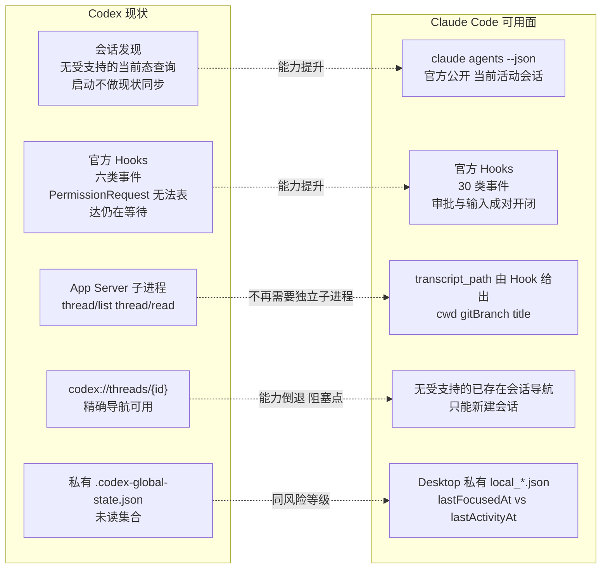
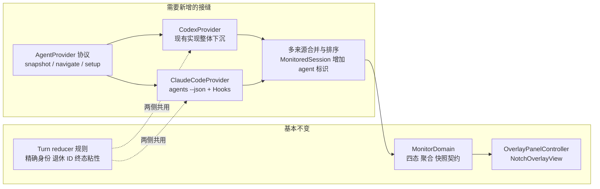

# 扩展支持 Claude Code（Desktop + CLI）技术探索

| 字段 | 内容 |
| --- | --- |
| 文档状态 | 可行性调研；不是实现决策，未改动任何生产代码 |
| 首次记录 | 2026-08-15 |
| 探索点 | 让当前只服务 Codex Desktop 的顶部监视器同时汇总 Claude Code 会话 |
| 目标读者 | 后续负责决策、spike 和实现的 Agent 与产品负责人 |
| 验证基线 | Claude Desktop `1.30096.5`（bundle `com.anthropic.claudefordesktop`），内置 Claude Code CLI `2.1.229`，macOS `Darwin 25.5.0`，验证日期 `2026-08-15` |
| 当前结论 | **状态汇总可行且比 Codex 更容易；精确导航当前无受支持实现，是唯一的产品级阻塞点** |

> 目录约定沿用 [`shared-app-server/README.md`](../shared-app-server/README.md)：每个探索点独立二级目录，后续实验记录追加到本文第 10 节，不覆盖早期证据。

## 1. 文档目的

本文回答一个问题：把 Codex in Notch 扩展成同时监视 Claude Code（Desktop 与 CLI）的多智能体中心，技术上是否成立、代价在哪里、哪些能力现在还不存在。

它记录：

- 本机实测确认的 Claude Code 集成能力，以及每项能力是官方公开还是私有观察；
- 与当前 Codex 集成路径的逐项对照，指出哪些现有难题在 Claude Code 侧消失、哪些新难题出现；
- 现有架构需要的抽象改动范围；
- 分阶段验证计划与 NO-GO 条件；
- 必须由产品拍板的决策点。

本文不主张立即实现。除只读检查与一次 deep link 探测外，本次调研没有修改任何配置、代码或用户状态。

## 2. 结论摘要

| 维度 | 判定 | 依据 |
| --- | --- | --- |
| 会话发现 | **优于 Codex。** 官方公开命令直接枚举当前活动会话 | `claude agents --json` 返回 `pid / cwd / kind / startedAt / sessionId / name` |
| 启动现状同步 | **优于 Codex。** 当前的“启动不做现状同步”限制在 Claude Code 侧不存在 | 同上；启动即可知道有哪些会话在跑 |
| 生命周期状态 | **优于 Codex。** Hook 事件集更细、身份字段更全 | 官方 Hooks 提供 `PermissionRequest` / `PermissionDenied` / `Notification(permission_prompt)` / `Elicitation` 成对事件 |
| 子智能体过滤 | **优于 Codex。** 精确而非推断 | Hook payload 带 `agent_id` / `agent_type` |
| Desktop + CLI 统一 | **成立。** 一次集成覆盖两者 | Desktop 启动的就是同一个 CLI 二进制，且带 `--setting-sources=user,project,local` |
| 会话标题与元数据 | **成立。** 路径由官方 Hook payload 给出 | `transcript_path`、`cwd`；标题需解析 JSONL（格式非公开） |
| **精确导航** | **当前不可行。** 无任何受支持接口能聚焦已存在的会话 | 官方 deep link 只能新建会话；`claude://code/sessions/local_…` 实测被拒 |
| 已读自动移除 | 私有只读可行，风险等级与现有 Codex 未读适配器相同 | Desktop 侧 `lastFocusedAt` / `lastActivityAt` |
| 额度圆环 | Desktop 用户可行；纯 CLI 用户无等价数据源 | `plan-usage-history.json` 属于 Claude Desktop 私有状态 |

**总判断：** 除导航外，Claude Code 的集成面比 Codex 更宽、更公开、更容易做对。产品价值主张里“快速跳回会话”这一半目前没有落点，这是决定要不要做的关键，而不是工程难度。

## 3. 与当前 Codex 路径的对照



值得注意的是三个当前架构里最贵的设计，在 Claude Code 侧都可以变简单：

1. **独立 App Server 子进程**（`CodexAppServerClient.swift` 全部 860 行、NDJSON 分帧、超时探活、传输重建）在 Claude Code 侧没有对应必需品。会话集合来自一条 0.2 秒返回的官方命令，标题与元数据来自 Hook 直接给出的 `transcript_path`。
2. **启动 cutoff 的能力边界**（见 [`system-architecture.md` §2.1](../../system-architecture.md)）在 Claude Code 侧不成立，因为存在受支持的“此刻有哪些会话”查询。
3. **`PermissionRequest` 只证明管线跑过、不能表达仍在等待**（当前 Approval needed 只能由 `request_user_input` 之外的显式证据产生）在 Claude Code 侧有直接解法：`PermissionRequest` 带 `tool_use_id`，`PermissionDenied` 与后续 `PreToolUse` 用同一 `tool_use_id` 关闭它，与现有 reducer 的成对开闭模型完全同构。

## 4. 已验证事实

以下每一条都在本机实测过。版本变化后必须重新验证。

### 4.1 会话发现（官方公开）

官方 CLI 文档公开 `claude agents --json`，实测输出：

```json
[
  {
    "pid": 91157,
    "cwd": "/Users/yinfenglu/Projects/codex-in-notch",
    "kind": "interactive",
    "startedAt": 1786832578142,
    "sessionId": "45510eae-d774-464e-bff9-972b2c28bae5",
    "name": "codex-in-notch-f6"
  }
]
```

要点：

- 文档把该命令描述为“监视并派发并行后台会话”，但**实测同时返回 `kind: interactive` 的交互式会话**，包括由 Claude Desktop 托管的会话。这是本次调研最重要的单条发现。
- 支持 `--all`（含已完成的后台会话）与 `--cwd <path>`。
- 三次计时均为 0.19–0.26 秒。作为 1 秒轮询偏重，作为 5 秒轮询或事件触发后的权威读取合适。
- 同一信息也存在于 `~/.claude/sessions/<pid>.json`（额外含 `entrypoint`、`kind`、`version`、`messagingSocketPath`）。该文件由 `claude` 进程自己持有（`lsof` 确认 pid 91157 持有 `/tmp/cc-socks/91157.sock`），**因此终端启动的 CLI 会话与 Desktop 托管会话使用同一套注册机制**。该文件格式未公开，只应作为“何时该重新查询官方命令”的 watcher 输入，不应作为数据来源。

### 4.2 生命周期事件（官方公开）

官方 Hooks 文档公开 30 个事件、配置文件位置与 payload 字段。与本产品直接相关的映射：

| 产品状态 | Claude Code 证据 | 关闭条件 |
| --- | --- | --- |
| Running | `UserPromptSubmit`（带 `user_message`、`is_continuation`） | 后续状态事件 |
| Approval needed | `PermissionRequest`（带 `tool_use_id`） | 同 `tool_use_id` 的 `PermissionDenied` 或 `PreToolUse`/`PostToolUse` |
| Input needed | `Notification(notification_type: idle_prompt / agent_needs_input)`、`Elicitation` | `ElicitationResult`、`Notification(elicitation_complete)` |
| Completed | `Stop`（带 `last_assistant_message`）、`StopFailure`（带 `error_type`） | 终态粘性 |
| 会话消失 | `SessionEnd`（带 `session_end_reason`） | — |

关键结构性优势：

- **`prompt_id`（v2.1.196+，当前 2.1.229 满足）是 `turn_id` 的直接对应物。** 现有 `HookTurnState` 的“精确 `threadID + turnID` 身份 + 退休 ID 不可复活”规则可以原样保留。
- **`agent_id` / `agent_type` 在子智能体上下文中存在。** 现有产品要求“子智能体不显示为独立行”，在 Codex 侧靠推断，在这里是精确过滤。
- **Hook 配置是热加载的。** 官方文档明确“对 settings 文件中 hooks 的直接编辑通常由 file watcher 自动生效”，不需要重启会话。
- **存在 `http` 类型 hook 与 `async: true`。** 意味着可以让 Claude Code 直接 POST 到应用内的 loopback listener，不需要 Codex 侧那套 “Python helper 写 0600 事件文件 + 应用轮询消费” 的落盘管线，且 `async` 保证不阻塞用户的会话。这是一条值得单独评估的实现路线（见 §6.2）。

**待验证：** Hook 是否确实在 Desktop 托管的会话中触发。间接证据很强——Desktop 启动 CLI 时实测带 `--setting-sources=user,project,local`，即显式加载用户级 `~/.claude/settings.json`，且 `--settings {"fastMode":false}` 这一 inline override 不含 `disableAllHooks`。但本次调研**没有**写入任何 hook 配置去实证，因为那会修改用户配置。这是 Phase 0 的第一项。

### 4.3 会话身份与元数据

- 每个 Hook payload 都带 `session_id`、`transcript_path`、`cwd`、`permission_mode`。**路径由官方接口给出**，不需要猜测。
- transcript JSONL 中存在 `custom-title`、`ai-title`、`last-prompt` 记录，以及每条记录上的 `cwd`、`gitBranch`、`version`、`isSidechain`。标题、Project 归属与预览都可以从这里取。
- **但 JSONL 的记录结构本身不是公开契约。** 解析它属于私有依赖，需要按 [`AGENTS.md`](../../../AGENTS.md) 登记，并对缺失/损坏 fail closed。
- Project 概念在 Claude Code 侧没有 Codex 那样的用户创建实体。可用的等价物是 `cwd` + `gitBranch`，或 `claude agents --json` 返回的 `name`（实测为 `codex-in-notch-f6` 这类从目录派生的名字，`nameSource: derived`）。这与当前 PRD “禁止从 cwd、Git 根目录或路径最后一级推导 Project” 的规则直接冲突，需要产品决策（见 §8）。

### 4.4 导航（阻塞点）

**结论：当前没有任何受支持的方式聚焦一个已经存在的 Claude Code 会话。**

官方证据：

- [Deep links 文档](https://code.claude.com/docs/en/deep-links) 定义的唯一路径是 `claude-cli://open`，参数只有 `q`（预填 prompt）、`cwd`、`repo`。它**总是新开一个终端窗口和新会话**，不接受会话 ID。
- Claude Desktop 侧公开的是 `claude://code/new`（可带 `?q=`、`?folder=`、`?file=`），同样只新建。

本机实测：

```text
open "claude://code/sessions/local_5ddb387b-66f4-4356-80f0-713248074c23"
→ main.log: [warn] claudeURLHandler: unrecognized code path { pathname: '/sessions/local_...' }
```

对安装包的只读检查显示 `/code/sessions/…` 路由在实现中确实存在，但它被 feature gate 保护，且其 ID 校验为 `/^(cse|session)_/`——即面向云端/远程会话 ID，本地会话的 `local_` 前缀不匹配。用 `cse_` 前缀的探测 ID 同样被拒，说明还有更严格的形状校验。**这是安装包实现细节，不是产品契约，不得据此实现。** 它唯一的价值是提示：本地会话 deep link 未来有可能出现，值得在每次 Desktop 更新后复查。

现有可行的替代路径，全部有代价：

| 路径 | 覆盖 | 代价 |
| --- | --- | --- |
| 只激活 Claude.app | Desktop 会话 | 用户仍需自己在侧边栏找会话；退化为“打开应用”而非“跳回会话” |
| pid → tty → Apple Events 聚焦终端标签页 | CLI 会话 | 需要 Automation（Apple Events）授权；需要逐个适配 iTerm2 / Terminal.app / Ghostty / kitty / WezTerm；PRD 现有约束只排除了辅助功能与屏幕录制权限，Apple Events 是否可接受需产品拍板 |
| Accessibility API 点击 Desktop 侧边栏 | Desktop 会话 | **与 PRD “不申请辅助功能权限” 直接冲突，本文不建议** |
| 等待官方提供本地会话 deep link | 两者 | 时间不可控 |

进程祖先链可以公开地区分两类宿主，实测：

```text
91157 (claude) → 91156 (Claude.app/Contents/Helpers/disclaimer) → 39127 (Claude.app)
```

即用 `ps -o ppid=` 向上走即可判定“Desktop 托管”还是“某个终端里的 CLI”，不需要读私有文件。

### 4.5 已读与自动移除

Claude Desktop 在 `~/Library/Application Support/Claude/claude-code-sessions/<org>/<account>/local_<uuid>.json` 中保存每个会话的：

```text
sessionId / cliSessionId / cwd / title / titleSource /
createdAt / lastFocusedAt / lastActivityAt / isArchived /
completedTurns / model / permissionMode
```

`lastActivityAt > lastFocusedAt` 是“未读”的自然等价物，`isArchived` 直接对应归档。`cliSessionId` 字段还提供了 Hook 的 `session_id` ↔ Desktop 会话 ID 的映射。

风险等级与现有 Codex 未读适配器完全相同：私有只读 schema、高版本风险、必须 fail closed。纯 CLI 会话没有任何已读概念，其终态行只能靠手动 dismiss 或下一次 `UserPromptSubmit` 移除——`MonitorStore` 已有 dismissed-row 机制可复用。

### 4.6 额度

`~/Library/Application Support/Claude/plan-usage-history.json` 形如：

```json
{"version": 2, "samples": [{"t": 1786821640117, "org": "…", "u": {"fh": 3, "sd": 0}}]}
```

`fh` / `sd` 与官方 `/usage` 展示的滚动窗口对应（推测为 5 小时 / 7 天用量百分比，**未验证**）。这是 Claude Desktop 私有状态，纯 CLI 用户没有该文件。若 V1 要求额度圆环对 Claude Code 也成立，需要接受“仅 Desktop 用户可用，其余显示不可用”。

## 5. 对现有架构的影响

好消息是领域层几乎不需要动。`MonitorDomain.swift` 里的 `SessionStatus` 四态、`MonitorAvailability`、`MonitoredSession`、`MonitorAggregation` 都不含任何 Codex 语义；`HookEventRepository` 的事件 schema 与 Claude Code 的 payload 近乎逐字段对应：

| 现有 `HookEvent` 字段 | Claude Code 对应 |
| --- | --- |
| `session_id` | `session_id` |
| `turn_id` | `prompt_id` |
| `hook_event_name` | `hook_event_name` |
| `tool_use_id` | `tool_use_id` |
| `prompt` | `user_message` |
| `last_assistant_message` | `last_assistant_message` |

需要改动的边界：



具体改动清单：

1. **`CodexMonitoring` 升级为多提供者协议。** 现有 8 个方法（`fetchSnapshot` / `hookSetupStatus` / `installHooks` / `removeHooks` / `clearSessions` / `updateHookSettings` / `disconnect`）本身就是通用形状，需要的是允许多个实例并存并合并快照。
2. **`MonitoredSession` 增加来源标识**，用于行内图标、聚合与导航分发。当前 `id` 为 `threadID:turnID`，跨来源需要加前缀避免碰撞。
3. **`CodexNavigating` 拆成按来源分发的导航器**，且必须允许“导航能力不可用”这一状态——这是 Codex 侧从未出现过的情况，UI 需要新的表达（例如行可点但只激活应用，或行明确标记不可跳转）。
4. **`MonitorStatus` 的展示字符串去 Codex 化**（`"Connecting to Codex"`、`"Update Codex"`、`"Codex disconnected"`），改为按来源渲染。
5. **`CodexAppServerClient` 保持 Codex 专属**，不进入通用层。Claude Code 侧不需要等价物。
6. **产品命名。** 仓库、App、bundle 与 UI 文案目前整体叫 Codex in Notch，扩展后需要重新命名决策。

## 6. 实现路线

### 6.1 路线 A：文件事件 + 官方命令（推荐首选）

沿用当前架构已经验证过的形状：

- 用 `DispatchSourceFileSystemObject` + 250 ms debounce 监听 `~/.claude/sessions/` 目录（该模式在 `CodexDesktopUnreadState.swift` 已有实现）。
- 目录变化或定时到期时执行 `claude agents --json`，作为会话集合的**权威**来源。
- Hook 事件仍走现有落盘管线（helper 脚本原子写 0600 事件文件 → `HookEventRepository` 消费），只需替换字段映射与 hook 定义。

优点：与现有代码同构、无新权限、无常驻端口、失败面已知。
代价：多一次进程启动（约 0.2 秒），不适合 1 秒轮询。

### 6.2 路线 B：`http` hook + 应用内 loopback listener

Claude Code 支持 `type: "http"` 的 hook，直接把事件 POST 到指定 URL，配合 `async: true` 不阻塞会话。

优点：零落盘、零轮询延迟、不需要安装任何 helper 脚本，事件到 UI 的延迟只受 HTTP 往返限制。
代价：应用需要监听 loopback 端口并处理鉴权（`headers` 支持 `$VAR` 插值，可配合 `allowedEnvVars` 下发一次性 token）；端口占用、防火墙提示与"本地服务"心智负担都是新的；崩溃后 hook 会静默失败（非 2xx 按非阻塞错误处理，对用户无害但会丢事件）。

**建议：** 先用路线 A 做 spike 证明状态模型成立，路线 B 作为延迟优化的后续选项，不在第一版引入。

## 7. 分阶段验证计划

每阶段完成后记录证据再决定是否继续。任何阶段观察到会话行为变化、审批阻塞或配置损坏，立即停止并回滚。

### Phase 0：确认 Hook 在两种宿主中都触发（必须最先做）

目标：证明写入 `~/.claude/settings.json` 的用户级 hook 对 Desktop 托管会话与终端 CLI 会话都生效。

执行前必须获得用户明确授权，因为这会修改用户的 Claude Code 配置。

1. 备份现有 `~/.claude/settings.json`（本机当前**不存在**该文件，需注意首次创建与后续合并的差异）。
2. 安装一个只做 append 的最小 hook：`UserPromptSubmit`、`PermissionRequest`、`Stop`、`SessionEnd` 各一条，写入临时目录。
3. 在 Claude Desktop 中发起一轮对话，确认四类事件是否到达。
4. 在终端 `claude` 中重复同一验证。
5. 确认热加载：不重启会话直接改 hook 定义，观察是否生效。
6. 确认 workspace trust 的实际影响：官方文档说明 settings 文件中的 hooks 需要接受 workspace trust 对话框，需实测新增 hook 是否触发新的信任提示。
7. 完整移除 hook，确认配置恢复原状。

**停止条件：** Desktop 会话收不到 hook；或安装 hook 会让用户在每个项目重新走信任流程。

### Phase 1：会话集合与身份

1. 多会话并发下验证 `claude agents --json` 的完整性（Desktop 两个 + 终端一个 + 后台 agent 一个）。
2. 验证 `sessionId` 与 Hook 的 `session_id` 一致。
3. 验证 `prompt_id` 在同一会话连续多轮中确实变化，且不复用。
4. 验证子智能体事件带 `agent_id` / `agent_type`，可被正确过滤。
5. 验证会话结束后从 `agents --json` 中消失的时机。

### Phase 2：四态状态矩阵

在 `HookEventRepository` 的现有规则下重放真实事件序列，覆盖：

| 场景 | 必须观察到 | 不允许发生 |
| --- | --- | --- |
| 正常完成 | `UserPromptSubmit → Stop` | 出现第五种可见状态 |
| 权限审批 | `PermissionRequest` 开、同 `tool_use_id` 关 | 无真实等待时显示 Approval needed |
| 审批被拒 | `PermissionDenied` 关闭等待 | 等待悬挂 |
| 需要输入 | `Elicitation → ElicitationResult` 成对 | 用无关事件清除等待 |
| 请求失败 | `StopFailure` 直接进 Completed | 展示 `error_type` 细节 |
| 同会话下一轮 | 新 `prompt_id` 原子替换 | 旧 `prompt_id` 复活 |
| 压缩 | `PreCompact` / `PostCompact` 不改变状态 | 被误判为终态 |
| 会话结束 | `SessionEnd` 移除行 | 行残留 |

建议最低重复次数与 `shared-app-server` 探索一致：正常完成 30 次，审批合计 30 次，输入 20 次，失败与并发各至少 10 次。

### Phase 3：导航（决定性阶段）

在做任何实现之前先回答产品问题（见 §8）。若产品接受降级导航：

1. 实测 pid → tty → Apple Events 聚焦终端标签页，在 iTerm2 与 Terminal.app 上验证。
2. 记录 Automation 权限提示的实际形态与用户成本。
3. 对 Desktop 会话，确认“仅激活应用”是否达到可接受的产品体验。
4. 每次 Claude Desktop 更新后复查 `/code/sessions/` 路由是否开始接受本地会话 ID。

### Phase 4：已读、额度与降级

1. 验证 `lastFocusedAt` / `lastActivityAt` 的更新时机与节流延迟（Codex 侧观察到约 500 ms 持久化延迟，此处需重新测量）。
2. 验证 `plan-usage-history.json` 的 `fh` / `sd` 与官方 `/usage` 显示是否一致。
3. 验证 Claude Code 未安装、版本过低、hook 未信任三种情况下的降级表现。

## 8. 必须由产品决定的问题

工程上这些都能做，但它们改变产品定义，不应由实现方替用户决定：

1. **导航降级是否可接受？** 当前 PRD 第 3 条目标是“让用户点击任意会话行后进入完全相同的会话”，并且 ADR-0004 把精确导航列为发布门槛。Claude Code 侧现在做不到。可选：(a) 仅激活应用；(b) 对 CLI 会话用 Apple Events 聚焦终端；(c) 在官方支持出现前不做 Claude Code。
2. **是否接受申请 Automation（Apple Events）权限？** PRD 明确排除辅助功能与屏幕录制，未提及 Apple Events。这是 CLI 会话精确导航的唯一非 GUI-自动化路径。
3. **Project 语义怎么定义？** Codex 侧有用户创建的 Project 实体且明令禁止从 cwd 推导。Claude Code 侧不存在该实体，只有 `cwd` / `gitBranch` / 派生 `name`。要么为 Claude Code 行放宽规则，要么该列显示为不适用。
4. **额度只对 Desktop 用户可用是否可接受？**
5. **产品命名与定位。** 从 “Codex in Notch” 变成多智能体中心，仓库名、App 名、bundle id、UI 文案与引导流程都要重做。
6. **两侧状态语义是否强行对齐？** Claude Code 能提供比四态更细的信息（如 `StopFailure` 的 `error_type`）。保持四态可以复用整条链路，但会丢弃真实可用的信息。

## 9. NO-GO 条件

出现任一条件即不应把该方案产品化：

- Phase 0 证明用户级 hook 对 Desktop 托管会话不生效，且没有其他官方事件源。
- 安装 hook 会导致用户在每个项目重新走 workspace trust 流程，形成不可接受的安装摩擦。
- 产品判定“无法精确跳回会话”使该来源失去核心价值。
- 唯一可行的导航实现需要辅助功能权限或 GUI 自动化。
- 需要修改 `Claude.app`、`app.asar`、注入 Electron IPC，或连接 `/tmp/cc-socks/*.sock` 这类未公开的会话间消息通道来获取状态或导航。
- 官方后续移除 `claude agents --json` 对交互式会话的可见性，退回到与 Codex 相同的“无法查询当前态”。

## 10. 探索记录

沿用 [`shared-app-server/README.md` §14](../shared-app-server/README.md) 的模板，后续追加，不覆盖早期证据。

### 2026-08-15 — 初次可行性调研（只读）

- 执行范围：本机只读检查 + 一次 `claude://` deep link 探测 + 两次 `claude agents --json`
- Claude Desktop：`1.30096.5`，bundle `com.anthropic.claudefordesktop`
- 内置 Claude Code CLI：`2.1.229`
- macOS：`Darwin 25.5.0`
- 未修改：任何配置、任何生产代码、任何用户状态
- 结果：状态汇总 PASS（证据见 §4.1–4.3）；精确导航 **FAIL**（§4.4）
- 未验证项：Hook 在 Desktop 托管会话中的实际触发（Phase 0）；`fh` / `sd` 的确切窗口语义；`lastFocusedAt` 更新时机
- 下一步建议：先做 §8 的产品决策 1 与 2，再决定是否投入 Phase 0

## 11. 参考入口

- 官方 Claude Code Hooks：<https://code.claude.com/docs/en/hooks>
- 官方 CLI 参考（含 `claude agents --json`）：<https://code.claude.com/docs/en/cli-reference>
- 官方 Deep links：<https://code.claude.com/docs/en/deep-links>
- 官方 Desktop 应用：<https://code.claude.com/docs/en/desktop>
- 当前领域状态：[`MonitorDomain.swift`](../../../CodexInNotch/CodexInNotch/MonitorDomain.swift)
- 当前 Hook reducer 与安装器：[`HookIntegration.swift`](../../../CodexInNotch/CodexInNotch/HookIntegration.swift)
- 当前编排器：[`LiveCodexMonitorService.swift`](../../../CodexInNotch/CodexInNotch/LiveCodexMonitorService.swift)
- 当前导航：[`CodexDesktopNavigator.swift`](../../../CodexInNotch/CodexInNotch/CodexDesktopNavigator.swift)
- 当前架构：[`system-architecture.md`](../../system-architecture.md)
- 非公开依赖登记规则：[`AGENTS.md`](../../../AGENTS.md)
