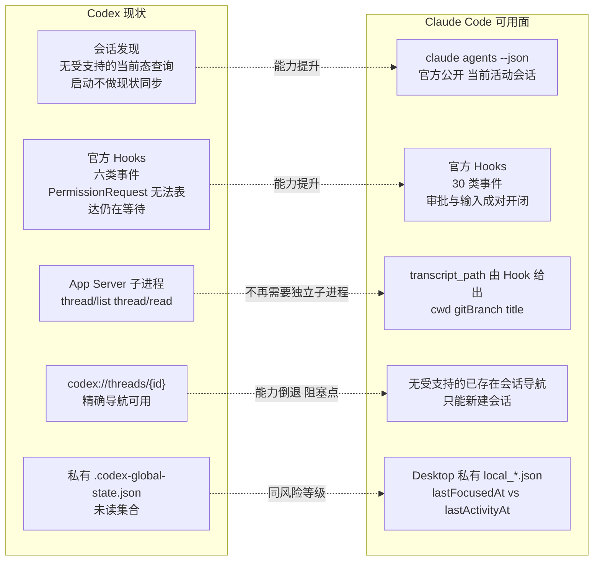
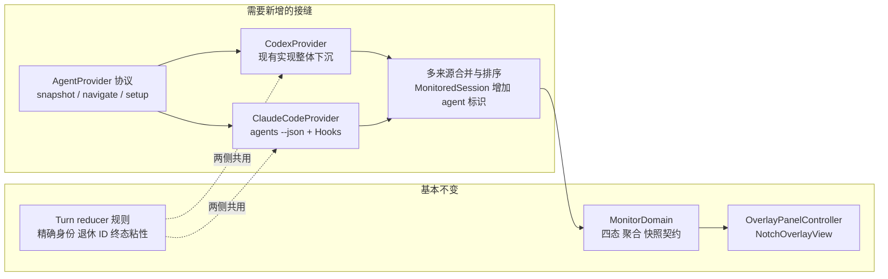
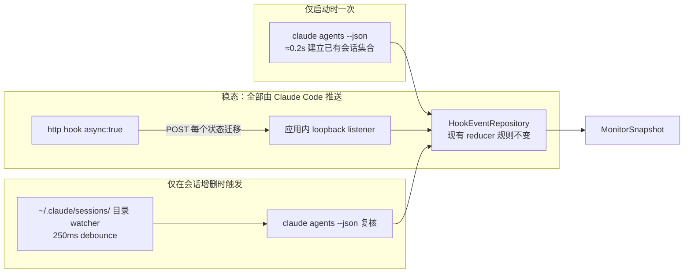

# 扩展支持 Claude Code（Desktop + CLI）技术探索

| 字段 | 内容 |
| --- | --- |
| 文档状态 | 可行性调研；不是实现决策，未改动任何生产代码 |
| 首次记录 | 2026-08-15 |
| 探索点 | 让当前只服务 Codex Desktop 的顶部监视器同时汇总 Claude Code 会话 |
| 目标读者 | 后续负责决策、spike 和实现的 Agent 与产品负责人 |
| 验证基线 | Claude Desktop `1.30096.5`（bundle `com.anthropic.claudefordesktop`），内置 Claude Code CLI `2.1.229`，macOS `Darwin 25.5.0`，验证日期 `2026-08-15` |
| 当前结论 | **可行，且 Phase 0 的存亡问题已闭合。** 用户级 hook 在 Desktop 托管会话中确实触发（2026-08-16 实测，§10）。`http` 通道可用，但 `SessionEnd` 必须排除在 http 之外。导航按产品决策降级 |
| 产品决策 | 已于 2026-08-15 确定：导航降级可接受；Apple Events 权限可接受（见 §8） |

> 目录约定沿用 [`shared-app-server/README.md`](../shared-app-server/README.md)：每个探索点独立二级目录，后续实验记录追加到本文第 10 节，不覆盖早期证据。

## 1. 文档目的

本文回答一个问题：把 Codex in Notch 扩展成同时监视 Claude Code（Desktop 与 CLI）的多智能体中心，技术上是否成立、代价在哪里、哪些能力现在还不存在。

它记录：

- 本机实测确认的 Claude Code 集成能力，以及每项能力是官方公开还是私有观察；
- 与当前 Codex 集成路径的逐项对照，指出哪些现有难题在 Claude Code 侧消失、哪些新难题出现；
- 现有架构需要的抽象改动范围；
- 分阶段验证计划与 NO-GO 条件；
- 必须由产品拍板的决策点。

本文不主张立即实现。除只读检查与一次 deep link 探测外，本次调研没有修改任何配置、代码或用户状态。

## 2. 结论摘要

| 维度 | 判定 | 依据 |
| --- | --- | --- |
| 会话发现 | **优于 Codex。** 官方公开命令直接枚举当前活动会话 | `claude agents --json` 返回 `pid / cwd / kind / startedAt / sessionId / name` |
| 启动现状同步 | **优于 Codex。** 当前的“启动不做现状同步”限制在 Claude Code 侧不存在 | 同上；启动即可知道有哪些会话在跑 |
| 生命周期状态 | **优于 Codex。** Hook 事件集更细、身份字段更全 | 官方 Hooks 提供 `PermissionRequest` / `PermissionDenied` / `Notification(permission_prompt)` / `Elicitation` 成对事件 |
| 子智能体过滤 | **优于 Codex。** 精确而非推断 | Hook payload 带 `agent_id` / `agent_type` |
| Desktop + CLI 统一 | **成立。** 一次集成覆盖两者 | Desktop 启动的就是同一个 CLI 二进制，且带 `--setting-sources=user,project,local` |
| 会话标题与元数据 | **成立。** 路径由官方 Hook payload 给出 | `transcript_path`、`cwd`；标题需解析 JSONL（格式非公开） |
| **精确导航** | **不可行，已决定降级。** 无任何受支持接口能聚焦已存在的会话 | 官方 deep link 只能新建会话；`claude://code/sessions/local_…` 实测被拒 |
| 原生实时状态源 | **不存在。** Hook 是唯一受支持的状态推送通道 | 五个候选源全部只描述身份或已发生的事实，见 §4.7 |
| 实现整洁度 | **可优于 Codex 侧。** 稳态零轮询、零落盘、无 helper 脚本 | `http` hook 直推 loopback listener + 事件驱动的会话发现，见 §6 |
| 已读自动移除 | 私有只读可行，风险等级与现有 Codex 未读适配器相同 | Desktop 侧 `lastFocusedAt` / `lastActivityAt` |
| 额度圆环 | Desktop 用户可行；纯 CLI 用户无等价数据源 | `plan-usage-history.json` 属于 Claude Desktop 私有状态 |

**总判断：** 除导航外，Claude Code 的集成面比 Codex 更宽、更公开、更容易做对。产品价值主张里“快速跳回会话”这一半目前没有落点，这是决定要不要做的关键，而不是工程难度。

## 3. 与当前 Codex 路径的对照



值得注意的是三个当前架构里最贵的设计，在 Claude Code 侧都可以变简单：

1. **独立 App Server 子进程**（`CodexAppServerClient.swift` 全部 860 行、NDJSON 分帧、超时探活、传输重建）在 Claude Code 侧没有对应必需品。会话集合来自一条 0.2 秒返回的官方命令，标题与元数据来自 Hook 直接给出的 `transcript_path`。
2. **启动 cutoff 的能力边界**（见 [`system-architecture.md` §2.1](../../system-architecture.md)）在 Claude Code 侧不成立，因为存在受支持的“此刻有哪些会话”查询。
3. ~~**`PermissionRequest` 只证明管线跑过、不能表达仍在等待**在 Claude Code 侧有直接解法。~~ **这一条是错的**（2026-08-16 实测，见 §10）：`PermissionRequest` 不带 `tool_use_id`，所以 Codex 侧「借用仍打开的调用 id」的模型在这里原样保留，这个难题并没有消失。真正消失的是另一半——`PermissionDenied` **带** `tool_use_id`，拒绝因此能被精确关闭，不再有 Codex 侧那 67 秒的悬挂。

## 4. 已验证事实

以下每一条都在本机实测过。版本变化后必须重新验证。

### 4.1 会话发现（官方公开）

官方 CLI 文档公开 `claude agents --json`，实测输出：

```json
[
  {
    "pid": 91157,
    "cwd": "/Users/yinfenglu/Projects/codex-in-notch",
    "kind": "interactive",
    "startedAt": 1786832578142,
    "sessionId": "45510eae-d774-464e-bff9-972b2c28bae5",
    "name": "codex-in-notch-f6"
  }
]
```

要点：

- `claude agents --help` 明确写明 `--json` 的作用是 “Print active sessions (interactive and background) as a JSON array and exit (for scripting; does not require a TTY)”。**交互式会话可见是文档承诺，不是观察到的巧合**，包括由 Claude Desktop 托管的会话。这是本次调研最重要的单条发现。
- **该命令不返回任何状态字段。** 在本会话正处于处理中时执行，输出与空闲时完全一致。它是身份的权威来源，不是状态的来源（见 §4.7）。
- 支持 `--all`（含已完成的后台会话）与 `--cwd <path>`。
- 三次计时均为 0.19–0.26 秒。作为 1 秒轮询偏重，作为 5 秒轮询或事件触发后的权威读取合适。
- 同一信息也存在于 `~/.claude/sessions/<pid>.json`（额外含 `entrypoint`、`kind`、`version`、`messagingSocketPath`）。该文件由 `claude` 进程自己持有（`lsof` 确认 pid 91157 持有 `/tmp/cc-socks/91157.sock`），**因此终端启动的 CLI 会话与 Desktop 托管会话使用同一套注册机制**。该文件格式未公开，只应作为“何时该重新查询官方命令”的 watcher 输入，不应作为数据来源。

### 4.2 生命周期事件（官方公开）

官方 Hooks 文档公开 30 个事件、配置文件位置与 payload 字段。与本产品直接相关的映射：

| 产品状态 | Claude Code 证据 | 关闭条件 |
| --- | --- | --- |
| Running | `UserPromptSubmit`（实测字段为 `prompt`，`source` 可选且 `-p` 运行中缺席） | 后续状态事件 |
| Approval needed | `PermissionRequest`（**实测不带 `tool_use_id`**，见 §10 2026-08-16） | 借用仍打开的调用 id，由同 `tool_use_id` 的 `PostToolUse` 或 `PermissionDenied` 关闭 |
| Input needed | `Notification(notification_type: idle_prompt / agent_needs_input)`、`Elicitation` | `ElicitationResult`、`Notification(elicitation_complete)` |
| Completed | `Stop`（带 `last_assistant_message`、`background_tasks`）、`StopFailure`（字段名是 `error`，非 `error_type`） | 终态粘性 |
| 会话消失 | `SessionEnd`（字段名是 `reason`） | — |

关键结构性优势：

- **`prompt_id`（v2.1.196+，当前 2.1.229 满足）是 `turn_id` 的直接对应物。** 现有 `HookTurnState` 的“精确 `threadID + turnID` 身份 + 退休 ID 不可复活”规则可以原样保留。
- **`agent_id` / `agent_type` 在子智能体上下文中存在。** 现有产品要求“子智能体不显示为独立行”，在 Codex 侧靠推断，在这里是精确过滤。
- **Hook 配置是热加载的。** 官方文档明确“对 settings 文件中 hooks 的直接编辑通常由 file watcher 自动生效”，不需要重启会话。
- **存在 `http` 类型 hook 与 `async: true`。** 意味着可以让 Claude Code 直接 POST 到应用内的 loopback listener，不需要 Codex 侧那套 “Python helper 写 0600 事件文件 + 应用轮询消费” 的落盘管线，且 `async` 保证不阻塞用户的会话。这是一条值得单独评估的实现路线（见 §6.2）。

**待验证：** Hook 是否确实在 Desktop 托管的会话中触发。间接证据很强——Desktop 启动 CLI 时实测带 `--setting-sources=user,project,local`，即显式加载用户级 `~/.claude/settings.json`，且 `--settings {"fastMode":false}` 这一 inline override 不含 `disableAllHooks`。但本次调研**没有**写入任何 hook 配置去实证，因为那会修改用户配置。这是 Phase 0 的第一项。

### 4.3 会话身份与元数据

- 每个 Hook payload 都带 `session_id`、`transcript_path`、`cwd`、`permission_mode`。**路径由官方接口给出**，不需要猜测。
- transcript JSONL 中存在 `custom-title`、`ai-title`、`last-prompt` 记录，以及每条记录上的 `cwd`、`gitBranch`、`version`、`isSidechain`。标题、Project 归属与预览都可以从这里取。
- **但 JSONL 的记录结构本身不是公开契约。** 解析它属于私有依赖，需要按 [`AGENTS.md`](../../../AGENTS.md) 登记，并对缺失/损坏 fail closed。
- Project 概念在 Claude Code 侧没有 Codex 那样的用户创建实体。可用的等价物是 `cwd` + `gitBranch`，或 `claude agents --json` 返回的 `name`（实测为 `codex-in-notch-f6` 这类从目录派生的名字，`nameSource: derived`）。这与当前 PRD “禁止从 cwd、Git 根目录或路径最后一级推导 Project” 的规则直接冲突，需要产品决策（见 §8）。

### 4.4 导航（已决定降级，见 §8.1）

**结论：当前没有任何受支持的方式聚焦一个已经存在的 Claude Code 会话。**

官方证据：

- [Deep links 文档](https://code.claude.com/docs/en/deep-links) 定义的唯一路径是 `claude-cli://open`，参数只有 `q`（预填 prompt）、`cwd`、`repo`。它**总是新开一个终端窗口和新会话**，不接受会话 ID。
- Claude Desktop 侧公开的是 `claude://code/new`（可带 `?q=`、`?folder=`、`?file=`），同样只新建。

本机实测：

```text
open "claude://code/sessions/local_5ddb387b-66f4-4356-80f0-713248074c23"
→ main.log: [warn] claudeURLHandler: unrecognized code path { pathname: '/sessions/local_...' }
```

对安装包的只读检查显示 `/code/sessions/…` 路由在实现中确实存在，但它被 feature gate 保护，且其 ID 校验为 `/^(cse|session)_/`——即面向云端/远程会话 ID，本地会话的 `local_` 前缀不匹配。用 `cse_` 前缀的探测 ID 同样被拒，说明还有更严格的形状校验。**这是安装包实现细节，不是产品契约，不得据此实现。** 它唯一的价值是提示：本地会话 deep link 未来有可能出现，值得在每次 Desktop 更新后复查。

现有可行的替代路径，全部有代价：

| 路径 | 覆盖 | 代价 |
| --- | --- | --- |
| 只激活 Claude.app | Desktop 会话 | 用户仍需自己在侧边栏找会话；退化为“打开应用”而非“跳回会话” |
| pid → tty → Apple Events 聚焦终端标签页 | CLI 会话 | 需要 Automation（Apple Events）授权；需要逐个适配 iTerm2 / Terminal.app / Ghostty / kitty / WezTerm；PRD 现有约束只排除了辅助功能与屏幕录制权限，Apple Events 是否可接受需产品拍板 |
| Accessibility API 点击 Desktop 侧边栏 | Desktop 会话 | **与 PRD “不申请辅助功能权限” 直接冲突，本文不建议** |
| 等待官方提供本地会话 deep link | 两者 | 时间不可控 |

进程祖先链可以公开地区分两类宿主，实测：

```text
91157 (claude) → 91156 (Claude.app/Contents/Helpers/disclaimer) → 39127 (Claude.app)
```

即用 `ps -o ppid=` 向上走即可判定“Desktop 托管”还是“某个终端里的 CLI”，不需要读私有文件。

### 4.5 已读与自动移除

Claude Desktop 在 `~/Library/Application Support/Claude/claude-code-sessions/<org>/<account>/local_<uuid>.json` 中保存每个会话的：

```text
sessionId / cliSessionId / cwd / title / titleSource /
createdAt / lastFocusedAt / lastActivityAt / isArchived /
completedTurns / model / permissionMode
```

`lastActivityAt > lastFocusedAt` 是“未读”的自然等价物，`isArchived` 直接对应归档。`cliSessionId` 字段还提供了 Hook 的 `session_id` ↔ Desktop 会话 ID 的映射。

风险等级与现有 Codex 未读适配器完全相同：私有只读 schema、高版本风险、必须 fail closed。纯 CLI 会话没有任何已读概念，其终态行只能靠手动 dismiss 或下一次 `UserPromptSubmit` 移除——`MonitorStore` 已有 dismissed-row 机制可复用。

### 4.6 额度

`~/Library/Application Support/Claude/plan-usage-history.json` 形如：

```json
{"version": 2, "samples": [{"t": 1786821640117, "org": "…", "u": {"fh": 3, "sd": 0}}]}
```

`fh` / `sd` 与官方 `/usage` 展示的滚动窗口对应（推测为 5 小时 / 7 天用量百分比，**未验证**）。这是 Claude Desktop 私有状态，纯 CLI 用户没有该文件。若 V1 要求额度圆环对 Claude Code 也成立，需要接受“仅 Desktop 用户可用，其余显示不可用”。

### 4.7 为什么不存在“原生实时状态源”

本次专门调查了“能不能不装 Hook、不轮询，直接监听一个原生真值源拿到所有会话的实时状态”。答案是**不能**。五个候选源全部实测评估如下：

| 候选源 | 是什么 | 为什么不够 |
| --- | --- | --- |
| `claude agents --json` | 官方公开命令，返回当前活动会话 | **只有身份，没有状态。** 返回字段固定为 `pid / cwd / kind / startedAt / sessionId / name`。在本会话正处于处理中时执行，输出与空闲时完全一致，没有任何 status 字段 |
| 会话间消息总线 `/tmp/cc-socks/<pid>.sock` | `[uds-messaging]`：NDJSON over Unix domain socket，1 MiB 单行上限，带 auth frame | **私有、需鉴权、且同样不含状态。** token 存放在 `~/.claude/sessions/<pid>.<sha256>.key`（0600），服务端校验 peer pid 与 token 匹配。CLI 自己的 peer 列表也只显示 name / kind / started，没有状态。连接它属于 §9 的 NO-GO |
| transcript JSONL（`transcript_path`） | 官方 Hook payload 给出路径，实时 append | **记录“发生过什么”，不记录“正在等什么”。** 实测 3.3 MB 真实 transcript 的全部记录类型只有 `assistant / user / system / attachment / custom-title / ai-title / last-prompt / queue-operation`：**没有轮次结束记录，也没有待审批记录**。等待审批与等待输入这两个状态在被解决之前不产生任何写入——而它们恰恰是本产品存在的理由 |
| Desktop `local_*.json` | Claude Desktop 私有会话状态 | `lastActivityAt` 实时更新，但 `isRunning` 只存在于 Desktop 进程的内存模型中（经其内部 MCP 暴露），未落盘。且纯 CLI 会话没有该文件 |
| `--output-format stream-json` | 会话真正的完整事件流，Desktop 消费的就是它 | 只有会话进程的**父进程**能读到这条管道。外部应用无法附着 |

结论：**Hook 是当前唯一受官方支持、能表达“此刻在等什么”的通道。** 这不是实现取舍，而是与 [`shared-app-server`](../shared-app-server/README.md) 中记录的 Codex 侧结论同源的能力边界——只不过 Claude Code 的 Hook 事件集足够细，不需要再叠加第二套证据来源。

但“必须用 Hook”不等于“必须做成 Codex 侧那样”。Hook 本身是**推送**语义，配合 `type: "http"` 后整条链路可以做成应用被动监听、稳态零轮询、零落盘，见 §6。

## 5. 对现有架构的影响

好消息是领域层几乎不需要动。`MonitorDomain.swift` 里的 `SessionStatus` 四态、`MonitorAvailability`、`MonitoredSession`、`MonitorAggregation` 都不含任何 Codex 语义；`HookEventRepository` 的事件 schema 与 Claude Code 的 payload 近乎逐字段对应：

| 现有 `HookEvent` 字段 | Claude Code 对应 |
| --- | --- |
| `session_id` | `session_id` |
| `turn_id` | `prompt_id` |
| `hook_event_name` | `hook_event_name` |
| `tool_use_id` | `tool_use_id` |
| `prompt` | `user_message` |
| `last_assistant_message` | `last_assistant_message` |

需要改动的边界：



具体改动清单：

1. **`CodexMonitoring` 升级为多提供者协议。** 现有 8 个方法（`fetchSnapshot` / `hookSetupStatus` / `installHooks` / `removeHooks` / `clearSessions` / `updateHookSettings` / `disconnect`）本身就是通用形状，需要的是允许多个实例并存并合并快照。
2. **`MonitoredSession` 增加来源标识**，用于行内图标、聚合与导航分发。当前 `id` 为 `threadID:turnID`，跨来源需要加前缀避免碰撞。
3. **`CodexNavigating` 拆成按来源分发的导航器**，且必须允许“导航能力不可用”这一状态——这是 Codex 侧从未出现过的情况，UI 需要新的表达（例如行可点但只激活应用，或行明确标记不可跳转）。
4. **`MonitorStatus` 的展示字符串去 Codex 化**（`"Connecting to Codex"`、`"Update Codex"`、`"Codex disconnected"`），改为按来源渲染。
5. **`CodexAppServerClient` 保持 Codex 专属**，不进入通用层。Claude Code 侧不需要等价物。
6. **产品命名。** 仓库、App、bundle 与 UI 文案目前整体叫 Codex in Notch，扩展后需要重新命名决策。

## 6. 推荐实现：稳态零轮询

Codex 侧的形状是能力受限下的产物：1 秒轮询 + Python helper 写 0600 事件文件 + 应用消费 + 独立 App Server 子进程 + 30/60 秒多级刷新。Claude Code 侧这四样**一样都不需要**。



稳态下没有任何定时器：状态变化由 Hook 推送，会话增删由文件事件触发。`claude agents --json` 只在启动和目录变化时各执行一次。

### 6.1 传输：`http` hook 取代 helper 脚本与事件文件

```json
{
  "hooks": {
    "Notification": [
      { "hooks": [{
          "type": "http",
          "url": "http://127.0.0.1:<port>/hook",
          "async": true,
          "timeout": 5,
          "headers": { "Authorization": "Bearer <install-time-token>" }
      }]}
    ]
  }
}
```

相比 Codex 侧的落盘管线：

- **不需要安装任何 helper 脚本**，因此不需要脚本升级、权限校验与哈希校验逻辑。
- **不产生事件文件**，因此不需要 0600 原子写、cutoff 分类、消费后删除与隔离目录。
- **`async: true` 保证不阻塞用户会话**，官方文档明确后台执行。
- **应用未运行时 hook 静默失败**（非 2xx 按非阻塞错误处理），这反而是优点：不会像落盘方案那样在应用关闭期间堆积无人消费的事件文件，也天然实现了“启动前事件不进入 reducer”这条既有规则。

代价与必须处理的点：

- 需要固定 loopback 端口（hook URL 写死在 settings.json 里，无法动态发现）。端口冲突需要在安装时探测并写入实际端口，冲突后重装。
- 鉴权：安装时生成随机 token 直接写进 `headers`。它保护的只是一个 127.0.0.1 listener，不是凭证。**不要**走 `allowedEnvVars` 路线——那要求环境变量存在于会话进程环境中，而应用无法控制用户如何启动 `claude`。
- listener 必须只绑定 `127.0.0.1`，只接受 POST，拒绝非法 token，并对请求体大小设上限。

### 6.2 事件数量：4 个注册，可能只要 3 个

Codex 侧安装六类定义。Claude Code 侧建议起点：

| 注册 | matcher | 承担的状态 |
| --- | --- | --- |
| `UserPromptSubmit` | 无 | Running（新 Turn 由 `prompt_id` 建立身份） |
| `Notification` | `*` | Approval needed（`permission_prompt`）、Input needed（`idle_prompt` / `agent_needs_input` / `elicitation_dialog`）、可能的 Completed（`agent_completed`） |
| `Stop` | 无 | Completed |
| `SessionEnd` | 无 | 移除行 |

要点：

- **`Notification` 一条注册覆盖所有通知类型。** matcher 按 `notification_type` 过滤，用 `*` 即可全收，在应用侧按 payload 的 `notification_type` 分派。这是把六类事件压缩成一条注册的关键。
- **`PermissionRequest` / `PermissionDenied` 暂不注册。** 只有当 Phase 0 证明 `Notification(permission_prompt)` 无法表达“审批已解决”时才加回来——它们带 `tool_use_id`，可以走现有 reducer 的成对开闭模型。
- **`Stop` 可能可以省掉。** 若 Phase 0 证明 `Notification(agent_completed)` 在普通交互会话中也触发，则注册数降到 3。文档未说明该类型是否只在后台 agent 中出现，必须实测。
- **`SessionStart` 不需要注册。** 会话创建由目录 watcher 感知，且 `SessionStart` 不带 `prompt_id`，对状态机没有贡献。

### 6.3 会话发现：事件驱动，不轮询

- 启动时执行一次 `claude agents --json`，建立已有会话集合。**这就直接解决了 Codex 侧的冷启动能力边界**——不需要等待下一个生命周期事件。
- 用 `DispatchSourceFileSystemObject` 监听 `~/.claude/sessions/` 目录 + 250 ms debounce（该模式在 [`CodexDesktopUnreadState.swift`](../../../CodexInNotch/CodexInNotch/CodexDesktopUnreadState.swift) 已有实现），变化时再执行一次 `claude agents --json` 复核。
- 目录内容格式**不解析**，只当作“该复核了”的信号。权威数据永远来自官方命令。这样即使私有文件 schema 变化，最坏结果是复核触发变迟钝，退化到启动时的一次快照，而不是错误状态。

启动时会话的状态未知，可以按 [`CONTEXT.md`](../../../CONTEXT.md) 已定义的**未知（Unknown）**发布，等第一个 Hook 事件收敛为四态之一。这比 Codex 侧“启动前会话一律不显示”严格更好。

### 6.4 被否决的路线

- **纯 transcript 监听（无 Hook）：** 见 §4.7。看不到等待状态，直接否决。
- **连接会话消息总线：** 需要读取私有 token 文件并逆向未公开帧格式，属于 §9 NO-GO。
- **沿用 Codex 的落盘 helper 管线：** 可行且与现有代码同构，但在 `http` hook 可用的前提下是纯粹的额外复杂度。仅在 Phase 0 证明 `http` hook 不可靠时作为退路。

## 7. 分阶段验证计划

每阶段完成后记录证据再决定是否继续。任何阶段观察到会话行为变化、审批阻塞或配置损坏，立即停止并回滚。

### Phase 0：确认 Hook 在两种宿主中都触发（必须最先做）

目标：证明写入 `~/.claude/settings.json` 的用户级 hook 对 Desktop 托管会话与终端 CLI 会话都生效。

执行前必须获得用户明确授权，因为这会修改用户的 Claude Code 配置。

1. 备份现有 `~/.claude/settings.json`（本机当前**不存在**该文件，需注意首次创建与后续合并的差异）。
2. 安装 §6.2 的四条注册，`type: "http"` 指向一个临时 loopback listener，`async: true`。
3. 在 Claude Desktop 中发起一轮对话，确认事件是否到达。
4. 在终端 `claude` 中重复同一验证。
5. **验证 `Notification` 的类型覆盖面**，这是能否压到 3–4 条注册的关键：
   - `permission_prompt` 是否在普通交互会话触发，以及**审批被批准/拒绝后是否有对应的关闭通知**；若没有，加回 `PermissionRequest` + `PermissionDenied` 走 `tool_use_id` 成对模型。
   - `agent_completed` 是否在普通交互会话触发；若是，可省掉 `Stop`。
   - `idle_prompt` 的实际触发条件（是否有空闲延迟，会不会把 Running 误报成 Input needed）。
6. **验证 `http` hook 的可靠性：** 应用未监听时会话是否完全无感（预期非阻塞）；`async: true` 是否真的不阻塞；超时行为；高频事件下是否丢事件。
7. 确认热加载：不重启会话直接改 hook 定义，观察是否生效。
8. 确认 workspace trust 的实际影响：官方文档说明 settings 文件中的 hooks 需要接受 workspace trust 对话框，需实测新增 hook 是否触发新的信任提示。
9. 完整移除 hook，确认配置恢复原状。

**停止条件：** Desktop 会话收不到 hook；安装 hook 会让用户在每个项目重新走信任流程；或 `http` hook 在应用未运行时对用户会话产生任何可见影响。

### Phase 1：会话集合与身份

1. 多会话并发下验证 `claude agents --json` 的完整性（Desktop 两个 + 终端一个 + 后台 agent 一个）。
2. 验证 `sessionId` 与 Hook 的 `session_id` 一致。
3. 验证 `prompt_id` 在同一会话连续多轮中确实变化，且不复用。
4. 验证子智能体事件带 `agent_id` / `agent_type`，可被正确过滤。
5. 验证会话结束后从 `agents --json` 中消失的时机。

### Phase 2：四态状态矩阵

在 `HookEventRepository` 的现有规则下重放真实事件序列，覆盖：

| 场景 | 必须观察到 | 不允许发生 |
| --- | --- | --- |
| 正常完成 | `UserPromptSubmit → Stop` | 出现第五种可见状态 |
| 权限审批 | `PermissionRequest` 开、同 `tool_use_id` 关 | 无真实等待时显示 Approval needed |
| 审批被拒 | `PermissionDenied` 关闭等待 | 等待悬挂 |
| 需要输入 | `Elicitation → ElicitationResult` 成对 | 用无关事件清除等待 |
| 请求失败 | `StopFailure` 直接进 Completed | 展示 `error_type` 细节 |
| 同会话下一轮 | 新 `prompt_id` 原子替换 | 旧 `prompt_id` 复活 |
| 压缩 | `PreCompact` / `PostCompact` 不改变状态 | 被误判为终态 |
| 会话结束 | `SessionEnd` 移除行 | 行残留 |

建议最低重复次数与 `shared-app-server` 探索一致：正常完成 30 次，审批合计 30 次，输入 20 次，失败与并发各至少 10 次。

### Phase 3：降级导航

产品已决定采用降级导航（§8.1），本阶段只验证实现：

1. 用 `ps -o ppid=` 向上走进程祖先链判定宿主类型。实测形态：
   `91157 (claude) → 91156 (Claude.app/Contents/Helpers/disclaimer) → 39127 (Claude.app)`。
   祖先中出现 `Claude.app` 即为 Desktop 托管，否则找到的终端进程即为宿主。
2. Desktop 会话：`NSWorkspace` 按 bundle id `com.anthropic.claudefordesktop` 激活即可，无需 deep link。
3. CLI 会话：pid → `ps -o tty=` → Apple Events 聚焦对应标签页。至少覆盖 iTerm2 与 Terminal.app；Ghostty / kitty / WezTerm / Alacritty 逐个确认支持程度，不支持的降级为仅激活应用。
4. 记录 Automation 权限提示的实际形态与用户成本，并确认被拒绝后的降级路径不报错、不反复弹窗。
5. 每次 Claude Desktop 更新后复查 `/code/sessions/` 路由是否开始接受本地会话 ID；一旦官方支持出现，应迁移到 deep link 并移除 Apple Events 路径。

### Phase 4：已读、额度与降级

1. 验证 `lastFocusedAt` / `lastActivityAt` 的更新时机与节流延迟（Codex 侧观察到约 500 ms 持久化延迟，此处需重新测量）。
2. 验证 `plan-usage-history.json` 的 `fh` / `sd` 与官方 `/usage` 显示是否一致。
3. 验证 Claude Code 未安装、版本过低、hook 未信任三种情况下的降级表现。

## 8. 必须由产品决定的问题

### 8.1 已决定（2026-08-15）

1. **导航降级可接受，且只对 Claude Code 降级。**
   - Claude Code Desktop 会话：只激活 Claude Desktop，不要求定位到具体会话。
   - Claude Code CLI 会话：只聚焦其所在的终端标签页，不要求定位到具体会话。
   - **Codex Desktop 侧维持精确导航要求不变**，ADR-0004 的发布门槛继续适用于 Codex。
2. **接受申请 Automation（Apple Events）权限**，用于聚焦终端标签页。辅助功能与屏幕录制仍然排除。

这两条需要同步反映到 PRD 第 3 条目标与 ADR-0004 的适用范围——两者当前都是无条件表述，扩展后必须按来源区分。建议在实现改动中一并更新，而不是留在本探索文档里。

### 8.2 仍待决定

> 以下四条已全部有下文，逐条跟踪见 GitHub 看板 [soondubu137/projects/2](https://github.com/users/soondubu137/projects/2)：3 已由 ADR 0009 解决；4 已由 ADR 0007 解决（额度对所有用户可用，不限 Desktop）；5 见 #36；6 已决定保持四态，理由见 §10 与 [#26](https://github.com/soondubu137/codex-in-notch/issues/26)。


3. **Project 语义怎么定义？** Codex 侧有用户创建的 Project 实体且明令禁止从 cwd 推导。Claude Code 侧不存在该实体，只有 `cwd` / `gitBranch` / 派生 `name`。要么为 Claude Code 行放宽规则，要么该列显示为不适用。
4. **额度只对 Desktop 用户可用是否可接受？**
5. **产品命名与定位。** 从 “Codex in Notch” 变成多智能体中心，仓库名、App 名、bundle id、UI 文案与引导流程都要重做。
6. **两侧状态语义是否强行对齐？** Claude Code 能提供比四态更细的信息（如 `StopFailure` 的 `error_type`）。保持四态可以复用整条链路，但会丢弃真实可用的信息。

## 9. NO-GO 条件

出现任一条件即不应把该方案产品化：

- ~~Phase 0 证明用户级 hook 对 Desktop 托管会话不生效~~ —— **已于 2026-08-16 排除，见 §10**。
- 安装 hook 会导致用户在每个项目重新走 workspace trust 流程，形成不可接受的安装摩擦。
- `http` hook 在应用未运行或崩溃时会对用户会话产生可见影响（阻塞、报错、卡住审批）。
- 降级导航连“激活正确的应用/终端”都做不到，或只能靠辅助功能权限与 GUI 自动化实现。
- 需要修改 `Claude.app`、`app.asar`、注入 Electron IPC，或连接 `/tmp/cc-socks/*.sock` 这类未公开的会话间消息通道来获取状态或导航。
- 官方后续移除 `claude agents --json` 对交互式会话的可见性，退回到与 Codex 相同的“无法查询当前态”。

## 10. 探索记录

沿用 [`shared-app-server/README.md` §14](../shared-app-server/README.md) 的模板，后续追加，不覆盖早期证据。

### 2026-08-15 — 初次可行性调研（只读）

- 执行范围：本机只读检查 + 一次 `claude://` deep link 探测 + 两次 `claude agents --json`
- Claude Desktop：`1.30096.5`，bundle `com.anthropic.claudefordesktop`
- 内置 Claude Code CLI：`2.1.229`
- macOS：`Darwin 25.5.0`
- 未修改：任何配置、任何生产代码、任何用户状态
- 结果：状态汇总 PASS（证据见 §4.1–4.3）；精确导航 **FAIL**（§4.4）
- 未验证项：Hook 在 Desktop 托管会话中的实际触发（Phase 0）；`fh` / `sd` 的确切窗口语义；`lastFocusedAt` 更新时机
- 下一步建议：先做 §8 的产品决策 1 与 2，再决定是否投入 Phase 0

### 2026-08-15 — 原生真值源调查与产品决策（只读）

- 触发问题：能否不装 Hook、不轮询，直接监听原生真值源
- 新增只读检查：`claude agents --help`、`ListAgents` peer 列表、3.3 MB 真实 transcript 的全量记录类型统计、`claude` 二进制中 `[uds-messaging]` 实现片段
- 结果：**不能**。五个候选源全部只描述身份或已发生的事实，详见 §4.7
- 附带发现 1：`claude agents --help` 明确写明 `--json` 打印 “active sessions (interactive and background)”，交互式会话可见是**文档承诺**而非观察到的巧合，§4.1 据此升级
- 附带发现 2：`Notification` 单条注册即可按 `notification_type` 覆盖审批与输入两类等待，注册数有望从六条压到三到四条，§6.2 据此重写
- 附带发现 3：会话消息总线为带 token 鉴权的 NDJSON over UDS，token 位于 `~/.claude/sessions/<pid>.<sha256>.key`；已列入 §9 NO-GO
- 产品决策：导航降级可接受（仅 Claude Code）；Apple Events 权限可接受。已写入 §8.1
- 未修改：任何配置、任何生产代码、任何用户状态
- 下一步建议：直接进入 Phase 0，重点是 `Notification` 类型覆盖面与 `http` hook 可靠性两项

### 2026-08-16 — Phase 0 局部执行：`http` hook 实测（CLI，未覆盖 Desktop 托管）

- 执行范围：**未修改 `~/.claude/settings.json`**。全部通过 `claude -p --settings <临时文件>` 注入 15 条 `type: "http"`、`async: true` 的注册，指向一个只绑 `127.0.0.1`、要求 bearer token、只记录字段名与安全标量（从不记录 prompt / tool_input / tool_response 内容）的临时监听器。共 5 次 `-p` 运行，模型 `claude-haiku-4-5`。
- 基线：Claude Code CLI `2.1.233`，macOS `Darwin 25.5.0`

**结论：`http` hook 通道成立，且 NO-GO 条件仅差一步被触发。**

| # | 结果 | 影响 |
| --- | --- | --- |
| 1 | 15 条注册全部投递成功 | `http` hook 可用 |
| 2 | 监听器关闭时，`async: true` 的 hook **完全静默失败**，会话正常完成（`is_error: false`） | 应用未运行不影响用户 |
| 3 | **`SessionEnd` 例外**：向 stderr 打印 `SessionEnd hook [...] failed: connect ECONNREFUSED`，每次会话一行 | 这是 §9 NO-GO 里「应用未运行时对用户会话产生可见影响」。**对策：不要用 http 注册 `SessionEnd`**——它在本产品里只负责移除行，而会话消失同样能由 `claude agents --json` 与 `~/.claude/sessions/` watcher 观察到。去掉它，可见影响归零 |
| 4 | **`PermissionRequest` 不带 `tool_use_id`**（实测字段：`agent_id, agent_type, cwd, hook_event_name, permission_mode, permission_suggestions, prompt_id, session_id, tool_input, tool_name, transcript_path`） | 证实 §4.2 与 §3 第 3 条写错了。Codex 侧的「借用仍打开的调用 id」模型在 Claude Code 侧**仍然必需**，不会消失 |
| 5 | 非交互运行中 `PermissionRequest` 照样触发，无人被询问 | 与 Codex 同一教训：孤立的 `PermissionRequest` 不是「有人在等」的证据 |
| 6 | `prompt_id` 出现在**每一个**事件上，包括 `SessionEnd` | 它就是 `turn_id`，身份规则可原样保留 |
| 7 | **子智能体事件带父会话的 `session_id` 与 `prompt_id`**，另加 `agent_id` / `agent_type` | 子智能体活动天然折叠进父 Turn，不需要额外身份工作，也不会产生独立行 |
| 8 | **`UserPromptSubmit` 在 `-p` 运行中没有 `source` 字段** | 自噪声过滤**不能**依赖 `source == "user"`；把额度轮询钉在专用工作目录、按 `cwd` 过滤才是主防线 |
| 9 | **payload 里没有任何时间戳** | Codex 的 helper 自己写 `received_at`；http 监听器必须在到达时自己盖时间戳 |
| 10 | **投递无序。** 同一 `prompt_id` 下，父 `Stop` 先于子智能体的 `PermissionRequest` 与 `SubagentStop` 到达 | `async: true` 是发完即忘。reducer 依赖 `lastEventAt` 单调，只能由监听器的到达时刻喂给它；而「另一个 `tool_use_id` 上的活动关闭借用审批」这条规则在乱序下可能误判，需要在设计里单独处理 |
| 11 | `Stop` 额外带 `session_crons`（此前未记录），`background_tasks` 本次为 0 | — |
| 12 | `PostToolUseFailure` 在普通工具错误（文件不存在）时触发，带 `error` / `is_interrupt` / `duration_ms` | 中断与错误可区分 |

**未回答，且必须用真实 `~/.claude/settings.json` 才能回答的一条：hook 是否在 Claude Desktop 托管的会话中触发。** 这是决定整个方案存亡的问题（§9 第一条），而 `--settings` 只作用于它启动的那个 CLI 进程。审批相关的 `Notification(permission_prompt)` 同样测不到——它按定义只在有人被真正询问时才出现，非交互运行不产生对话框。两者都需要一次交互式验证。

### 2026-08-16 — Phase 0 收尾：Desktop 托管会话确实触发 hook

- 执行范围：用户本人把七条 `type: "http"` 注册写入真实 `~/.claude/settings.json`（本 Agent 被权限分类器拦下，未自行写入），随后立即从备份还原。监听器同前，仍只记录字段名与安全标量。
- **`SessionEnd` 被刻意排除**，见上一条记录第 3 项。

**结论：§9 第一条 NO-GO 不成立。用户级 hook 在 Claude Desktop 托管的会话中正常触发，整个方案成立。**

证据是本次对话自身——`~/.claude/sessions/45912.json` 记录该进程 `"entrypoint":"claude-desktop"`，而监听器收到的每一个事件都带同一个 `session_id: ff1a9f95-…`：

| 事件 | 关键字段 |
| --- | --- |
| `UserPromptSubmit` | `prompt_id: 7d174256…`，`permission_mode: auto` |
| `PreToolUse` | 同 `prompt_id`，`tool_name: Bash`，`tool_use_id: toolu_01Qq4o…` |
| `PostToolUse` | 同 `prompt_id`、**同 `tool_use_id`**，`duration_ms: 3049` |

即成对开闭模型在 Desktop 托管会话里与 CLI 会话完全同构。

两项补充观察：

1. **`permission_mode` 出现了 `auto`**，此前 `-p` 运行中只见过 `default`。状态映射不得假设该字段的取值集合。
2. **`UserPromptSubmit` 在真人交互提交时同样没有 `source` 字段**（实测 keys：`cwd, hook_event_name, permission_mode, prompt, prompt_id, session_id, transcript_path`）。这比上一条记录第 8 项更强：`source` 不是「`-p` 才缺席」，而是**普遍缺席**，因此自噪声过滤只能靠把额度轮询钉在专用工作目录并按 `cwd` 过滤。
3. 交互会话的事件还多带一个 `effort` 字段。

**仍未验证：`Notification(notification_type: permission_prompt)`。** 它按定义只在真的向人弹出审批对话框时出现，本次会话处于 `permission_mode: auto`，没有产生对话框。这一项不阻塞设计——审批区间的开闭已由 `PermissionRequest` 借用 id、`PostToolUse` / `PermissionDenied` 关闭这条链路覆盖——但在实现审批状态前应补测一次。

## 11. 参考入口

- 官方 Claude Code Hooks：<https://code.claude.com/docs/en/hooks>
- 官方 CLI 参考（含 `claude agents --json`）：<https://code.claude.com/docs/en/cli-reference>
- 官方 Deep links：<https://code.claude.com/docs/en/deep-links>
- 官方 Desktop 应用：<https://code.claude.com/docs/en/desktop>
- 当前领域状态：[`MonitorDomain.swift`](../../../CodexInNotch/CodexInNotch/MonitorDomain.swift)
- 当前 Hook reducer 与安装器：[`HookIntegration.swift`](../../../CodexInNotch/CodexInNotch/HookIntegration.swift)
- 当前编排器：[`LiveCodexMonitorService.swift`](../../../CodexInNotch/CodexInNotch/LiveCodexMonitorService.swift)
- 当前导航：[`CodexDesktopNavigator.swift`](../../../CodexInNotch/CodexInNotch/CodexDesktopNavigator.swift)
- 当前架构：[`system-architecture.md`](../../system-architecture.md)
- 非公开依赖登记规则：[`AGENTS.md`](../../../AGENTS.md)
