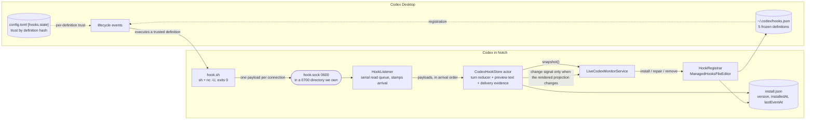

# Codex hooks, designed from scratch

| Field | Content |
| --- | --- |
| Document status | Research that was adopted. Implemented on 2026-08-20; §17 lists where the implementation departs from it. The design decisions now live in ADR 0014 and ADR 0015 |
| First recorded | 2026-08-20 |
| Question | If the Codex hook integration did not exist yet, what would it look like built once, deliberately |
| Audience | Whoever decides whether to rebuild it, and whoever implements it afterwards |
| Language | English. Written that way by explicit request while the rest of `docs/` was still Chinese; every document is English now, so this row is only a historical note |
| Basis | Reading of `HookIntegration.swift`, `AgentHookListener.swift`, `ManagedHooksConfiguration.swift`, `ManagedHooksFileEditor.swift`, `ClaudeCodeHookSetup.swift`, `system-architecture.md` §2/§3/§8, `tech-design.md` §7.1–§7.2, ADR 0010, ADR 0013, as of commit `604fb6d` |
| Measurements | **None of its own.** Every number quoted here is carried from an existing document or code comment and is attributed at the point of use |

> Directory convention follows [`shared-app-server/README.md`](../shared-app-server/README.md): one second-level directory per exploration, later evidence appended rather than overwriting earlier evidence.

## 1. Why this document exists

The Codex hook path was built incrementally, mostly by an agent, and it accumulated: two transports, a filesystem queue nothing needs, a four-state installation machine, three state files, a launch cutoff, a legacy layout sweep, and a per-refresh script comparison. Meanwhile the *second* product's path — added later, under ADR 0013 — solved the same transport problem better, and then serialised its payloads to disk anyway because the first product's reducer was a directory reader.

This document answers one question: with the requirement known and the measurements already in hand, what is the smallest correct implementation? It is written as if nothing existed, and then §10 says what that costs against what exists.

It does not propose a schedule and it is not an ADR. If the design is accepted, the decisions in §4 and §6 are the ones that need ADRs of their own.

## 2. What the hooks have to deliver

Three answers per Codex thread, live:

1. a turn opened;
2. it is waiting on the human — for input, or for approval;
3. it ended.

Plus one short line of text for the row. Everything else a row displays — title, Project, unread state, membership — already comes from the App Server and from `.codex-global-state.json`.

Hooks are the **only** runtime source for those three answers. `system-architecture.md` §2.1 records the measurement behind that: on CLI `0.148.0-alpha.9`, with a turn genuinely running, `thread/loaded/list` is empty, threads are always `notLoaded`, `thread/list` does not return turns and `thread/read` never shows `inProgress`. No supported read answers "what is Codex doing right now".

That is the entire requirement. Most of the current implementation is not serving it.

## 3. The design in one picture



Three moving parts inside the app — a registrar, a transport, a store — against six today.

## 4. Registration, and the contract that shapes everything else

### 4.1 The registered definitions

`UserPromptSubmit`, `PreToolUse`, `PostToolUse`, `PermissionRequest`, `Stop`. All unmatched.

> **Since this was written, `SubagentStart` and `SubagentStop` were added, making seven.** They are the only events that can answer whether work is still in flight after a Thread's own Turn ended (`subagent-row-consistency/README.md` §6.2). Count `managedDefinitions` in `HookIntegration.swift` rather than a number in prose — this line has read five, six and seven at various points.

`SessionEnd` is **not** registered. It is registered today, mapped to a signal, and then does nothing: `HookIntegration.swift` reduces `.sessionEnded` and `.inert` identically — consumed, no state change. It costs one process launch per session end and one more definition for the user to trust, and buys nothing. A thread whose session is gone is already retired by App Server membership reconciliation.

`PreToolUse` and `PostToolUse` stay unmatched, which is ~90% of the event volume. §12.1 records why narrowing them does not work.

### 4.2 The handler is one immutable string

```json
{"type": "command", "command": "/bin/sh '<support>/agents/codex/hook.sh'", "timeout": 3}
```

**The definition is never rewritten after it is first installed.** This is the load-bearing decision in the whole design.

`tech-design.md` §390 records why: Codex stores trust in `config.toml` under `[hooks.state."<hooks.json path>:<event>:<group>:<handler>"]`, keyed by the definition's content hash. Change a definition and Codex **silently stops executing that one** until the user re-trusts it in `/hooks`, while every untouched definition keeps firing normally. Nothing in the app can see it: the app's own "have we ever received an event" marker is satisfied by the definitions that still work, and the UI goes on saying Connected. On 2026-08-15 this was measured with `PreToolUse` dead for two consecutive turns and no indication anywhere.

So versioning lives entirely in the *script*, which is not hashed. The definition names a stable path and carries nothing else — no version, no port, no token, no argument that could ever need to change.

If the definition set genuinely has to change, that becomes a **declared** migration rather than a silent one: bump `definitionsVersion` in `install.json`, registration reads `mismatched`, and the settings card tells the user in advance that Codex will ask them to trust the definitions again.

### 4.3 Two rules on the merge

Both are cheap, and both protect the user's file rather than ours:

- **Append at the tail, remove only from the tail.** Our group goes last in each event's group array. If the `group` component of the trust key is an array index — unverified, see §13.1 — then removing a group from the middle renumbers everything after it and silently drops trust for *the user's own* definitions.
- **A no-op install writes nothing.** If `isFullyInstalled` already holds, return without touching the file. `ManagedHooksFileEditor.remove()` has that guard today; `install()` does not, so turning the switch on rewrites — and reformats — a file that was already correct.

## 5. Transport: one socket, no files

The helper is four lines of `sh`: pipe stdin to `nc -U` at the socket, discard both streams, `echo '{}'`, `exit 0`. It forwards the payload **unfiltered**.

Three properties matter:

- **It is silent whether or not the app is running.** ADR 0013 established this for the other product, where an unowned loopback port printed `connect ECONNREFUSED` into the user's session once per event with no setting that suppressed it. A `command` handler that exits 0 and writes to neither stream cannot do that anywhere.
- **The socket cannot be taken.** It is `0600` inside a `0700` directory this app owns. The filesystem answers what a bearer token used to answer badly.
- **Field selection moves into Swift.** Truncation, identity and event naming become testable code instead of a Python string literal inside a Swift file that only one integration test ever executes.

Cost, carried from ADR 0013's table (measured against Claude Code CLI 2.1.237, not against Codex): `sh` + `nc` costs 6.3 ms per event where Python costs 30 ms. At roughly 17 events per turn that is 107 ms against 510 ms of CPU per turn. The Codex helper is the 30 ms row of that table.

Framing is "one connection, one payload, writer closes". No request line, no header, no length prefix.

### 5.1 What disappears with the file queue

The queue exists only because the first implementation had a shell script that could not talk to a running process. With a socket, all of the following have no remaining purpose:

atomic temp-and-rename writes; `0600` attributes per event file; ordering by `time_ns` filename; corrupt-file quarantine to `.invalid`; delete-after-consume; rollback of reducer state when the marker fails to persist; the `DirectoryChangeWatcher` on the queue with its `attachIfNeeded` retry on every refresh; and `hookEventDebounceInterval` — **100 ms added to every hook-driven redraw**, on the one path where a user is watching for a row to change.

The second socket goes too. `HookPreviewChannel`, `event_id` correlation, `claimPreview`, and the unclaimed-preview retention cap all exist because text was not allowed into an event file. One socket carrying the whole payload has no such split. `system-architecture.md` §5 already says this in as many words: the channel is kept because it runs, not because it is needed.

## 6. One store, and three invariants that stop being guards

A listener (C sockets, GCD, one serial read queue) stamps arrival time and hands payloads, in order, to a single actor that holds reducer state, preview text and delivery evidence.

Three things the current implementation enforces by rule become facts of the architecture:

- **No launch cutoff.** An event that arrives is live by construction. `AGENTS.md` §6.2 — "historical events carry no business semantics" — stops being a check on `received_at` and becomes a property: there is no backlog, because nothing is written down. `liveEventCutoff` and the backlog classification go with it.
- **`retiredTurnIDs` goes away.** Arrival stamps taken on a serial queue are monotonic, so a late event from a retired turn cannot exist; the timestamp comparison already in `mutateExactTurn` covers what the set covered. This one is conditional on §13.2.
- **Text never needs a promise.** It is held in memory because there is nowhere else for it to go, not because a rule forbids the alternative.

And one behaviour improves rather than merely moving: **the store signals a change only when the rendered projection changes** — status, turn identity, or the preview line — instead of once per arriving event. A 17-event turn is not 17 wake-ups, and the burst shape that forced `MessageDisplay` to be diverted before the queue on the other product is handled by the same rule rather than by a special case. This is `AGENTS.md` §7 satisfied at the source: redraw count follows what is drawn.

Previews move into the store with everything else. They live in the listener today only because the queue-file path had no other home for them.

## 7. Health: two facts, not four states

Today `HookSetupStatus` has four cases and `status(hasObservedEvent:)` takes the second fact as a parameter, which is what makes the caller thread one through the other. They are independent facts with different sources, so they are modelled separately and projected for display.

| Fact | Source | Values |
| --- | --- | --- |
| Registration | `~/.codex/hooks.json` only | `absent` / `mismatched` / `complete` |
| Delivery | live events, plus one persisted line | `neverSeen` / `seen(at:)` |

Registration is recomputed when we write the file and when FSEvents reports it changed — not on a cadence. That removes `installationRevalidationInterval`, every `invalidateInstallationCache()` call site, the cached scan, and `hasManagedSupportFootprint`. `isIntegrationEnabled` becomes `registration == .complete` instead of a switch.

The settings card is the projection:

| Registration | Delivery | Card |
| --- | --- | --- |
| `complete` | `neverSeen` | Registered. Open `/hooks` in Codex and trust the definitions |
| `complete` | `seen` | Connected |
| `mismatched` | any | The registration is not what this version needs; turn the switch on to repair it |
| `absent` | any | Not installed |

### 7.1 The silence probe stays

It caught a real failure and it is the only runtime evidence that a definition has lost trust. It is kept, restated as an implication table with one entry:

> Three or more `PostToolUse` since launch with zero `PreToolUse` ⇒ `PreToolUse` is registered and not firing. Say so, and name `/hooks`.

A table rather than an `if` so that a second rule is additive. Only implications where absence is genuinely evidence belong in it: `PermissionRequest` fires only when a human is asked, so its silence proves nothing and it must never be probed.

Note that §4.2 closes most of the hole this probe covers. With the definition frozen, the app can no longer cause the silent-untrust state by itself; the probe is left for the cases it cannot cause — a user editing `config.toml`, or a Codex update that rehashes.

## 8. State on disk

One file, `install.json`:

```json
{"definitionsVersion": 1, "installedAt": "…", "lastEventAt": "…"}
```

It replaces three: `managed-install.json`, `hook-settings.json` and `monitor-state.json`.

No install marker to prove the script is ours. The script sits in a directory this app owns, and the current code's own comment already concedes the point about the hash it replaced: anything able to rewrite the script can rewrite the marker beside it, so it provides no tamper resistance. What it did provide — "our own older helper" versus "a file we never installed" — is not a distinction worth a file, because the response to both is the same: write the current script.

`lastEventAt` exists for exactly one reason: after a restart, before Codex has done anything, the card must not tell a user who trusted the hooks last week to go and trust them again.

Turn state remains memory-only, unchanged and for the reason `AGENTS.md` §6.2 already gives.

## 9. Lifecycle

| Moment | What happens |
| --- | --- |
| Launch | Bind the socket. If the bundled script's bytes differ from the file on disk, write it. Read `install.json`. Recompute registration once |
| Install / repair | Write the script, merge the five definitions (§4.3), write `install.json`, recompute registration |
| Event | Listener stamps and forwards; store reduces; store signals only if the projection changed |
| Refresh | `store.snapshot()`. **No file I/O of any kind** |
| `hooks.json` changes underneath us | FSEvents → recompute registration |
| Uninstall | Strict removal of our definitions, delete our directory. Nothing else |

The line worth calling out is the refresh row. Today `fetchSnapshot()` calls `upgradeManagedHookIfNeeded()`, which reads a ~4 KB script off disk and string-compares it — on every single refresh, to answer a question that can only change when the app itself is upgraded.

## 10. What this removes from the current implementation

| Removed | Why it existed | Why it does not need to |
| --- | --- | --- |
| `codex_in_notch_hook.py` | The only transport a shell hook had | A 4-line `sh` helper, 5× cheaper (ADR 0013's table) |
| `events/` and everything around it | The script could not reach a running process | The socket can |
| Event-queue watcher + 100 ms debounce | Files needed watching | The store signals directly |
| `HookPreviewChannel`, `preview.sock`, `event_id`, `claimPreview`, retention cap | Text was not allowed into an event file | One socket carries the whole payload |
| `liveEventCutoff` and backlog classification | Files outlive the process | Nothing is written down |
| `retiredTurnIDs` | Late and reordered events | Arrival stamps are monotonic (§13.2) |
| `ManagedInstallationState` (4 states), `hasManagedSupportFootprint`, the cached scan, `installationRevalidationInterval` | Installation health was polled | It is recomputed when it can change |
| `upgradeManagedHookIfNeeded()` on the refresh path | Script upgrades had no other home | Launch |
| `managed-install.json`, `hook-settings.json`, `monitor-state.json` | Grown one at a time | One `install.json` |
| `legacyFlatLayout`, `legacyScript`, `legacySettings` | Real migrations, already served | A from-scratch design has no legacy; §14 keeps exactly one marker |
| `SessionEnd` registration | Looked like it should retire rows | It reduces to nothing today |
| The Claude Code listener's queue-file round trip | The reducer read directories | Its last client is gone (§11.1) |

## 11. What is kept, unchanged

- **`ManagedHooksConfiguration` and `ManagedHooksFileEditor`.** Refuse rather than coerce, byte-compare before writing, read back to verify, keep a recovery copy of what is about to be replaced. (Written when this doc was drafted as "one recovery copy from before the first edit" — [ADR 0016](../../adr/0016-write-the-users-claude-code-settings-and-keep-a-copy.md) refreshes it on every write instead, for both products.) This is the good part of the current implementation, it edits a file the app does not own, and it gets stricter treatment under this design rather than less.
- **The reducer's rules.** Four states with sticky `Completed`; `request_user_input` and `request_permissions` as waits that own their `tool_use_id`; `PermissionRequest` borrowing the still-open call's id; a borrowed wait closing on activity against any *other* call. That last one is not tidiness — `system-architecture.md` §3 records that a denied Bash approval produces no event at all for that call, 67 seconds of silence and then the turn's `Stop`.
- **`AgentHookVocabulary`.** Separating "what happened" from "what this product calls it" is right, and it is what lets one store serve both products.
- **`timeout: 3` and synchronous execution.** Ordering is worth more than the milliseconds.

### 11.1 One consequence outside the Codex boundary

`AgentHookListener` receives Claude Code payloads on a socket and then writes them to disk as event files, so that `HookEventRepository` — a directory reader, because of Codex — can read them back. This design removes that reader's last client. The Claude Code side keeps its helper, its socket and its vocabulary, and simply stops serialising: same store, same reducer, one transport each.

That is the largest single simplification here, and it is a side effect of designing the Codex path correctly.

## 12. Alternatives considered and rejected

### 12.1 Narrow `PreToolUse` / `PostToolUse` with a matcher

`^(request_user_input|request_permissions)$` would cut roughly 90% of the event volume. It does not work. Ordinary-tool approval — the Bash case — arrives as a `PermissionRequest` carrying `tool_name` and no `tool_use_id`, so the wait can only be pinned to the id of the call a catch-all `PreToolUse` announced moments earlier; and the denial inference needs to see activity on *other* calls. Narrowing costs a state the product exists to show. The answer to the volume is the cheaper helper, not a matcher. (The current code declines the matcher for a second, independent reason: a naming detail would silently decide whether a wait is ever observed.)

### 12.2 Inline the helper into the definition

Codex parses `command` with a shell — the current definition quotes its argument — so the whole helper could be inline:

```
/usr/bin/nc -U '<path>/hook.sock' >/dev/null 2>&1; echo '{}'
```

No script file, nothing to write, upgrade or verify; installation health collapses to "is this exact string registered"; and a user reviewing trust in `/hooks` sees precisely what will run rather than a path to an opaque file.

Rejected, narrowly. The script file is the one indirection that lets behaviour change without touching the definition — and §4.2 is the whole reason this design exists. Inlining trades the app's only re-trust-free upgrade path for one file. Worth revisiting only if the helper's behaviour is ever declared final.

### 12.3 Read `config.toml`'s `[hooks.state]` and report trust directly

This would answer per-definition trust exactly instead of inferring it from silence. Rejected: it is a private schema dependency that would require an entry in `non-public-codex-integration-features.md` and would break on a Codex update, in exchange for improving a diagnostic that §4.2 largely makes unnecessary. If the probe in §7.1 ever proves insufficient, this is the next step, and it is an ADR-sized decision.

### 12.4 Keep the file queue as a crash buffer

The queue is the only place an event can survive a crash between arrival and reduction. That window is not worth anything: in-memory turn state dies in the same crash, and the design already discards everything written before launch. Accepted loss, recorded in §15.

## 13. What had to be measured before implementing

Both were single measurements, and both gated a specific deletion. Answered below on 2026-08-20, at implementation time.

### 13.1 Is the `group` component of the trust key an array index? — **Yes**

Read straight out of `~/.codex/config.toml` on the maintainer's machine, 2026-08-20:

```toml
[hooks.state."/Users/…/.codex/hooks.json:pre_tool_use:0:0"]
trusted_hash = "sha256:e304ee0feab09051d537f35e02e7a8f3eaac2371c2b082e08d4f02631b382ccb"
```

Three things it settles. The event is spelled in **snake case**, not as it appears in `hooks.json`. The third component is the group's **index in that event's array**. And there is a fourth, indexing the handler inside the group.

So §4.3's append-only rule is load-bearing for the *user's own* definitions, not merely tidy: removing a group from the middle renumbers every group after it and silently drops their trust. Recorded in ADR 0014 and in `tech-design.md` §7.1.

Note what this does **not** license. Nothing in the implementation reads this key — the two merge rules are conservative and correct whether or not the observation holds — so it is not a private dependency and gets no row in the registry (§8 of `AGENTS.md`).

### 13.2 Does Codex serialise hook execution per session? — **Not measured, and it stopped mattering**

It needs a live Codex turn to answer and it was not answered. It does not have to be: `retiredTurnIDs` is kept regardless, because the reducer is shared and the *other* product demonstrably reorders. ADR 0013 records Claude Code delivering a `Stop` ahead of its own subagent's `PermissionRequest` under one `prompt_id`. The deletion this measurement gated is therefore off the table for a reason that does not depend on Codex at all, and §6's third bullet was implemented as "keep it".

If it is ever measured and holds, the deletion is still not available while one store serves both products.

## 14. Migration

One re-trust, once, announced.

The current Python command line stays as a single legacy identity marker — the mechanism `ManagedHooksConfiguration` already has for exactly this, and the only piece of legacy handling this design keeps. Its effect: an existing install is recognised as `mismatched` rather than `absent`, so the user is asked to repair rather than told nothing is installed, and is warned that Codex will ask them to trust the new definitions.

Everything else the old install left behind — the script, the queue directory, the three state files, the second socket — is deleted by the uninstall half of the same repair.

## 15. Costs and limits, stated plainly

- **One re-trust at migration.** Unavoidable: the definition changes exactly once, on the way to never changing again.
- **No crash buffer.** §12.4.
- **`SessionEnd` is not registered**, so a thread whose session ends without a `Stop` is retired by membership reconciliation instead — marginally later. Not a regression: today's registration does nothing at all.
- **The helper depends on `/usr/bin/nc` supporting `-U`.** macOS ships it; ADR 0013 already accepts this dependency for the other product. It is the only external component in the path.
- **A process per event remains.** 6.3 ms rather than 30 ms, but the `http` transport this project measured at 1.2 ms is not available here: Codex has no such handler type, and ADR 0013 rejected ports for reasons that apply regardless.
- **The silence probe still cannot see a definition that has never had a reason to fire.** Bounded by design (§7.1) and honest about it.

## 16. The tests this design needs

Written as invariants rather than as a checklist of methods, because several of them replace tests that exist today:

1. The registered definition is byte-identical to the previous version's after any change to the helper script — the frozen-definition contract, pinned so a future edit fails the build rather than the user's trust.
2. Installing over an already-correct configuration does not write the file.
3. Our group is appended at the tail, and repairing removes only from the tail.
4. An install refuses, byte-identically, every configuration shape it cannot understand — carried over unchanged, it is one of the strongest tests in the suite today.
5. The helper exits 0 and writes nothing to either stream, both when the app is listening and when it is not — carried over from ADR 0013's equivalent, run against the real script.
6. The socket is private to this user and drops what it cannot read.
7. Payloads are reduced in arrival order, and an out-of-order arrival changes nothing.
8. A turn's lifecycle drives the four states, including the borrowed-approval open and both of its closes (answered, and inferred from activity on another call).
9. The store signals a change for a status transition and does not signal for an event that changes nothing rendered.
10. Three `PostToolUse` with no `PreToolUse` produce the diagnostic; a delivered `PreToolUse` never does.
11. Registration and delivery project to the four cards in §7, and `neverSeen` after a restart does not re-ask a user who has already trusted.
12. Uninstall leaves the user's other definitions byte-identical and strands no reference to a deleted helper.

## 17. Status

**Implemented, 2026-08-20**, with three declared departures. This document is left as written — it is a record of the reasoning, not a description of the code — and the differences are listed here rather than edited into the sections above.

| Section | Departure | Why |
| --- | --- | --- |
| §6, §10 | **`retiredTurnIDs` is kept.** | §13.2 above. The claim is about the transport; the failure is in the executor, and the reducer is shared with a product that measurably reorders. |
| §8 | **`definitionsVersion` is not written.** `install.json` holds `installedAt` and `lastEventAt`. | It would be a second, weaker copy of a fact `hooks.json` already carries. A changed definition set makes `isFullyInstalled` fail, which *is* `mismatched`, which is the announcement §4.2 asks for. A version field could only agree with that or be wrong about it. |
| §6, §7 | **`HookSetupStatus` survives as the projection.** Registration (`HookRegistration`) and delivery are modelled separately as §7 asks, and the four cards in §7's table are exactly its four cases, so it stays as the display type both products already publish. | §7's own table is the projection. Replacing the type as well would have churned `MonitorStore`, `SettingsWindow` and the Claude Code path for no change in behaviour. |

One thing the implementation found that this document did not anticipate: the `.invalid` quarantine had accumulated **155 files** in `agents/claudeCode/events/` on the maintainer's machine, none of which anything would ever read or remove. Dropping the queue drops the quarantine with it — an unrecognised payload is now reported once and discarded.

The decisions in §4.2 and §6 have ADRs: [0014](../../adr/0014-the-codex-hook-definition-is-never-rewritten.md) and [0015](../../adr/0015-hook-events-go-straight-into-the-reducer.md).
