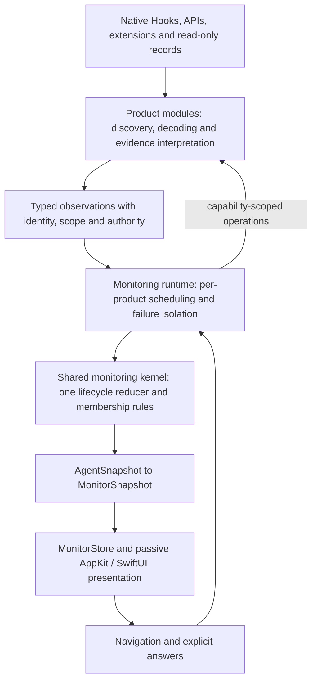

# Scaling Notchline beyond two products

| Field | Value |
| --- | --- |
| Status | Original architectural investigation, 2026-09-07. The [six-level product support contract](../../product-support.md) replaces the earlier support bands and three-tier proposal. [The migration record](tiered-support.md) tracks the subsequent implementation and measurements |
| Investigated | 2026-09-07 |
| Source baseline | Local `master`, `20ff4f1`; current implementation and selected invariant tests inspected |
| External evidence | Official documentation fetched on the investigation date; additional products have not been exercised locally |
| Question | How can another product be supported without changing the common lifecycle, scheduling and presentation implementation each time? |
| Recommendation | A modular Swift application with product-owned boundary adapters, a shared monitoring kernel, explicit capabilities and a reusable conformance suite; an external Provider protocol only after the internal boundary survives dissimilar products |

Terminology follows [`CONTEXT.md`](../../../CONTEXT.md). A **Product** is user-visible; a **Provider** is its in-app adapter. One Provider may observe several runtime instances of its product. Proposed type names below are illustrative, not a committed API. This document is a migration proposal, not a description of shipped behaviour.

## 1. Finding

Notchline already has a useful multi-product boundary. The problem is not the absence of an interface, and it is not solved by adding another one around the existing classes. The interface normalises the final presentation snapshot while much of the machinery that produces it still assumes Hooks and the two existing products.

The scalable boundary is **product evidence into common monitoring semantics**. Product-specific interpretation remains necessary: a lifecycle event, a permission notification, a transcript record and an application activation do not mean the same thing. Put that interpretation in a product module; make identity, ordering guards, lifecycle reduction, membership, scheduling, answer validity and publication reusable.

Success means adding a Provider, its fixtures, its registration and any necessary product assets. It should not require adding product-name branches to the common reducer, scheduler, row renderer or answer controller. A newly encountered domain concept may still require an explicit contract extension; the interface must not hide that work in arbitrary flags.

### 1.1 Adopted support contract

The baseline-plus-extensions direction became the [six-level support contract](../../product-support.md) on 2026-09-12. It replaces this section's earlier non-cumulative bands and the subsequent three-tier proposal. L1–L6 distinguish lifecycle, context, progress, wait detection, request reading and request answering. Read removal, navigation, quota and usage, final answers, subagents, recovery and terminal reasons are declared independently.

The kernel still understands more than a minimum Provider supplies. Sources add evidence to the same reducer; read evidence retires a Turn but cannot open one, and answer delivery changes no lifecycle state without native evidence. Products without wait detection retain the current Running presentation with a declared Settings boundary; no fifth status was introduced. [The migration record](tiered-support.md) describes what was actually built and retains the measurements behind its boundaries.

## 2. What can be kept, and what needs to move

The evidence below comes from the implementation, including places where older architectural prose or comments still describe the original Codex-only composition.

| Existing boundary | Current evidence | Assessment |
| --- | --- | --- |
| Provider protocol | [`AgentMonitoring`](../../../Notchline/Notchline/LiveCodexMonitorService.swift): product identity, change stream, snapshot and next deadline | Keep the asynchronous observation shape. It already supports independent Providers. |
| Product snapshots and merge | [`AgentSnapshot`, `MonitorSnapshot`, `AgentSnapshotMerge`](../../../Notchline/Notchline/MonitorDomain.swift) | Keep the one UI data contract and pure merge. The merge already consumes an array, not a pair. |
| Runtime composition | [`MonitorStore.makeShared`, `record`, `refreshAndWait`](../../../Notchline/Notchline/MonitorStore.swift) | The store constructs both Providers and routes their results. `LiveCodexMonitorService` is currently the Codex Provider, not the owner of Claude Code. Extract common runtime coordination from the presentation store without putting Claude Code inside the Codex class. |
| Shared lifecycle logic | [`AgentHookVocabulary`, `HookEventRepository`](../../../Notchline/Notchline/HookIntegration.swift) | Already reused by both products, but accepts a Hook payload and mixes delivery, decoding, trust bookkeeping, answer connections and lifecycle reduction. Split these responsibilities around a typed evidence boundary. |
| Vocabulary options | Same file: `reportsApprovalDenials`, `wakesOnToolCallOpened`, `settlesHeldTurnsFromRecord`, content flags and answer encoding | These encode real edge cases. Move product interpretation into adapters; do not grow a switchboard of behaviour flags for every new product. |
| Setup | `AgentMonitoring.installHooks/removeHooks/hookSetupStatus`; `AgentSnapshot.setupStatus: HookSetupStatus` | A server or extension Provider should not pretend to install Hooks. Separate observation from integration setup. |
| Answering | [`AgentRequest.replyTicket`](../../../Notchline/Notchline/AgentRequest.swift), [`RequestAnswering.hookOutput`](../../../Notchline/Notchline/RequestAnswering.swift) | A transport-specific ticket crosses the domain and presentation boundary. Preserve its stale-answer protection behind an opaque, transport-independent handle. |
| Navigation | [`AgentNavigationRouter`, `NavigationOutcome`](../../../Notchline/Notchline/CodexDesktopNavigator.swift) | Reuse this separation. Outcomes already distinguish opening a Thread, raising an application and focusing a terminal. |
| Product identity and setup copy | `AgentKind` is a two-case enum; `MonitorStore` contains per-product installation messages; [`ProductConnectionRows`](../../../Notchline/Notchline/SettingsWindow.swift) explicitly draws the two products | Introduce a registry and data-driven setup presentation. Changing the enum alone is insufficient. |
| Product evidence | [`LiveCodexMonitorService`](../../../Notchline/Notchline/LiveCodexMonitorService.swift), [`ClaudeCodeMonitorService`](../../../Notchline/Notchline/ClaudeCodeMonitorService.swift) and their repositories | Keep native discovery, Project interpretation, read-state evidence, navigation and protocol parsing at these boundaries. Do not erase their differences. |

The current module sizes reinforce the extraction opportunity, but are not themselves a defect: `HookIntegration.swift` is 4,808 lines, `MonitorStore.swift` 4,977, the Codex Provider 2,562 and the Claude Code Provider 1,820, including substantial explanatory comments. Reducing line counts is not the acceptance criterion.

The selected tests inspected in [`NotchlineTests.swift`](../../../Notchline/NotchlineTests/NotchlineTests.swift) already protect the important semantics: `hookReducerRequiresStableTurnIdentity`, `hookReducerPairsInputResultsAndIgnoresOldTurnEvents`, `trustedHookMarkerDoesNotRestoreTurnIntoConfirmedSnapshot` and `aKeptSnapshotDoesNotClaimAQuitDesktopIsConnected`. Extract and extend these invariants rather than replacing them with interface-mocking tests.

## 3. External interfaces: what they establish

These are documented capabilities, not a claim that Notchline can already use them successfully. In particular, Thread admission, wait closure, runtime discovery and exact navigation need local validation for every supported host and version.

| Product or protocol | Officially documented surface | Architectural consequence and remaining gap |
| --- | --- | --- |
| Codex | Hooks expose lifecycle events and Turn identity. App Server exposes stored Thread reads; `thread/read` does not resume or subscribe to that Thread. [Hooks](https://learn.chatgpt.com/docs/hooks), [App Server](https://learn.chatgpt.com/docs/app-server) | Keep native Hooks and read-only enrichment. Reading through another App Server is not proof of observing Desktop's live runtime. |
| Claude Code | Lifecycle and request Hooks include `UserPromptSubmit`, `PermissionRequest`, `Stop` and `StopFailure`; request output has its own decision schema. [Reference](https://code.claude.com/docs/en/hooks) | A reusable Hook transport is useful. Product interpretation and answer encoding still belong to the Claude Code Provider. |
| Gemini CLI | `BeforeAgent` and `AfterAgent` bracket an agent response; the latter also participates in retry control. The base payload exposes `session_id`, but no general Turn ID. `Notification(ToolPermission)` is observational and cannot grant permissions. [Reference](https://geminicli.com/docs/hooks/reference/) | A strong test of Hooks with different semantics: verify Turn correlation, retries, interruption, wait closure and navigation. A permission alert must not produce an answer button. |
| OpenCode | An HTTP API supplies session listing/status and SSE events; plugins expose permission and session events. The TUI uses a server, and a separate `opencode serve` creates another server. [Server](https://opencode.ai/docs/server/), [Plugins](https://opencode.ai/docs/plugins/) | A strong test of a Provider without Hooks. Attach to the actual runtime; prove discovery and snapshot/event scope. Status API availability alone does not establish full Turn or read-state semantics. |
| Cursor | Hooks expose `conversation_id` and `generation_id`, prompt submission and loop termination. Execution hooks can return permission decisions. [Reference](https://cursor.com/docs/hooks) | Identity is promising. A pre-execution interception point is not evidence that the user is waiting at a permission dialogue. Validate editor/CLI/cloud separately, including navigation and visibility. |
| ACP | A client sends `session/prompt`, receives updates and permission requests, then receives a stop reason. `session/list` is capability-gated and lists known conversations. [Prompt Turn](https://agentclientprotocol.com/protocol/v1/prompt-turn), [Session List](https://agentclientprotocol.com/protocol/v1/session-list) | A useful adapter for a runtime already exposing the relevant connection. The documented flow does not establish a universal, passive attachment to other clients' running conversations. A session list is not a current activity projection. |
| MCP | Standardises tool/resource access and associated protocol interactions. [Architecture](https://modelcontextprotocol.io/docs/2026-07-28/learn/architecture) | Making Notchline an MCP server does not by itself make every product publish all its lifecycle boundaries to it. A notification tool still needs a deterministic native caller; model-chosen calls are insufficient evidence. |

The last column contains design inferences from those interfaces. No absence claim here is intended as a proof that a vendor could not add another interface. Before implementation, recheck the precise public schema and target binary version.

Three questions must be answered independently:

1. Can the product be controlled through a protocol?
2. Can the specific runtime the user is already using be observed through it?
3. Does that observation prove the identities, boundaries and navigation outcomes Notchline promises?

Only the first is answered by many SDKs and protocol compatibility announcements.

## 4. Options and trade-offs

| Option | What improves | What remains expensive | Verdict |
| --- | --- | --- | --- |
| Add more `AgentMonitoring` implementations | Lowest initial disruption; current merge remains reusable | Each Provider duplicates recovery and membership machinery; shared code keeps accumulating Hook assumptions | Useful migration seam, insufficient final architecture |
| Map every product's Hooks into one JSON vocabulary | Reuses helper, socket, parsing conventions and selected lifecycle events | Server streams are awkward; identical event names can mean different things; mapping cannot invent identity or current state | Keep as one boundary adapter family |
| Product modules plus shared monitoring kernel | Reuses lifecycle, ordering, membership and resource scheduling while containing native interpretation | Requires a careful extraction and a conformance suite; optional capabilities need honest presentation | Recommended first destination |
| Standardise everything on ACP or a proxy | Can simplify interaction for products and hosts using that connection | May require owning launches, forwarding permissions and becoming part of the execution path; does not automatically cover existing Desktop/terminal instances | Separate, optional research track |
| External executable Providers from day one | Language freedom, process failure isolation, independent distribution | Adds protocol negotiation, packaging, trust, updates, process cost and compatibility before the boundary is proven | Defer; design the internal boundary so this remains possible |

A modular application is enough initially. A daemon, plugin marketplace, JavaScript runtime or general event-sourcing platform is not required to extract a Swift state machine and its contracts.

## 5. Proposed responsibility split



Logical modules can begin as source groups, then become local Swift package targets where dependency checks are useful:

| Module | Owns | Must not own |
| --- | --- | --- |
| `MonitoringContracts` | Identity types, observations, capabilities, snapshots, request forms and operation results | AppKit, native JSON keys, paths inside another product, sockets |
| `MonitoringCore` | Turn reduction, ordering guards, membership, dismissal application and pure aggregation | Product names, protocol parsing, private file reads |
| `MonitoringRuntime` | Provider registry, independent scheduling, cancellation, bounded work and command routing | Reinterpreting a product's raw payloads or a second lifecycle reducer |
| Product modules | Native decoders, runtime discovery, source reconciliation, metadata/read evidence, setup and navigation implementations | Direct UI mutation or their own competing version of common lifecycle rules |
| Shared transport support | Framing, local delivery, HTTP/SSE mechanics, bounded subprocess operations and structured file editing primitives | Deciding Running, read, Project or approval from transport health |
| Presentation | `MonitorSnapshot`, layout and user intent | Native protocols or product-specific state transitions |

The kernel is one implementation, with state partitioned by product and observation scope. It need not be one global actor processing every byte. Preserve ordered framing on serial queues and decoding off lifecycle actors. Product failures must not block other products' events.

A Provider remains the composition that publishes one product's `AgentSnapshot`: its native adapters supply evidence and the shared kernel reduces that evidence. Splitting the implementation does not introduce a second user-visible product or replace the existing meaning of Provider.

Source reconciliation in a Provider means proving facts such as “this exact Thread owns this Turn” or “this request was auto-reviewed”. The kernel decides what those facts change. Avoid a Provider computing a final status and a second reducer independently computing another status for the same Turn.

## 6. Contracts that make the boundary useful

### 6.1 Identity and runtime instances

Use a stable `ProductID` and a registry descriptor instead of relying on `AgentKind.allCases` throughout the app. Built-in registration can remain compiled Swift; runtime plugin discovery is a separate concern.

Distinguish:

- `ProductID`: product attribution and settings.
- `ObservationScopeID`: the native identity namespace, such as an account/store/host combination, where the product requires one.
- `ThreadKey`: product, stable scope and native Thread ID.
- `TurnKey`: Thread key and native Turn ID, or an explicitly local correlation identity.
- `SourceInstanceID` and `epoch`: a connection/process observation generation, not the Thread's permanent identity.

Two windows or two connections observing one native Thread must not create two rows. A process restart must not rename the Thread. Conversely, two unrelated servers reusing the same native ID must not collide. The Provider supplies evidence for aliases and scope equality; the core does not merge on title, working directory or proximity in time.

Where a product lacks a Turn ID, a Provider may propose a local ID only at an unambiguous submission boundary, with a demonstrated way to associate subsequent events and reject duplicates. It must mark that identity as local to an observation epoch. If overlapping Turns, retries or missing events cannot be disambiguated, this path cannot satisfy the normal monitoring contract. A UUID or timestamp does not solve correlation.

### 6.2 Typed observations, not a universal status setter

The contract needs more than `threadID`, `status` and a timestamp. Start with a small typed vocabulary:

| Observation | Meaning |
| --- | --- |
| Turn boundary | An identified Turn started or ended; terminal reason can be unavailable |
| Wait opened / resolved | One identified request became pending or ceased to be pending, with its owning Turn or subagent |
| Thread admission / metadata | Product evidence of identity, parentage, eligibility and display metadata |
| Read evidence | Current evidence authorising retirement of a particular terminal Turn |
| Current observation batch | Explicit coverage and completeness for a set of current facts |
| Presence / integration health | Runtime presence and observation reliability, independent of Turn state |
| Optional enrichment | Preview, quota or subagent information, with its own scope and freshness |

Every state-changing observation carries its product/scope, source epoch, relevant Thread/Turn/request identity, provenance and ordering information. Use native revisions or event IDs when available. A receiver-assigned sequence proves only local receipt order; it does not recover native ordering or turn a replayed event into live evidence.

Do not rank all sources by a single confidence number. Define **authority by operation**. For example, current read-state evidence can retire a matching terminal Turn but cannot start a Turn; cached read data may preserve a display but cannot authorise new retirement. Metadata can update a title without replacing a preview. Transport timeouts can affect availability without manufacturing Completed.

Product-specific facts can be narrowly typed, such as confirmation of a previously held Turn start. They must correspond to a defined invariant, not expose arbitrary callbacks that let a Provider rewrite core state.

### 6.3 Snapshot and stream recovery

Represent snapshot coverage explicitly: scope, query start, source revision/watermark if supplied, whether pagination completed and which categories of evidence the batch contains. An empty history listing, a partial page and a complete current activity projection are different values.

Where the product supplies a coherent snapshot/stream cut, use it. Otherwise subscribe first, buffer bounded observations during the read, and preserve live changes newer than or concurrent with the read. A sequence assigned locally cannot prove that a remote snapshot includes an event. Without native ordering guarantees, use conservative reconciliation and targeted re-reads; record uncertainty rather than replacing newer state with a late answer.

Absence authorises deletion only when the Provider establishes complete coverage and the product defines that absence as meaningful. In particular, absence from a historical Thread list does not end a live Turn.

Declare recovery as one of:

- Current runtime state can be reconstructed, within a tested scope.
- Only live boundaries observed since this monitoring epoch establish activity.
- The current source is unavailable; no new conclusion can be made.

The first is an optional stronger capability. The second is an honest launch limitation already relevant to the existing architecture. Neither permits replaying old Hooks as a launch snapshot. A persisted evidence journal is not part of this proposal.

### 6.4 Capabilities are more than booleans

Separate three things: what the Provider implements, what the current host/version/configuration makes available, and what this specific Thread or request supports.

| Capability | Values or distinctions needed |
| --- | --- |
| Lifecycle observation | Which boundaries and waits are observable, with what identity and recovery coverage |
| Navigation | Exact Thread, identified terminal, application-only, unavailable; report the actual outcome |
| Read state | Authoritative evidence with a boundary, unsupported, temporarily unavailable |
| Request display | Supported form and fields, unsupported form, missing current payload |
| Answering | Allowed operations on this pending request, current handle validity and delivery semantics |
| Quota | Rate-limit window, budget, usage or unsupported; include account, unit and freshness |
| Subagents | Known count/relations versus unsupported; unsupported is not zero |
| Setup | Managed Hooks, product extension, existing endpoint or no configuration required |

Quota is particularly easy to over-normalise: token usage, context occupancy, money spent and account rate limits cannot all become the same percentage. Keep their measures typed and let the footer display only the categories it supports. Missing quota must not disable reliable lifecycle monitoring.

Read-state support is optional. A terminal Turn with unanswerable read state keeps the existing explicit lifecycle exits: another submission, proven disappearance or manual dismissal. It must not expire after an invented timeout or be silently labelled unread.

Missing start/end evidence is more serious than missing enrichment. Under the tiered proposal in §1.1, unavailable wait classification is compatible with baseline lifecycle support, but cannot be represented as confirmed Running. Losing required lifecycle coverage makes baseline observation unreliable: hold a last trustworthy state only where the established availability policy permits it, and otherwise report unavailable observation. A completion-notification-only offering remains outside the proposed baseline.

### 6.5 Separate operations from observation

Split the current protocol into focused contracts. Illustrative responsibilities are:

```text
ProductObserving       changes, current observations, refresh needs, stop
IntegrationConfiguring inspect setup, plan changes, apply managed changes
ThreadNavigating       check target, open target, report actual outcome
RequestAnswering       validate current handle, send explicit answer, report delivery
UsageReading           optional usage observations with scope and freshness
```

The runtime composes these contracts once per Provider. An observation-only Provider does not implement meaningless Hook installation or answer methods.

Replace `HookReplyRegistry.Ticket` in the common domain with an opaque `AnswerHandle`. Bind it to the product, runtime epoch, Thread, Turn, request and allowed operations. For existing products it wraps the same held Hook connection. A future API-backed handle requires an identifiable pending request and a tested freshness/race contract; a URL and a request ID alone are insufficient.

The UI continues to render a bounded set of typed request forms. An unknown form can be displayed in a supported reading-only representation or routed to the product. Do not generate arbitrary executable UI from a Provider-supplied schema or convert every request into grant/refuse.

On answer submission, revalidate the handle and consume it at most once locally. Report expired, rejected, delivered or outcome-unknown as appropriate to the native protocol. Bytes written are not necessarily acceptance, and a lost acknowledgement is not proof of non-delivery. Never blindly retry a possibly delivered answer. A successful send still waits for product evidence before changing the Turn's status.

### 6.6 Registry, setup and scheduling

A registry entry owns display name, stable ordering, module factory, capabilities, setup description and implementation version. Settings enumerate entries. Keep platform presentation separate from native file paths and setup messages.

Shared file-editing primitives should parse, preserve unknown structures, back up and write atomically. Product setup still defines the exact keys, ordering and trust-preservation rules. In particular, extracting the Codex setup must not rewrite its frozen definitions or disturb the user's existing registrations.

Move provider orchestration towards `MonitoringRuntime`, retaining current independent result publication, per-product stability gates, single-flight work and overdue-deadline protection. Work should be scheduled for the Provider and scope that changed. Coalesce metadata/preview invalidations; do not discard lifecycle edges as if they were repaint requests.

Disabled Providers attach no watchers and launch no processes. Optional enrichment gets separate budgets and cannot delay a lifecycle publish. Keep bounded queues and observable overflow: losing lifecycle observations invalidates the affected coverage and triggers supported recovery, never silent continuation with a falsely complete state.

The existing render-server boundary remains: no continuous SwiftUI animation, no token-by-token invalidation of the whole overlay, and explicit main-actor publication. Registry growth must not turn into one full poll or one assistant process per installed product.

## 7. Compatibility with current contracts

These are proposed contract changes to make explicit when implementation begins; none is silently adopted here.

| Current rule | Proposed treatment | Documents to update with implementation |
| --- | --- | --- |
| Cross-source orchestration is named `LiveCodexMonitorService` | Each product retains native evidence interpretation; shared scheduling and coordination get a product-neutral owner. One centre per responsibility, without a second reducer. | `AGENTS.md`, `system-architecture.md`, `tech-design.md` |
| Only `HookEventRepository` reduces Turn state | Extract that implementation into the shared kernel; Hook ingestion becomes one caller of typed observations. Do not introduce a competing reducer. | Same documents and invariant tests |
| Hooks supply starts; supplementary sources cannot invent Turns | Designate the product's primary lifecycle authority explicitly. A future native current projection may establish an exact active Turn only after same-runtime recovery is proven; metadata, history and supplementary read sources still cannot open Turns. | `AGENTS.md`, `CONTEXT.md`, `system-architecture.md`, `tech-design.md`, recovery ADRs |
| Answerable means a held Hook connection; answers travel on it | Preserve current behaviour; generalise the definition to a valid native pending-request handle only when a non-Hook answer path has been proven. | `CONTEXT.md`, `answer-in-notch.md`, `PRD.md`, a new ADR |
| Navigable root Thread admission, with existing Claude Code navigation degradation | Preserve current admission evidence and actual navigation outcomes. Decide explicitly whether a future product's weaker navigation is acceptable. | `CONTEXT.md`, `PRD.md`, navigation ADRs |
| A shared four-status vocabulary | Preserve existing products' semantics. For a baseline Provider, separate active lifecycle from unavailable attention observation (§1.1); decide its honest row and aggregate presentation before shipping. Do not silently fill in Running. | `CONTEXT.md`, `PRD.md`, `MonitorDomain`, capability/setup presentation and an ADR if the displayed vocabulary changes |
| Two-product setup and quota presentation | Enumerate supported products and distinguish supported quota measures. No additional permanent mark per product. | `dual-agent-design.md`, `quota-footer-v2.md`, `panel-v2.md`, `figma-design.md` |
| Managed files and private dependencies | Preserve current boundaries. Document new setup artifacts and any newly introduced private dependency per feature. | `integration-settings-behaviour.md`, `artifacts.md`, private integration registry |

An abstraction cannot make a non-navigable Thread navigable, a missing read signal available, or a native approval race safe. These are release gates, not implementation inconveniences.

## 8. Migration in reviewable phases

### Phase 0 — Pin behaviour and the extraction boundary

Create small, sanitised fixtures from existing test payloads for both products, plus expected observations and resulting snapshots. Cover ordering, held Turns, request correlation, terminal membership, private-source failure and navigation outcomes. Use fake clocks and transport doubles. Add import/dependency checks for the proposed kernel boundary.

**Exit:** the same fixture suite can describe both existing products without putting native JSON keys in the common expectations. Add a baseline-only fixture requiring no wait, quota, preview, read-state or answer capability; enhanced fixtures enable each extension independently. Record the current Release resource baseline before performance-affecting changes. No runtime or hook installation changes are needed for this phase.

### Phase 1 — Remove the public Hook assumptions

Extract `AgentMonitoring` out of the Codex file, introduce the product registry, separate setup/answer/navigation contracts, and wrap existing tickets in opaque handles. Keep existing Providers as the authoritative producers of `AgentSnapshot` throughout this phase. Convert setup rows and messages to registry data, preserving current wording and actions.

**Exit:** a test Provider with neither Hooks nor quota can be registered, enabled, disabled and navigated using its declared capabilities, without editing common product switches. Existing two-product behaviour stays identical.

### Phase 2 — Extract the monitoring kernel

Move the existing reducer's common semantics behind typed observations. Move native payload decoding, held-start evidence and product request interpretation into their product modules. Extract common runtime scheduling from `MonitorStore` only along proven seams; keep layout and transient interaction state there.

Migrate one Provider at a time. An offline differential harness may feed equivalent sanitised fixtures to the old and extracted paths. Only one path may own each live runtime, bind each Hook endpoint or deliver answers. Do not shadow-run duplicate live helpers or answer transports.

**Exit:** both products use the kernel, the common modules have no native product branches, the complete existing suite passes, and Release behaviour matches the baseline. Remove the compatibility path after parity is established.

### Phase 3 — Exercise two different extension shapes

Use **OpenCode as the first complete candidate** because its server/event shape challenges the Hook-centric boundary. First prove attachment to the user's actual runtime, identity and admission. Then validate submission, completion, interruption, pending requests, reconnect, navigation and read-state limitations. Its published API makes it a promising candidate, not a pre-approved release.

Use **Gemini CLI as a second, bounded correlation experiment**. It tests whether Hooks without the same Turn identity and answering surface can enter the contract honestly. Do not compensate for gaps by adding timing heuristics to the kernel.

If either fails the required lifecycle or navigation gates, preserve the findings and choose another product. The architecture is not validated merely because an adapter compiles.

**Exit:** adding a different native transport requires a product module and conformance fixtures, not new switches in the core or fabricated state. Document the exact supported hosts and versions.

### Phase 4 — Consider an external Provider protocol

Only pursue this if independent contributors, release cadence or process isolation make it useful. Put a proxy Provider in the app and run external adapters on demand. Prefer a versioned local message protocol over loading third-party native libraries into the UI process.

Negotiate protocol major/minor versions, capabilities and resource limits. Include the same identity, epochs, scoped observations and operation results as the internal contract. Version a JSON Schema and compatibility fixtures together. Refuse unknown required semantics; tolerate optional fields only where doing so is safe. A local NDJSON transport is sufficient to investigate; a public network service is unnecessary.

A built-in Provider must not gain the resident cost of an external process merely to share the protocol. Authenticating local publishers, executable provenance, updates and disconnect handling become explicit work in this phase. A Provider may publish only within its registered scope; filesystem permissions alone do not establish the meaning of its claims.

## 9. Validation and NO-GO conditions

| Scenario | Required result |
| --- | --- |
| Two products or independent stores reuse native IDs | No collision; two connections to the same proven Thread still produce one row |
| Duplicate, delayed or old-epoch event | No duplicate Turn, backward transition or revival of a retired Turn |
| Snapshot completes after a new submission | The new Turn and its content survive |
| Listing is partial, corrupt or historical | It cannot delete current activity or authorise read retirement |
| No stable native Turn identity | Local correlation must pass overlap/retry tests; otherwise admission is refused or that mode remains unsupported |
| Permission event is observational only | Show only what is known; never manufacture answerability |
| Request is answered in the product during a notch click | Stale handle cannot answer another request or be retried ambiguously |
| Product disappears or reconnects | Health and observation epoch change; no invented terminal reason or historical replay |
| Optional metadata, quota or read source fails | Preserve core lifecycle where trustworthy; degrade only the affected capability |
| Baseline Provider has no wait classification | Its active Turn never claims that no human wait exists; row and aggregate use the agreed baseline presentation |
| An extension disappears while a Turn is waiting | Attention coverage degrades explicitly; the absence of new wait evidence does not prove work resumed |
| A Turn is manually dismissed | It stays dismissed for that Turn; next submission is eligible; stop its unnecessary read-state work |
| One Provider hangs or floods input | Other Providers keep publishing; queues and work remain bounded |
| Disabled and idle products | Disabled Providers do no observation work; idle work is explained by a supported correction requirement |
| 3, 10 and 20 registered product descriptors | Setup and ordering remain generic; collapsed geometry does not grow a mark per product |
| New transport and request shape | Add adapter/fixtures; common kernel does not need product-name conditions |

For performance-affecting phases, measure **Release** before and after with the same workloads: two existing products, then an additional active product, then many disabled descriptors. Record process count, RSS, wake-ups, idle CPU, event-to-snapshot latency and overlay publication count. Use cumulative CPU-time differences for event/hover bursts; use steady-state sampling for idle cost. Set numerical acceptance budgets from the measured baseline and its run-to-run variation before implementing; this research supplies no new measured performance result.

Stop the normal integration path if it requires inferring Turn state from silence, replaying historical Hooks, mistaking another runtime's status for the user's runtime, creating permission prompts just to observe them, or claiming exact navigation from application activation. Also stop if native retries and request identity cannot make answers safe. Record a narrower capability or a separate product proposal rather than weakening the kernel silently.

## 10. Rollback and evidence retention

Each phase is a separate complete change, with passing local tests before commit. Keep runtime mode selection exclusive so rollback does not attach two consumers to one socket. Retain the old in-app adapter only for the migration window; remove it after parity rather than growing permanent fallback trees.

Use temporary roots for probes and never the user's ordinary conversations as fixtures. Any later integration experiment must preserve unrelated user configuration and remove only its own hooks, helpers, sockets, processes, transcripts and scratch directories. Keep conclusions and minimal sanitised regression fixtures; remove capture apparatus.

No implementation, hook registration, application restart, answer operation or additional-product runtime probe was performed for this investigation. The [private integration registry](../../non-public-codex-integration-features.md) was checked: this proposal adds, modifies, migrates and removes no production non-public integration. Proposed changes to that boundary require the registry updates in §7 when implemented.

Document validation on 2026-09-07: all relative file links resolve and code fences are balanced. The repository's full `NotchlineTests` suite passed with 715 tests and zero failures (`xcodebuild test -project Notchline/Notchline.xcodeproj -scheme Notchline -destination 'platform=macOS' -only-testing:NotchlineTests`). This confirms the existing baseline; it does not validate any proposed Provider or performance claim.
