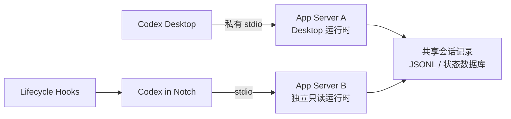
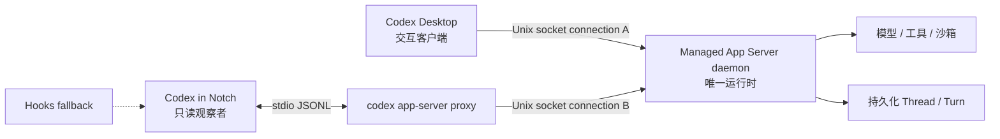

# 共享 Codex Desktop App Server 技术探索

| 字段 | 内容 |
| --- | --- |
| 文档状态 | 待验证；不是生产实现决策 |
| 首次记录 | 2026-08-13 |
| 探索点 | 让 Codex Desktop 与 Codex in Notch 连接同一个本地 App Server 实例 |
| 目标读者 | 后续负责调研、验证和实现的 Codex |
| 当前建议 | 先做隔离 spike；验证成功前不得替换现有 Hooks + 独立只读 App Server 路径 |
| 发布约束 | 共享 Desktop 运行时目前涉及实验性协议和未公开的 Desktop 启动开关，不得默认进入生产版本 |

> 目录约定：可探索的技术路径统一放在 `docs/technical-explorations/` 下，每个探索点拥有自己的二级目录。本探索点使用 `shared-app-server/`；后续探索点应创建并列目录，不要把无关实验追加到本文。

## 1. 文档目的与使用方式

本文不是概念说明或最终架构决定，而是一份可以交给未来 Codex 直接执行的探索手册。它记录：

- 为什么共享 App Server 可能从根本上提高状态准确性。
- 截至记录日期已经通过官方文档、当前安装包和本机进程验证的事实。
- 仍然未知、必须用真实 Desktop 样本确认的协议行为。
- 从无侵入探测到小范围实现的分阶段实验步骤。
- 每个阶段的安全边界、停止条件、验收矩阵和回滚方法。
- 若实验成功，需要修改的代码边界与正式化门槛。

未来执行者开始工作时必须先完成以下动作：

1. 阅读本文全文，再阅读 `docs/tech-design.md` 中 App Server、Hooks、严格 Turn 身份和安全约束相关章节。
2. 检查 `git status --short`，保护用户已有改动；不要默认修改当前实现。
3. 重新查询官方 App Server 文档和当前 CLI 帮助，不得把本文记录的实验参数视为永久契约。
4. 重新记录 Desktop 版本、Codex CLI 版本、App Server 协议版本和当前进程启动参数。
5. 只有用户明确要求执行 spike 或实现时，才可以启动 daemon、重启 Desktop、设置启动环境或改代码。
6. 任何时候都不得修改 `ChatGPT.app`、`app.asar`、Desktop 私有数据库或向 Desktop 私有 IPC 注入消息。

## 2. 问题背景

当前 Codex in Notch 与 Codex Desktop 分别运行自己的 App Server：



两个 App Server 可以读取相同的持久化会话记录，但不共享进程内运行时。独立 App Server 因而可能看到历史 Turn，却看不到 Desktop 正在处理的活动 Turn、等待请求、订阅关系和实时终态通知。

这导致当前实现必须组合多种证据：

- Hooks 提供 `UserPromptSubmit`、权限管线、输入请求和 `Stop` 等实时边界。
- `thread/list` / `thread/read` 提供标题、集合和持久化 Turn 状态。
- reducer 使用严格 `thread_id + turn_id` 身份和新鲜度门槛合并证据。

该组合可以失败关闭，但仍存在结构性缺口：

- `Stop` 只证明 Turn 到达终态边界，不说明是 `completed`、`failed` 还是 `interrupted`。
- 独立 `thread/read` 可能在 Desktop Turn 尚未稳定时返回瞬时或重建状态。
- `PermissionRequest` Hook 证明进入权限管线，不等于用户仍需审批。
- Running 结束后必须等待另一来源补全终态，容易出现中间态或错误映射。

本探索的核心假设是：

> 如果 Desktop 和 Codex in Notch 连接同一个 App Server 进程，并且 Codex in Notch 能以只读观察者身份订阅同一个 Thread，那么 `turn/*`、`item/*`、`thread/status/changed` 和 `serverRequest/resolved` 可以成为同一运行时内的权威事件流，从而替代大部分跨进程猜测。

## 3. 已确认事实快照

以下事实只代表 2026-08-13 的安装版本。未来执行时必须重新验证。

### 3.1 官方协议能力

官方文档：<https://developers.openai.com/codex/app-server/>

当前公开文档确认：

- App Server 使用双向 JSON-RPC 2.0 协议。
- 支持 `stdio://`、`ws://IP:PORT`、`unix://` 和 `unix://PATH` 等 transport。
- Unix socket transport 在本质上是通过 Unix socket 建立 WebSocket 连接。
- 每个连接都必须独立完成 `initialize -> initialized` 握手。
- `thread/start` 会自动订阅该连接；`thread/resume` 用于重新打开已有 Thread。
- `thread/read` 只读取持久化 Thread，不加载、不恢复，也不订阅事件。
- `thread/unsubscribe` 的语义针对“当前连接”，且协议包含“最后一个 subscriber”的行为；因此协议模型支持同一 App Server 上存在多个连接/订阅者。
- 启动或恢复 Thread 后，连接可以接收 `thread/status/changed`、`turn/*`、`item/*` 和 `serverRequest/resolved`。
- `turn/completed.turn.status` 的终态是 `completed`、`interrupted` 或 `failed`。
- App Server listener、WebSocket 和相关 daemon 能力仍带有实验性/不保证生产稳定的约束。

### 3.2 当前 Desktop 运行方式

本机只读进程检查曾观察到 Desktop 启动：

```text
/Applications/ChatGPT.app/Contents/Resources/codex \
  -c features.code_mode_host=true \
  app-server \
  --analytics-default-enabled
```

该命令没有传入 `--listen unix://...` 或 `--listen ws://...`，所以使用默认 `stdio://`。对该进程执行只读 socket 检查时：

- 没有发现 TCP `LISTEN`。
- 没有发现带文件路径、可由第三方连接的 Unix listener。
- 只有 Desktop 父进程与 App Server 之间的匿名 Unix socket/stdio 通道。

结论：Codex in Notch 无法安全附着到“当前已经运行”的 Desktop stdio App Server。复用同一实例必须在 Desktop 启动前改变双方的连接拓扑，不能截获或复用现有文件描述符。

### 3.3 当前 CLI 与 daemon 能力

当时随 Desktop 安装的 CLI 版本为：

```text
codex-cli 0.147.0-alpha.6.5
```

CLI 帮助公开了以下命令：

```text
codex app-server daemon start
codex app-server daemon stop
codex app-server daemon restart
codex app-server daemon version
codex app-server proxy
codex app-server --listen unix://
```

其中：

- `daemon` 管理一个本地长期运行的 App Server。
- 默认控制 socket 路径是 `$CODEX_HOME/app-server-control/app-server-control.sock`；默认 `CODEX_HOME` 通常为 `~/.codex`。
- `app-server proxy` 把自身 stdio 上的 JSONL 转发到正在运行的 App Server control socket。
- `proxy` 是最适合现有 Codex in Notch 客户端做第一阶段 spike 的接入方式，因为当前 Swift 客户端已经实现 stdio JSONL，不必先实现 Unix WebSocket transport。

### 3.4 当前 Desktop 安装包中的实验接入路径

对当前 `ChatGPT.app/Contents/Resources/app.asar` 的只读检查发现：

```text
CODEX_APP_SERVER_USE_LOCAL_DAEMON=1
```

当前实现满足本地 host、没有冲突的 CLI override、daemon 版本兼容等条件时，会尝试连接：

```text
$CODEX_HOME/app-server-control/app-server-control.sock
```

而不是启动独立 stdio App Server。

必须把这条信息视为安装包实现细节，而不是公开 Desktop 产品契约：

- 官方 Desktop 设置和公开文档目前没有承诺这个环境变量。
- 名称、条件、socket 路径和版本检查都可能随 Desktop 更新变化。
- 不得通过修改 `app.asar` 强制开启。
- 正式产品不能只靠该开关长期存在来保证可用性。

### 3.5 当前 Codex in Notch 实现限制

相关代码：

- `CodexInNotch/CodexInNotch/CodexAppServerClient.swift`
- `CodexInNotch/CodexInNotch/LiveCodexMonitorService.swift`
- `CodexInNotch/CodexInNotch/HookIntegration.swift`
- `CodexInNotch/CodexInNotch/MonitorDomain.swift`

当前客户端：

- 启动 `codex app-server --listen stdio://`，因此创建独立运行时。
- 实现了请求/响应关联和增量 JSONL 解析。
- 故意忽略所有没有 `id` 的 notification。
- 没有区分“带 `id + method` 的 server-initiated request”和普通 response。
- 不会订阅或 reduce `turn/*`、`item/*`、`thread/status/changed`。

因此即使把进程参数改为 `app-server proxy`，也必须先补齐消息分类、事件流和严格 reducer，才能获得共享运行时的价值。

## 4. 目标架构



目标属性：

1. Desktop 仍然是唯一交互客户端和用户操作入口。
2. Codex in Notch 只观察，不发送 `turn/start`、`turn/steer`、`turn/interrupt`、审批决定、用户输入、归档或删除请求。
3. 两个客户端看到相同的 loaded Thread、活动 Turn 和终态事件。
4. Hooks 保留为兼容和降级通道，但不再负责猜测终态原因。
5. daemon 或共享模式不可用时，应用自动回退到现有安全路径；不得为了显示状态而阻塞 Desktop。

## 5. 推荐的接入路线

### 5.1 路线 A：通过 `app-server proxy` 做 spike（优先）

Codex in Notch 继续管理一个 stdio 子进程，但参数从：

```text
codex app-server --listen stdio://
```

实验性地改为：

```text
codex app-server proxy
```

优点：

- 最大化复用现有 `Process + Pipe + JSONL` 客户端。
- daemon socket 和 WebSocket framing 由官方 CLI proxy 负责。
- 可以快速证明共享运行时和多客户端订阅是否成立。
- 失败时只需退出 proxy；不会直接实现或维护私有 socket 协议。

限制：

- 多一个 proxy 子进程。
- proxy 和 daemon 都是实验能力。
- 正式实现仍需版本探测、重连和降级。

### 5.2 路线 B：Swift 直接连接 Unix socket（只在路线 A 成功后评估）

优点：

- 少一个转发进程。
- 可以直接管理连接、心跳和重连。

代价：

- 需要实现 Unix socket 上的 WebSocket Upgrade、frame、ping/pong、关闭和重连。
- 协议实验期内维护成本与版本耦合更高。
- 更容易错误处理认证、backpressure 和半连接状态。

在 proxy 已证明成为性能或可靠性瓶颈之前，不应优先选择此路线。

### 5.3 明确拒绝的路线

- 不附着、复制或劫持 Desktop App Server 的 stdio 文件描述符。
- 不注入 Electron IPC。
- 不修改 `app.asar` 或应用签名内容。
- 不读取或复制认证 token 来模拟 Desktop。
- 不把轮询 JSONL/SQLite 的结果伪装成同一运行时事件。

## 6. 事件权威性与状态模型

共享进程只是前提，不自动保证状态正确。所有事件仍必须使用精确 `threadId + turnId`，并按事件语义决定权威级别。

### 6.1 建议的事件映射

| App Server 证据 | Codex in Notch 状态 | 约束 |
| --- | --- | --- |
| `turn/started`，`turn.status == inProgress` | Running | 建立或确认精确当前 Turn |
| `item/commandExecution/requestApproval` | Approval Needed | 必须是当前 `threadId + turnId`；记录 request id |
| `item/fileChange/requestApproval` | Approval Needed | 同上 |
| `item/permissions/requestApproval` | Approval Needed | 同上 |
| `item/tool/requestUserInput` | Input Needed | 必须绑定 request/tool item id |
| `serverRequest/resolved` | 清除匹配的 pending request | 只清除相同 request id；若 Turn 未终止，回到 Running |
| `turn/completed(status: completed)` | Completed | 当前 Turn 已结束 |
| `turn/completed(status: failed)` | Completed | 产品不区分结束原因 |
| `turn/completed(status: interrupted)` | Completed | 产品不区分结束原因 |
| `thread/status/changed.activeFlags` | 辅助校正 | 不能创建 Turn、猜测 Turn id 或复活终态 Turn |
| `item/started` / `item/completed` | 内容与阶段辅助证据 | 不得覆盖 `turn/completed` |
| Hook `Stop` | Completed fallback | 同一当前 Turn 直接结束，不再解析原因 |

### 6.2 单会话状态优先级

对于同一个精确 Turn，建议 reducer 使用：

```text
Completed
  > 未解决的 Input request
  > 未解决的 Approval request
  > 已开始且未终止的 Running
```

必须继续保留：

- `threadId + turnId` 严格匹配。
- pending request id/tool item id 成对关闭。
- 已终止 Turn 不被迟到 `item/started`、active flag 或 Hook 复活。
- 新 Turn 只能由明确的新 Turn 事件建立，不能按时间邻近猜测。
- notification 重放或重连补发必须幂等。

### 6.3 顶部总状态

共享 App Server 不改变产品层聚合规则。顶部状态仍由当前会话集合按 `MonitorDomain` 中的既定优先级聚合。实施时必须单独测试：

- 一个 Approval + 一个 Running。
- 一个 Input + 一个 Approval。
- 一个 Completed + 一个仍在 Running 的 Turn。
- 多个终态与活动 Turn 并存。

不得因为事件来源变为实时流而顺手修改产品优先级。

## 7. 分阶段验证计划

每个阶段完成后都要记录证据，再决定是否进入下一阶段。任何阶段出现 Desktop 行为变化、审批阻塞或数据破坏风险，立即停止并回滚。

### Phase 0：重新确认能力与基线

目标：证明当前机器仍具备本文依赖的入口，不改变运行状态。

建议只读命令：

```sh
/Applications/ChatGPT.app/Contents/Resources/codex --version
/Applications/ChatGPT.app/Contents/Resources/codex app-server --help
/Applications/ChatGPT.app/Contents/Resources/codex app-server daemon --help
/Applications/ChatGPT.app/Contents/Resources/codex app-server proxy --help
ps -axo pid=,ppid=,command=
```

对经过 `ps` 明确识别的 App Server PID，再执行：

```sh
lsof -nP -a -p <validated-app-server-pid> -U
lsof -nP -a -p <validated-app-server-pid> -iTCP
```

检查项目：

- Desktop 是否仍启动 `app-server`。
- 是否仍默认使用 stdio。
- daemon/proxy 命令是否仍存在。
- 默认 socket 路径是否变化。
- 安装包是否仍包含 local-daemon 分支；只允许读取，不允许修改。
- daemon 与 Desktop bundled CLI 是否满足版本兼容。

停止条件：

- 官方协议已删除多连接、Unix socket 或 subscription 语义。
- 当前 Desktop 不再具备 local-daemon 路径。
- 只能通过修改安装包或注入 IPC 才能继续。

### Phase 1：隔离验证 daemon 与 proxy

目标：不重启 Desktop，不连接真实活动 Thread，只验证 daemon 生命周期和第二客户端握手。

执行前：

- 确认用户已授权启动本地 daemon。
- 记录当前是否存在 daemon；不得误停用户已经在使用的 daemon。
- 不修改 Desktop 启动环境。

建议流程：

1. 使用随当前 Desktop 安装的同一 Codex binary 启动 daemon。
2. 执行 `daemon version`，保存 CLI 版本和运行中 App Server 版本。
3. 检查 socket 存在、属主是当前用户、权限不会允许其他用户连接。
4. 启动 `codex app-server proxy`。
5. 通过 proxy 完成 `initialize -> initialized`。
6. 只调用 `thread/loaded/list`、`thread/list`、`account/read` 等只读方法。
7. 关闭 proxy，确认 daemon 仍健康。
8. 如果 daemon 是本次实验启动且用户不希望保留，使用 `daemon stop` 回滚；不要手工删除未知 socket 或状态目录。

预期结果：

- proxy 是 daemon 的新 connection，而不是新建独立 App Server。
- 两个 proxy connection 可以分别 initialize。
- 一个 proxy 断开不影响另一个连接与 daemon。

### Phase 2：让 Codex in Notch 成为 daemon 观察客户端

目标：在不让 Desktop 使用 daemon 的情况下，完成客户端 transport 和事件解析基础设施。

建议实现必须受仅测试可用的 feature flag 或依赖注入控制，默认生产路径不变。

#### 7.2.1 Transport 抽象

建议引入类似结构：

```swift
enum AppServerEndpoint {
    case standaloneStdio
    case localDaemonProxy
}
```

`standaloneStdio` 保持当前行为；`localDaemonProxy` 启动 `app-server proxy`。不要把环境变量或 Desktop 重启逻辑写进底层 transport。

#### 7.2.2 Envelope 分类

当前“有 id 就当 response、无 id 就忽略”的规则必须替换为：

```text
有 method、无 id  -> notification
有 method、有 id  -> server-initiated request
无 method、有 id  -> response 或 error
其他              -> malformed / diagnostic
```

要求：

- response 仍按 request id 恢复 continuation。
- notification 进入顺序保持的事件流。
- server request 单独暴露给安全策略，不能误当 response。
- 未识别 notification 允许忽略，但必须有脱敏计数，不能断开健康 transport。
- 不记录 prompt、命令、路径、原始 Thread id 或完整 envelope。

#### 7.2.3 只读 server-request 策略

Codex in Notch 不得代替 Desktop 回答 approval、permission、user input、dynamic tool 或 auth refresh request。

必须用实验确定 server request 在多客户端下是：

- 只路由给发起/拥有 Turn 的 Desktop connection；还是
- 广播给所有订阅 connection；还是
- 根据某种 capability/host client 规则选择。

如果请求只路由给 Codex in Notch，且不响应会阻塞 Desktop Turn，则该架构立即 NO-GO，除非官方提供明确的 observer capability 或只读订阅方法。不得通过“自动 decline/cancel”规避阻塞，因为那会改变用户 Turn。

### Phase 3：让 Desktop 与 Codex in Notch 共享 daemon

目标：验证同一真实 Desktop Turn 的多客户端事件流。这是第一个会改变 Desktop 启动方式的阶段。

执行前必须再次获得用户明确授权，因为需要：

- 完全退出并重新启动 Desktop。
- 启动或复用 daemon。
- 临时设置 Desktop 可见的环境变量。
- 实验结束后恢复启动环境。

#### 7.3.1 优先使用进程局部环境

如果可以在不改变登录会话全局环境的情况下直接启动 Desktop 可执行文件，优先使用一次性环境：

```sh
CODEX_APP_SERVER_USE_LOCAL_DAEMON=1 \
  /Applications/ChatGPT.app/Contents/MacOS/ChatGPT
```

必须先确认没有仍在运行的 Desktop 实例，且不要用强制终止代替正常退出。

#### 7.3.2 `launchctl` 仅作为受控备选

如果 Launch Services 启动必须使用用户会话环境，可以临时执行：

```sh
launchctl setenv CODEX_APP_SERVER_USE_LOCAL_DAEMON 1
open -a ChatGPT
```

实验结束，无论成功失败都必须恢复：

```sh
launchctl unsetenv CODEX_APP_SERVER_USE_LOCAL_DAEMON
```

不得把该环境变量写入 shell profile、LaunchAgent 或永久设置。执行者必须在最终报告中明确说明是否已经 unset。

#### 7.3.3 确认 Desktop 真的使用共享 daemon

不能因为设置了环境变量就假设成功。至少需要三类证据：

1. `daemon version` 返回运行中实例及兼容版本。
2. Desktop 进程树不再包含由 Desktop 新建的独立 stdio App Server，或有其他明确连接 daemon 的证据。
3. Codex in Notch 连接后，`thread/loaded/list` 能看到 Desktop 当前 loaded Thread。

若 Desktop 静默回退到独立 stdio App Server，必须判为未共享，不得继续解释事件结果。

#### 7.3.4 建立观察订阅

公开协议目前没有单独的 `thread/subscribe`。需要验证以下路径：

1. Codex in Notch 连接 daemon 并完成 initialize。
2. 调用 `thread/loaded/list` 获取 daemon 中已加载 Thread。
3. 观察未调用 `thread/resume` 时是否已经收到全局 `thread/status/changed` 或 Turn 事件。
4. 若没有事件，只对明确 loaded 的测试 Thread 调用不带配置 override 的 `thread/resume`。
5. 验证 `thread/resume` 只增加当前 connection 的订阅，不会中断活动 Turn、改变 model/cwd/sandbox/personality 或生成新 Turn。

`thread/resume` 在当前产品技术设计里不是获准的常规只读方法，因此只能用于该隔离 spike。只要观察到任何用户可见副作用，立即停止，不得进入正式实现。

#### 7.3.5 快照与事件竞态

重连后的正确初始化顺序必须通过实验确定。建议候选算法：

1. 先建立订阅并开始缓冲 notification。
2. 获取当前 Thread/Turn 快照。
3. 以精确 id 和事件顺序合并缓冲 notification。
4. 发布第一个 UI snapshot。
5. 之后持续 reduce notification。

目标是避免“先读快照、订阅前发生终态”造成丢事件，也避免“先处理 notification、再被旧快照覆盖”。若协议没有 sequence number，应使用当前 reducer 的事件身份、终态粘性和请求开始时间门槛，并在文档中记录仍然存在的不可消除窗口。

### Phase 4：真实状态矩阵

每个案例都必须保存脱敏事件序列：method、相对时间、哈希后的 thread/turn/request id、状态字段；不得保存 prompt、回复、命令或路径。

| 场景 | 必须观察到 | 不允许发生 |
| --- | --- | --- |
| 正常完成 | `turn/started -> turn/completed(completed)` | 中间产生第五种会话状态 |
| 用户取消 | `turn/started -> turn/completed(interrupted)` | 显示取消原因而不是 Completed |
| Turn 失败 | `turn/completed(failed)` | 显示失败原因而不是 Completed |
| 命令审批 | requestApproval；解决后 `serverRequest/resolved` | 没有真实 pending 时显示 Approval Needed |
| 文件修改审批 | requestApproval + resolved | Codex in Notch 回答审批 |
| 权限请求 | permissions request + resolved | 把权限管线 Hook 单独当 pending |
| 用户输入 | `tool/requestUserInput` + resolved | 用其他 tool item 清除 pending |
| 同一 Thread 下一 Turn | 新的明确 turn id | 旧 Turn 事件复活或覆盖新 Turn |
| 两个并发 Thread | 两套独立 id/event state | pending request 串线 |
| Notch 中途连接 | 正确 baseline 后继续流 | 展示历史 Running |
| Notch 断线重连 | 无重复终态、无状态倒退 | 重连导致 Desktop Turn 中断 |
| Desktop 重启 | daemon/连接恢复行为明确 | 环境残留导致 Desktop 无法启动 |
| daemon 重启 | 明确降级并恢复 | UI 清空可信状态或高频重启 |
| 睡眠/唤醒 | 连接重建且状态重新校正 | 重放旧 approval/input |

建议最低重复次数：

- 正常完成 30 次。
- 用户取消 30 次。
- 命令/文件/权限审批合计 30 次。
- 用户输入 20 次。
- 失败、断线、Desktop 重启和 daemon 重启各至少 10 次。
- 至少 20 组双 Thread 并发。

## 8. 成功标准

进入实现阶段前必须同时满足：

### 8.1 正确性

- 同一当前 Turn 的三种 `turn/completed` 结果与实时 Stop 都直接建立 Completed。
- Running、Input、Approval 到 Completed 之间不出现第五种可见会话状态。
- 没有真实 unresolved server request 时，Approval Needed 零误报。
- Input/Approval 只由匹配 request id 关闭，零跨 Turn 清除。
- 迟到、重复和重连补发事件不会复活 terminal Turn。
- 多 Thread 并发零串线。

### 8.2 时延

- Running、Approval、Input 和终态从 Desktop 事件到 Notch UI 的 p95 不超过 1 秒。
- 连接健康时不依赖 1 秒轮询获得状态变化。
- daemon/proxy 断开后 3 秒内进入明确降级状态，恢复后 5 秒内完成可信重建。

### 8.3 无副作用

- Codex in Notch 不发送任何 Turn 控制、审批、输入或归档类响应。
- Codex in Notch 连接、断开、崩溃或重启都不改变 Desktop Turn。
- Desktop 审批仍只能由 Desktop UI 正常完成。
- Desktop、daemon 与 proxy 均无明显 CPU/内存回归。
- socket 权限只允许当前用户访问。

### 8.4 可运维性

- Desktop/CLI 版本不兼容时自动关闭共享模式并回退。
- daemon 不存在时不循环拉起、不反复弹错。
- 实验开关默认关闭，具有 kill switch。
- 所有环境变量和 daemon 生命周期都有明确回滚路径。

## 9. NO-GO 条件

出现任一条件即停止将该方案产品化：

- 必须修改或重签 `ChatGPT.app`。
- 必须依赖注入、劫持 stdio 或 Desktop 私有 IPC。
- observer 收到必须响应的 server request，忽略会阻塞 Desktop。
- `thread/resume` 会改变活动 Turn 或配置，且没有官方只读订阅替代。
- Desktop 更新后经常改变隐藏环境变量或 socket 契约，无法可靠能力探测。
- 多客户端订阅会丢 `turn/completed`、重复审批或造成状态倒退。
- socket 权限或认证不能建立合理的本地安全边界。
- 共享 daemon 崩溃会让 Desktop 和 Notch 同时不可用，且不能安全降级。

## 10. 建议实现边界

只有 Phase 0–4 通过后，才考虑正式代码变更。

### 10.1 `CodexAppServerClient.swift`

- 抽象 standalone 与 daemon-proxy endpoint。
- 保留现有增量 JSONL buffer。
- 正确分类 response、notification 和 server request。
- 提供顺序事件流与连接 generation。
- 实现 daemon 版本/能力探测和有限退避重连。
- 任何 observer 模式下禁止发送非 allowlist 方法。

建议 observer allowlist 初始只包含：

```text
initialize
initialized
thread/list
thread/loaded/list
thread/read
thread/resume          # 仅在 spike 证明无副作用后
thread/unsubscribe
account/read
account/rateLimits/read
account/usage/read
```

正式化时应再次缩减 allowlist。若能不调用 `thread/resume` 就获得订阅，应删除它。

### 10.2 `LiveCodexMonitorService.swift`

- 引入 App Server notification reducer。
- 用 `threadId + turnId + requestId/itemId` 表达状态。
- 处理订阅 baseline、缓冲事件和重连校正。
- 共享模式健康时优先使用同运行时事件。
- 共享模式不可用时回退到当前 Hooks/只读 snapshot 逻辑。
- 不让旧 fallback snapshot 覆盖更新的共享事件。

### 10.3 `HookIntegration.swift`

- Hooks 继续作为兼容与降级来源。
- 共享事件流健康时，Hook 只能补充边界，不能覆盖权威 terminal/pending 结果。
- 保留严格身份、live cutoff 和 retired Turn 处理。

### 10.4 `MonitorDomain.swift` / `MonitorStore.swift`

- 如有需要，为状态增加证据来源与 connection generation，但不要暴露协议细节到 UI。
- 保持既有单会话和顶部聚合优先级，除非产品文档另行决定。
- 断线时保留最后可信状态的策略必须与当前 connection stability gate 对齐。

### 10.5 测试

至少新增：

- response / notification / server-request envelope 分类测试。
- notification 分片、合并、重复和乱序边界测试。
- `turn/completed` 三种协议结果统一映射 Completed 的测试。
- approval/input request 与 resolved 精确配对测试。
- terminal Turn 不可复活测试。
- 双 Thread 并发测试。
- 订阅前后 snapshot 竞态测试。
- daemon/proxy 断线、版本不兼容和 fallback 测试。
- observer outbound allowlist 测试，证明无法发出控制或审批响应。

## 11. 安全要求

本节曾经开头两条是隐私要求（不持久化正文、日志脱敏）。它们随 [`PRD.md`](../../PRD.md) 第 7 节一并删除：本产品没有网络出口，正文落不落盘换不来用户能察觉的任何东西。下面剩下的都是**本机其他进程**能不能借这条通道去控制 Codex 的问题，与隐私无关。

- 不把 App Server socket 暴露到非 loopback 网络。
- 不为方便调试关闭 socket 权限或复用认证材料。
- 不让 Codex in Notch 成为 approval client。
- 不自动设置 `CODEX_APP_SERVER_USE_LOCAL_DAEMON`；必须由用户显式开启实验。
- 应用退出时不擅自停止用户可能被其他客户端使用的 daemon。
- 只有本应用启动且拥有明确 ownership marker 的实验 daemon，才能在用户授权后自动停止。

## 12. 降级与回滚

共享模式必须是增强路径，不得成为 Desktop 可用性的单点依赖。

推荐状态机：

```text
Shared daemon available + Desktop confirmed attached
    -> SharedEventMode

Daemon absent / version mismatch / Desktop not attached
    -> ExistingHookAndSnapshotMode

Transport transient failure
    -> retain last trusted state briefly
    -> bounded reconnect
    -> fallback if stability gate fails
```

实验回滚清单：

1. 正常退出测试版 Codex in Notch/proxy。
2. 正常退出 Desktop。
3. 执行 `launchctl unsetenv CODEX_APP_SERVER_USE_LOCAL_DAEMON`，即使此前认为未设置也要核对。
4. 如果 daemon 是本次实验创建且没有其他客户端使用，执行 `codex app-server daemon stop`。
5. 重新正常启动 Desktop。
6. 用进程树确认 Desktop 恢复自己的 stdio App Server。
7. 验证可以创建 Turn、审批、取消和完成。
8. 在实验记录中写明环境是否恢复、daemon 是否保留。

不得使用 `kill -9`、删除整个 `~/.codex`、删除未知 socket 目录或修改用户认证状态作为常规回滚手段。

## 13. 风险清单

| 风险 | 影响 | 缓解方式 |
| --- | --- | --- |
| Desktop 隐藏开关变化 | 更新后无法共享 | 每次启动做版本/能力 gate；默认 fallback |
| daemon 与 bundled CLI 版本不匹配 | Desktop 回退或连接失败 | 使用 `daemon version`；不混用不同 binary |
| server request 路由不明确 | 审批或输入可能被阻塞 | spike 先验证；无 observer capability 时 NO-GO |
| `thread/resume` 有副作用 | 改变用户 Turn | 只对测试 Thread、无 override；任何副作用即停止 |
| 两个客户端处理同一 request | 重复决定或竞态 | Notch 永不响应；验证请求 ownership |
| daemon 成为共同故障点 | Desktop 和 Notch 同时断开 | 稳定性测试；Desktop 可回退；共享模式默认关闭 |
| socket 权限过宽 | 本地其他进程可控制 Codex | 校验 owner/mode；不暴露网络 listener |
| notification 丢失或重复 | 状态倒退/卡住 | baseline + 幂等 reducer + generation + 定期校正 |
| App 更新改变协议 schema | 解析错误 | 生成/对照当前版本 schema；未知字段前向兼容 |
| proxy 性能或崩溃 | 状态延迟/断开 | 采样 CPU/内存；有限重连；必要时再评估直接 socket |

## 14. 探索记录模板

未来每次实际探索后，在本节下追加记录，不要覆盖早期证据。

```markdown
### YYYY-MM-DD — <阶段/实验名称>

- 执行者：
- Desktop 版本/build：
- bundled Codex CLI：
- daemon App Server 版本：
- macOS 版本：
- 当前分支与 commit：
- 用户授权范围：
- 变更前进程/daemon 状态：
- 执行命令：仅记录无 secret 的命令
- 事件样本：method + 相对时间 + 哈希 id
- 结果：PASS / FAIL / BLOCKED
- 是否观察到副作用：
- 是否触发停止条件：
- 回滚动作：
- 环境变量已清除：是/否/未设置
- daemon 最终状态：运行/停止/原样保留
- 相关测试或日志路径：不得包含 secret、prompt 或原始会话 id
- 下一步建议：
```

## 15. 当前决策

截至 2026-08-13：

- **技术可行性：有明确依据，值得 spike。** App Server 协议和 daemon 模型支持多个连接，当前 Desktop 安装包也存在连接本地 daemon 的实验路径。
- **准确性收益：高。** 同运行时 `turn/completed` 和 request lifecycle 能直接解决 Approval 误报以及 Running 到 Completed 的同步间隙。
- **生产成熟度：不足。** Desktop 接入方式未形成公开稳定契约，多客户端 server-request routing 和只读订阅仍未证明。
- **建议：** 优先完成 daemon + proxy + notification reducer 的隔离验证，再在用户明确授权下进行 Desktop 共享运行时实验；在全部成功标准满足前，保留当前实现作为默认路径。

## 16. 参考入口

- 官方 Codex App Server：<https://developers.openai.com/codex/app-server/>
- 当前产品/集成技术设计：`docs/tech-design.md`
- 当前 App Server 客户端：`CodexInNotch/CodexInNotch/CodexAppServerClient.swift`
- 当前实时监控服务：`CodexInNotch/CodexInNotch/LiveCodexMonitorService.swift`
- 当前 Hook reducer：`CodexInNotch/CodexInNotch/HookIntegration.swift`
- 当前领域状态：`CodexInNotch/CodexInNotch/MonitorDomain.swift`
- 当前状态存储与连接稳定性：`CodexInNotch/CodexInNotch/MonitorStore.swift`
