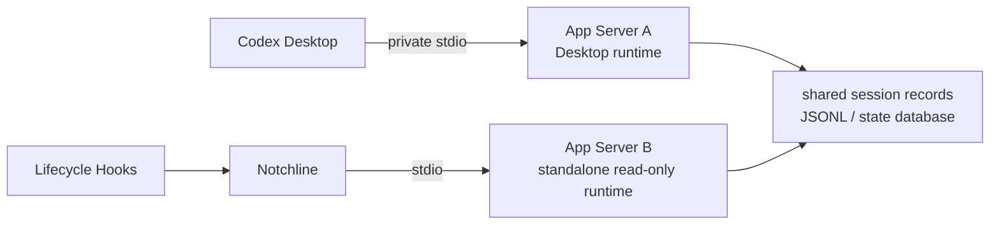
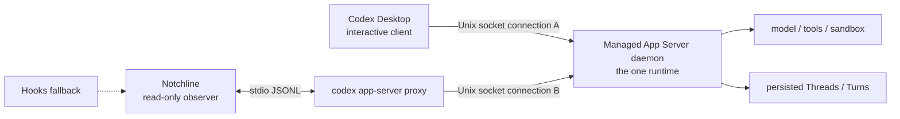

# Sharing one Codex Desktop App Server — technical exploration

| Field | Value |
| --- | --- |
| Status | Unverified; not a production decision |
| First recorded | 2026-08-13 |
| Question | Can Codex Desktop and Notchline connect to the same local App Server instance? |
| Audience | Whoever investigates, verifies and implements this next |
| Recommendation | Spike it in isolation first; the existing Hooks + standalone read-only App Server path must not be replaced before that succeeds |
| Release constraint | Sharing a Desktop runtime currently involves experimental protocol and an undocumented Desktop launch switch, and must not reach production by default |

> Directory convention: explorable technical paths live under `docs/technical-explorations/`, one second-level directory each. Later evidence is appended rather than overwriting what is there.

## 1. How to use this document

This is not a concept note or a final architecture decision but a handbook the next person can execute directly. It records why sharing an App Server could fundamentally improve status accuracy, what has been verified against official documentation and the installed package as of the recorded date, what remains unknown and must be confirmed against real Desktop samples, the staged experiments from non-invasive probing to a small implementation, and each stage's safety boundary, stop conditions and rollback.

Before starting, the executor must: read this document and `docs/tech-design.md`'s App Server, Hooks, strict Turn identity and safety sections; check `git status --short` and protect the user's existing changes; re-read the official App Server documentation and current CLI help rather than treating the parameters recorded here as a permanent contract; re-record the Desktop version, Codex CLI version, App Server protocol version and current process launch arguments; start a daemon, restart Desktop, set launch environment or change code **only** when the user explicitly asks for a spike or an implementation; and **never** modify `ChatGPT.app`, `app.asar`, Desktop's private databases, or inject into Desktop's private IPC.

## 2. The problem

Notchline and Codex Desktop each run their own App Server:



Both can read the same persisted session records but share no in-process runtime. A standalone App Server can therefore see historical Turns while seeing nothing of the Turn Desktop is currently processing, its pending requests, its subscriptions or its live terminal notifications.

So the current implementation has to combine kinds of evidence: hooks give live boundaries (`UserPromptSubmit`, the permission pipeline, input requests, `Stop`), `thread/list` / `thread/read` give titles, membership and persisted Turn status, and the reducer merges them under strict `thread_id + turn_id` identity with freshness gates.

That combination can fail closed, and it still has structural gaps:

- `Stop` proves a Turn reached a terminal boundary without saying whether it was `completed`, `failed` or `interrupted`.
- A standalone `thread/read` may return a transient or reconstructed state while a Desktop Turn has not settled.
- The `PermissionRequest` hook proves the permission pipeline ran, not that a user still needs to approve.
- After Running ends, another source has to supply the terminal state, which invites intermediate states and wrong mappings.

The core hypothesis:

> If Desktop and Notchline connect to the same App Server process and Notchline can subscribe to the same Thread as a read-only observer, then `turn/*`, `item/*`, `thread/status/changed` and `serverRequest/resolved` become an authoritative event stream inside one runtime, replacing most cross-process guessing.

## 3. Confirmed facts

These describe the installed version as of 2026-08-13 and must be re-verified before any future work.

### 3.1 Official protocol capabilities

Official documentation: <https://developers.openai.com/codex/app-server/>

- The App Server uses bidirectional JSON-RPC 2.0.
- It supports `stdio://`, `ws://IP:PORT`, `unix://` and `unix://PATH` transports, where the Unix socket transport is essentially a WebSocket over a Unix socket.
- Every connection completes its own `initialize -> initialized` handshake.
- `thread/start` subscribes that connection automatically; `thread/resume` reopens an existing Thread.
- `thread/read` reads a persisted Thread without loading, resuming or subscribing.
- `thread/unsubscribe` is scoped to "the current connection", and the protocol has "last subscriber" behaviour — so the protocol model supports several connections and subscribers on one App Server.
- After starting or resuming a Thread, a connection can receive `thread/status/changed`, `turn/*`, `item/*` and `serverRequest/resolved`.
- **Notifications are addressed to subscribers, and the server counts them** (observed 2026-09-08 in Desktop's own `logs_2.sqlite`, target `codex_app_server::outgoing_message`). Every outgoing notification is logged `app-server event: <name> targeted_connections=N`: `1` for `item/started`, `item/completed`, `turn/started`, `turn/completed`, `thread/status/changed` and `serverRequest/resolved` while Desktop is the only client, and `0` for `thread/closed` and `skills/changed`, which nothing was subscribed to at the time. So a fan-out to subscribers is what the implementation does, not only what the protocol permits — and the count is a **direct check** on whether a second observer is actually attached, worth asserting in Phase 3 rather than inferring. It says nothing about server *requests*, which need exactly one responder; that question is still §7 Phase 2's.
- `turn/completed.turn.status`'s terminal values are `completed`, `interrupted` and `failed`.
- The App Server listener, WebSocket and daemon capabilities all still carry experimental / not-guaranteed-for-production caveats.

### 3.2 How Desktop currently runs

A read-only process inspection on this machine observed Desktop launching:

```text
/Applications/ChatGPT.app/Contents/Resources/codex \
  -c features.code_mode_host=true \
  app-server \
  --analytics-default-enabled
```

with no `--listen unix://…` or `--listen ws://…`, so it uses the default `stdio://`. A read-only socket inspection of that process found no TCP `LISTEN`, no file-path Unix listener a third party could connect to, and only the anonymous Unix socket / stdio channel between the Desktop parent and the App Server.

**Conclusion**: Notchline cannot safely attach to an already-running Desktop stdio App Server. Sharing one instance requires changing both sides' connection topology before Desktop launches, and never intercepting or reusing an existing file descriptor.

### 3.3 CLI and daemon capabilities

The CLI shipped with Desktop then was `codex-cli 0.147.0-alpha.6.5`, whose help exposes:

```text
codex app-server daemon start | stop | restart | version
codex app-server proxy
codex app-server --listen unix://
```

- `daemon` manages one long-running local App Server.
- The default control socket is `$CODEX_HOME/app-server-control/app-server-control.sock`, with `CODEX_HOME` usually `~/.codex`.
- `app-server proxy` forwards JSONL on its own stdio to a running App Server's control socket.
- `proxy` is the best first-stage entry for the existing Swift client, which already speaks stdio JSONL and would otherwise need a Unix WebSocket transport first.

### 3.4 The experimental entry point inside the current Desktop package

A read-only inspection of `ChatGPT.app/Contents/Resources/app.asar` found:

```text
CODEX_APP_SERVER_USE_LOCAL_DAEMON=1
```

Under which the current implementation, given a local host, no conflicting CLI override and a compatible daemon version, tries to connect to `$CODEX_HOME/app-server-control/app-server-control.sock` instead of starting a standalone stdio App Server.

This must be treated as a package implementation detail rather than a public Desktop product contract: official settings and public documentation promise nothing about this variable; the name, conditions, socket path and version checks may all change with a Desktop update; it must never be forced on by modifying `app.asar`; and a shipping product cannot rely on that switch continuing to exist.

### 3.5 Current Notchline limitations

The current client (`CodexAppServerClient.swift`, `LiveCodexMonitorService.swift`, `HookIntegration.swift`, `MonitorDomain.swift`) starts `codex app-server --listen stdio://` and therefore creates a standalone runtime; it implements request/response correlation and incremental JSONL parsing; it deliberately ignores every notification with no `id`; it does not distinguish a server-initiated request (with both `id` and `method`) from an ordinary response; and it neither subscribes to nor reduces `turn/*`, `item/*` or `thread/status/changed`.

So even changing the process arguments to `app-server proxy` would first require message classification, an event stream and a strict reducer before a shared runtime is worth anything.

## 4. The target architecture



Target properties: Desktop remains the only interactive client and the only place a user acts; Notchline only observes and never sends `turn/start`, `turn/steer`, `turn/interrupt`, an approval decision, user input, an archive or a delete; both clients see the same loaded Threads, active Turns and terminal events; hooks remain as a compatibility and degradation channel but stop guessing terminal reasons; and when the daemon or shared mode is unavailable the app falls back automatically to the existing safe path, never blocking Desktop in order to display status.

## 5. Recommended routes

### 5.1 Route A: spike through `app-server proxy` (preferred)

Notchline keeps managing one stdio subprocess, with the arguments changed experimentally from `codex app-server --listen stdio://` to `codex app-server proxy`.

Advantages: it reuses the existing `Process + Pipe + JSONL` client almost entirely; the daemon socket and WebSocket framing are the official CLI proxy's problem; it can quickly prove whether a shared runtime and multi-client subscription hold; and a failure only means quitting the proxy rather than implementing and maintaining a private socket protocol.

Limits: one more subprocess, both the proxy and the daemon are experimental, and a real implementation would still need version probing, reconnection and degradation.

### 5.2 Route B: connect the Unix socket directly from Swift (evaluate only after A succeeds)

Advantages: one fewer forwarding process, and direct control of the connection, heartbeats and reconnection.

Costs: implementing WebSocket upgrade, framing, ping/pong, close and reconnect over a Unix socket; higher maintenance and version coupling during a protocol's experimental period; and more room to get authentication, backpressure and half-open states wrong.

It should not be preferred until the proxy is demonstrably a performance or reliability bottleneck.

### 5.3 Explicitly rejected routes

Attaching to, duplicating or hijacking Desktop's App Server stdio file descriptors; injecting Electron IPC; modifying `app.asar` or anything covered by the signature; reading or copying authentication tokens to impersonate Desktop; and dressing polled JSONL/SQLite results up as same-runtime events.

## 6. Event authority and the state model

A shared process is a precondition and guarantees no correctness by itself. Every event still needs an exact `threadId + turnId`, with its authority decided by its semantics.

| App Server evidence | Notchline status | Constraint |
| --- | --- | --- |
| `turn/started`, `turn.status == inProgress` | Running | Establishes or confirms the exact current Turn |
| `item/commandExecution/requestApproval` | Approval needed | Must be the current `threadId + turnId`; record the request id |
| `item/fileChange/requestApproval` | Approval needed | As above |
| `item/permissions/requestApproval` | Approval needed | As above |
| `item/tool/requestUserInput` | Input needed | Must bind to the request/tool item id |
| `serverRequest/resolved` | Clear the matching pending request | Only the same request id; if the Turn has not ended, back to Running |
| `turn/completed(status: completed)` | Completed | The current Turn has ended |
| `turn/completed(status: failed)` | Completed | The product does not distinguish why |
| `turn/completed(status: interrupted)` | Completed | The product does not distinguish why |
| `thread/status/changed.activeFlags` | Auxiliary correction | May not create a Turn, guess a Turn id, or revive a terminal Turn |
| `item/started` / `item/completed` | Content and phase evidence | Must not override `turn/completed` |
| Hook `Stop` | Completed fallback | Ends that same current Turn directly, with no reason parsed |

For one exact Turn the reducer should use `Completed > an unresolved Input request > an unresolved Approval request > started-and-unterminated Running`, while keeping strict `threadId + turnId` matching, paired closing by request/tool item id, no revival of a terminated Turn by a late `item/started`, active flag or hook, new Turns established only by an explicit new-Turn event rather than temporal proximity, and idempotence under notification replay or reconnect re-delivery.

A shared App Server changes no product-level aggregation: the top-level status is still aggregated from the current session set by `MonitorDomain`'s existing priority. Implementation must separately test one Approval plus one Running, one Input plus one Approval, one Completed plus a Running Turn, and several terminal Turns alongside active ones — and must not casually change the product priority just because events became a live stream.

## 7. Staged verification

Each stage records evidence before the next begins. Any stage that changes Desktop behaviour, blocks an approval or risks data damage stops and rolls back immediately.

### Phase 0: re-confirm capabilities and the baseline

Prove this machine still has the entry points this document depends on, changing no state. Read-only: `codex --version`, `app-server --help`, `app-server daemon --help`, `app-server proxy --help`, and `ps -axo pid=,ppid=,command=`; then, for an App Server PID identified through `ps`, `lsof -nP -a -p <pid> -U` and `-iTCP`.

Check that Desktop still starts `app-server`, still defaults to stdio, that the daemon/proxy commands still exist, whether the default socket path changed, that the package still contains the local-daemon branch (read only, never modified), and that the daemon and Desktop's bundled CLI are version-compatible.

Stop if the official protocol has dropped multi-connection, Unix socket or subscription semantics; if the current Desktop no longer has a local-daemon path; or if continuing would require modifying the package or injecting IPC.

### Phase 1: verify the daemon and proxy in isolation

Verify daemon lifetime and a second client's handshake without restarting Desktop and without connecting to a real active Thread.

First confirm the user has authorised starting a local daemon, and record whether a daemon already exists — never stop one the user is already using. Do not modify Desktop's launch environment.

Then: start the daemon with the same Codex binary Desktop ships; run `daemon version` and save both the CLI and the running App Server versions; check the socket exists, is owned by the current user, and has permissions no other user can connect through; start `codex app-server proxy`; complete `initialize -> initialized` through it; call only read-only methods (`thread/loaded/list`, `thread/list`, `account/read`); close the proxy and confirm the daemon is still healthy; and if the daemon was started by this experiment and the user does not want it kept, roll back with `daemon stop` rather than deleting an unknown socket or state directory by hand.

Expected: the proxy is a new connection to the daemon rather than a new standalone App Server; two proxy connections can initialize independently; and one proxy disconnecting affects neither the other connection nor the daemon.

### Phase 2: make Notchline a daemon observer client

Build the client transport and event parsing without letting Desktop use the daemon. The implementation must be behind a test-only feature flag or dependency injection, leaving the default production path unchanged.

**Transport abstraction** — something like `enum AppServerEndpoint { case standaloneStdio, localDaemonProxy }`, where `standaloneStdio` keeps today's behaviour and `localDaemonProxy` starts `app-server proxy`. Environment variables and Desktop restart logic must never enter the transport layer.

**Envelope classification** — today's "has an id so it is a response, has none so ignore it" must be replaced by:

```text
method, no id  -> notification
method and id  -> server-initiated request
no method, id  -> response or error
anything else  -> malformed / diagnostic
```

Responses still resume continuations by request id; notifications enter an order-preserving event stream; server requests are exposed separately to the safety policy and never mistaken for responses; unrecognised notifications may be ignored but must be counted in a redacted form and must not drop a healthy transport; and prompts, commands, paths, raw thread ids and whole envelopes are never recorded.

**The question lifecycle, added 2026-09-08.** Phase 2 must also establish whether an observer sees a **question** open and close, because that is the one thing hooks demonstrably cannot deliver and it is now a known hole in the shipped product ([`answering-codex`](../answering-codex/README.md) §3.6.1). Codex's `request_user_input_async` asks a person, returns to the model in 51 ms and lets the Turn run on; the app keeps the question's words from the hook and draws them, and deliberately claims no `Input needed`, because **nothing on the hook channel ever says the question ended** — an answer arrives as the next `UserPromptSubmit`, and a Skip, a snooze and Desktop's own auto-resolution arrive as nothing. What to measure, on a thread this connection did not start:

- Does the observer receive `item/started` for the `agentMessage` whose `delivery` is `async` — the same item Desktop builds its card from?
- Does it receive `serverRequest/resolved` for that request's id? That notification carries `requestId` and `threadId` and fires **however the request ended**, which is the closing edge the hook channel has not got. `targeted_connections` (§3.1) says whether it was actually addressed to us.
- Does the observer also receive the `item/tool/requestUserInput` **request** itself, with `isBlocking: false`? That is the NO-GO test below, read at its sharpest: this request is one Desktop answers on a 60 s-inactivity-plus-90 s clock, so an observer that receives it and ignores it may be changing what the user's Turn does rather than merely watching it.

Answering any of them is out of scope in every phase; the question here is only what an observer is *told*.

**Read-only server-request policy** — Notchline must never answer an approval, permission, user-input, dynamic-tool or auth-refresh request on Desktop's behalf. Experiment must establish whether a server request under multiple clients is routed only to the Desktop connection that owns the Turn, broadcast to every subscribed connection, or chosen by some capability/host-client rule. **If a request is routed to Notchline and not answering it blocks a Desktop Turn, this architecture is immediately NO-GO** unless an official observer capability or read-only subscription method exists. Automatically declining or cancelling to avoid blocking is not acceptable, because it changes the user's Turn.

### Phase 3: let Desktop and Notchline share a daemon

Verify multi-client event streams on the same real Desktop Turn. This is the first stage that changes how Desktop launches, and needs explicit user authorisation again, because it requires fully quitting and restarting Desktop, starting or reusing a daemon, temporarily setting an environment variable Desktop can see, and restoring the launch environment afterwards.

**Prefer a process-local environment.** If Desktop's executable can be launched directly without changing the login session's global environment, use a one-off environment:

```sh
CODEX_APP_SERVER_USE_LOCAL_DAEMON=1 /Applications/ChatGPT.app/Contents/MacOS/ChatGPT
```

first confirming no Desktop instance is still running, and never substituting a force quit for a normal one.

**`launchctl` only as a controlled fallback.** If Launch Services requires the user session's environment:

```sh
launchctl setenv CODEX_APP_SERVER_USE_LOCAL_DAEMON 1
open -a ChatGPT
```

and afterwards, whether it succeeded or failed, `launchctl unsetenv CODEX_APP_SERVER_USE_LOCAL_DAEMON`. It must never be written into a shell profile, a LaunchAgent or any permanent setting, and the final report must state explicitly whether it was unset.

**Confirm Desktop really is using the shared daemon** — setting the variable is not evidence of success. At least three things are needed: `daemon version` returning a running, compatible instance; Desktop's process tree no longer containing a standalone stdio App Server it created, or other clear evidence it connected to the daemon; and Notchline, once connected, seeing Desktop's currently loaded Threads through `thread/loaded/list`. If Desktop silently fell back to a standalone stdio App Server, it is not shared and no event results may be interpreted.

**Establishing an observing subscription** — the public protocol currently has no separate `thread/subscribe`. Verify: connect and initialize; call `thread/loaded/list`; observe whether global `thread/status/changed` or Turn events already arrive without `thread/resume`; if not, call `thread/resume` — with no configuration override — on an explicitly loaded test Thread only; and verify that it only adds a subscription for the current connection, without interrupting an active Turn, changing model/cwd/sandbox/personality, or creating a new Turn. `thread/resume` is not an approved routine read-only method in the current technical design and may be used only in this isolated spike; any user-visible side effect stops it immediately and it may not enter a real implementation.

**The snapshot/event race** — the correct initialisation order after a reconnect must be established by experiment. The candidate: subscribe and begin buffering notifications; take the current Thread/Turn snapshot; merge the buffered notifications by exact id and event order; publish the first UI snapshot; and reduce notifications continuously thereafter. The goal is avoiding both "read the snapshot first and lose a terminal event that happened before subscribing" and "process notifications first and have a stale snapshot overwrite them". With no sequence number in the protocol, use the current reducer's event identity, terminal stickiness and request-start thresholds, and document the window that remains.

### Phase 4: the real state matrix

Every case saves a redacted event sequence: method, relative time, hashed thread/turn/request ids and status fields — never prompts, replies, commands or paths.

| Scenario | Must observe | Must not happen |
| --- | --- | --- |
| Normal completion | `turn/started -> turn/completed(completed)` | A fifth session status appearing in between |
| User cancellation | `turn/started -> turn/completed(interrupted)` | Showing the cancellation reason rather than Completed |
| Turn failure | `turn/completed(failed)` | Showing the failure reason rather than Completed |
| Command approval | requestApproval, then `serverRequest/resolved` | Approval needed with no real pending request |
| File-change approval | requestApproval + resolved | Notchline answering the approval |
| Permission request | permissions request + resolved | Treating the permission-pipeline hook as a pending request by itself |
| User input | `tool/requestUserInput` + resolved | Another tool item clearing the pending request |
| The next Turn on one Thread | A new explicit turn id | An old Turn's events reviving or overwriting the new one |
| Two concurrent Threads | Two independent id/event states | Pending requests crossing threads |
| Notchline connecting mid-Turn | A correct baseline then the stream | Showing a historical Running |
| Notchline reconnecting | No duplicate terminal state, no state going backwards | The reconnect interrupting a Desktop Turn |
| Desktop restart | Well-defined daemon/connection recovery | Environment residue preventing Desktop starting |
| Daemon restart | Explicit degradation and recovery | The UI clearing trustworthy state, or restarting in a tight loop |
| Sleep/wake | The connection rebuilt and state re-corrected | Replaying an old approval or input |

Suggested minimum repetitions: 30 normal completions, 30 user cancellations, 30 approvals across command/file/permission, 20 user inputs, at least 10 each of failure, disconnection, Desktop restart and daemon restart, and at least 20 two-Thread concurrency runs.

## 8. Success criteria

All of these must hold before an implementation phase begins.

**Correctness**: all three `turn/completed` results and a live `Stop` on the same current Turn each establish Completed directly; no fifth visible session status appears between Running/Input/Approval and Completed; zero false Approval needed with no real unresolved server request; Input/Approval closed only by a matching request id, with zero cross-Turn clearing; late, duplicate and reconnect-redelivered events never revive a terminal Turn; and zero crossed state across concurrent Threads.

**Latency**: Running, Approval, Input and terminal states reach the Notchline UI within a p95 of 1 second from the Desktop event; with a healthy connection, no status change depends on a periodic poll (the current implementation is deadline-driven with a 60-second heartbeat backstop, `system-architecture.md` §2); and a daemon/proxy disconnection reaches an explicit degraded state within 3 seconds and a trustworthy rebuild within 5 seconds of recovery.

**No side effects**: Notchline sends no Turn control, approval, input or archive response; its connecting, disconnecting, crashing or restarting never changes a Desktop Turn; Desktop approvals are still completed only through Desktop's UI; no noticeable CPU or memory regression in Desktop, the daemon or the proxy; and socket permissions admit only the current user.

**Operability**: an incompatible Desktop/CLI version closes shared mode and falls back automatically; an absent daemon is neither started in a loop nor reported repeatedly; the experimental switch defaults off and has a kill switch; and every environment variable and daemon lifetime has an explicit rollback path.

## 9. NO-GO conditions

Any one of these stops productising this approach:

- It requires modifying or re-signing `ChatGPT.app`.
- It requires injection, stdio hijacking or Desktop's private IPC.
- The observer receives a server request it must answer, where ignoring it blocks Desktop.
- `thread/resume` changes an active Turn or its configuration, with no official read-only subscription alternative.
- Desktop updates frequently change the hidden environment variable or the socket contract, defeating reliable capability probing.
- Multi-client subscription loses `turn/completed`, duplicates approvals, or makes state go backwards.
- Socket permissions or authentication cannot establish a reasonable local security boundary.
- A shared daemon crashing takes Desktop and Notchline down together with no safe degradation.

## 10. Implementation boundaries

Only after Phases 0–4 pass.

**`CodexAppServerClient.swift`**: abstract the standalone and daemon-proxy endpoints; keep the existing incremental JSONL buffer; classify responses, notifications and server requests correctly; provide an ordered event stream and a connection generation; implement daemon version/capability probing and bounded-backoff reconnection; and forbid sending any non-allowlisted method in observer mode. The initial observer allowlist:

```text
initialize
initialized
thread/list
thread/loaded/list
thread/read
thread/resume          # only once a spike proves it has no side effects
thread/unsubscribe
account/read
account/rateLimits/read
account/usage/read
```

which should be narrowed again at productisation — and `thread/resume` removed entirely if a subscription can be had without it.

**`LiveCodexMonitorService.swift`**: add an App Server notification reducer; express state as `threadId + turnId + requestId/itemId`; handle the subscription baseline, buffered events and reconnect correction; prefer same-runtime events while shared mode is healthy; fall back to the current Hooks/read-only snapshot logic when it is not; and never let an older fallback snapshot overwrite a newer shared event.

**`HookIntegration.swift`**: hooks remain a compatibility and degradation source; while the shared stream is healthy a hook may only supplement a boundary and never override an authoritative terminal or pending result; and strict identity and retired-Turn handling stay.

**`MonitorDomain.swift` / `MonitorStore.swift`**: add evidence source and connection generation to the state if needed, without exposing protocol details to the UI; keep the existing single-session and top-level aggregation priorities unless the product documents decide otherwise; and align "keep the last trustworthy state on disconnect" with the current connection stability gate.

**Tests**, at minimum: envelope classification (response / notification / server request); notification fragmentation, coalescing, duplication and out-of-order boundaries; all three `turn/completed` results mapping to Completed; exact pairing of approval/input requests with resolved; a terminal Turn being unrevivable; two-Thread concurrency; the snapshot race around subscribing; daemon/proxy disconnection, version incompatibility and fallback; and an observer outbound allowlist test proving no control or approval response can be sent.

## 11. Safety requirements

This section once opened with two privacy requirements (never persist message text, redact logs). Both were deleted with [`PRD.md`](../../PRD.md) §7: this product has no network egress, and whether text passes through disk buys the user nothing they can perceive. What remains is entirely about whether **another local process** could use this channel to control Codex.

- Never expose the App Server socket on a non-loopback network.
- Never loosen socket permissions or reuse authentication material for debugging convenience.
- Never make Notchline an approval client.
- Never set `CODEX_APP_SERVER_USE_LOCAL_DAEMON` automatically; the user must enable the experiment explicitly.
- Never stop, on quit, a daemon other clients may be using.
- Only an experimental daemon this app started and owns by an explicit marker may be stopped automatically, and only with the user's authorisation.

## 12. Degradation and rollback

Shared mode must be an enhancement and never a single point of failure for Desktop's availability:

```text
Shared daemon available + Desktop confirmed attached
    -> SharedEventMode

Daemon absent / version mismatch / Desktop not attached
    -> ExistingHookAndSnapshotMode

Transport transient failure
    -> retain last trusted state briefly
    -> bounded reconnect
    -> fallback if the stability gate fails
```

The experiment rollback checklist: quit the test Notchline/proxy normally; quit Desktop normally; run `launchctl unsetenv CODEX_APP_SERVER_USE_LOCAL_DAEMON` and verify even if you believe it was never set; if the daemon was created by this experiment and no other client uses it, run `codex app-server daemon stop`; restart Desktop normally; confirm from the process tree that Desktop has its own stdio App Server again; verify a Turn can be created, approved, cancelled and completed; and state in the record whether the environment was restored and whether the daemon was kept.

`kill -9`, deleting all of `~/.codex`, deleting unknown socket directories and modifying the user's authentication state are never routine rollback methods.

## 13. Risks

| Risk | Impact | Mitigation |
| --- | --- | --- |
| The hidden Desktop switch changes | Sharing impossible after an update | Version/capability gate at every launch; default fallback |
| Daemon and bundled CLI versions mismatch | Desktop falls back, or the connection fails | Use `daemon version`; never mix binaries |
| Server-request routing is unclear | Approvals or input could block | Verify in the spike; NO-GO with no observer capability |
| `thread/resume` has side effects | Changes the user's Turn | Test Threads only, no overrides; any side effect stops it |
| Two clients handle one request | Duplicate decisions or a race | Notchline never answers; verify request ownership |
| The daemon becomes a shared failure point | Desktop and Notchline drop together | Stability testing; Desktop can fall back; shared mode off by default |
| Socket permissions too broad | Other local processes could control Codex | Verify owner/mode; expose no network listener |
| Notifications lost or duplicated | State goes backwards or sticks | Baseline + idempotent reducer + generation + periodic correction |
| An app update changes the protocol schema | Parse errors | Generate and compare the current version's schema; forward-compatible unknown fields |
| Proxy performance or crashes | Delayed or dropped status | Sample CPU/memory; bounded reconnect; re-evaluate the direct socket if needed |

## 14. Exploration record template

Append a record after each real exploration rather than overwriting earlier evidence.

```markdown
### YYYY-MM-DD — <stage / experiment name>

- Executor:
- Desktop version/build:
- Bundled Codex CLI:
- Daemon App Server version:
- macOS version:
- Branch and commit:
- Scope of user authorisation:
- Process/daemon state beforehand:
- Commands run: secret-free commands only
- Event samples: method + relative time + hashed ids
- Result: PASS / FAIL / BLOCKED
- Side effects observed:
- Stop conditions triggered:
- Rollback actions:
- Environment variable cleared: yes / no / never set
- Final daemon state: running / stopped / left as found
- Related tests or log paths: never containing secrets, prompts or raw session ids
- Recommended next step:
```

## 15. Current decision

As of 2026-08-13:

- **Technical feasibility: well founded, worth a spike.** The App Server protocol and daemon model support several connections, and the current Desktop package has an experimental path to a local daemon.
- **Accuracy benefit: high.** Same-runtime `turn/completed` and request lifecycles would directly solve false Approval reports and the Running-to-Completed synchronisation gap.
- **Production maturity: insufficient.** Desktop's entry point is not a public stable contract, and multi-client server-request routing and read-only subscription are unproven.
- **Recommendation:** complete the isolated verification of daemon + proxy + notification reducer first, then run the Desktop shared-runtime experiment with the user's explicit authorisation; keep the current implementation as the default path until every success criterion is met.

**Addendum, 2026-09-08 — the accuracy case got a second, sharper instance, and the blocker did not move.** Codex's async question ([`answering-codex`](../answering-codex/README.md) §3.6.1) is the first request shape where the hook channel cannot be made correct by reading it more carefully: the open edge is free and now shipped, and the closing edge does not exist there at all. `serverRequest/resolved` is exactly that edge, it needs no write path, and taking it would not touch §11's "never make Notchline an approval client" — which is worth saying plainly, because the case for revisiting that sentence in `answering-codex` §5.1 is a *different* argument and this one does not depend on it.

What has not changed is §9: Desktop reaches the daemon only under `CODEX_APP_SERVER_USE_LOCAL_DAEMON`, a package detail the user must set, with a restart. So this route still cannot deliver the question lifecycle to anybody who has not opted into an experiment, and the shipped answer stays what §7 Phase 2 is now asked to improve on rather than replace.

## 16. References

- Official Codex App Server: <https://developers.openai.com/codex/app-server/>
- Current product and integration technical design: `docs/tech-design.md`
- The current App Server client, live monitor service, hook reducer, domain state and store: `CodexAppServerClient.swift`, `LiveCodexMonitorService.swift`, `HookIntegration.swift`, `MonitorDomain.swift`, `MonitorStore.swift`
